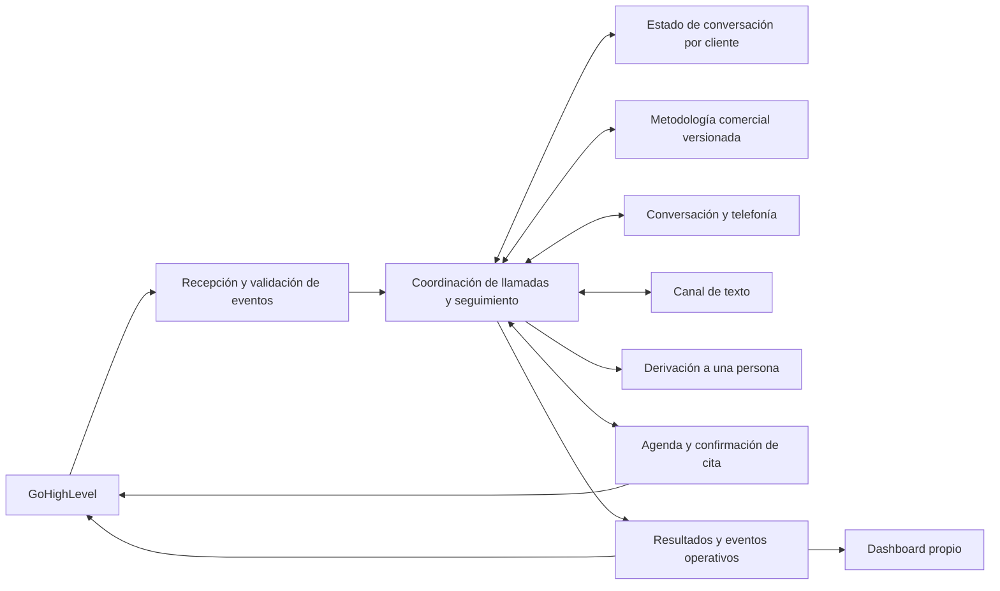

# Arquitectura — NBC Sales

> Actualización de alcance Academy/S01/KCAL01: ver la sección de consolidación OR01 del 2026-09-15 al final. Las secciones anteriores conservan el estado histórico; no describen por sí solas toda la plataforma actual.

Actualizado: 2026-09-14. Dashboard demo, integración de prueba y conversación de voz por navegador implementados. El diagrama comercial completo sigue siendo conceptual; telefonía, agenda y continuidad entre canales pendientes.

## Decisiones registradas

### ADR-001 — Stack abierto

Fecha: 2026-09-12. Las tecnologías se eligen conjuntamente. Actualización: el usuario aprobó Next.js + TypeScript + Supabase para el dashboard. Voz y telefonía continúan abiertas.

### ADR-002 — GoHighLevel y dashboard propio

Fecha: 2026-09-12. Decisión confirmada por el usuario: integrar GoHighLevel y disponer de dashboard propio. Actualización: dashboard implementado con Next.js; lectura de contacto y recepción de eventos como primera prueba. La sincronización comercial completa sigue pendiente.

### ADR-003 — Dashboard e integración de prueba primero

Fecha: 2026-09-12. El usuario confirma Estados Unidos e inglés y solicita priorizar una demostración del dashboard y la conexión de prueba con GoHighLevel. Vertical y tipo de cita pendientes, sin bloquear este hito. Aprueba Next.js + TypeScript para la aplicación y Supabase para datos/login. Alcance en `features/dashboard-ghl-test.md`.

## Separación conceptual propuesta



El diagrama describe responsabilidades, no llamadas de red por turno ni microservicios obligatorios. La sincronización de reportes no debería añadir espera al audio en vivo.

Separar configuración del cliente, metodología y adaptadores de proveedores es una propuesta para facilitar cambios. Cambiar un proveedor puede requerir modificar su adaptador, migrar datos y repetir pruebas. No se promete compatibilidad universal mediante una variable de configuración.

El contrato `get_next_line(conversation_history)` del brief es una hipótesis inicial. Antes de adoptarlo, debe cubrir acciones de agenda, interrupciones, estado compartido, derivaciones y el modelo de conversación elegido.

## Estructura documental inicial (con ampliación técnica debajo)

```text
Caller/
├── metodo_ainnovate.md
├── NBC_Voice_AI_Handoff_Brief (1).md
├── CLAUDE.md
├── .windsurfrules
├── .cursorrules
├── .clinerules
├── .aider.conf.yml
├── .github/copilot-instructions.md
├── .gitignore
├── .env.example
├── CHANGELOG.md
└── docs/
    ├── 01-project-overview.md
    ├── 02-architecture.md
    ├── 03-security.md
    ├── 04-deployment.md
    ├── 05-product-decisions.md
    ├── DB_SCHEMA.md
    ├── API_DOCS.md
    ├── SKILLS.md
    └── features/
        ├── isa-speed-to-lead.md
        └── dashboard-ghl-test.md
```

Ampliación autorizada por la elección del stack y la solicitud de construir: `src/app/` (páginas y API), `src/components/dashboard/` (interfaz, estilos y tipos separados), `src/lib/` (datos demo, validaciones, métricas), `src/services/` (GoHighLevel y Supabase), `src/styles/` (tokens y estilos globales), `supabase/migrations/` (eventos de integración), `tests/` (flujos críticos), `scripts/` (verificación local). Configuración de Next.js, TypeScript y dependencias en raíz. Los documentos originales se conservan.

## Datos y configuración

Existen migraciones de eventos y sesiones, endpoints de integración y Caller, y configuración en `.env.example`. Ambas migraciones se aplicaron en NBC Caller mediante Management API SQL; Auth, RLS y deduplicación verificados. Ver `DB_SCHEMA.md`, `API_DOCS.md` y `README.md` para contratos, variables y puesta en marcha.

## Convenciones

- Documentar cada feature antes de implementarla; actualizar arquitectura y changelog cuando corresponda.
- Distinguir requisitos confirmados, requisitos del brief, propuestas e incógnitas.
- Separar lógica comercial, presentación, integración y acceso a datos.
- Aplicar tipado estricto si se elige TypeScript; documentar el equivalente si se elige otro lenguaje.
- Definir el sistema de estilos junto con la interfaz y respetarlo después.
- Los datos de demostración deben identificarse como tales; un mock no demuestra una integración real.

## Implementación real y dependencias

- `src/app/layout.tsx`, `page.tsx`, `error.tsx`: entrada, metadatos y recuperación de errores.
- `src/components/dashboard/Dashboard.tsx`, `Dashboard.module.css`, `Dashboard.types.ts`: navegación, tablas, gráficos, filtros, diálogo y tipos.
- `src/components/dashboard/Integrations.tsx`, `Integrations.module.css`: estado de configuración, login y test real.
- `src/components/dashboard/AgentShowcase.tsx`, `AgentShowcase.module.css`: ficha visual del agente, onda decorativa y recorrido comercial propuesto, sin reproducción de voz.
- `src/lib/demo-data.ts`, `metrics.ts`, `integration-validation.ts`: fixtures, métricas, CSV y validación de eventos.
- `src/services/integration.service.ts`: servicio solo servidor, acceso Supabase, autorización y consulta de GHL.
- `src/app/api/integrations/{status,events}/route.ts`, `src/app/api/integrations/ghl/test/route.ts`, `src/app/api/webhooks/ghl/route.ts`: rutas descritas en API_DOCS.
- `src/styles/variables.css`, `globals.css`: tokens, reset y estilos globales importados en layout.
- `supabase/migrations/202609120001_integration_events.sql`: persistencia e idempotencia.
- `tests/integration-validation.test.ts`, `tests/dashboard.spec.ts`, `playwright.config.ts`: verificaciones de lógica, API y navegador.
- `package.json`, `package-lock.json`, `tsconfig.json`, `next-env.d.ts`, `next.config.ts`: configuración y dependencias.
- `README.md`: inicio local, credenciales y receta de workflow. `.env.local`: valores privados, ignorado.
- `test-results/`, `.next/`, `node_modules/`: artefactos locales ignorados. `scripts/check-cloud-access.mjs`: verificación de metadatos cloud.

Versiones resueltas durante esta entrega: Next.js 16.3.5; React/React DOM 19.3.0; TypeScript 5.9.3; Supabase JS 2.116.0; Lucide React 0.468.0; Playwright 1.63.0. El lockfile registra todas las dependencias transitivas. No hay Tailwind ni biblioteca adicional de gráficos.

## Sistema visual

CSS Modules, tipografía del sistema, fondo claro, navegación azul noche, acentos azules y amarillo NBC; referencia visual entregada por el usuario. Tokens centrales en `variables.css`: `--canvas`, `--surface`, `--ink`, `--muted`, `--line`, `--accent`, `--accent-dark`, `--sage`, `--lime`, `--soft`, `--amber`, `--radius`, `--shadow`. Las variantes de estado se definen en el módulo del dashboard. Los únicos estilos inline corresponden a alturas/proporciones calculadas de gráficos.

## Límites del primer hito

Las vistas demo se seleccionan en estado del cliente, sin enlaces profundos. El operador real se autentica dentro de Integrations o Caller; su token vive en memoria y necesita volver a iniciar sesión tras recargar o expirar. Se verifica un email y una subcuenta configurados. No se ha implementado OAuth de distribución, gestión multiempresa, agenda real, escritura de notas, llamadas telefónicas ni observabilidad de producción.

`agentRules: false` evita que Next.js modifique las reglas compartidas automáticamente; las reglas propias indican leer la documentación local del framework. Indicador de desarrollo oculto para la demostración.

Actualización visual NBC: tokens `--brand-navy`, `--brand-blue`, `--brand-gold`, `--brand-on-gold`. Los alias anteriores `--sage` y `--lime` permanecen para no renombrar consumidores, con valores adaptados a la nueva paleta. `scripts/check-cloud-access.mjs` es una herramienta local de lectura de metadatos de Supabase/Vercel, no un endpoint público ni una dependencia de la aplicación. `.vercelignore` excluye configuración local y material interno de los uploads.

Presentación: cabecera azul NBC en Overview con onda CSS decorativa, jerarquía tipográfica ampliada, resumen de llamadas derivado de fixtures y detalle de conversación refinado. `artifacts/presentation/` contiene siete capturas reales en PNG a escala 2x y un ZIP para compartir; no contiene pantallas autenticadas. `artifacts` queda excluido del upload Vercel.

## Caller implementado

`Caller.tsx` y `Caller.module.css` incorporan login, micrófono, sesión SDK y resultados; `@elevenlabs/client` 1.25.0 se carga dinámicamente al iniciar. `caller-types.ts` define sesiones y transcripciones; `caller-validation.ts` valida autorización e identidad del resultado. `caller.service.ts` coordina reservas y persistencia; `elevenlabs.service.ts` contiene el adaptador HTTP solo servidor. `requireOperator` retorna el UUID de Auth, utilizado en todos los filtros de sesiones.

Flujo: operador → POST `/api/caller/sessions` → reserva SQL única → autorización ElevenLabs vinculada a una conversación → SDK WebSocket/audio → desconexión → POST `/api/caller/sessions/:id/sync` → lectura del proveedor y escritura de resultado. El navegador nunca envía el resultado definitivo. Consulta automática tras desconexión hasta doce intentos separados por dos segundos; consulta manual disponible después. Si se cierra la página, el operador puede sincronizar desde el historial al volver. No hay webhook ni worker de sincronización permanente.

Archivos adicionales: `src/app/api/caller/sessions/route.ts`, `src/app/api/caller/sessions/[id]/sync/route.ts`, `supabase/migrations/202609140001_call_sessions.sql`, `config/nbc-test-agent.json`, `scripts/setup-caller.mjs`, `tests/caller-validation.test.ts`, `tests/caller.spec.ts` y `docs/features/caller-live-tests.md`. Configuración del agente en JSON propio; el adaptador Retell aún no está implementado aunque el esquema reserva ese valor. Artefactos de prueba interna en `artifacts/caller/`, excluidos de despliegue.

## ADR-004 — Plataforma modular y trabajo paralelo

Fecha: 2026-09-14. Cambio de alcance autorizado por el usuario: master dashboard NBC Sales con Caller, Academy, Ask Anas y Lead Engine. Se mantiene el stack, paleta y carpeta raíz. Tres lanes separados por propiedad de archivos; orquestador único para rutas/infraestructura/documentación global. `docs/lanes/README.md` es la tabla de coordinación, `START-HERE.md` prepara las conversaciones externas.

Ampliación: `src/components/platform/` para shell/Home/Academy/Ask Anas; `src/components/lead-engine/` para planificación; `src/lib/academy-*` y `lead-engine-*` para validación y reglas puras; `docs/sources/` para adjuntos de requisitos. `src/app/(workspace)/layout.tsx` comparte shell entre `/caller`, `/academy`, `/ask-anas`, `/lead-engine` e `/integrations`. Home `/` usa el mismo shell. `/demo` conserva el dashboard previo con sus fixtures. Todos dependen del root layout existente.

Los módulos no comparten todavía sesión de login persistente; Caller e Integrations mantienen sus entradas de operador y APIs protegidas. Academy importa metadatos JSON localmente, sin descargar videos ni ejecutar URLs. Lead Engine produce planes locales, sin job worker, acceso externo ni pagos. No se crean tablas nuevas en este hito: persistencia de Academy y ledgers de prospecting requieren contrato revisado e integración del orquestador antes de habilitar ejecución.

Integración concreta: root `page.tsx` compone PlatformShell/PlatformHome; wrapper de Integrations cliente colocalizado en su ruta y `Workspace.module.css` para títulos comunes. Caller aporta `caller-insights.ts` y sus tests para métricas, filtros y exportación verificada. `tests/platform.spec.ts` valida navegación, planificación y Academy; `tests/caller-workspace.spec.ts` usa fixtures interceptados claramente separados de pruebas con Supabase real. No se agregaron dependencias. El shell controla padding de contenido, incluido Lead Engine.

## Coordinación de cuatro lanes — 2026-09-14

Ronda externa en Codex Local: I01 Infraestructura/Vercel, C01 Caller, L01 Lead Engine y K01 Academy/Ask Anas. El mapa vigente es `docs/lanes/README.md`; las tareas cerradas están en `docs/lanes/tasks/`. Root mantiene contratos y auth comunes y realiza la integración. I01 despliega un snapshot runtime congelado (`docs/lanes/BASELINE.json`) desde staging aislado; no publica el directorio compartido mientras los otros lanes editan. Las migraciones nuevas reservadas para L01/K01 se entregan sin aplicar a la base compartida hasta revisión e integración.

## Revisión antes del push — instrucción posterior de Franco

Los prompts se amplían conforme a AInnovate; tareas y ownership se mantienen. Antes de cualquier push, Franco revisa y autoriza el paquete concreto. La revisión técnica del orquestador no sustituye su aprobación. Conectar Vercel y publicar el baseline inicial congelado para revisión conserva la autorización previa; código nuevo/correcciones del candidato deben presentarse y revisarse antes de publicarse. No usar CLI/API, merge, promoción o auto-deploy para eludir esa revisión. Detalle vigente: `docs/lanes/REVIEW-PROTOCOL.md` (ruta desde raíz).

Cada lane entrega evidencia, criterios de aceptación, pasos para revisión y deltas documentales; orquestador consolida CHANGELOG/esquema/API/arquitectura/lookup. Infraestructura mantiene su feature `docs/features/platform-delivery.md` y puede preparar mejoras pequeñas del shell como candidato separado después de la conexión, sujeto a revisión; no bloquea el enlace inicial por un rediseño amplio.

## Academy, sesión y calendario — consolidación OR01, 2026-09-15

Esta sección actualiza el alcance anteriormente descrito como local y de login en memoria. No revisa ni sustituye los reportes posteriores de otros módulos.

- AcademyWorkspace/Academy.module.css: editor visual, import JSON/CSV/TSV, v1/v2, portadas y preview de alumnos separada. `src/lib/academy-*` define manifiestos, import, draft y programa; `knowledge-*` proyecta fuentes. `academy-access.ts` exige admin; `academy.service.ts` y `academy-covers.ts` coordinan almacenamiento servidor; `academy-client.ts` consume desde cliente. Endpoints en `/api/academy/**`. Feature `features/academy.md`.
- Binarios de portadas y objectURLs viven aparte de metadata; el servidor usa bucket privado por owner. Inventarios/versiones y bucket son propuesta SQL sin aplicación confirmada en OR01. Alumno real, cursos publicados, progreso/notas persistentes y video siguen pendientes. Ask Anas no genera respuestas.
- `WorkspaceAccess.tsx` usa `WorkspaceSessionStorage` con storageKey `nbc-workspace-session-v1`, expiración fija12h, renovación SDK y verificación de identidad/membresía. La sesión se comparte por origen/navegador/perfil; contraseña no se persiste. Feature `features/workspace-session.md`. Código actual conserva cambios I05, sin atribuirlos a S01.
- `CalendarWorkspace.tsx`/Calendar.module.css y `src/lib/calendar-month.ts`: grilla42días, navegación, selección, zona del feed, all-day/fin exclusivo; mantiene feed/backend y roles existentes. Feature `features/calendar-view.md`.

OR01:37 unitarias pasan; chequeo TypeScript global falla por snapshots históricos incluidos y tipos de tests de portadas. A1/A2/S1/CAL1/T1 registrados en `lanes/reports/OR01-ACADEMY-REVIEW-2026-09-15.md`. No se aprueba todavía cierre funcional ni una nueva publicación.

## Plataforma integrada — OR02, 2026-09-16

Estado vigente en `00-current-state.md`; inventario de rutas/SQL en `reference/runtime-contract-index.md`. Root layout/WorkspaceAccess/shell proveen identidad general; guards de API independientes. Lead Engine conserva adapter de auth legado y requiere L-AUTH antes de consumo. No sustituir límites de cada módulo por el estado del login visual.

Caller C07: workbench CRM privado/listas/pipeline, preferencias server por owner/modo, Analytics18widgets, insights por reglas, consola ElevenLabs web y grabador; cola solo demo y telefonía pendiente. Lead Engine r9: planes y carpetas Postgres, jobs/quote/claims/reservas, adaptador Apify preparado y evidencia/score puro; no pipelines reales de investigación/verificación ni integración de créditos. Members I09: onboarding/chat/support/calendario, Settings y Usage; Overview11widgets/layout e hitos locales; roadmap de ejemplo en /members. Credits: ledger/wallet/metering y adaptador Stripe pendiente de activar comercialmente.

Vercel actual confirmado L01-r9:234 archivos manifest coinciden con fuente local. Esto permite revisar una base común; no habilita publicar workspace mutable o asumir aprobación de Franco. Nuevas carreras detectadas: refresco de token no debe reiniciar borradores de mismo usuario; requests terminadas con token viejo deben liberar flags sin reintroducir datos obsoletos. Reproducciones/hallazgos OR02 detallados en su reporte.


## Actualización L02 / I10

L02 local, 2026-09-16: src/services/lead-engine-auth.ts centraliza el guard interno para ambos adaptadores Lead Engine; reutiliza requireOperator y consulta membresía antes del store. Auth común de otros módulos permanece intacto. T1 excluye artifacts históricos del typecheck, conservando src/tests.
