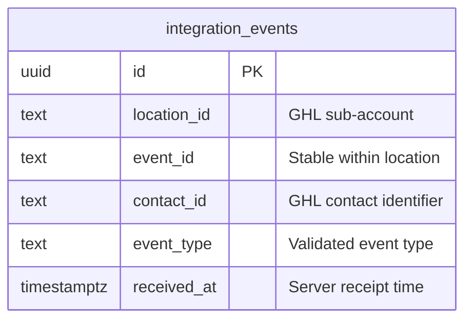
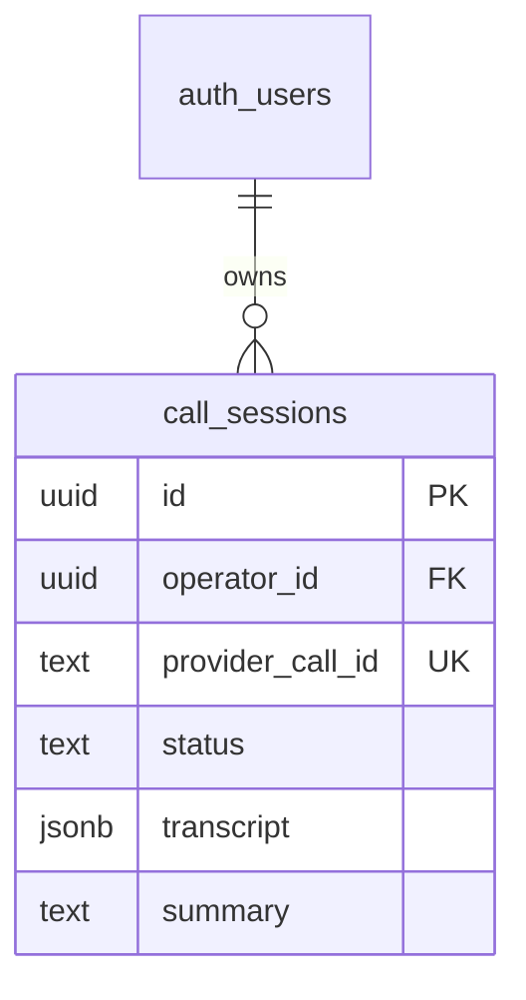
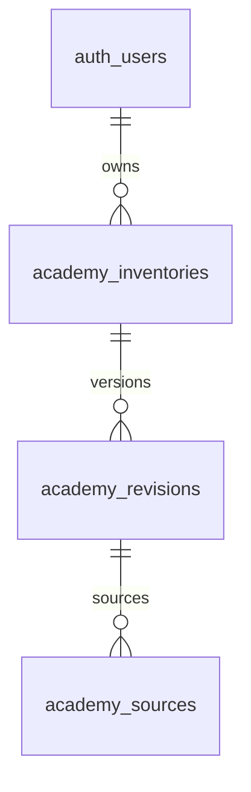

# Esquema de base de datos

> Actualización de alcance Academy/S01/KCAL01: ver la sección de consolidación OR01 del 2026-09-15 al final. Las secciones anteriores conservan el estado histórico; no describen por sí solas toda la plataforma actual.

Actualizado: 2026-09-14. Motor aprobado: Postgres en Supabase. Dos migraciones aplicadas al proyecto NBC Caller mediante Management API SQL.

## Diagrama ER



No se han creado tablas locales de contactos o tenants. Los IDs de GHL son referencias externas, sin claves foráneas locales. La primera versión opera con una subcuenta configurada en servidor.

## Tabla `public.integration_events`

| Columna | Tipo | Nullable | Default | Descripción |
|---|---|---|---|---|
| id | uuid | No | gen_random_uuid() | Clave primaria |
| location_id | text | No | Ninguno | Subcuenta verificada por el servidor |
| event_id | text | No | Ninguno | Identificador estable del evento |
| contact_id | text | No | Ninguno | Referencia al contacto externo |
| event_type | text | No | Ninguno | `contact.created`, `contact.updated` o `integration.test` |
| received_at | timestamptz | No | now() | Momento de persistencia |

Índices y constraints: PK `id`; unique `integration_events_location_event_unique` sobre `(location_id,event_id)` para idempotencia; índice `integration_events_location_received_idx` sobre `(location_id,received_at desc)`; check de valores de `event_type`.

## RLS y permisos

```sql
alter table public.integration_events enable row level security;
revoke all on public.integration_events from anon, authenticated;
grant select, insert on public.integration_events to service_role;
```

No hay políticas de acceso directo para usuarios autenticados o anónimos. El backend usa la clave privada de servicio tras verificar al operador o al workflow. El filtro por cuenta está en el servidor; no se presenta este diseño inicial como autorización multiempresa completa.

| Rol | SELECT | INSERT | UPDATE | DELETE |
|---|---|---|---|---|
| anon | No | No | No | No |
| authenticated | No | No | No | No |
| Backend service_role | Sí | Sí | No usado | No usado |

El service role es privilegiado; esta tabla describe operaciones usadas por la aplicación, no garantiza que la clave carezca de otros privilegios del proveedor.

## Triggers, funciones y tipos

Sin triggers ni funciones propias. Se usa `gen_random_uuid()` del motor. Tipos de aplicación en `Dashboard.types.ts` e `integration-validation.ts`; tipos de esquema generados pendientes de disponer de un proyecto y aplicar la migración.

## Historial

| Archivo | Estado | Descripción |
|---|---|---|
| `supabase/migrations/202609120001_integration_events.sql` | Aplicada a NBC Caller vía Management API SQL | Eventos de prueba, idempotencia, RLS e índice de lectura |

La reversión mediante DROP está documentada como comentario en la migración y requiere autorización y respaldo si contiene datos. No modificar una migración después de aplicarla.

Verificación remota: RLS habilitada, SELECT de servicio aceptado, SELECT de anon/authenticated rechazado y dos inserciones con el mismo identificador producen una fila. Los datos sintéticos se revirtieron en la misma transacción. La ejecución vía Management API SQL no registra automáticamente historial de Supabase CLI; reconciliar ese historial antes de adoptar db push.

## Tabla `public.call_sessions`

Migración `202609140001_call_sessions.sql`, aplicada el 2026-09-14. Tipos de aplicación en `src/lib/caller-types.ts`.

| Columnas | Tipo y restricciones | Uso |
|---|---|---|
| `id` | UUID, PK, sin default | UUID v4 del intento, idempotencia |
| `operator_id` | UUID requerido, FK `auth.users(id)` | Propietario validado por backend |
| `provider`, `provider_agent_id` | Text requeridos; proveedor `elevenlabs` o `retell` | Proveedor y agente fijo de la sesión |
| `provider_call_id` | Text nullable, unique | Conversación fijada al emitir autorización |
| `channel` | Text requerido, default `web`; `web` o `phone` | Solo web implementado |
| `status` | Text requerido, default `preparing` | `preparing`, `ready`, `active`, `processing`, `completed`, `failed`, `expired` |
| `created_at` | Timestamptz requerido, default `now()` | Reserva del intento |
| `started_at`, `ended_at`, `synced_at` | Timestamptz nullable | Tiempos verificados y última sincronización |
| `duration_seconds` | Integer nullable, >= 0 | Duración del proveedor |
| `transcript` | JSONB requerido, default `[]`, check array | Turnos normalizados, sin payload crudo |
| `summary`, `failure_code` | Text nullable | Resumen y código de fallo seguro |

Índice `(operator_id, created_at desc)` para historial. Índice único parcial por `operator_id` para estados `preparing`, `ready`, `active`: solo un inicio abierto simultáneo. El estado `processing` ya no bloquea otra conversación. Una reserva abandonada se marca `expired` tras diez minutos al intentar iniciar; no es un proceso programado. Un resultado completado o fallido no retrocede por respuestas concurrentes. Las reservas expiradas pueden recuperar el resultado al sincronizar.

RLS habilitada, sin políticas de acceso directo. Se revocan todos los permisos de `anon` y `authenticated`; backend usa `service_role` para SELECT/INSERT/UPDATE con filtro obligatorio de propietario. No hay endpoints DELETE ni audios almacenados. Los transcripts de Supabase todavía no tienen borrado automático; no confundir con la retención de treinta días configurada en ElevenLabs. No hay nuevos triggers ni funciones SQL. Reconciliar ambas migraciones con el historial CLI antes de adoptar `db push`.



Validación final: acceso directo anon/authenticated rechazado en call_sessions, servicio permitido, RLS e índice único de sesión activa comprobados. Historial recuperado en nuevo login, móvil sin desbordamiento y salida de sesión limpia verificados. Build/TypeScript, seis unitarias y cinco E2E pasaron.

## Plataforma modular — alcance de datos

Esta entrega no agrega tablas ni aplica migraciones nuevas. `integration_events` y `call_sessions` permanecen operativas. Academy prepara un manifiesto local de cursos/módulos/lecciones; no es un LMS persistente. Lead Engine define contratos para planes, batches, búsquedas, verificaciones, entregas y supresiones en `features/lead-engine.md`; el ledger global todavía no está implementado. No habilitar proveedores pagados antes de persistencia, índices de idempotencia, reserva atómica de presupuesto y aislamiento de acceso.

## Academy — propuesta K01-r6 consolidada el 2026-09-15

Fuente revisada: `supabase/migrations/202609140020_academy.sql`. **PROPUESTA, sin aplicación ni pruebas PostgreSQL/Storage ejecutadas por OR01.** No inferir estado remoto a partir de un deploy. Revisión del orquestador con correcciones de aplicación: `lanes/reports/OR01-ACADEMY-REVIEW-2026-09-15.md`.



| Tabla | Campos y restricciones |
|---|---|
| `academy_inventories` | `id uuid PK` sin default; `owner_id uuid NOT NULL FK auth.users(id)`; `name text NOT NULL`, trim de 1–160 caracteres; `revision integer NOT NULL >=1`; `created_at`, `updated_at timestamptz NOT NULL DEFAULT now()`; UNIQUE(id,owner_id) |
| `academy_revisions` | `inventory_id`, `owner_id uuid NOT NULL`; `revision integer NOT NULL >=1`; `name text NOT NULL`, trim de 1–160; `manifest jsonb NOT NULL`, objeto v1/v2, courses array, tamaño textual <=2MiB; `origin jsonb NOT NULL`, objeto/label de 1–160; `created_at timestamptz NOT NULL DEFAULT now()`; PK(inventory_id,revision); FK(inventory_id,owner_id) a inventario |
| `academy_sources` | `inventory_id uuid`, `revision integer`, `course_id`, `module_id`, `lesson_id text`, todos NOT NULL; `video_url text NULL` con prefijo HTTPS y <=2048 si existe; `transcript_url text NULL` restringida a NULL; `content_status text NOT NULL DEFAULT 'pending'`, solo pending; PK(inventory_id,revision,lesson_id); FK(inventory_id,revision) a revisión |

Sin cascadas de borrado declaradas ni triggers propios. Índices `academy_owner_created_idx(owner_id,created_at DESC,id DESC)` y `academy_revision_owner_idx(owner_id,inventory_id,revision DESC)` además de PK/unique. Las revisiones/sources son append-only para los permisos concedidos; `service_role` sigue siendo un rol privilegiado del proveedor.

RLS propuesta habilitada en las tres tablas, sin políticas directas de cliente. SQL de permisos:

```sql
alter table public.academy_inventories enable row level security;
alter table public.academy_revisions enable row level security;
alter table public.academy_sources enable row level security;
revoke all on public.academy_inventories, public.academy_revisions, public.academy_sources from public, anon, authenticated, service_role;
grant select, insert, update on public.academy_inventories to service_role;
grant select, insert on public.academy_revisions, public.academy_sources to service_role;
revoke all on function public.academy_save_inventory(uuid, uuid, integer, text, jsonb, jsonb) from public, anon, authenticated;
grant execute on function public.academy_save_inventory(uuid, uuid, integer, text, jsonb, jsonb) to service_role;
```

`academy_save_inventory(p_id uuid,p_owner uuid,p_expected integer,p_name text,p_manifest jsonb,p_origin jsonb)` retorna JSONB y usa SECURITY INVOKER con search_path pg_catalog,public. Esperada0 crea; revisiones existentes se bloquean FOR UPDATE, comprueban owner/revisión y avanzan una versión. Inserta revisión y fuentes en la misma transacción. PT404 para no encontrado/owner; PT409 para conflicto. Solo backend administra datos después de comprobar admin activo; el rol o propietario no los decide el cliente. SQL íntegro en la migración citada.

Bucket propuesto `academy-covers`: privado, 2MiB, MIME image/jpeg. INSERT ON CONFLICT DO NOTHING y rechazo de bucket preexistente público. No añade políticas anon/authenticated a Storage. Ruta de objeto `${ownerUUID}/${coverUUID}.jpg`, subida sin overwrite por servicio y lectura mediante endpoint privado. No hay tabla custom de assets, GC ni borrado de portadas huérfanas implementados. RLS y acceso a bucket reales siguen pendientes de pruebas aisladas.

DTOs manuales en `src/lib/academy-storage-types.ts` y `academy-types.ts`; no tipos DB generados nuevos. Manifiesto v1 admite20 cursos; v2 hasta100 y description<=500/coverId UUIDv4 opcionales; ambos conservan 2000 lecciones totales y validación servidor/1MiB de manifiesto. El límite SQL2MiB permite representación JSONB; no reemplaza validación del servidor. Sesión S01 y UI KCAL01 no agregan tablas.

| Migración | Estado revisado | Pruebas pendientes |
|---|---|---|
| `202609140020_academy.sql` | Propuesta, no aplicada por OR01 | Guardar/leer, roles/RLS, CAS con dos conexiones, rollback parcial, Storage real privado |

## Estado consolidado Caller/Lead Engine/Members/Usage — OR02 (2026-09-16)

El esquema inicial de dos migraciones es histórico. [Índice actual con tablas, SQL íntegro y evidencias](reference/runtime-contract-index.md) consolida030Members,040CallerCRM,050CallerOperations,060CallerWorkbench,060UsageSettings,070CallerViews y010LeadEngine. OR02 comparó los siete archivos contra sus hashes aplicados, todos coinciden. No se ejecutó nueva migración ni se verificó el esquema remoto hoy.

Caller incorpora leads/imports/voice_jobs, listas/items, pipelines/buckets/activity/changes y views personales; IDs propietarios, versiones e idempotencia en sus RPC. Members incorpora roles/onboarding/calendario/mensajes/tickets/wallet/operaciones/asientos; Usage añade eventos de consumo, tarifas/paquetes/órdenes/eventos de pago y perfil. Lead Engine010 está aplicada según r9 con16 tablas/21funciones y pruebas históricas aisladas; ya no es SQL pendiente. Academy020 sí sigue propuesta.

Atención: dos archivos llevan prefijo202609150060 con nombres distintos. No adoptar tooling de migraciones por versión ni db push indiscriminadamente sin reconciliar nombres/historial Management API; ambos se preservan como aplicados. OR02 no intentó reconciliación o reaplicación.

Hallazgos con posible impacto de datos: I-ONBOARD (upsert no atómico puede revertir completed_at), I-EVENT (retry evento devuelve conflicto), L-AUTH (guard API ignora suspensión). No son fallos demostrados de RLS directa ni doble acreditación. Correcciones con cambios SQL requieren nuevas migraciones y pruebas aisladas antes de integración.


## Owner Cell App: migraciones 202609210230 y 202609210240 (2026-09-21)

Escritas y probadas sobre Postgres 17 aislado; **aplicadas a NBC Caller el 2026-09-21** vía Management API (evidencia en `artifacts/lanes/L03/`). Aplicación: `node scripts/lead-engine-apply-migration.mjs <archivo>` en orden, evidencia en `artifacts/lanes/L03/`.

| Migración | Tablas | Funciones | Notas |
|---|---|---|---|
| `202609210230_lead_engine_memory.sql` | `lead_engine_row_ledger`, `lead_engine_dial_outcomes`, `lead_engine_register_snapshots`, `lead_engine_entity_graph_edges`, `lead_engine_verified`, `lead_engine_names`, `lead_engine_state_coverage`; `batches` + `recipe_version`, `brain_version` | `lead_engine_ledger_gate` (trigger), `lead_engine_record_dial_outcome`, `lead_engine_verified_fresh` | Ledger exige delivery previa, tz válida y scrub de 31 días; outcome `opt_out`/`wrong_number` suprime en la misma transacción; ventana 08:00 a 20:00 como CHECK. |
| `202609210240_lead_engine_jobs.sql` | `lead_engine_jobs`, `lead_engine_job_transitions`, `lead_engine_credits_ledger`, `lead_engine_job_spend`, `lead_engine_daily_ceilings`, `lead_engine_job_rows`; `plans.lane` admite `D` | `lead_engine_job_transition` (trigger), `lead_engine_credit_balance`, `lead_engine_credit_move`, `lead_engine_grant_credits`, `lead_engine_meter`, `lead_engine_create_job`, `lead_engine_hold_job`, `lead_engine_sample_result`, `lead_engine_freeze_job`, `lead_engine_resume_job`, `lead_engine_job_progress`, `lead_engine_close_batch`, `lead_engine_deliver_job` | Todo SECURITY INVOKER, RLS on, grants solo a `service_role`; ledgers append-only con trigger inmutable. |

| `202609210260_lead_engine_auth_users_read.sql` | (ninguna) | recrea `lead_engine_register_start`, `lead_engine_grant_credits` | Sin lecturas directas de `auth.users` (42501 en Supabase); la FK cubre la validación. |
| `202609210270_lead_engine_phase5.sql` | (ninguna nueva) | `lead_engine_phone_neighborhood`, `lead_engine_score_report`; vendor `anthropic`; índice único del grafo | Phase 5. |
| `202609210280_lead_engine_stop_loss.sql` | `jobs.expected_cost_cents_per_cell` | `lead_engine_meter` con `stop_loss`, `lead_engine_job_freshness` | Anas §4 y §8. |
| `202609210250_lead_engine_registers.sql` | `lead_engine_register_ingests` | `lead_engine_register_start`, `lead_engine_register_write`, `lead_engine_register_progress`, `lead_engine_register_resume`, `lead_engine_names_reuse`, `lead_engine_register_summary`, `lead_engine_new_licensees` | Ingesta por trozos con cursor; snapshots append-only; una corrida activa por fuente. |

Detalle funcional en `docs/features/owner-cell-jobs.md`.
