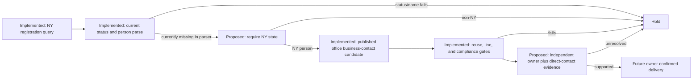

# New York attorney workflow review

Reviewed 2026-09-24. The live brain routes `attorney_ny` through the NY Attorney Registrations adapter (`ny_attorneys`) and forbids a Maps fallback or Maps deliverable. The catalog-verified Socrata source is a public professional registration and publishes an office phone. It can establish a current NY attorney and a business-contact candidate. It does not establish that the attorney owns a firm, that a named partner is a current owner, or that the office phone is a direct personal handset.

## Hypothesis

The NY registration route is suitable only for a professional business-contact workflow when the row is currently registered, belongs to New York, identifies a person, and retains its published office contact. A surname appearing in `company_name` is a weak named-partner signal; it is not owner evidence. A contact may become an owner-confirmed delivery only after independent firm-owner evidence and an explicit direct-business-contact link to the same phone, in addition to the normal line and compliance controls.

## Bounded five-case fixture/code audit

This review used five synthetic variants against the live `nyAttorneyRow` function on 2026-09-24, plus the focused local `ny_attorneys` fixture test. The synthetic values contain no retained real contact information. No source request, secret, paid provider, Maps request, residential/property lookup, phone verification, or contact compilation ran.

| Case | Rows | Observed parser result |
| --- | ---: | --- |
| Current NY person with firm | 1 | Kept as a named-partner heuristic candidate. |
| Current non-NY person with firm | 1 | Incorrectly kept; the parser does not enforce `state = NY`. |
| Delinquent registration | 1 | Held as `status_not_registered`. |
| Missing person name | 1 | Held as `not_a_person`. |
| Current NY person without firm | 1 | Kept as an `Attorney` / `Solo` candidate; this is not owner proof. |

`node --experimental-strip-types --test --test-name-pattern='ny_attorneys' tests/lead-engine-registers.test.ts` passed. The direct five-case audit found that [`nyAttorneyRow`](/Users/francocappanera/NBC%20Sales/Caller/src/lib/lead-engine-registers.ts:683) applies current-status and person checks but no state check. The adapter's Socrata query has `state='NY'`, yet a malformed fetch, cache, or direct parser caller can admit a currently registered non-NY row. This is code/fixture evidence only; it does not measure source coverage, firm ownership, handset ownership, mobile status, reachability, DNC/TCPA clearance, or delivery. `verifiedPhones` is zero.

## Current route and proposed correction

The route currently protects `attorney_ny` from the generic Maps fallback through `NEVER_MAPS_DELIVERABLE`; that guard is implemented in shared runtime and is outside this file's change scope. Current export status also keeps ownership unconfirmed. The source's `company_name` and office phone remain professional business-contact facts, not named-partner, owner, or employee handset proof.

The material remaining parser defect is the absent NY state gate. Root should update `nyAttorneyRow` to fail closed after the status check, for example `if (stateOf(row.state) !== 'NY') return skip(id, payload, 'state_out_of_scope');`, and add a synthetic non-NY-current regression fixture. That correction neither adds a source nor calls a provider.

| Failure | Correction | Status |
| --- | --- | --- |
| A current non-NY registration can enter the NY route if it reaches the parser outside the query filter. | Require `stateOf(row.state) === 'NY'` inside `nyAttorneyRow`; hold all other states. | Proposed shared correction |
| Surname-in-firm is represented as ownership. | Preserve it only as a heuristic role signal and require independent firm-owner evidence. | Implemented role wording; owner gate blocked |
| A published office number is represented as a direct owner mobile. | Treat it as a business-contact candidate; retain reuse, mobile, reachability, DNC/TCPA, suppression, duplicate, freshness, and timezone gates separately. | Implemented contact gates; direct-contact proof proposed |
| Maps becomes the NY-attorney deliverable when the register is unavailable. | Keep `attorney_ny` in `NEVER_MAPS_DELIVERABLE`; hold the request without an eligible register route. | Implemented |

## Source evidence and remaining measurement

The source catalog records NYS Attorney Registrations (`data.ny.gov`, `eqw2-r5nb`) as a $0 quarterly public source with current-registration status, firm, and business office-phone fields; its verified query filters `status='Currently registered' AND state='NY'`. The research build specification reports the dataset as public under 22 NYCRR 118 and describes its phone as business-level. Those descriptions do not independently prove a firm owner, employee status, personal mobile, or deliverability.

After the state guard and an owner/direct-contact gate are wired, a lawful 5–20-row aggregate test may use only the catalog-verified endpoint. Keep separate denominators for current NY registrations, person records, firm/solo candidates, unique published business phones, independently owner-supported rows, mobile, reachable, DNC/TCPA-clear, suppression/duplicate-clear, direct-business-contact-supported, and delivered rows. Do not use residential or property data to discover private numbers. `perCleanUsd` remains null pending an approved outcome study.

## Root integration regression check, 2026-09-24

The NY attorney parser now enforces state=NY itself and holds non-NY or missing-address-state rows, matching the declared adapter query scope. The never-Maps guard and ownership-unconfirmed export wording also apply.

Focused synthetic regression checks passed; no paid phone test or uplift measurement was performed. Earlier defect observations above are historical where this correction supersedes them.
