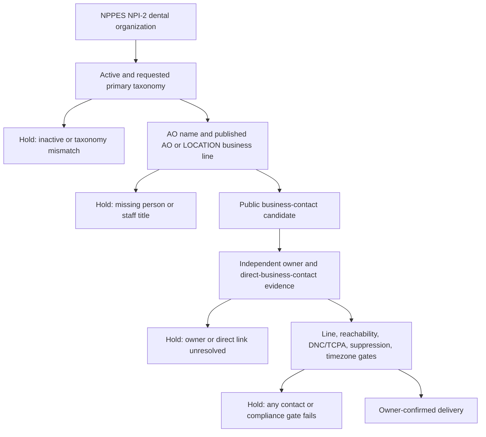

# Dentists: public business-contact route review

## Hypothesis

For an active NPPES NPI-2 dental organization, a published Authorized Official (AO) name plus its published AO or LOCATION line can support a **business-contact candidate** when it is explicitly tied to that organization. It cannot by itself establish that the AO owns the practice, that the line reaches that person, or that it is a mobile handset. This is a lawful public-business-contact alternative to the legacy dentist recipe-B parcel and skip-trace path; it does not use a mailing or parcel address to discover a private phone.

## Bounded audit

On 2026-09-24, I ran the existing focused NPPES adapter test against the saved public NPPES fixture (`node --experimental-strip-types --test --test-name-pattern='nppes:' tests/lead-engine-registers.test.ts`). The five-case dentist subset was: three active NPI-2 records with a primary Dentist taxonomy, one active office-manager AO, and one active organization with a non-Dentist primary taxonomy despite secondary dental taxonomies. The adapter kept the three primary-Dentist records, held the office-manager title, and held the secondary-only taxonomy record. No network, provider, append, trace, phone verification, owner determination, or delivery ran. No contact values or addresses were retained here.

The focused test passed. It demonstrates parser behavior only. Its denominator is five selected fixture records, not NPPES coverage, business-contact reachability, owner accuracy, mobile rate, DNC/TCPA status, or a clean-contact rate.

## Correction DAG

The existing parser implements the first two holds. The evidence and delivery branch is not wired. The current recipe-B path is unsuitable for making this distinction: when an NPPES row has `phone10`, `pullNames` writes that public AO line to the job row; `parcelStep` and `traceStep` only select rows where `phone10` is null; and `settleVerified` can deliver after generic verification. The delivered-row presentation then calls every recipe-B result “skip traced to the owner’s home,” even where no trace occurred. This can misstate a public business line as a private owner-traced contact and bypasses `assessOwnerEvidence`.

Concrete shared-runtime correction for root review: add a dentist/NPPES public-business-contact lane that persists field provenance (`nppes_ao_published` or `nppes_location_published`) separately from trace provenance; prevents it entering the parcel/trace selection; and calls `assessOwnerEvidence` with independently ingested public business/registry evidence before any owner-labelled delivery. In `src/services/lead-engine-jobs.service.ts`, update `pullNames`, `parcelStep`, `traceStep`, `settleVerified`, and the recipe-B status text together so an untraced NPPES line is neither labelled nor treated as a skip-traced owner contact. Keep unresolved rows held. This needs a regression test covering a recipe-B NPPES row with a populated AO line.

## Industry-specific failures

| Failure | Handling |
|---|---|
| AO is office, billing, credentialing, or practice-management staff | Existing title exclusion holds known staff titles; expand only with reviewed evidence, not inference. |
| AO is an executive at a DSO or multi-practice organization | Hold absent independent business-matched owner/founder and direct-contact evidence. |
| AO line equals the LOCATION/front-desk line | Treat it as a published business line, never as direct owner-handset evidence. |
| Dentist is present only as a secondary taxonomy | Current adapter rejects it because it requires the primary taxonomy. This is a coverage limitation, not an ownership filter; decide through a separately tested taxonomy-any correction before changing it. |
| NPPES mailing address is residential | Do not use it for this workflow to find a private phone. |

## Sources and constraints

- `handoff/04_SOURCE_CATALOG.md`, Group C: verified free NPPES API fields, endpoint bounds, and the distinction between AO and practice lines; its recipe hint describes D for AO/practice contrast and B only for solos through mailing address.
- `handoff/07_RESEARCH_BUILD_SPEC.md`, §5.3: reported 682-record identity study and its explicit weak-phone constraint. This review does not reuse that study as a clean-contact measurement.
- `src/data/lead-engine-brain.json`, `industries.dentist`: current national `nppes:dentist` recipe-B mapping and historical benchmark, which remain unchanged.
- `src/lib/lead-engine-registers.ts`, `nppesOrganization`: active/primary-taxonomy/staff-title/person parser behavior.
- `src/services/lead-engine-jobs.service.ts`, `pullNames`, `parcelStep`, `traceStep`, and `settleVerified`: populated NPPES `phone10` bypasses the null-phone parcel/trace queries and reaches generic settlement.
- `src/lib/lead-engine-research.ts`, `assessOwnerEvidence`: the existing but currently uncalled owner/direct-business-contact assessment required by the proposed lane.

## Remaining measurement

After the public-business-contact lane and evidence gate are wired, run a lawful 5–20 row aggregate study from the verified NPPES endpoint. Report separate denominators for active requested-taxonomy organizations, non-staff AO candidates, records with each published business-contact field, independently owner-supported records, direct-business-contact-supported records, authorized line outcomes, and delivered contacts. Do not use parcel, mailing-address, residential, or skip-trace data to find private phones.

## Root integration regression check, 2026-09-24

Export wording now uses row evidence. A published NPPES contact is no longer described as traced to a home merely because the job uses recipe B. All exported contact-status labels retain ownership unconfirmed. A complete independent owner-evidence pipeline remains pending.

Focused synthetic regression checks passed; no paid phone test or uplift measurement was performed. Earlier defect observations above are historical where this correction supersedes them.
