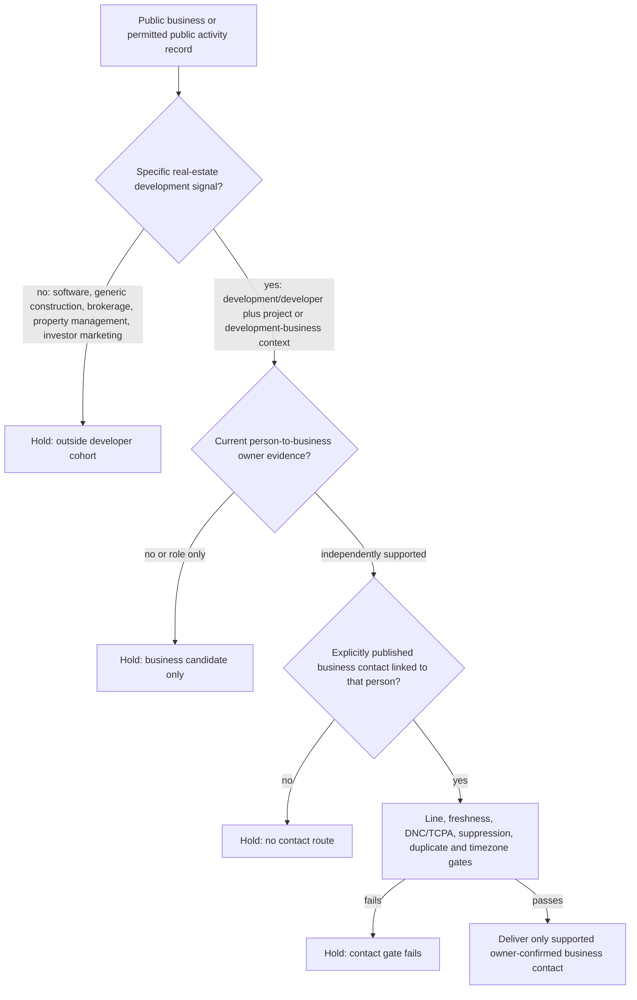

# Real-estate developer workflow review

Reviewed 2026-09-24. The live brain calls `developer` a recipe-B industry and gives North Carolina the text source `investors --min 6 --max 30`. It has no `register_source` in any state. `quoteJob` consequently falls back to recipe A (Google Maps scrape plus phone verification) in the five audited routes. That route can establish a public business-listing candidate, but it cannot establish that a development business is a real-estate developer, that a named person owns it, or that a listed telephone belongs directly to an owner.

## Hypothesis

A public, explicitly published business presence can support a *development-business candidate* only after its activity is distinguished from general construction, brokerage, property management, investment marketing, and unrelated software development. A public listing or permit applicant can support business identity/activity evidence; neither proves current beneficial ownership or an owner-confirmed direct contact. With no catalog-verified developer-specific public business-contact endpoint and no implemented owner-evidence gate, every candidate must hold from owner-contact delivery.

## Five-case code audit

On 2026-09-24, a local five-case audit called `route`, `registerSourceFor`, and `quoteJob` with `real estate developer` or `builder-developer` in NC, TX, FL, and CA. It used no network endpoint, credential, paid provider, property record, address lookup, phone value, or personal-contact data.

| Cases | Brain result | Actual quote result |
| --- | --- | --- |
| NC real-estate developer; NC builder-developer | Recipe B with the textual investor source | No register source; falls back to recipe A without blockers. |
| TX real-estate developer; FL builder-developer; CA developer | Recipe B with no name source | No register source; falls back to recipe A without blockers. |

The sample is a routing audit only. It does not measure developer-business coverage, owner evidence, published-business-contact coverage, phone type, reachability, DNC/TCPA, suppression, or delivery. No phones were verified.

## Candidate logic and holds

The diagram is proposed policy, not an implemented route. The current runtime skips the first three evidence decisions by permitting the generic Maps fallback.

| Failure | Safe handling | Runtime state |
| --- | --- | --- |
| A listing for a software developer, builder-only contractor, brokerage, property manager, investor marketer, or general contractor is treated as a real-estate development business. | Require an explicit real-estate development/business or project context; otherwise hold. | Proposed |
| A company listing, permit applicant, LLC officer, or project representative is labelled the owner. | Keep role/entity facts as candidate evidence until separately supported current ownership is recorded. | Not implemented |
| A published listing telephone is called an owner's mobile or direct line. | Treat it only as a public business-contact candidate and require a direct-business-contact link plus normal gates. | Not implemented |
| The legacy investor instruction implies a private parcel/residential route. | Do not use county-owner/property records, parcel matching, skip trace, append, or residential lookup for this workflow. | Held by this review; not guarded by the developer route. |
| Missing register mapping silently changes recipe B to Maps delivery. | Block Maps delivery for `developer` until a lawful developer-specific public business-contact route and owner-evidence gate are implemented. | Proposed shared correction |

## Sources and implementation status

| Source | Scope and evidence | Status |
| --- | --- | --- |
| Developer brain entry | `developer` aliases, recipe B, historical Anas fields, and NC textual investor instruction; no `register_source`. | Implemented configuration; unsafe fallback. |
| Generic Maps fallback | Public listing discovery and phone candidate when `quoteJob` cannot open a register path. It is not developer activity, ownership, or direct-contact proof. | Implemented runtime; unsuitable for owner-confirmed developer delivery. |
| Catalogued developer-specific public business-contact endpoint | No such VERIFIED endpoint appears in the reviewed source catalog or build specification. | Blocked |
| County-owner/investor instruction | The brain's NC instruction is an investor-count recipe, not a verified developer-contact source. Property/residential lookup is outside this review's scope. | Blocked |

## Iteration and remaining measurement

The initial premise was that recipe B would select a developer name route. The audit found no mapped register route at all; it instead permits an unqualified Maps fallback in all five cases. The correction is to hold the developer route, not to substitute property data or a private-phone append.

After a lawful, catalog-verified public business-contact source and a separate current-owner evidence rule are implemented, run a 5–20 row aggregate source sample. Record distinct counts for source rows, specific development-business matches, supported owner candidates, published business-contact candidates, mobile/line classification, reachability, DNC/TCPA clearance, suppression/duplicate clearance, direct-business-contact support, and delivered rows. Keep `perCleanUsd` null unless outcome evidence is collected under approval.

## Runtime correction for shared-owner review

[`quoteJob` in `src/lib/lead-engine-jobs.ts`](/Users/francocappanera/NBC%20Sales/Caller/src/lib/lead-engine-jobs.ts:127) sees no developer `register_source`, then permits recipe-A Maps fallback because `developer` is absent from `NEVER_MAPS_DELIVERABLE`. The five audited inputs all returned recipe A with no blockers. Add `developer` to [`NEVER_MAPS_DELIVERABLE` in `src/lib/lead-engine-gates.ts`](/Users/francocappanera/NBC%20Sales/Caller/src/lib/lead-engine-gates.ts:1). With no mapped lawful developer register, the existing quote logic will block the route instead of delivering a generic listing as an owner contact. This is a safe material correction; it does not add a source, call a provider, or alter the historical brain benchmark.
