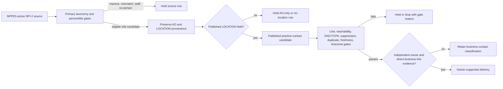

# Healthcare AO versus LOCATION contact contrast

Reviewed 2026-09-24. The live `healthcare_ao_contrast` brain entry uses recipe D and the free NPPES NPI-2 register for chiropractors, dentists, podiatrists, optometrists, physical therapy, and mental-health practices. NPPES publishes an Authorized Official (AO) name/title/telephone and a LOCATION telephone. They are distinct published business-contact fields: AO may be a corporate or headquarters desk, while LOCATION is the practice contact. Neither field, whether equal to or different from the other or from a Maps listing, proves current ownership, direct reach to the AO, handset ownership, mobile status, reachability, consent, or deliverability.

## Hypothesis

An active NPI-2 organization with the requested primary taxonomy can establish practice identity. Its LOCATION line can enter a public practice-contact lane after normal contact/compliance gates. AO identity and title are role evidence only. An AO line may be retained as separately labelled published-field metadata for an independently supported direct-business-contact assessment, but AO-only records must not be turned into owner contacts. Same and different AO/LOCATION numbers are a source-field contrast, not owner evidence.

## Five-case local code audit

On 2026-09-24, five synthetic NPI-2 objects were passed directly to `nppesOrganization(item, 'Chiropractor')` using `node --experimental-strip-types`. The audit made no network request and performed no lookup, trace, verification, delivery, or collection of actual contact data.

| Case | Observed parser result | Safe interpretation |
| --- | --- | --- |
| AO and LOCATION have the same number | Kept; `phone10` contains the AO field. | A shared published number is a business-contact field observation, never owner or handset proof. |
| AO and LOCATION differ | Kept; `phone10` contains the AO field while LOCATION remains in payload. | Difference is not a direct-owner signal. |
| LOCATION only | Kept; `phone10` is null despite a LOCATION field in payload. | The usable public practice field is not promoted into the job contact column. |
| Billing Coordinator AO | Held as `staff_title_excluded`. | Existing explicit staff-title gate works. |
| Corporate-looking organization with Vice President AO | Kept with the AO phone. | Corporate/repeated-AO screening and ownership evidence are absent. |

This fixture/code audit has a denominator of five selected synthetic parser inputs. It is not a source-coverage, line-type, owner accuracy, contactability, DNC/TCPA, reachability, or clean-contact measurement. `verifiedPhones` is zero.

## Correction DAG

The AO/LOCATION comparison belongs at `C` as a recorded source contrast. It must not change the branch to `I` or create an owner-mobile/direct-line label. Repeated AO identity/phone across organizations and corporate/DSO signals must hold owner labelling until separately corroborated.

## Industry-specific failures and field gates

| Risk | Required handling | Current state |
| --- | --- | --- |
| A different AO and LOCATION or Maps phone is called a direct owner line. | Store field provenance and treat equality/difference as contrast only; require independent owner and explicit direct-business-contact evidence. | Blocked. |
| An AO-only field becomes a local practice contact. | Hold AO-only/no-LOCATION records from the LOCATION public-contact lane. | Blocked. |
| A same AO/LOCATION field is called owner proof. | Label it a shared published business field only. | Blocked. |
| Billing, credentialing, office-management, administrator, or coordinator AO enters the route. | Keep the existing excluded-title parser gate; hold unfamiliar roles pending evidence. | Partial. |
| Corporate/DSO or one AO repeated across organizations is treated as an independent owner. | Count repeated normalized AO identity plus AO phone and hold corporate/repeated candidates from owner labelling. | Blocked. |
| A LOCATION business contact is delivered as an owner contact. | Require `assessOwnerEvidence` with a current direct business-site link and independent owner/founder corroboration; otherwise retain a business-contact classification only. | Blocked. |

## Sources, iteration, and implementation correction

- **VERIFIED / implemented:** `src/lib/lead-engine-registers.ts`, `nppesOrganization`, parses active primary-taxonomy NPI-2 rows, staff-title exclusions, AO phone into `name.phone10`, and LOCATION phone into payload.
- **VERIFIED / implemented:** `handoff/04_SOURCE_CATALOG.md`, Group C, identifies NPPES AO versus LOCATION telephone fields and the free keyless endpoint.
- **REPORTED / implemented historical identity context:** `src/data/lead-engine-brain.json`, `industries.healthcare_ao_contrast`, records a 682-row identity study; it explicitly is not a verified-cell measurement.
- **VERIFIED / proposed gate:** `src/lib/lead-engine-research.ts`, `assessOwnerEvidence`, requires current linked business-site and independent registry owner/founder evidence, but the recipe-D settlement path does not call it.

The initial recipe-D assumption was that an NPPES/Maps phone mismatch could be called a direct-line candidate. The five-case audit falsifies the owner meaning of that label: the runtime cannot distinguish AO and LOCATION provenance once `nppesOrganization` chooses AO as `phone10`, while an eligible LOCATION-only record has no job contact field. The correction is a source-specific NPPES healthcare lane that persists both fields and their provenance, selects LOCATION only for the public practice-contact lane, holds AO-only/no-LOCATION rows, and independently gates every owner label.

The material shared-runtime defect is in [`nppesOrganization`](/Users/francocappanera/NBC%20Sales/Caller/src/lib/lead-engine-registers.ts:833) together with [`bucketStep`](/Users/francocappanera/NBC%20Sales/Caller/src/services/lead-engine-jobs.service.ts:663) and [`settleVerified`](/Users/francocappanera/NBC%20Sales/Caller/src/services/lead-engine-jobs.service.ts:762). The parser puts `authorized_official_telephone_number` in `phone10`; `bucketStep` then puts any matched, unequal Maps phone in bucket 2, whose label is “Direct line candidate”; settlement can deliver a verified mobile without invoking `assessOwnerEvidence`. Implement a healthcare-specific field-provenance type (`nppes_ao_published`, `nppes_location_published`), make LOCATION the only public-practice contact input, prohibit AO/Maps comparison from setting `owner_direct_line_candidate`, and require a repeated-AO/corporate hold plus `assessOwnerEvidence` before owner-supported delivery. Add five route fixtures for same, different, LOCATION-only, AO-only, and staff/corporate-repeated cases.

The next measurement, after that correction, is a lawful 5–20 row aggregate observation from the verified public NPPES endpoint: report separate counts for active primary-taxonomy rows, staff holds, LOCATION present, AO-only holds, same/different source fields, repeated/corporate holds, normal contact-gate outcomes, independently owner-supported rows, and delivered business contacts. Do not use mailing, parcel, residential, trace, append, or paid lookup data. NPPES source access is free (`perInputUsd: 0`); per-clean cost remains unknown because no clean or delivered outcome has been measured.
