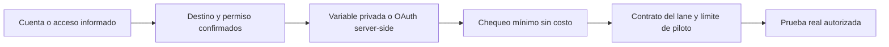

# Readiness de conexiones e integración

Fecha: 2026-09-17. Lane: Infraestructura / Conexiones e Integración. Tarea: I10. Modelo base: Terra, razonamiento medio.

## Objetivo

Coordinar la configuración privada y el orden de integración para desbloquear Caller, Lead Engine y Master Dashboard sin conectar cuentas, iniciar consumo, modificar módulos de producto ni publicar un workspace mutable.

## Alcance

- Mantener un registro interno sin secretos con estados `configured`, `not_configured`, `verified` y `blocked`.
- Identificar el dueño de cada adaptador, la configuración mínima y la evidencia que convertiría una configuración en conexión verificada.
- Definir la única integración Google preparada actualmente y pedir confirmación del destino antes de iniciar OAuth.
- Conservar L02/T1 locales y preparar la corrección S1 de sesión como fase separada de alto riesgo.
- Registrar la fuente de costo cuando se conozca, sin inventar importes ni crear otro dashboard.

## Fuera de alcance

- Llamadas, SMS, scraping, cotizaciones, ejecuciones de Actors, cargos, campañas, compras o publicación.
- Diseñar funcionalidades de Caller, Lead Engine o Master Dashboard.
- Cambiar `.env.local`, variables remotas, permisos de cuentas, defaults personales de modelos o credenciales.
- Conectar Google, Calendar, Ads, GHL o ElevenLabs desde una cuenta Google por inferencia.

## Flujo de configuración

Una cuenta disponible solo cubre A. Ningún estado posterior se infiere de ella.

## Google: conexión preparada, no activada

El único adaptador Google existente es el feed de Calendar. Lee, desde servidor, los próximos eventos de un calendario fijo de programa. Requiere una identidad de integración dedicada, acceso de lector al calendario que se confirme y OAuth offline con el scope `calendar.events.readonly`.

El adaptador no crea, edita, invita ni publica eventos; no lee calendarios arbitrarios enviados por navegador. Una cuenta Google o una sesión de conector del IDE no entrega las credenciales desplegables ni autoriza el acceso. La cuenta informada debe aclarar si se destina a ese calendario o a otro producto. No habilita ElevenLabs, Google Ads, GoHighLevel ni una API de Google por sí sola.

## Contratos de integración y responsables

| Producto | Adaptador / dueño | Configuración que puede ser necesaria | Validación posterior | Estado inicial |
|---|---|---|---|---|
| Caller | Caller C08 | Credenciales Twilio, número propio y configuración ElevenLabs | Número/agente, eventos y prueba a número propio con límite | ElevenLabs configurado; Twilio no configurado localmente |
| Lead Engine | Lead Engine L03 | Una elección confirmada entre Apify, Outscraper y/o BatchData; clave privada del proveedor elegido | Chequeo de bajo costo, Actor/endpoint, tarifa, piloto acotado y persistencia | Ningún proveedor configurado localmente; `outcrawler` requiere aclarar si significa Outscraper |
| Master Dashboard | Master Dashboard TR01 | Fuentes acordadas por métrica, cliente, periodo, unidad y frescura | Datos verificables y contrato de cada métrica | Bloqueado por referencia/fuentes de Anas; no conectar fuentes arbitrarias |
| Calendar | Infra I10 | ID de calendario de programa y OAuth server-side Google de solo lectura | Feed próximo de solo lectura, sin eventos externos ficticios | Destino y credenciales no configurados |
| GHL | Integración existente, coordinación Infra | Subcuenta, token privado, Location ID y webhook según recorrido acordado | Contacto/workflow de prueba controlado | Variables locales vacías; no es dependencia de I10 salvo que un lane la solicite |

## Corrección S1

S1 es la carrera en `WorkspaceAccess`: un logout remoto lento puede terminar después de un login nuevo y borrar la sesión nueva, incluso en otra pestaña. Mantener 12 horas fijas y validación de membresía requiere aislar generaciones de login/logout, propagar la salida local sin esperar la red y probar logout retenido, nuevo login, error remoto y refresh tardío.

Por afectar auth común y sesiones entre pestañas, se trata como fase Sol/alto. No se modifica bajo la fase inicial Terra/medio. T1 se revisará con el mismo candidato sin excluir archivos de código o pruebas vigentes.

## Aceptación I10

1. Matriz sin secretos, con dueño, estado y siguiente verificación por conexión.
2. Destino Google y tipo de acceso documentados antes de OAuth o acceso a datos.
3. Ninguna configuración privada o proveedor activado por inferencia.
4. S1 preparado y separado como fase crítica; L02/T1 locales preservados.
5. Reporte I10 con modelo, costo conocido/desconocido, pruebas y necesidades para Franco.

## Dependencias y decisión pendiente

- Franco confirma si la cuenta Google se usará para el calendario de mentoría/programa u otro producto, y cuál es ese producto si no es Calendar.
- El dueño del calendario confirma calendario exacto e identidad dedicada con permiso lector antes de OAuth.
- Caller confirma el contrato Twilio mínimo; Lead Engine aclara `outcrawler` y selecciona proveedor para el piloto; Master Dashboard aporta la referencia de Anas.
- Franco cambia el selector a Sol/alto antes de comenzar la corrección S1; después se vuelve a Terra/medio.
