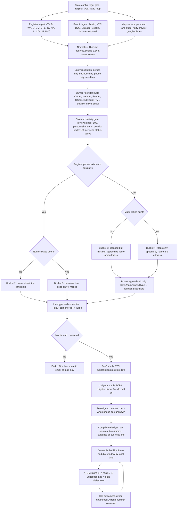
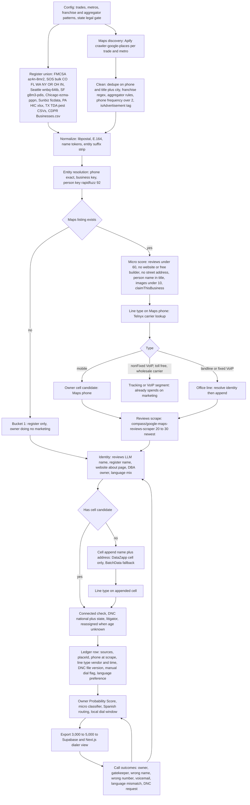
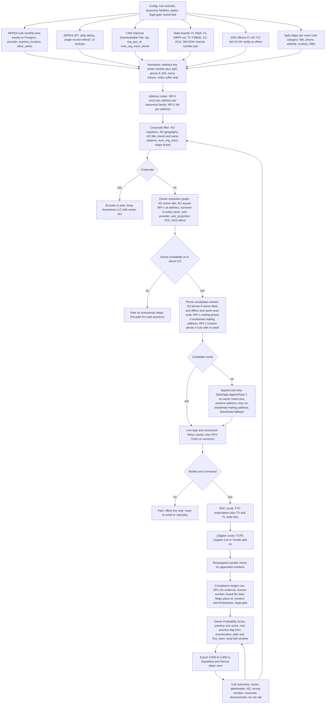
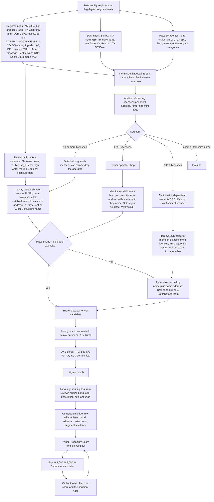
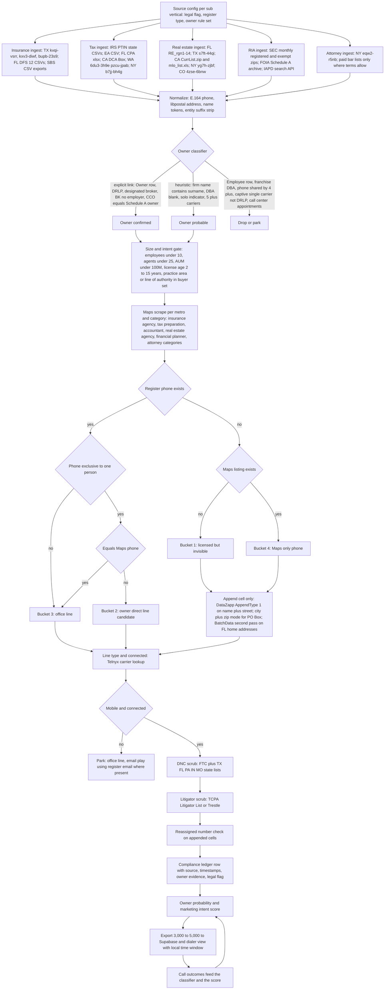
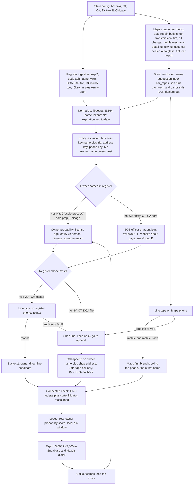
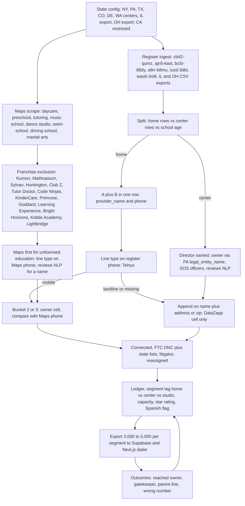
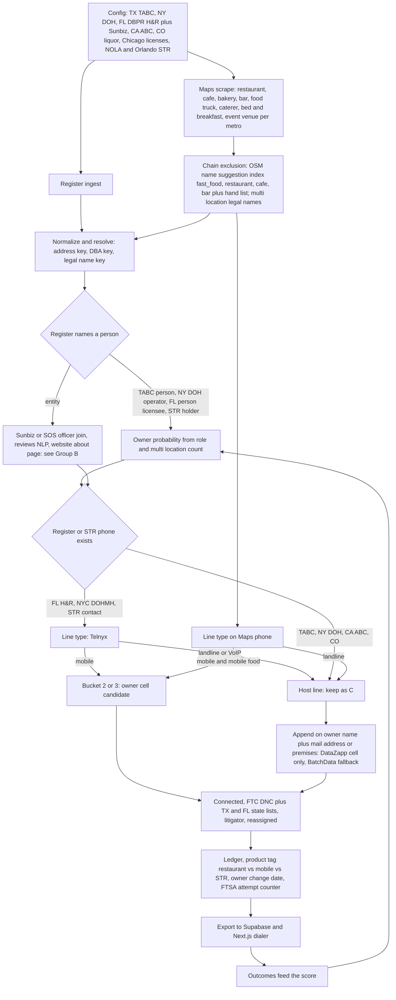

```mermaid
flowchart TD
    A0[State config: CPOM posture, SOS access, registry, franchise and chain lists, legal gate] --> A1[Maps discovery: Apify crawler-google-places, all Group D categories and keyword strings per metro]
    A0 --> A2[Register ingest: TN registry PDF, TDLR laser and esthetician CSVs, FL MQA office surgery and electrology, RI CHFR, AHCA clinic export]
    A0 --> A3[SOS ingest: FL Sunbiz SFTP, CO 4ykn-tg5h, NC bulk, WA extract, OR Socrata, NY n9v6-gdp6; per record TX PIR, CA bizfile, AZ eCorp, NV SilverFlume, IL, MI, PA, VA, MN, TN]
    A0 --> A4[NPPES monthly bulk plus weekly delta: NPI-1 NP PA RN MD by address key, NPI-2 name regex, AO fields]
    A1 --> B1[Chain filter: exclude corporate chains and telehealth; flag franchisees]
    B1 --> B2[Normalize: libpostal address with suite, phone E.164, title tokens, DBA candidates]
    A2 --> B2
    A3 --> B2
    A4 --> B2
    B2 --> C1[Address roster: NPI-1 clinicians at street number plus suite plus zip5; NPI-2 at address; SOS entities at address]
    B2 --> C2[Website team page and Instagram bio extraction: founder, owner, lead injector, medical director, credential]
    C1 --> C3[Person first resolution: named human to SOS officer or agent or PIR; two hop through member LLCs; NPI-1 mailing address equals member address]
    C2 --> C3
    C3 --> C4[Medical director graph: director on 2 or more spas, director title without owner evidence, director NPI-1 elsewhere -> director_only]
    C4 --> C5[Owner Probability Score: agreement count of SOS, NPI-1, website, Instagram; sole_proprietor; founder wording; franchise flag; formation age]
    C5 --> D1{Free direct phone candidate exists}
    D1 -- NPI-1 mailing phone differs or AO owner phone differs or agent phone --> D2[Bucket 2: owner direct line candidate]
    D1 -- only Maps phone --> D3{Maps phone is mobile per Telnyx}
    D3 -- yes --> D4[Bucket 3 mobile: NP or owner answers the spa line; call with the owner name]
    D3 -- no --> D5[Bucket 4: front desk line; append on person name plus NPI-1 mailing address or SOS member address]
    D2 --> E1[Line type and connected: Telnyx carrier, RPV Turbo second opinion]
    D4 --> E1
    D5 --> E0[Cell append: DataZapp AppendType 1, BatchData fallback]
    E0 --> E1
    E1 --> E2{Mobile and connected}
    E2 -- no --> X1[Park: email or Instagram DM play]
    E2 -- yes --> E3[DNC scrub: FTC plus FL, TX, PA, IN, MO state lists]
    E3 --> E4[Litigator scrub]
    E4 --> E5[Reassigned number check on appended phones]
    E5 --> F1[Compliance ledger row with sources, timestamps, director_only exclusion evidence]
    F1 --> F2[Export 3,000 to 5,000 with owner name, credential, role, spa, franchise flag, local time window]
    F2 --> G1[Call outcomes: reached_owner, reached_injector_employee, reached_front_desk, reached_medical_director, wrong_number, voicemail, dnc_request]
    G1 --> C5
    A3 --> H1[New spa detection: SOS formations with aesthetic keywords under 180 days, new NPI-2 and NPI-1 at new addresses, new TN registrations]
    H1 --> C5
```

# Lead Engine: Industry Routed Owner Cell Sourcing

## Technical build specification for NBC Sales

Prepared by Franco Cappanera, Head of AI, NBC Sales. Research date: September 19, 2026. Version 1.0.

This document has two audiences. The first eight sections are written for Anas and the leadership team: they explain the logic, the industry grouping, the recommended stack, one workflow per industry with a diagram, a prioritized stack with costs per industry, and the strategy for building something a competitor cannot copy. The appendices (A through G) are the full research modules, one per industry group, written as build specifications for the engineering agent that will implement the system. Every factual claim in the appendices is tagged VERIFIED (the endpoint or page was fetched and the payload was read during this research), REPORTED (a secondary source or a vendor page describing a third party) or UNKNOWN (not confirmed, with an exact verification request listed). The summary sections below inherit those tags.

## 1. Introduction: the logic of the Lead Engine

### 1.1 What we are building and why it is different

Every lead scraper on the market does the same thing: run a Google Maps scraper, take the phone number on the listing, sell the list. That phone is, by definition, the number the business wants strangers to call. It is the front desk, the office line, the call tracking number, the receptionist. It is the gatekeeper line. A salesperson dialing it is doing the same thing as everybody else and hitting the same wall.

The Lead Engine's output is different: **a verified owner cell phone number**, meaning a mobile line, live, belonging to the person who owns the business, not on the Do Not Call registry, not belonging to a known TCPA litigator, with a documented chain of evidence explaining why we believe it is the owner and why we are allowed to dial it. A human salesperson dials it manually, one call at a time, during the recipient's local business hours.

The reason this is hard is that **no single data source both names the owner and proves that a phone belongs to that person**. Public registers name owners but publish office phones. Phone vendors attach phones to names but do not know who owns what. Google Maps knows what the business does and what number it advertises but not who is behind it. So the engine is not a scraper; it is a matching system that combines four roles:

| Role | What it supplies | Why it fails alone |
|---|---|---|
| A, identity | A public register that names the human owner (a license, a corporate filing, a permit, a federal registry) | Its phone is usually the office line, or there is no phone at all |
| B, contact | A phone attached to that specific person (from the register itself, or from a paid append on name plus address) | A name next to a number proves nothing about ownership |
| C, contrast | The number the business advertises on Google Maps | It is the gatekeeper line by definition |
| D, validation | Line type (mobile, landline, VoIP), connected status, DNC status, litigator status | Says nothing about who owns the number |

The decision rule that ties them together is simple and measurable. **If the register phone (B) differs from the advertised Maps phone (C), the register phone is a strong candidate for the owner's direct line.** If they are equal, it is the main line and there is no bypass; the owner cell must come from an append. This rule was first measured on the federal healthcare registry (NPPES) and then generalized: across 682 live organization records in Florida, Texas and North Carolina, the named Authorized Official's phone differs from the practice's front desk phone in 36.7 percent of records, and when the official's title says Owner, President or Member, that different phone is a direct line to the owner about one time in four (VERIFIED, Appendix C).

### 1.2 The four buckets, and the one nobody else can see

The matching stage does not produce one list; it produces four buckets, and they are worth very different amounts to a marketing agency.

- **Bucket 1, in the register but absent from Google Maps.** A licensed, registered owner who does no marketing at all. No listing, no reviews, often no website. For an agency that sells marketing, this is the ideal customer, and a Maps first competitor structurally cannot find them because they start from Maps.
- **Bucket 2, in both, phones differ.** The register phone is the owner direct line candidate. The best bucket for immediate dialing.
- **Bucket 3, in both, phones equal.** The register phone is the business line. Keep only if the line type test says it is a mobile (which in one to three person shops it often is).
- **Bucket 4, in Maps only.** No identity from a register. Requires identity resolution from other sources and a paid append.

### 1.3 The two questions every industry has to answer

The core insight from the research is that **the register knows WHO owns the business, and Google Maps knows WHAT the business does.** Washington State's contractor register lists 50,628 "GENERAL" contractors and only 516 "ROOFING" contractors, because the state classifies the permission, not the trade (VERIFIED). Ask the register for roofers and you get 516; ask Google Maps and you get thousands, with no owner names. Both stages are required on every industry, and the way they combine is what changes from one industry to the next.

That is why Anas's instinct is correct and is the architectural backbone of this document: **each industry needs its own workflow**, because the answer to "where is the owner named" and "where is the owner's phone" is different for a roofer, a dentist, a med spa, a barber and a restaurant. The engine is a router: it classifies the target industry into a group, and each group has its own identity source, its own contact logic, its own contrast rule and its own legal gate. The validation stage (D) is shared.

## 2. How the industries were grouped

The grouping is not by commercial category and not by who buys the most marketing. It is by **sourcing mechanism**: three questions decide the group.

1. Does a public register name the human owner? (A contractor board, a state license, a corporate filing, a federal registry.)
2. Is the owner's phone attached to that register, or does it have to be appended?
3. Does the owner answer the advertised phone (one to five person shops), or is the owner hidden behind a front desk (healthcare, personal care, restaurants)?

Those three questions produce eight groups. Two of them (G, H, I) were researched together because they are smaller and share mechanics.

| Group | Industries | Sourcing mechanism | Who answers the Maps phone |
|---|---|---|---|
| A. Licensed home services | HVAC, roofing, plumbing, electrical, garage doors, general contractors, solar, pool, fencing, concrete, windows | State contractor board names the owner or qualifier; in seven states it also carries a phone | Owner in small shops, office in larger ones |
| B. Unlicensed home services | Landscaping, tree service, cleaning, junk removal, pressure washing, handyman, painting, movers, pest control (licensed sub case) | No board; identity from Secretary of State, FMCSA, city licenses, DBA filings, reviews; pipeline is inverted (Maps first) | The owner, on a personal cell, in the majority of cases |
| C. Healthcare with NPI | Dentists, chiropractors, physical therapy, optometry, audiology, mental health, dermatology, small physician practices, podiatry; veterinarians as a sub case | Federal NPPES registry names the Authorized Official and every clinician; ownership inferred from name, address and title patterns | Front desk |
| D. Aesthetic and cash pay healthcare | Med spas, injector practices, IV therapy, GLP-1 and hormone clinics, laser, hair restoration, small cosmetic surgery | No taxonomy, no owner register; person first (injector, founder) then entity (SOS, Comptroller, MSO and PC pairing); legal structure varies by state | Front desk |
| E. Personal care and fitness | Salons, barbershops, nails, massage, lash and brow, tattoo, gyms and studios | Establishment license names the owner in NY and FL; practitioner license plus home address in TX; suite studios are one person businesses | Owner in suites and one chair shops, front desk in multi chair salons |
| F. Regulated professional services and legal | Insurance agents, CPAs and tax preparers, real estate brokers, RIAs, attorneys | Person level license registers with contact data; the problem is owner versus employee, solved with appointment, firm permit, designated broker and Schedule A ownership data | The professional, or the office |
| G. Automotive | Independent repair, body, tire, towing, detailing, small dealers, car washes | NY DMV names the owner on repair shops; WA gives phones; CA gives both through two files; elsewhere SOS plus Maps | Shop line |
| H. Childcare and education | Daycares, family child care homes, preschools, tutoring, dance and music studios | State childcare licensing datasets name the provider and carry her phone and often email | The provider herself, at home |
| I. Food and hospitality | Independent restaurants, bars, food trucks, caterers, short term rental operators | Liquor license files name principals; health permits name operators in NY; STR permits carry name, cell and email | Front of house |

Why this grouping and not another: a grouping by marketing spend (who buys Meta ads) would put dentists next to roofers, and they need completely different pipelines. A grouping by sourcing mechanism means one implementation per group serves every industry in it, and adding an industry later is a configuration change, not a new module.

## 3. How the research was done: one industry at a time, to convergence

Each group was researched as its own module with the same discipline, because a finding from one industry does not transfer to another. The method for each module:

- **Hypothesis 1:** the most obvious path from "list of businesses" to "verified owner cell".
- **Vulnerabilities:** every way that path breaks (the phone is an office line, the named person is an employee not the owner, the register is stale, phone reuse, states without bulk data, legal restrictions, low mobile rate, franchise contamination, large companies).
- **Attack:** a specific alternative source, filter or matching technique for each vulnerability.
- **Hypothesis 2, 3, 4** until the workflow stops changing.

Wherever possible the researcher hit the real endpoint and counted. Examples of what was measured live, not assumed: 682 NPPES organization records in three states for the Authorized Official effect; 41 med spa storefronts in Tampa and Austin looked up by name against NPPES (17 percent have an organization NPI); 15,554 of 15,799 electrical permits in Austin in the last twelve months carry a contractor phone; 71,435 Texas salon establishment rows checked for the owner name trap; New York's 32,384 salon and barber licenses checked for the presence of a human owner name (99.8 percent); Texas TDLR's owner_telephone field compared to business_telephone (identical on 100 percent of electrical contractor rows, so it is a mirror, not a second phone).

The important consequence for the reader: **the per industry findings are not opinions**. Where the report says Florida names the barbershop owner in the address block of the license file, that is a raw line from the file. Where it says a source is UNKNOWN, the appendix gives the exact request the engineering agent should run to settle it.

## 4. Recommended stack

The stack has three layers: free public registers (the identity layer, which is where the value is), a Maps scraper (the contrast layer) and a validation layer (line type, DNC, litigator). Paid appends sit between them and are used only on the rows that need them. The table below is the global recommendation; each industry section refines it.

| Component | Role | Priority | Cost | Why |
|---|---|---|---|---|
| Socrata open data endpoints (state and city portals) plus agency bulk files (CSLB, FL DBPR, FL MQA, FL DFS, FL Sunbiz, VA DPOR, MN DLI, NJ DCA, NPPES, CMS, IRS PTIN, SEC, FMCSA) | A and often B | MUST | $0 | The identity layer; this is where competitors are absent |
| Apify compass/crawler-google-places | C | MUST | $0.004 per place ($0.50 minimum run) | Already in stack; cheaper than Outscraper above the free tier |
| Apify compass/google-maps-reviews-scraper plus a small LLM for extraction | A for unregistered sole proprietors | MUST in Groups B, E, G, I | $0.30 per 1,000 reviews plus about $0.002 per listing | Owner first names from reviews ("the owner, Mike, came out himself"); cheapest identity source where no register exists |
| Postgres entity resolution: libpostal, rapidfuzz, phonenumbers (E.164), pg_trgm | Matching | MUST | $0 | The whole method is the join; no vendor does cross register resolution |
| Telnyx Number Lookup | D, line type and carrier | MUST | $0.0015 to $0.0025 per number | Cheapest accurate line type; this is the branch decision in every pipeline |
| FTC National DNC Registry, direct subscription | D | MUST | $82 per area code per year (FY2026), $85 from October 2026; first five area codes free | Legal requirement; rescrub every 31 days; do not depend on a vendor for this |
| TCPA Litigator List (or Trestle litigator add on) | D | MUST | $0.001 to $0.005 per query | Asymmetric risk: a serial plaintiff's number passes every technical test |
| DataZapp Phone Append API, cell only mode | B, paid append | SHOULD | $0.02 to $0.03 per match, charged on matches only; $125 minimum, $1,000 prepay to unlock the API | Cheapest name plus address to cell append found; returns PhoneType, Cell, CellDoNotCall; its reverse phone product returns CompanyName, which tests whether a Maps phone belongs to a person |
| RealPhoneValidation Turbo V3 or DNC Plus | D, connected status and business versus consumer flag | SHOULD | $0.008 to $0.015 per number, $19 per month minimum | One call gives connected, line type, DNC and litigator; the caller_type "business" flag is the evidence that defends a B2B call under the DNC rules |
| BatchData skip trace | B, second pass | SHOULD (reserve) | $0.03 to $0.07 per match, $99 minimum | Stronger on property linked owners; use on DataZapp misses for Bucket 1, not as the default verifier |
| Secretary of State bulk files (CO Socrata, NY Socrata, FL Sunbiz SFTP, WA extract, TX Comptroller per record) | A for entities | SHOULD, MUST in Groups B, D, E, I | $0 to $20 per month | Registered agent or officer is the owner for micro LLCs (5 of 5 in a Colorado lawn care sample) |
| Shovels.ai (building permits with contractor phone and activity) | Intent signal, Group A | NICE | $599 per month for 25,000 credits | Permit velocity as ability to pay; only on the top candidates |
| Outscraper | C backup | NICE | $3 per 1,000 records | No advantage over Apify at our volumes |
| Fresha, Booksy, Instagram profile scrapers (Apify actors) | A residual | NICE | $1.60 to $4 per 1,000 | Staff role "Owner" and bio role words; terms risk, low volume only |
| Data Axle (what "DataZapp" is often confused with) | B | AVOID | Contact sales | Compiled business file with business phones, no owner cell for one location shops |
| Clay, Apollo, ZoomInfo, Cognism, Lusha | B | AVOID | $149 to $15,000 plus per year, 10 to 40 cents per mobile credit | LinkedIn derived; about 20 percent owner coverage on local businesses; not built for one person trades |
| OpenCorporates | A | AVOID | £2,250 per year minimum | State SOS bulk is free where needed |
| NIPR PDB, NMLS bulk, FINRA BrokerCheck compilation, voter files, DMV data, WA LCB lists, SC and UT licensee lists | A | AVOID | Various | Legally restricted for marketing use, or $85,000 per year with no phone (NMLS) |

**Two decisions to make now.** First, the verifier is not one vendor: Telnyx (or RealPhoneValidation) for line type, the FTC subscription for DNC, a dedicated litigator scrub, and BatchData only for skip tracing. Separating the functions lowers cost and raises precision compared with using BatchData for everything. Second, DataZapp is the recommended primary cell append because it charges on matches only and its cell only mode returns exactly the field we need; BatchData stays as the second pass.

## 5. Industry by industry analysis

Each section below gives: what makes the group different, the findings that change the build, the workflow diagram, the prioritized stack for that industry, the cost per 5,000 verified owner cells, and what to build first. The full research, state by state tables, hypothesis loops, legal checks and open questions are in the corresponding appendix.

### 5.1 Group A: Licensed home services

**What makes it different.** The state register is not an optional enrichment, it is the legal precondition to operate, so identity (A) is free in at least eleven jurisdictions and the register phone (B) comes with it in seven. This is the cheapest and cleanest group in the system and should be built first.

**Findings that change the build.**

- **California CSLB** is the largest and cleanest source: 212,896 licenses, 311,059 personnel rows with real human names, and the "Sole Owner" title isolates 93,755 people whose phone is used by nobody else (89.8 percent yield). Washington (L&I), Oregon (CCB), Minnesota (DLI) and Florida (DBPR) also deliver name plus phone for free.
- **Texas TDLR has an owner_telephone field but it is a mirror** of business_telephone on 100 percent of electrical contractor rows, and owner_name is the business name (VERIFIED). Texas is a business level register; the human comes from the Master Electrician link or the Comptroller officer data. The Texas A/C contractor file has zero phones.
- **Building permits are a second identity plus contact source.** Austin's permit dataset carries contractor_full_name, contractor_phone and contractor_trade; 98 percent of electrical, plumbing and general contractor permits in the last twelve months have a phone (VERIFIED). NYC's legacy DOB permits name the permittee with a phone. Permit velocity is the strongest intent and ability to pay signal available.
- **Legal posture must gate the state list.** South Carolina requires a certification that the licensee list will not be used for commercial solicitation, with criminal penalties. Utah restricts licensee lists to approved purposes. Arizona requires a commercial purpose public records statement and charges market value. Oregon, Colorado and Illinois publish under public domain or ODbL licenses. Washington publishes the full dataset under PDDL even though its public records statute restricts commercial lists of individuals (defensible, not clean).
- **New York has no statewide contractor license**; NYC's consumer affairs dataset gives 13,385 home improvement contractors with a contact phone, and North Carolina sells its list of general contractor qualifiers for $25, the best value in the country for GC owners.

**Workflow.**



**Stack for Group A.**

| Component | Priority | Cost | Reason |
|---|---|---|---|
| CSLB data portal, FL DBPR extracts, WA and OR Socrata, MN DLI CSVs, VA DPOR regulant lists, NJ DCA bulk, CO and IL Socrata, NYC DCWP | MUST | $0 | Free identity, and phone in CA, WA, OR, MN, FL |
| Austin, NYC DOB, Chicago, Seattle permit datasets | MUST where in scope | $0 | Person name plus phone plus activity |
| Apify crawler-google-places | MUST | $40 to $80 per list | Contrast phone and trade classification |
| libpostal, rapidfuzz, phonenumbers | MUST | $0 | Entity resolution |
| Telnyx, FTC DNC, TCPA Litigator List | MUST | $0.0025 per number; $82 per area code; $0.005 per query | Legal floor |
| DataZapp cell append | SHOULD | $0.02 to $0.03 per match | Bucket 1 and Bucket 4 |
| RealPhoneValidation | SHOULD | $0.008 to $0.015 | Connected status and business flag |
| BatchData skip trace | SHOULD (reserve) | $0.03 to $0.07 | Second pass |
| Shovels.ai | NICE | $599 per month | Permit velocity where free permits do not exist |
| NC LBGC list ($25), NV list ($200), MI FOIA list ($0.005 per record) | NICE | Under $250 per state | Cheap paid identity for states without bulk |
| Apify state license scrapers (AZ, OH, LA, MD) | NICE, per record only | $2 to $10 per 1,000 | Verification of individual records |
| Data Axle, Clay, OpenCorporates, ConstructConnect, Dodge | AVOID | Four figures | No owner cells, or free equivalents exist |
| SC and UT board lists | AVOID | | Solicitation use prohibited |

**Cost per 5,000 verified owner cells: about $350 to $600, or 7 to 12 cents per cell.** The register is free; the dominant cost is the cell append for owners whose register phone is a landline or office line.

**Build first:** California CSLB Sole Owner end to end (5,000 owners, near zero cost), then WA and OR (trivial Socrata joins), then Florida DBPR, then Austin permits as the intent feed.

### 5.2 Group B: Unlicensed home services

**What makes it different.** No board names the owner, so the pipeline is inverted: **start from Google Maps, test the line type of the advertised phone first, and only resolve identity and append a cell for listings whose phone is not already a mobile.** This works because one to five person shops advertise the owner's own handset. The best estimate of the mobile share of Maps phones in these trades is 55 to 70 percent (confidence medium low; no vendor publishes this and it is the first thing to measure with Telnyx).

**Findings that change the build.**

- **The FMCSA Motor Carrier Census is a free national register with names, phones and emails** that covers not only movers (135,587 active household goods carriers, 82.5 percent with three or fewer trucks) but also 26,562 active carriers with TREE in the name and 14,705 with LANDSCAP as a DBA (VERIFIED). Anyone with a truck over 10,001 pounds registers with a USDOT number, and small operators register their cell.
- **The registered agent of a micro LLC is the owner.** In the Colorado Secretary of State file, five of five lawn care entities in good standing had a registered agent whose surname matched the business name (VERIFIED). The heuristic: agent is a person, agent address equals principal address, agent surname appears in the entity name.
- **City business license datasets name owners and carry phones** in Seattle (95.8 to 100 percent phone fill on Group B NAICS codes), San Francisco, Chicago (owner file joined to license file) and Los Angeles (VERIFIED).
- **Owner names can be extracted from reviews.** "The owner, Mike, was great" appears constantly in reviews of micro businesses; at $0.30 per 1,000 reviews plus a small LLM this is the cheapest identity source for sole proprietors who never filed anything, and no competitor was found doing it at scale.
- **Pest control is licensed everywhere** (Department of Agriculture applicator and business lists in TX, CA, FL and 16 states via a scraper), so it behaves like Group A.
- **Franchise contamination is heavy** (Molly Maid, The Grounds Guys, 1-800-GOT-JUNK, College Hunks, CertaPro, Two Men and a Truck, Lawn Doctor, Terminix) and must be removed by name pattern before any spend.

**Workflow.**



**Stack for Group B.**

| Component | Priority | Cost | Reason |
|---|---|---|---|
| Apify crawler-google-places | MUST | $36 to $96 per 24,000 places | Discovery is the contact source here |
| Apify google-maps-reviews-scraper plus small LLM | MUST | $120 plus $30 to $60 per list | Owner names for unregistered sole proprietors |
| Telnyx Number Lookup | MUST | $54 per list | The line type gate is the first paid step |
| FMCSA Company Census | MUST | $0 | Names, phones, emails for movers, tree, landscaping, haulers |
| Seattle, SF, Chicago, LA business license datasets | MUST where the metro is in scope | $0 | Owner names and phones |
| SOS bulk: CO, NY, FL Sunbiz, WA, OH, IN new filings | MUST | $0 | Registered agent or officer as owner |
| FL Sunbiz fictitious names, PA HIC export, TX and CA pest CSVs | MUST per state | $0 | Human behind the trade name |
| FTC DNC plus FL, TX, PA, IN, MO state lists; TCPA Litigator List | MUST | $82 per area code; $0.005 per query | Higher DNC hit rate on personal cells |
| DataZapp cell append, RealPhoneValidation, BatchData reserve | SHOULD | $0.02 to $0.07 per match | Office branch and Bucket 1 |
| Website about page fetch | SHOULD | $0 plus LLM | 15 to 30 percent of listings gain a name |
| Harris County and LA County assumed names | SHOULD for Houston and LA | $0 to unknown | Sole proprietors in the two largest unlicensed markets |
| Facebook pages, Yelp, Thumbtack, Nextdoor scrapers | NICE | $1.20 to $5.40 per 1,000 | Cross platform discovery; terms risk |
| Historical WHOIS | AVOID | | Redacted, 5 to 10 percent hit |
| Clay, Apollo, ZoomInfo, Lusha, paid SOS bulk (IN $9,500, TX unload $1,350) | AVOID | | Thin coverage or free equivalents |

**Cost per 5,000 verified owner cells: about $600 to $650, or 12 to 13 cents per cell**; 9 cents if the connected second opinion is dropped in favor of Telnyx alone. A 5,000 list needs 18,000 to 22,000 raw Maps places after franchise removal: four to five trades across four to six metros.

**Build first:** the line type gate on Maps phones (measure the mobile share on day one), then the FMCSA join, then the reviews extraction, then the Colorado and Florida SOS agent heuristic.

### 5.3 Group C: Healthcare with NPI

**What makes it different.** The federal NPPES registry is free, has no key, has no opt out, names a human Authorized Official on every organization record and names every clinician with a license number and a mailing address that is frequently residential. The owner is identifiable from public data for roughly two thirds of independent practices without any vendor. The weak spot is the phone, not the identity.

**Findings that change the build (measured live on 682 organization records in FL, TX and NC).**

- Authorized Official phone differs from the practice phone in **36.7 percent** of records; the AO title indicates ownership (Owner, President, CEO, Member, Founder) in **62.8 percent**; among owner titled records the AO phone differs from the front desk in **28 percent**.
- The AO surname appears inside the organization's legal name ("Smith Family Dentistry", "John Doe DDS PA") in **29.2 percent** of single practice records: a free ownership rule with no vendor.
- **Corporate contamination is detectable**: the same AO name and phone repeated across three or more records flags DSOs and chains (12.2 percent of the sample; 22 of 30 Florida audiology records belonged to one corporate AO). CMS's Provider Data Catalog gives group size (num_org_mem) for free to exclude large groups.
- **Sub vertical ranking by cleanliness:** podiatrists (82 percent owner titled) and chiropractors (74 percent) are the cleanest; family medicine (23 percent, hospital owned practices dominate) is the dirtiest. Mental health and acupuncture are mostly solo NPI-1 providers with no front desk, so the register phone is often a personal cell.
- About 5 percent of AO records are credentialing or billing desks (third party services listing themselves), which must be excluded by title.
- **Veterinarians are not in NPPES**; they route through state veterinary boards, SOS officers of the practice entity and Maps.

**Workflow.**



**Stack for Group C.**

| Component | Priority | Cost | Reason |
|---|---|---|---|
| NPPES bulk V.2 monthly plus weekly deltas | MUST | $0 | The register: AO fields, license numbers, sole proprietor flag, enumeration date |
| NPPES API | MUST | $0 | Daily deltas and per record refresh; 1,200 row ceiling per query, slice by postal code |
| CMS Provider Data Catalog National Downloadable File | MUST | $0 | Group size and group phone, 3.39 million rows |
| Apify crawler-google-places | MUST | $70 to $100 per list | Contrast phone and brand detection |
| Postgres entity resolution | MUST | $0 | The join is the method |
| Telnyx, FTC DNC plus TX and FL lists, TCPA Litigator List | MUST | See global | Legal floor |
| DataZapp cell append | SHOULD | $0.02 to $0.03 per match | 70 percent of owners have no register cell |
| Florida MQA data download | SHOULD | $0 | Daily statewide file with email and mailing address for every FL health profession |
| FL DBPR vet extract, TX TSBDE dentist file, CA DCA Box files, WA DOH dataset | SHOULD | $0 | License confirmation; TX "Private" practice flag is a free owner style filter |
| SOS officer bulk (FL, NC, CO, WA, IN, OH) | SHOULD | $0 | PA and PLLC entities, the vet sub case |
| RealPhoneValidation, BatchData reserve | SHOULD | See global | Connected status; second pass |
| PECOS enrollment and reassignment files, Medicare utilization | NICE | $0 | Size and revenue proxies |
| DataZapp healthcare lists | NICE | $0.04 per record with phone | Breadth test of a sub vertical before building |
| Definitive Healthcare, IQVIA OneKey, ZoomInfo, Ribbon, list brokers, Doximity | AVOID | $15,000 to $100,000 plus | No owner cells; the same NPPES rows we load free |

**Cost per 5,000 verified owner cells: about $410 to $470, or 8 to 9.5 cents per cell**, from roughly 30,000 input records (one large state across all sub verticals, or one sub vertical across four to six states).

**Build first:** the NPPES bulk load with the AO contrast and the surname in entity name rule, then chiropractors and podiatrists in Florida and Texas as the first lists, then the DSO exclusion model.

### 5.4 Group D: Med spas and aesthetic cash pay healthcare

**What makes it different.** There is no owner register and no NPPES taxonomy, and the legal structure varies by state: in strict corporate practice of medicine states (CA, TX, NY) the entity of record is a physician owned professional corporation with a management company (MSO) behind it, while in Florida the LLC owner can be anyone. The owner is resolved **person first** (the injector or founder advertised on the website, on Instagram, in local press, or enumerated as an NPI-1 provider at the spa's suite), then **entity second** (SOS officer or agent, two hops through member LLCs in Florida, Comptroller public information report in Texas, MSO plus PC pairing in CPOM states).

**Findings that change the build.**

- Of 41 med spa storefronts in Tampa and Austin looked up by name, only **17 percent had an organization NPI** (VERIFIED). NPPES alone cannot enumerate the industry.
- **Address matching of individual clinicians works.** Querying NPPES for nurse practitioners, physician assistants and registered nurses by postal code and matching the practice location to the spa's exact suite found a clinician at 6 of 17 addresses (35 percent lower bound); two of those had a residential mailing address and a different mailing phone (an Austin NP flagged sole proprietor with a mailing phone different from the spa line).
- **The Florida two hop pattern, on a live case:** a Tampa spa resolved to an NP at the suite, then a Sunbiz officer search on her surname revealed the operating LLC, whose members are three holding entities, one at the NP's mailing address; local press confirmed the three co founders.
- **The Tennessee Medical Spa Registry** (399 facilities, medical director named) shows that the medical director is not the owner: 287 distinct directors, the top ones supervising three to seven spas each. A medical director graph is needed to avoid calling the supervising dermatologist as if he owned each spa.
- **Texas laser hair removal facility licenses** are in a separate TDLR CSV with phone; esthetician establishment rows (4,768) have owner_name equal to business_name. Texas Comptroller public information reports expose officers per entity (free per record, $1.50 per 1,000 via a scraper).
- **Franchise brands have no NPI records** (DRIPBaR, Restore, LaserAway returned zero); the exclusion list matters (Ideal Image, Milan Laser, SkinSpirit, Prime IV, Sono Bello, telehealth GLP-1 brands).
- Manufacturer provider locators (Allergan Alle, Galderma Aspire, device makers) are JavaScript applications with terms limiting use to non commercial personal use: manual qualification only, never bulk.

**Workflow.**



**Stack for Group D.**

| Component | Priority | Cost | Reason |
|---|---|---|---|
| Apify crawler-google-places with the full keyword set (medical spa, skin care clinic, laser hair removal, weight loss, IV therapy, plastic surgery) | MUST | $120 to $180 per list | The only universal discovery source for a cash pay industry |
| FL Sunbiz SFTP bulk with two hop member resolution and officer name search | MUST | $0 | The best free owner register in the group |
| CO, NC, WA, OR SOS files | MUST where in scope | $0 | Person agents on 85 percent of Colorado MED SPA rows |
| NPPES bulk, NPI-1 address roster, mailing addresses | MUST | $0 | Injector identity, license number, residential mailing address |
| Website team page extraction with a small LLM | MUST | $30 to $50 per list | Names the founder or lead injector on about half of sites |
| TX Comptroller PIR per record | MUST for Texas | $1.50 per 1,000 | Only free officer source in a strict CPOM state |
| Chain, franchise and registered agent service blocklists | MUST | $0 | Otherwise the list contains regional managers and Northwest Registered Agent |
| Medical director graph and director_only classifier | MUST | $0 | Prevents calling the supervising physician as the owner |
| DataZapp, Telnyx, RPV, FTC DNC, litigator list | MUST | See global | Validation |
| TN Medical Spa Registry parse plus TN licensure practice phones | SHOULD | $0 | Clean facility register in one state |
| TDLR laser facility CSV, FL MQA office surgery and electrolysis files | SHOULD per state | $0 | Business phone and licensed address |
| Instagram profile scraper on handles found on websites | SHOULD | $1.60 per 1,000 | Bio role words; low volume |
| Local press "best injectors" extraction | SHOULD | $0 | Names owners with credential |
| CA SOS Statement of Information bulk order | SHOULD for California | About $100 | Per record lookups do not scale |
| Outscraper with social link enrichment, RealSelf actor, AHCA clinic export, RI lists | NICE | $3 to $5 per 1,000 | Backups and small states |
| Alle, Aspire, device locators, AmSpa reports, Yelp, Groupon, Booksy, Vagaro, Zocdoc bulk scraping, DataZapp or Data Axle "med spa" lists, Clay, ZoomInfo | AVOID | | Terms, or the same front desk phone we already have |

**Cost per 5,000 verified owner cells: about $690 to $810, or 14 to 16 cents per cell**, the most expensive group. Volume is the binding constraint: the national universe is roughly 11,000 to 12,000 med spas, so a 5,000 list must bundle med spas with IV, GLP-1, hormone, laser, hair restoration and small cosmetic surgery practices across three or four states.

**Build first:** Florida (Sunbiz two hop plus NPI-1 address roster) because it has the cleanest legal structure and the largest market, then Texas with the Comptroller officer path, then the medical director graph from Tennessee as the template.

### 5.5 Group E: Personal care and fitness

**What makes it different.** In two large states **the establishment license itself names the human owner**: New York names the person on 99.8 percent of shop licenses (32,384 rows, VERIFIED) and Florida names the owner in the address block of barbershop rows (VERIFIED raw lines). Texas never names a person on an establishment but gives **the owner's home mailing address on 96 percent of mini salons** (21,616 suite studio rows) and 80 percent of full service salons, which is a skip trace key. The suite studio segment (Sola, Phenix, Salon Lofts, about 3,300 buildings and 110,000 professionals) is a population of one person businesses whose advertised phone is the owner's cell; Texas and New York license those people as their own establishments.

**Findings that change the build.**

- New York's dataset carries four license types (business, area renter, barbershop owner, barber renter), issue dates (2,205 new shops in 2026 to date) and a georeference, but no phone: identity and freshness come free, the phone comes from Maps or an append.
- Texas has 71,435 establishments with phone on 99.9 percent, and the mailing address on a residential street in another town is the append key. A suite renter advertising a Minnesota area code at an Austin suite is a personal cell that moved with its owner.
- **Booth rental salons** are detected by counting licensed practitioners per address; the owner is the SOS officer, not the practitioners.
- Booking platforms (Fresha, Booksy) expose staff counts and a job title "Owner" through Apify actors at $3.40 to $4 per 1,000 venues.
- **Gyms have no register**; they follow the Group B path with a franchise exclusion list (Anytime, Planet Fitness, Orangetheory, F45, Pure Barre, Club Pilates and about thirty more).
- Language matters for a bilingual sales team: Vietnamese American nail salons and Spanish speaking barbershops are large segments; route by language signal in reviews and names, never by profiling beyond language preference.

**Workflow.**



**Stack for Group E.**

| Component | Priority | Cost | Reason |
|---|---|---|---|
| NY DOS appearance enhancement and barber datasets | MUST | $0 | Owner named on 99.6 percent of shops, renters flagged, daily |
| TX TDLR 7358-krk7 plus daily CSVs | MUST | $0 | 71,435 establishments with phone and home mailing address |
| FL DBPR barbers and cosmetology extracts | MUST | $0 | Owner name on most barbershop rows, practitioner home addresses |
| CO, IL, DE license datasets | MUST | $0 | Practitioner and shop names; IL has a sole proprietor flag |
| SOS files (Sunbiz, CO, NY, WA, TX) | MUST | $0 to $200 | LLC and corporate shops, and all gyms |
| Apify crawler-google-places | MUST | $0.004 per place | Contrast and phone |
| Address clustering in Supabase (practitioners per address) | MUST | $0 | The segment logic is the product |
| Telnyx, FTC DNC, litigator list | MUST | See global | Legal floor |
| DataZapp reverse address and cell append | SHOULD | $0.02 to $0.03 per match | Converts the TX home address and FL practitioner address to a cell |
| Reviews scraper plus LLM | SHOULD | $0.30 per 1,000 reviews | Owner name and language signal for anonymous shops |
| Fresha and Booksy actors | SHOULD | $3.40 to $4 per 1,000 venues | Staff count as booth detector, "Owner" title |
| Instagram profile scraper, CA DCA Box files, VA DPOR, NJ DCA, PA and OH lists, county body art files | NICE | $0 to $71 | Residual identity |
| BatchData skip trace | NICE (reserve) | $0.03 to $0.07 | Second pass |
| WA DOL professional lists, AZ, UT, SC board lists, suite operator directories, Clay, ZoomInfo, Apollo | AVOID | | Restricted, JavaScript only, or no coverage of one chair businesses |

**Cost per 5,000 verified owner cells: about $770, or 15 cents per cell** for a mixed list; **about $350, or 7 cents**, for a list built only from the suite and mini segment plus New York shops, because the register already carries the name (NY) or the cell (TX suites).

**Build first:** Texas mini establishments plus New York shops (cheapest list in the whole program with the owner already identified), then Florida barbershops, then the booth rental detector.

### 5.6 Group F: Regulated professional services and legal

**What makes it different.** The person is the license and the registers are person level with contact data often included. The challenge is separating owners and principals (agency owner, firm partner, broker of record, RIA principal) from employees and captive producers, and reading the data use terms of each register.

**Findings that change the build.**

- **Texas TDI publishes an explicit owner register** (business relationships dataset, 118,020 rows) with association types Owner (9,212), Designated Responsible Licensed Person (27,988), Employee (11,653), Officer, Member (VERIFIED). It is both a list and the training set for an owner versus employee classifier. Florida DFS publishes name plus phone plus email for every licensee (323 MB, daily). The NAIC SBS report generator sells register rows with phone and email at $0.03 for 31 other states.
- **The IRS PTIN holder list is a free direct download by state** with business phone, business name, website and credential; the IRS states that the law allows vendors to obtain it and holders cannot opt out (VERIFIED). Cleanest legal position in the group.
- **Real estate:** Texas TREC (324,647 rows) names the designated broker on every broker company and carries the original license date; Florida DBPR files distinguish brokers from sales associates and identify independent brokers (empty employer field); California DRE publishes a free daily list with the responsible broker link. New York DOS attorney registrations (433,726 rows, quarterly) carry firm name and phone.
- **SEC Form ADV** monthly files include Schedule A direct owners with ownership bands, the CCO name and phone, employee count and AUM: a direct owner register for RIAs, but a small universe (about 2,600 cells nationally per run).
- **Skip:** mortgage outside California (NMLS bulk is $85,000 with no phone; state regulators point to NMLS), FINRA reps (terms prohibit compilation), NIPR PDB (FCRA gate), captive employees.

**Workflow.**



**Stack for Group F.**

| Component | Priority | Cost | Reason |
|---|---|---|---|
| TX TDI Socrata datasets (relationships, individuals, appointments, agencies) | MUST | $0 | Only public register anywhere with explicit Owner, DRLP and Employee rows |
| FL DFS bulk CSVs (individual, business, appointments) | MUST | $0 | Name plus phone plus email plus appointments |
| IRS PTIN state CSVs | MUST | $0 | Nationwide, business phone, released to vendors by law |
| TX TREC, FL DBPR real estate CSVs, CA DRE daily list, NY DOS brokers | MUST | $0 | Brokerage owner links and new firm dates |
| SEC monthly Form ADV zips plus Schedule A archive | MUST | $0 | Owner register with ownership bands and CCO phone |
| NY attorney registrations | MUST | $0 | Only verified bulk attorney list with phone and firm |
| Apify crawler-google-places | MUST | $0.004 per place | Contrast; the only route to team leads and practice areas |
| DataZapp, Telnyx, FTC DNC, litigator list, reassigned check | MUST | See global | Validation |
| NAIC SBS Report Generator | SHOULD | $0.03 per row, $30 minimum | Register rows with phone and email for 31 states; read checkout terms first |
| CA DRE mortgage and new licensee files, CA DCA monthly licensee files, IAPD search API | SHOULD | $0 | Independent brokers, week one licensees, CRD resolution |
| FL CPA, WA CPA, CO DORA, IL IDFPR, NY tax preparer, CT datasets | NICE | $0 | Identity only, credential confirmation |
| Avvo, Justia, FindLaw, Martindale | NICE | $2 to $10 per 1,000 | Practice areas and founder bios; sparingly |
| State bar member data purchases (FL, TX, CA) | NICE, conditional | Unknown | Only after reading each bar's use terms |
| NIPR PDB, NMLS bulk, FINRA BrokerCheck compilation, IRS EA list alone, Clay, ZoomInfo, Apollo | AVOID | | Restricted, $85,000 with no phone, or thin coverage |

**Cost per 5,000 verified owner cells by sub vertical:** insurance Florida about 6 cents, insurance Texas about 12 cents, tax preparers about 7 cents, real estate Florida about 9 cents, RIAs about 9 cents (small universe), New York attorneys about 9 cents (16 cents after a practice area filter).

**Build first:** Texas insurance and Texas real estate (they carry owner labels), the PTIN list nationwide, then Florida insurance and real estate, then RIAs and New York attorneys.

### 5.7 Group G: Automotive

**What makes it different.** Two excellent identity registers and many contrast only sources. New York DMV names the owner as a person on repair shop licenses (11,960 licenses expiring 2027 or 2028, owner_name a person in 11 of 12 sampled rows, VERIFIED) but carries no phone. Washington gives dealers and tow operators with phone on 99 percent of rows but names only the entity. California gives the licensee name through the monthly DCA file and the shop phone through the Bureau of Automotive Repair locator API (no auth, public domain conditions of use, no scraping clause). Texas tow truck operators are individuals in the TDLR dataset; Tow Company and Vehicle Storage Facility license types are not in it. Florida's motor vehicle repair registry is per record only.

**Workflow.**



**Stack for Group G.**

| Component | Priority | Cost | Reason |
|---|---|---|---|
| NY DMV facilities, WA DOL transportation licenses, CT dealers and repairers, TX TDLR tow, Chicago license plus owner files | MUST | $0 | Free owner names (NY, Chicago), phones (WA), universes (CT, TX) |
| CA DCA monthly public information file (BAR licensees) | MUST for CA | $0 | Statewide licensee names |
| CA BAR locator API | SHOULD for CA | $0 | Shop phone per license; zip radius sweep |
| Apify crawler-google-places | MUST | $0.004 per place | Contrast, and discovery for mobile detailing and mechanics |
| OpenStreetMap name suggestion index brand files (about 370 auto chains with Wikidata ids) | MUST | $0 | Franchise exclusion at zero cost |
| Reviews scraper plus LLM, SOS bulk (NY, WA, CO, FL) | SHOULD | $0.30 per 1,000 reviews; $0 | Owner names for entity rows |
| Telnyx, DataZapp plus BatchData fallback, FTC DNC, litigator list | MUST | See global | Group G is append heavy because register phones are shop lines |
| MI FOIA list, FL HSMV data listing, TxDMV open records, CA DMV dealer lists | NICE | Unknown fees | States without open files |
| NAPA, Bosch, AAA, ASE locators | NICE | $0 | Network membership as a "spends on marketing" signal |
| Data Axle, ZoomInfo, Clay | AVOID | | No owner cells for one location shops |

**Cost per 5,000 verified owner cells: about $770 to $790, or 15 to 16 cents per cell** (13 cents if DataZapp hits 75 percent on full legal names).

**Build first:** New York repair shops (owner already named) plus mobile detailing and mobile mechanics on the Group B path.

### 5.8 Group H: Childcare and education

**What makes it different.** This is **the best identity plus contact register found anywhere in this research**. Home based providers are licensed under the woman who runs the home; the register carries her name, her home address in most states, her phone in most states and her email in several. Pennsylvania's dataset has the legal entity name equal to the person, the responsible person title "OWNER", phone on 100 percent and email on 99.8 percent of 958 family homes and 585 group homes (VERIFIED). New York has 9,638 licensed group family day care homes with a person name on 100 percent and phone on 77 percent. Texas adds 4,704 home rows with phone on 99 percent. Centers name a director who may not be the owner; the owner comes from SOS.

The weakness is commercial, not technical: home providers spend little on marketing, and the DNC hit rate is the highest in the program (40 to 55 percent) because the register phone is her home or cell. Independent centers, preschools, dance and music studios and swim schools are the Meta ads buyers, and they follow the center path.

**A legal caution specific to California:** Health and Safety Code 1596.86 limits distribution of identifying information of small family daycare homes to parents and consumer information sites; the California phone must not be dialed for small family homes. Large homes and centers are fine. Florida, Texas and New York impose no use restriction.

**Workflow.**



**Stack for Group H.**

| Component | Priority | Cost | Reason |
|---|---|---|---|
| NY, PA, TX, CO, DE, WA childcare datasets | MUST | $0 | Identity plus phone in one row for homes |
| IL Sunshine export, OH childcare search export | SHOULD | $0 | Two more large states; fields to confirm |
| Telnyx, FTC DNC plus TX, PA, FL state lists, litigator list | MUST | See global | Highest DNC exposure in the program |
| DataZapp cell only, BatchData fallback | SHOULD | $0.02 to $0.07 per match | Only for no phone, landline and center owner rows |
| Apify crawler-google-places, reviews scraper plus LLM, SOS bulk | SHOULD | See global | Contrast for homes; discovery and owners for studios and centers |
| GA and NC open records requests | NICE | $0.10 per page plus admin | Two big states with per record portals |
| Care.com, Wyzant, Winnie, Yelp scrapers | NICE | $1 to $6 per 1,000 | Independent tutors; terms risk |
| Child care resource and referral lists, CA small family home phones | AVOID | | Restricted to parents |

**Cost per 5,000 verified owner cells: about $530, or 7 to 11 cents per cell** for home providers from NY, PA and TX (the contact is free, the cost is validation); about 20 cents for a list of 2,500 to 3,000 independent centers and studios from five states.

**Build first:** the home provider list as the cheapest end to end proof of the whole engine (100 percent owner identification, phone in the register), then centers and studios as the commercial product.

### 5.9 Group I: Food and hospitality

**What makes it different.** Liquor license files are the best principal register in the group and health inspection files are the worst owner source. Texas TABC (daily, 47 fields) carries an owner field that is a person on roughly two thirds of beer and wine retailer rows, but the phone column is empty on all 75,000 active rows (VERIFIED). New York State's health department names the permit operator as a person on 15,581 of 21,634 establishments outside NYC (VERIFIED), no phone. NYC has 31,319 active restaurants with 27,689 distinct phones but DBA only. Florida's hotels and restaurants extracts carry phone on 85 to 90 percent of rows with a licensee that is a person on only 8 to 12 percent, so the Sunbiz officer join closes the gap. Washington's liquor lists carry an explicit statement that records may not be used for commercial purposes: prohibited as a source.

The **short term rental operator product** is a surprise: New Orleans permits carry license holder name, contact name, contact phone and contact email at 99 percent fill, mostly personal addresses (VERIFIED); Orlando has phone and email plus property owner names. Under 5 cents per cell.

Restaurants are the most solicited owners in the program, with the highest DNC and Florida FTSA exposure, and the owner is behind an entity in most rows.

**Workflow.**



**Stack for Group I.**

| Component | Priority | Cost | Reason |
|---|---|---|---|
| TX TABC licenses | MUST | $0 | Only free statewide register with an owner person field at scale, daily |
| NY DOH food service establishments | MUST | $0 | Operator names on 15,581 establishments |
| FL DBPR hotels and restaurants extracts plus Sunbiz officers; the owner change feed | MUST for FL | $0 | Phone 85 to 90 percent; officers resolve the entity majority |
| New Orleans and Orlando STR permit datasets | MUST for the STR product | $0 | Name plus cell plus email in one row |
| OpenStreetMap brand files (about 600 food chains) | MUST | $0 | Chain exclusion |
| Apify crawler-google-places, reviews scraper, small LLM | MUST | See global | Contrast; discovery for mobile food; owner names for entities |
| Telnyx, DataZapp, BatchData, FTC DNC plus TX and FL lists, litigator list, reassigned check | MUST | See global | Validation |
| CA ABC daily export, NYC and Chicago license files, CO liquor licenses | SHOULD | $0 | Names statewide (CA), phones (NYC), owners (Chicago) |
| TX SOS new filings feed | SHOULD | $20 per month | Catches new restaurants before the TABC permit issues |
| PA, NC, MI, OH, GA, AZ, NV liquor lists | NICE | Unknown | Per state check needed |
| WA LCB lists | AVOID | | Explicit no commercial use statement |
| Yelp, OpenTable, Toast, DoorDash directories | AVOID | | Terms risk, no owner data beyond Maps |

**Cost per 5,000 verified owner cells: about $1,300, or 17 cents per cell** for restaurants and bars from Texas (26 cents if only 5,000 are exported from the available pool); **under 5 cents** for the STR operator product; mobile food at Group B economics.

**Build first:** the STR operator product (cheapest, cleanest), then Texas TABC with the SOS officer join, then Florida.

### 5.10 Summary across groups

| Group | Owner identified from public data | Register carries a phone | Cost per verified owner cell | List size feasibility | Marketing spend of the owner | Build priority |
|---|---|---|---|---|---|---|
| A. Licensed home services | 80 to 90 percent in CA, WA, OR, FL | Yes in 7 states | 7 to 12 cents | Easy, statewide | High | 1 |
| E. Personal care (suites and NY) | 75 to 90 percent in NY and FL; TX via home address | Yes in TX (99.9 percent) | 7 cents suites, 15 cents mixed | Easy in TX, NY, FL | Medium | 2 |
| C. Healthcare with NPI | About two thirds | 28 percent of owner records have a direct line | 8 to 9.5 cents | Easy, national | High | 3 |
| H. Childcare | 90 to 100 percent on home rows | Yes (name, phone, email) | 7 to 11 cents homes; 20 cents centers | Easy in NY, PA, TX | Low for homes, medium for centers | 4 (as proof of engine) |
| B. Unlicensed home services | 55 to 70 percent with free sources | Maps phone is the cell in the majority | 9 to 13 cents | Needs 4 to 6 metros | Medium to high | 5 |
| F. Professional services | Very high (explicit owner labels in TX) | Yes in FL, PTIN, NY attorneys | 6 to 16 cents | Easy, large universes | High for real estate, attorneys, agents | 6 |
| G. Automotive | High in NY, CA | WA only | 13 to 16 cents | Medium | High | 7 |
| D. Med spas and aesthetic | 45 to 80 percent by state | Rarely | 14 to 16 cents | Hard, national universe about 12,000 | Very high | 8 (strategic, not first) |
| I. Food and hospitality | Two thirds in TX and NY (entities behind) | STR only | 17 cents restaurants, under 5 cents STR | Easy | Medium, heavily solicited | 9 |

Group D is ranked last for build order but is strategically the most valuable: nobody sells verified med spa owner cells, the owners spend the most on marketing, and the engine's identity resolution is the only way to produce the list. It should be built once the generic engine (registers, Maps, matching, validation, ledger) is proven on Groups A, E and C.

## 6. The differentiator: what a competitor cannot copy

Everything in section 5 uses public data and commodity vendors. A competent team with this document could reproduce the pipelines in a quarter. So the honest question is: what compounds, and what is just good practice? The research evaluated seven candidates per group. The verdict is consistent across all of them.

### 6.1 Real moats (they compound with time and with dial volume)

**The Owner Probability Score trained on call outcomes.** Public data tells us who is licensed. Only dial outcomes tell us which register titles, which phone patterns, which address patterns and which permit velocities actually produce "reached the owner". Every dial by an NBC Sales caller produces a label: reached owner, reached gatekeeper, wrong number, voicemail, disconnected. After 20,000 labeled dials the model knows, per state and per industry, that (for example) a Washington individual registrant with an exclusive mobile in the register reaches the owner 61 percent of the time, while a Florida qualifier on a company with 200 reviews reaches a gatekeeper 80 percent of the time. Those labels are generated inside NBC Sales and never leave. A competitor cannot buy them; they need their own dial volume, and by the time they have it, ours is bigger. **This must be built first, in week one, as a schema:** an outcome enum and a snapshot of every feature at the moment of each dial. If the labels are not captured from the first list, they are lost.

**The cross register entity graph with history.** Nodes: person, business, license, phone, Maps place, permit, SOS entity, NPI. Edges carry provenance and timestamps. Anyone can build the graph from the same open data. What they cannot download is the accumulated diffs: who moved from employee qualifier to sole owner, which phone migrated from a company to a person, which license lapsed and was reissued under a new LLC, which med spa changed its medical director, which salon suite renter opened her own shop. The public registers overwrite in place; the history exists only for whoever was capturing it. This becomes a real moat after 12 to 18 months of daily diffs.

**The MSO plus PC pairing dataset in corporate practice of medicine states (Group D).** In California, Texas and New York, the med spa's legal owner is a physician owned professional corporation with a management company behind it, and the entrepreneur who actually runs the business is an officer of the MSO, not of the PC. Pairing them by address, by shared officers and by filing date produces a proprietary ownership dataset that no vendor sells and no scraper produces. Combined with the medical director graph (one director, many spas), it is the difference between calling the supervising dermatologist and calling the owner.

**The compliance ledger.** A row per number: source register and row id, fetch timestamp, title code evidence, Maps place id and phone at time of fetch, the evidence that the line is a business line (register equals Maps, or the validator's business flag), line type vendor and timestamp, DNC file version and timestamp, litigator vendor and timestamp, reassigned number check, the state legal gate applied, and the local time dial window computed from the address. This is what makes the list legally sellable when competitors' lists are not, what lets NBC Sales sell to larger clients, and what survives an audit or a TCPA demand letter. Commercially it is a barrier to entry for the cheap list sellers, who cannot produce it after the fact.

### 6.2 Good practice with a timing edge (copyable, but a head start)

- **The "licensed but invisible" pool** (Bucket 1). Anyone who joins a register to Maps can find the same people, but the pool is self depleting: once called, they are known. It is the primary segment for the first 90 days in each state and the sales narrative ("we call owners nobody else has a list of").
- **New licensee daily diffs.** CSLB daily, Washington three times a day, Oregon, Colorado, New York DOS salons, NPPES weekly, Texas TREC, TDLR, TABC: owners in their first 90 days have no marketing, no website and often no Maps listing yet. A cron job over the entity graph surfaces them the day they appear.
- **Owner name extraction from reviews and about pages with a small language model.** No competitor was found doing this at scale; it costs under a cent per listing and is the only identity source for unregistered sole proprietors. Copyable in principle, but it requires the extraction pipeline, the quality control and the join to the graph.
- **Permit velocity and license age as intent and ability to pay signals.** Free in Austin, NYC, Chicago and Seattle; paid elsewhere. Becomes a moat only when the score learns which velocity band converts.
- **The micro business classifier and the call tracking number detector** (Group B): cheap pre filters that keep spend off franchises, aggregators and VoIP tracking numbers.
- **Language routing for a bilingual team**: detect probable Spanish speaking owners from business names and review language, ethically and only as a language preference signal.

### 6.3 Table stakes (necessary, not differentiating)

Exclusive phone and phone reuse filters (which remove the Minnesota style employer registering 189 workers on one phone), franchise exclusion lists, E.164 normalization, address standardization, deduplication. Without them the lists are bad; with them nothing is defensible.

### 6.4 The strategic argument in one paragraph

The moat is not the scraper and not the registers. It is **the feedback loop between the engine and the sales floor**. Every competitor sells lists into the void and never learns which numbers reached an owner. NBC Sales controls both the engine and the dials, so every call improves the next list, and the ledger proves every number was produced legally. That combination (labeled outcomes plus historical graph plus compliance evidence) is what cannot be copied by buying the same tools, because the ingredient that matters is generated by our own callers, every day.

## 7. Build order and 90 day plan

**Module 0, week one, before any list is called:** the outcome schema and the compliance ledger (cheap, and the data is lost otherwise); E.164, libpostal, name parsing with corporate suffix stripping, rapidfuzz matching with thresholds (0.87 name, 0.90 address, manual review band 0.80 to 0.87); the four bucket logic; the exclusive phone filter; ZIP to IANA time zone; the 31 day DNC rescrub scheduler; per run cost tracking with a hard spend cap.

**Module 1, weeks one to two:** California CSLB Sole Owner end to end. One state, one register, 5,000 owners, near zero cost. This is the demo.

**Module 2, week two:** Washington and Oregon (Socrata, trivial), then the Telnyx line type measurement on every register phone. This produces the single missing number in the whole program: the mobile rate per source.

**Module 3, weeks three to four:** NPPES bulk load, the Authorized Official contrast, the surname in entity name rule, the DSO exclusion. First healthcare lists: chiropractors and podiatrists in Florida and Texas.

**Module 4, weeks four to six:** Texas mini establishments plus New York salon and barber owners (Group E), Florida DBPR (Groups A, E), Florida Sunbiz SFTP ingestion (used by Groups B, D, E, I).

**Module 5, weeks six to eight:** the Group B inverted pipeline with the reviews extraction and the FMCSA join; the Texas TDI owner register and the PTIN list (Group F); the childcare home provider list as the end to end proof.

**Module 6, weeks eight to twelve:** Group D (Florida two hop, Texas Comptroller officers, medical director graph), then automotive and food.

**Throughout:** every list called feeds the Owner Probability Score; every register is diffed daily; every number carries a ledger row.

**Three quick wins to show Anas immediately:** (1) 5,000 California contractors with verified owner cells, bucketed, at near zero data cost; (2) the Authorized Official trick on chiropractors and dentists, showing owner direct lines that differ from the front desk, free and national; (3) the "licensed but invisible" bucket, a list of licensed owners with no Google presence, which is the literal ideal customer profile of a marketing agency, served on a plate.

## 8. Compliance floor (applies to every group)

- **Manual dialing only.** No autodialer, no prerecorded voice, no ringless voicemail, no SMS. Enforce it technically in the dialer.
- **The federal DNC applies to business owners' cell phones** even for B2B calls, because courts treat cells as residential lines and the caller carries the burden of proving the line is a business line. Scrub every cell against the FTC registry (direct subscription), rescrub at least every 31 days (the FTC's own requirement), and record the evidence that the line is a business line (register equals Maps, or the validator's business flag) in the ledger.
- **Litigator scrub always.** Serial TCPA plaintiffs' numbers pass every technical test.
- **Dial window 8 am to 8 pm in the recipient's local time**, resolved per row from the address; rows with an unresolvable time zone are held back. Florida's Telemarketing Act sets 8 am to 8 pm and a maximum of three calls per 24 hours on the same subject, and the Florida Telephone Solicitation Act gives a private right of action with $500 to $1,500 per violation. Oklahoma, Washington, Maryland and Connecticut have similar mini TCPAs.
- **Global permanent suppression** of opt outs and detected litigators across every client and industry.
- **Source legal gates:** never voter files, never DMV data, never South Carolina or Utah licensee lists, never Washington liquor lists, never NIPR, never manufacturer provider locators in bulk; Arizona only through the commercial public records process; California small family daycare phones never dialed.
- **CCPA:** holding names and cells of California residents makes NBC Sales a business under the statute; keep a privacy notice, an access and deletion mechanism, and provenance per record.

## 9. Open questions that gate the first campaign

- **The mobile rate per register.** The only datapoint is 20 percent mobile on ten Google Maps roofing numbers in Miami. The hypothesis that register phones perform far better (a sole proprietor registers her own number) is untested and is the first Telnyx batch to run.
- **Anas's med spa workaround.** He reportedly found one; it should be compared with the Florida two hop and the NPI-1 address roster before either is built.
- **DataZapp actual hit rate on full legal names plus register addresses**, which moves Group G and Group D cost by three cents per cell.
- **State by state legal review of licensee lists** by a human with legal judgment, especially Washington (PDDL publication versus public records statute), Arizona and Michigan.
- Each appendix ends with its own list of exact verification requests (endpoint, sample request, expected fields) for the engineering agent.


# Appendix A: Licensed home services

Build spec module for the NBC Sales owner cell sourcing system. Scope: HVAC, roofing, plumbing, electrical, garage doors, general contractors and remodelers, solar, pool, fencing, concrete, windows and doors. Research date: 2026-09-19. Every claim is tagged VERIFIED (fetched the page or endpoint and saw it during this research), REPORTED (secondary source or vendor page describing a third party) or UNKNOWN (not confirmed, verification request listed in section 9). Note on method: the sandbox egress policy blocked raw curl to every external host, so all endpoint checks in this document were done through page fetches of the Socrata JSON API views and resource endpoints rather than curl; the results are equivalent (JSON metadata and SoQL query results were read directly).

### 1. Group A summary and direct answer

**Direct answer.** Group A is the best industry group in the whole system for the three way matching method, because the state register is not an optional enrichment here, it is the legal precondition to operate. The register gives you the identity (A) for free in at least eleven jurisdictions, gives you a register phone (B) in seven of them, and Google Maps gives you the contrast phone (C) everywhere. The realistic all in cost to produce one verified, live, mobile, DNC scrubbed, litigator scrubbed owner cell in Group A is **7 to 12 cents**, of which the register itself costs zero in the free bulk states and the dominant cost is the phone append for owners whose register phone is a landline or an office line.

**What changed versus the already established method.** Three findings from this research materially upgrade the workflow.

- **Texas TDLR has an owner_telephone field but it is a mirror.** The TDLR All Licenses dataset (7358-krk7) exposes both business_telephone and owner_telephone with 99.96 percent fill on Electrical Contractor, but a SoQL count of rows where owner_telephone differs from business_telephone returned exactly zero (VERIFIED). Do not treat it as a second phone. Also owner_name on Electrical Contractor rows is the business name, not a person (VERIFIED on an 8 row sample). Texas therefore behaves like a business level register and needs the Master Electrician of record (19,745 person level licenses, zero phone) or SOS officers to reach a human.
- **Building permits are a second, richer identity plus contact source in specific cities.** Austin's Issued Construction Permits dataset (3syk-w9eu) carries contractor_full_name (a person), contractor_company_name, contractor_phone and contractor_trade, and in the last twelve months 15,554 of 15,799 electrical permits, 13,966 of 13,981 general contractor permits, 13,127 of 13,194 plumbing permits and 10,883 of 11,233 mechanical permits had a contractor phone (VERIFIED). NYC's legacy DOB Permit Issuance (ipu4-2q9a) carries permittee first name, last name, business name, phone and license type (VERIFIED field list). These are people with phones and proven recent activity, which is the strongest intent signal available in Group A.
- **Legal posture varies sharply by state and must gate the register list.** South Carolina's LLR licensee list form requires the requester to certify the list will not be used for commercial solicitation, with criminal penalties (VERIFIED). Utah's R156-1-106 restricts licensee list use to approved purposes with opt out obligations (VERIFIED). Arizona's ROC requires a commercial purpose public records statement under A.R.S. 39-121.03 and defines solicitation as commercial (VERIFIED). Washington's RCW 42.56.070 bars agencies from providing lists of individuals for commercial purposes, yet L&I publishes the full contractor dataset under the PDDL open license on data.wa.gov (both VERIFIED), which is a defensible basis but not a clean one. Oregon's CCB dataset is explicit public domain (VERIFIED). Colorado DORA is public domain (VERIFIED). Illinois IDFPR is ODbL (VERIFIED).

**Tiering of states for Group A, by cost to reach a named owner with a phone.**

- Tier 1, free bulk with person name and phone in the same record: CA (CSLB, already verified), WA (L&I, already verified, PDDL), OR (CCB, rmi_name plus phone_number, public domain, VERIFIED), MN (DLI, already verified, phone reuse problem), FL (DBPR extracts, already verified, weekly), plus city level Austin permits and NYC DOB legacy permits.
- Tier 2, free bulk with person or business identity but no phone, so Maps or append supplies B: TX (TDLR, business phone only, person via Master Electrician link), VA (DPOR regulant lists, weekly, phone explicitly excluded, VERIFIED), IL (IDFPR roofing qualifying parties 12,131 active, no phone, VERIFIED), CO (DORA, EC and PC business level, ME and MP person level, no phone, VERIFIED), NJ (DCA bulk download by profession, no phone, VERIFIED), NYC DCWP (13,385 active HIC with contact_phone, no person name, VERIFIED).
- Tier 3, paid or request based lists that are cheap and legal: NV ($200 full list with phone and address, VERIFIED, no qualifier names in the list), NC LBGC ($25 mailing list of licensees or qualifiers, VERIFIED), MI (FOIA list at $0.005 per record above 10,000, VERIFIED pricing, fields UNKNOWN), GA ($25 to $100 per roster, no phone, VERIFIED), IN ($150 plus $10 per 1,000, no phone, VERIFIED), CSLB custom order ($245, phone, no personnel, VERIFIED).
- Tier 4, scrape only or unclear: AZ (Salesforce search, Apify actors at $2.19 to $2.99 per 1,000 with phone and qualifying party, REPORTED; official commercial public records path VERIFIED), OH (eLicense scrape at $5 per 1,000, person level, no phone, REPORTED), LA (public registry shows phone, email, qualifying party, REPORTED), MD (MHIC CGI search, no phone, REPORTED), PA (AG HIC search, fields UNKNOWN), TN (Tableau dashboard with CSV export, fields UNKNOWN), UT, OK, AL, KY, WI, MA, MO, NM (UNKNOWN or local only).
- Prohibited or restricted for solicitation: SC (certification against commercial solicitation), UT (approved purposes only, opt out required), AZ (commercial purpose statement, market value fee), WA (statutory ambiguity, mitigated by PDDL publication).

### 2. State by state contractor register map

Column key. Trades: which of the Group A trades are licensed at the state level; "local" means county or city licensing only. Bulk: the free or paid bulk path. Phone: person level (attached to a named human), business level (attached to the licensed entity) or none. Terms: what the source says about commercial or solicitation use. Quality: my assessment for owner identification.

| State | Agency and register | Trades licensed statewide | Bulk access and exact URL | Fields (owner or qualifier name, business, phone, email, address, class, status) | Phone level | Update | Terms of use | Quality for owner ID | Tag |
|---|---|---|---|---|---|---|---|---|---|
| CA | CSLB License Master plus Personnel | GC (B), all C trades incl. HVAC C-20, roofing C-39, plumbing C-36, electrical C-10, solar C-46, pool C-53, fencing C-13, concrete C-8, garage door D-28, windows D-52 | Free daily bulk, cslb.ca.gov/Onlineservices/Dataportal/ContractorList.aspx via __doPostBack; 212,896 licenses, 311,059 personnel; paid custom order $245 (phone, no personnel names) | Business name, BusinessPhone 99.9%, address, classifications, status, Personnel: name, title (Sole Owner, RMO, RME, Partner, Officer, Member), association date; no email | Business level, but Sole Owner rows make it person level for 93,755 people with exclusive phone (89.8%) | Daily | Data portal terms not fetched (503 on both attempts); the paid custom order form is silent on solicitation | Best in class | Already VERIFIED; custom order form VERIFIED |
| WA | L&I Contractor License Data General | All contractors register (GENERAL vs SPECIALTY), electrical and plumbing are separate L&I licenses | Socrata data.wa.gov/resource/m8qx-ubtq.json, 161,423 rows; companion datasets Bond bzff-4fmt and Insurance ciwg-agsx | primaryprincipalname, businessname, phonenumber, address, businesstypecodedesc (Individual, LLC, Corp), specialty codes, status, expiration; no email | Person level for Individual business type, business level otherwise | Three times daily 7:30, 12:15, 17:15 | License field is Open Data Commons PDDL (VERIFIED); RCW 42.56.070 restricts lists of individuals for commercial purposes via PRA (VERIFIED) | Excellent identity; phone is register phone | VERIFIED |
| OR | CCB Active Licenses | All construction contractors (residential, commercial), plumbing and electrical are BCD not CCB | Socrata data.oregon.gov/resource/g77e-6bhs.json, 56,247 rows | full_name (business), rmi_name (responsible managing individual), phone_number, fax, address, county, license_type, bond and insurance, endorsements; no email | Business phone next to a named RMI | Daily | License: Public Domain U.S. Government (VERIFIED) | Very good | VERIFIED |
| MN | DLI CCLD license export CSVs | Residential building contractors and remodelers, roofing, plumbing (Master), electrical (Master, contractor), HVAC is local | secure.doli.state.mn.us/ccld/data/MNDLILicRegCertExport_<Category>.csv | Licensee name, business, phone, address, license class, status | Mixed, phone reused up to 189 times, real owner pool about 10,100 Master level | Weekly (REPORTED) | MN Data Practices Act, no solicitation restriction seen | Good with reuse filter | Already VERIFIED |
| FL | DBPR public record extracts | Certified and registered contractors (CGC, CBC, CRC, CAC HVAC, CCC roofing, CFC plumbing, EC electrical, CPC pool, solar CVC), Division of Professions | myfloridalicense.com public records downloads, ASCII quote comma delimited, refreshed weekly (VERIFIED disclaimer page) | Licensee name (qualifier is a person), DBA, business, phone, address, license type, status; email not confirmed | Person level (license belongs to the qualifier) with business affiliation | Weekly | Chapter 119 public records; 455.275 is only address of record and service rules (VERIFIED), no solicitation clause found | Excellent | VERIFIED |
| TX | TDLR All Licenses | Electrical contractors and electricians (TDLR), A/C contractors and technicians (TDLR); plumbing is TSBPE not TDLR; GC, roofing, solar, pool, fencing, concrete, windows are unlicensed statewide | Socrata data.texas.gov/resource/7358-krk7.json; source licfile.asp | license_type, business_name, business_telephone, owner_name, owner_telephone, addresses, county, expiration, subtype; Electrical Contractor 13,917 rows, 13,911 with phone; A/C Contractor 20,323 rows, 0 phone; Master Electrician 19,745, 0 phone | Business level; owner_telephone equals business_telephone in 100% of Electrical Contractor rows (VERIFIED count 0 differences); owner_name is the business name | Not documented; last rows update mid 2026 | No license stated in metadata (VERIFIED); Texas Public Information Act | Good for electrical identity, weak for HVAC | VERIFIED |
| GA | SOS Professional Licensing Boards (Residential and General Contractors, Conditioned Air, Electrical, Plumbing, Low Voltage) | GC, residential, HVAC, electrical, plumbing (all person level qualifying agents plus company licenses) | Roster request form, $25 to $100 per license type, $3,000 all rosters, CD only, text files | license number, name, city, state, zip, county, issue and expiration; phone, email, street address excluded (VERIFIED) | None | On request | No use restriction on the form (VERIFIED); full state only, no county subsets | Identity only | VERIFIED |
| NC | LBGC (general contractors) and Board of Examiners of Plumbing, Heating and Fire Sprinkler Contractors | GC above $40,000 threshold (the LBGC consumer FAQ still cites $30,000), plumbing, heating (HVAC), fire sprinkler; electrical is a separate State Board of Examiners of Electrical Contractors; roofing, fencing, concrete unlicensed unless above threshold | LBGC mailing list $25 for full list of licensees or qualifiers (VERIFIED); PHFS board: public.nclicensing.org search, Apify $4 per 1,000 (REPORTED) | LBGC: license name, qualifiers, address, phone (REPORTED via lookup); PHFS: contactName, classificationHolders (persons), business, phone, email, address, class | Business phone with named qualifiers | On request | No restriction stated | Very good | VERIFIED (LBGC list price), REPORTED (fields) |
| AZ | Registrar of Contractors | All trades, residential and commercial classifications (CR and KB series) | No official bulk download; commercial public records request under A.R.S. 39-121.03 with market value fee (VERIFIED form); azroc.my.site.com/AZRoc/s/contractor-search; Apify actors $2.19 to $2.99 per 1,000 (REPORTED) | Business, DBA, entity type, qualifying party, officers and members with roles, classification, phone, city, zip, status, issue and renewal dates, bond, complaints | Business phone with named qualifying party and officers | Live | Commercial purpose defined to include obtaining names or addresses for solicitation; prepaid fee; misuse under 39-121.03 exposes requester to penalties | Very good data, restricted path | VERIFIED (legal), REPORTED (fields) |
| CO | DORA Professional and Occupational Licenses | Electrical contractors (EC 12,519) and plumbing contractors (PC 5,423) statewide, master electrician (ME 13,448) and master plumber (MP 9,373) person level; GC, HVAC, roofing are local | Socrata data.colorado.gov/resource/7s5z-vewr.json, 1,291,321 rows all professions | lastname, firstname, entityname, city, state, zip, licensetype, licensenumber, first issue, renewal, expiration, status, discipline; EC and PC rows carry entityname only; no phone, no email (VERIFIED) | None | Daily after midnight (VERIFIED) | Public Domain (VERIFIED) | Identity only; fallback SOS Business Entities 4ykn-tg5h with agent first and last name (VERIFIED fields) | VERIFIED |
| IL | IDFPR Professional Licensing (roofing statewide); IDPH plumbing contractor registration; electrical is local | Roofing contractor (business) and Qualifying Party Roofing Contractor (person); plumbing at IDPH; everything else local (Chicago licenses GC) | Socrata data.illinois.gov/resource/pzzh-kp68.json; LICENSED ROOFING CONTRACTOR active 4,939, QUALIFYING PARTY ROOFING CONTRACTOR active 12,131 (VERIFIED) | license_type, description, business flag, first_name, last_name, business_name, businessdba, city, state, zip, county, status, dates, discipline; no phone, no email | None | Not stated | ODbL (VERIFIED) | Identity only | VERIFIED |
| OH | Construction Industry Licensing Board (OCILB) via eLicense | HVAC (HV), electrical (EL), plumbing (PL), hydronics, refrigeration; GC and roofing are local | No bulk found on data.ohio.gov; elicense4.com.ohio.gov lookup; Apify $5 per 1,000 (REPORTED) | Licensee person name, company, company address, license type, status, dates; no phone (REPORTED) | None | Live | Ohio Public Records Act | Person level identity | REPORTED |
| PA | Attorney General HIC registry (HICPA) | Home improvement contractors above $5,000 per year; plumbing and electrical are local (Philadelphia and others) | hicsearch.attorneygeneral.gov (new dashboard 2026); no bulk found; Right to Know request possible | UNKNOWN which of owner name, phone, address are shown | UNKNOWN | Live | UNKNOWN | UNKNOWN | UNKNOWN |
| NY | No statewide GC or HIC; NYC DCWP (HIC), NYC DOB (Master Plumber, Master Electrician, GC registration), Suffolk, Nassau, Westchester, Rockland, Putnam county HIC | NYC and counties | NYC DCWP Issued Licenses w7w3-xahh: 13,385 active HIC Premises licenses with contact_phone (VERIFIED); DOB Permit Issuance ipu4-2q9a; DOB NOW Approved Permits rbx6-tga4 | DCWP: business_name, dba, contact_phone, address, status, dates, no person; DOB legacy permits: permittee first and last name, business, phone, license type, license number; DOB NOW: applicant first, middle, last, business, license, no phone | DCWP business level; DOB legacy person level | DCWP weekly; DOB daily | NYC Open Data terms, no solicitation clause | Good in NYC only | VERIFIED |
| NJ | DCA Division of Consumer Affairs (HIC registration, electrical contractors, master plumbers, HVACR) | HIC, electrical, plumbing, HVACR statewide | newjersey.mylicense.com/Verification_Bulk/Search.aspx: free bulk download by Profession, License Type, License Status (VERIFIED) | Name, license number, type, status, city, address for businesses; "The Division of Consumer Affairs does not provide phone numbers for individual's license" (VERIFIED) | None | Live | No restriction stated | Identity only | VERIFIED |
| TN | Board for Licensing Contractors (Commerce and Insurance) | GC and residential above $25,000, HVAC, plumbing, electrical as classifications; home improvement in some counties | data.tn.gov Tableau dashboard "Contractor and Qualifying Agent Data" with CSV export via View Data (VERIFIED page) | Contractor, qualifying agents; exact columns UNKNOWN | UNKNOWN | Page last modified 2026-04-21 | No terms stated | UNKNOWN | VERIFIED (exists), UNKNOWN (fields) |
| NV | State Contractors Board | All trades (A, B, C1 to C41) | Contractor List Request form: $100 up to 500 records, $200 above, Excel or PDF, emailed (VERIFIED) | Business name, license number, status, expiration, classification, monetary limit, mailing address, phone; no qualifier names in the list | Business level | On request | No restriction on the form (VERIFIED) | Good B, weak A (qualifier via lookup) | VERIFIED |
| MI | LARA Bureau of Construction Codes (residential builders, M and A contractors, electrical, mechanical, plumbing contractors) | Residential builder, maintenance and alteration, electrical, mechanical (HVAC), plumbing statewide | FOIA list request: $25 flat to 1,000, $0.025 per record to 10,000, $0.005 above, plus $50 setup and $2 handling; TXT, CSV, Excel (VERIFIED) | UNKNOWN whether phone is included | UNKNOWN | On request | Michigan FOIA, no commercial restriction | Cheap, likely person level for builders | VERIFIED (pricing), UNKNOWN (fields) |
| VA | DPOR Board for Contractors | Class A, B, C contractors (business) with specialties (RBC, CBC, H HVAC, ELE, PLB, etc.), tradesmen (person) | Free weekly regulant lists, dpor.virginia.gov/RegulantLists, tab delimited, pattern .../Regulant_List/{CODE}__crnt.txt (VERIFIED) | Business or individual name, license number, class, specialties, address, dates, email when published (REPORTED); "Phone numbers are not included" (VERIFIED) | None | Every 5 business days, usually Monday | Phone deliberately withheld; no explicit solicitation clause | Good identity | VERIFIED |
| SC | LLR Residential Builders Commission and Contractors Licensing Board | Residential builders, residential electricians, plumbers, HVAC, specialty registrants; general contractors | Licensee list $10 by email or CD (VERIFIED) | Professional contact details (exact fields not listed) | UNKNOWN | On request | Requester must certify no commercial solicitation; fine up to $500 or up to one year (VERIFIED) | Prohibited for this use | VERIFIED |
| LA | State Licensing Board for Contractors | Commercial, residential, home improvement registration, mechanical, electrical, plumbing via classifications | arlspublic.lslbc.louisiana.gov search; no bulk found; Apify $0.0032 per record (REPORTED) | Business, license type, status, dates, address, phone, email when displayed, classifications with qualifying party names | Business phone with named qualifying party | Live | Louisiana Public Records Act | Very good | REPORTED |
| UT | DOPL | All contractor classifications statewide, plus Construction Business Registry | No bulk; GRAMA request via secured.utah.gov; "Professional license listing" record series no longer used (VERIFIED) | UNKNOWN | UNKNOWN | UNKNOWN | R156-1-106: lists only for approved purposes, no solicitation except as allowed, opt out required, destroy on demand (VERIFIED) | Restricted | VERIFIED (legal) |
| NM | Regulation and Licensing Department, Construction Industries Division | All trades statewide (GB, EE, MM classifications) | UNKNOWN, license lookup only | UNKNOWN | UNKNOWN | UNKNOWN | IPRA request | UNKNOWN | UNKNOWN |
| MA | OCABR HIC registration, DPL Construction Supervisor License, electricians and plumbers boards | HIC, CSL, electrical, plumbing statewide | MA Contractor Hub lookup; no bulk found | UNKNOWN | UNKNOWN | UNKNOWN | M.G.L. c.66 request | UNKNOWN | UNKNOWN |
| MD | Department of Labor MHIC; State Board of Master Electricians; Plumbing Board; HVACR Board | HIC, electrical, plumbing, HVACR statewide | dllr.state.md.us CGI public query; Apify $10 per 1,000 (REPORTED); no bulk found | Contractor name, trade name, address, expiration, category, registration number; no phone (REPORTED) | None | Live | Maryland PIA | Person level identity for MHIC | REPORTED |
| AL | Licensing Board for General Contractors, Home Builders Licensure Board, HACR board, Plumbers and Gas Fitters board | GC above $50,000, home builders above $10,000, HVAC, plumbing | UNKNOWN (boards publish lookups; roster PDFs reported for GC board) | UNKNOWN | UNKNOWN | UNKNOWN | Alabama Open Records | UNKNOWN | UNKNOWN |
| KY | Dept of Housing, Buildings and Construction (HVAC, plumbing, electrical) | HVAC, plumbing, electrical statewide; GC local | UNKNOWN | UNKNOWN | UNKNOWN | UNKNOWN | KY Open Records | UNKNOWN | UNKNOWN |
| OK | Construction Industries Board | Plumbing, electrical, mechanical statewide; GC unlicensed; roofing registration | UNKNOWN; "Are They Licensed?" lookup only (VERIFIED FAQ has no list info) | UNKNOWN | UNKNOWN | UNKNOWN | Oklahoma Open Records Act | UNKNOWN | UNKNOWN |
| MO | None statewide (local only) | Local | Not applicable; use Kansas City, St. Louis County permit data and SOS | | | | | Weak | REPORTED |
| WI | DSPS (dwelling contractor qualifier, HVAC registration, plumbing, electrical) | Dwelling contractor, HVAC, plumbing, electrical statewide | LicensE public lookup; no bulk found on lookup page (VERIFIED); records request possible | UNKNOWN | UNKNOWN | UNKNOWN | WI Public Records Law | UNKNOWN | UNKNOWN |
| IN | PLA (plumbing contractors statewide; HVAC, electrical, GC local) | Plumbing | Paid CSV download: $150 first record plus $10 per 1,000; real time (VERIFIED) | Name, license number, address, issue, expiration, status; home phone and email confidential under IC 25-1-5-1 (VERIFIED) | None | Real time | Terms must be accepted; no solicitation clause seen | Identity only | VERIFIED |

**Detail notes by state (what to implement).**

- **CA.** Already the anchor. Add the CSLB Personnel title code logic from section 4. The paid $245 custom order is redundant with the free portal except as a phone backup. Note the free data portal page returned 503 twice during this research, so re-verify the terms text (section 9).
- **WA.** Filter businesstypecodedesc = Individual for person level, and for LLC or Corp use primaryprincipalname as the owner candidate; the Bond and Insurance datasets join on ContractorLicenseNumber and give an activity signal (bond expiration and insurance effective dates). The PDDL license is the strongest legal footing of any register in this group.
- **OR.** rmi_name is the responsible managing individual; on sole proprietorships full_name is the person. Fields verified: license_number, license_type, related_key, related_type, county_code, county_name, lic_exp_date, orig_regis_date, bond fields, ins fields, full_name, address, city, state, zip_code, phone_number, fax_number, rmi_name, exempt_text, endorsement_text. Public domain.
- **TX.** Use Electrical Contractor rows for B and C. For A, the TDLR license search page for each EC shows the Master Electrician of record (UNKNOWN whether the bulk file exposes that link; verify in section 9). Plumbing lives at TSBPE (Texas State Board of Plumbing Examiners), which has a license search and a licensee list purchase (UNKNOWN details). A/C Contractor rows have zero phone, so HVAC in Texas is Maps first, register second.
- **FL.** DBPR extracts are person level because Florida licenses the qualifier and lists the business as an affiliation. This is the cleanest A plus B combination after CA.
- **VA.** Regulant list files are the cheapest identity source east of the Mississippi. The file code list includes 2701 Class A, 2705 A B C, 2710 Tradesman, 2717 to 2723 specialties. Tradesman rows are people; contractor rows are firms with a designated employee or qualified individual on the license detail page (UNKNOWN whether the text file includes that person).
- **NYC.** Treat DCWP HIC as B and C (contact_phone versus Maps phone) and DOB legacy permits as A plus B plus activity. In 2026 the legacy dataset still shows GC 3,945, MP 1,229, FS 168 permits with permittee names (VERIFIED), while DOB NOW carries the bulk of volume without phone.
- **NJ.** The bulk download is free and immediate but phone free; NJ is a Maps first state where the register de duplicates and confirms.
- **CO.** Person level ME and MP licenses give owners of small electrical and plumbing shops; join to EC and PC by entityname fuzzy match and to the SOS Business Entities dataset (agentfirstname, agentlastname, agentorganizationname, principaladdress) to detect owner as registered agent.
- **NC.** Two boards, two purchases. The $25 LBGC list of qualifiers is the single best value in the country for GC owners.
- **NV.** $200 for the whole state with phone. Qualifier names require the online lookup or an Apify run.
- **AZ.** Excellent fields, restricted path. Either file the commercial public records request and pay, or scrape the public search for verification of individual records rather than building a list (see section 8).
- **GA, IN.** Identity only rosters; use for confirmation and dedupe, not as the source of B.
- **SC, UT.** Do not source lists from the boards. Use Maps plus SOS plus permits.

### 3. Building permit data as second identity and activity source

Permits solve three problems the register cannot: they name the human who pulled the permit (often the license holder who is also the owner in small shops), they carry a phone the contractor gave to the city (frequently the owner's cell in one to three person shops), and they prove the business is alive this quarter.

**Open datasets verified in this research.**

| Jurisdiction | Dataset and endpoint | Contractor identity fields | Phone | Coverage and cadence | Tag |
|---|---|---|---|---|---|
| Austin TX | data.austintexas.gov/resource/3syk-w9eu.json (2,376,402 rows) | contractor_full_name (person), contractor_company_name, contractor_trade, contractor_address1, contractor_city; applicant_full_name and applicant_phone also exist | contractor_phone, 98 percent fill on electrical, GC, plumbing, mechanical permits in the last 12 months (54,207 permits) | All permits since 2010, daily | VERIFIED |
| NYC | data.cityofnewyork.us/resource/ipu4-2q9a.json (legacy BIS, 3,990,545 rows) | permittee_s_first_name, permittee_s_last_name, permittee_s_business_name, permittee_s_license_type, permittee_s_license__ | permittee_s_phone__ | 2007 to present, shrinking as DOB NOW takes over; 2026 issuance still includes GC 3,945 and MP 1,229 | VERIFIED |
| NYC | data.cityofnewyork.us/resource/rbx6-tga4.json (DOB NOW) | applicant_first_name, applicant_middle_name, applicant_last_name, applicant_business_name, applicant_business_address, applicant_license, permittee_s_license_type, estimated_job_costs | None | 2016 to present, daily | VERIFIED |
| Chicago | data.cityofchicago.org/resource/ydr8-5enu.json (847,004 rows) and Contractor Search d67y-6zvx | contact_1 through contact_15: type, name, city, state, zipcode | None (phones removed) | 2006 to present, daily Monday to Saturday | VERIFIED |
| Seattle | data.seattle.gov/resource/76t5-zqzr.json (193,083 rows) | contractorcompanyname only, populated on 32,058 rows | None | Daily | VERIFIED |
| Los Angeles | data.lacity.org pi9x-tg5x (412,133 rows, 2020 to present) | No contractor fields at all (VERIFIED); the retired dataset yv23-pmwf carried Contractor's Business Name, License #, License Type, Principal First and Last Name (REPORTED, fetch returned 403) | None | Weekly | VERIFIED (new), REPORTED (old) |
| Miami-Dade | gis-mdc.opendata.arcgis.com Building Permits Issued (ArcGIS Hub feature service) | UNKNOWN (page is client rendered) | UNKNOWN | Two previous years to present | UNKNOWN |
| Phoenix, Denver, San Diego | ArcGIS Hub and Accela portals | UNKNOWN in this research | UNKNOWN | | UNKNOWN |

Reading of these results: **contractor phone in open permit data is the exception, not the rule.** Austin is exceptional. NYC legacy is exceptional and fading. Most cities publish the contractor name and sometimes the license number, which is still valuable because it links the permit to the state register row and therefore to the owner name and phone there.

**Paid permit APIs.**

- **Shovels.ai.** Plans Free 500 credits, Basic $599 per month for 25,000 credits, Pro $999 per month for 50,000 credits, one credit per record returned, Enterprise Data License delivers parquet or Snowflake shares (VERIFIED pricing page). That is 2.4 cents per record on Basic. Coverage 178M plus permits, 3.65M plus contractors, 2,770 plus jurisdictions, refreshed on the 1st and 15th (VERIFIED). The contractors search response includes primary_phone, phone, primary_email, email, website, linkedin_url, license, license dates, business_type, classification_derived, dba, employee_count, revenue, permit_count, avg_job_value, total_job_value, avg_inspection_pass_rate, review_count, rating, address (VERIFIED from API reference). Endpoints: /v2/contractors/search (requires permit_from, permit_to, geo_id; filters include contractor_classification_derived, contractor_min_total_permits_count, permit_min_job_value), /contractors/{id}/permits, /contractors/{id}/employees, /contractors/{id}/metrics (VERIFIED). No hit rate for phone is published (UNKNOWN). This is the only vendor that sells a person level employees endpoint, which is the license holder list behind a contractor.
- **BatchData Permits.** 125M plus permits nationwide, 125 plus data points including applicants and contractor information, daily refresh, pricing not published (VERIFIED page). The permit product is separate from the skip trace product already in the stack. Whether contractor phone is a field is UNKNOWN.
- **BuildZoom.** Now marketed as Gryd by BuildZoom Data; secondary comparison pages group it with BatchData as contact sales pricing (REPORTED). Apify scrapers of BuildZoom exist but scraping BuildZoom is a terms problem and adds nothing over Shovels.
- **PermitFlow, ConstructConnect, Dodge.** ConstructConnect and Dodge are commercial project lead platforms, sold per seat at four figures per year, aimed at bidders on commercial jobs; they do not expose small residential contractor owner phones and are AVOID for this use case (REPORTED, not fetched). PermitFlow is a permit filing workflow product, not a data vendor (REPORTED).
- **PermitStack.** $29 to $149 per month, 793 active jurisdictions, 103M plus permits, self serve (REPORTED via comparison article). Worth a free tier test as a cheap breadth source for contractor names only.

**How to use permits in the pipeline.** Two roles. First, as an identity source with activity: any contractor name that appears on three or more permits in the last 180 days in a metro is a live business, and the person named as permittee is the license holder. Second, as a large company filter: contractors with more than roughly 150 permits a year, or estimated_job_costs above the small business band, are not owner operated targets.

### 4. Hypothesis loop

**H1 (starting hypothesis).** A state register row with a phone is an owner phone; take register phone, verify line type, scrub, call.

Vulnerabilities of H1 and the attacks run against it.

- **Attack 1, the register phone is the office line.** Evidence: TDLR owner_telephone equals business_telephone in 100 percent of Electrical Contractor rows, so the register captured one number per licensee (VERIFIED). CSLB BusinessPhone is by definition the business phone. MN reuses one phone across up to 189 licenses (already verified), which means answering services or license mills. Consequence: H1 yields a mix of cells and office lines and cannot tell them apart without C.
- **Attack 2, the qualifier is not the owner.** CSLB Personnel titles include Sole Owner, Partner, Officer, Member, RMO (responsible managing officer) and RME (responsible managing employee). An RME is by definition an employee who qualifies someone else's license; an RMO is an officer, often the owner, but in larger firms a hired qualifier holding a small equity slice. FL DBPR licenses the qualifier personally and the company is an affiliation; the qualifier of a 40 person roofing company is frequently a salaried "qualifying agent". WA principals are whoever the registrant listed as owner or officer, which for LLCs is usually the owner. GA and NC issue person level licenses to qualifying agents who can qualify one company each, and qualifier rental is a known abuse. Consequence: A is wrong for a measurable minority.

**H2.** Owner equals register person only when the person's title is an ownership title (Sole Owner, Partner, Member, Owner, President) or the business type is Individual or sole proprietorship; RME and pure qualifying agents are excluded; in states with only qualifier names, the qualifier is accepted as owner only if the business is small.

Vulnerabilities of H2 and attacks.

- **Attack 3, business size is unknown from the register.** Fix: Google Maps review count (from the existing Apify place scrape) as the size proxy, Shovels permit_count and employee_count where budget allows, and CSLB or WA licensed personnel count (number of Personnel rows per license, number of specialty licenses per UBI). Rule of thumb from these fields: under 50 Google reviews and under 3 personnel rows is owner operated; over 300 reviews or more than 6 personnel rows or over 150 permits a year is a company with a gatekeeper, remove or route to a different play.
- **Attack 4, franchises and multi location operators.** Signals: the same phone on multiple Maps listings in different cities, business names that contain a franchise brand token (Mr. Rooter, One Hour, ARS, Roto-Rooter, Aire Serv, Mr. Electric, Benjamin Franklin, Precision Door, Window World, Renewal by Andersen, Bath Fitter, LeafFilter), and CSLB personnel titles that are all Officer with no Sole Owner or Member. Franchisees are still owners and can be good prospects, but the brand controls marketing, so they are a separate segment, not a Group A default.
- **Attack 5, stale data.** Registers keep expired, suspended and out of business rows. Filter to CLEAR or Active status and an expiration in the future; in addition require either a Maps listing that is not permanently closed or a permit in the last 12 months. Line status (connected) from RealPhoneValidation or Telnyx removes dead numbers.
- **Attack 6, phone reuse.** Build a phone frequency table across all registers, all Maps listings and all permit rows. Any phone attached to more than two distinct business names or more than three distinct persons is a shared line (answering service, accountant, license consultant, franchisor) and is excluded from B; keep the identity and send it to append.

**H3.** Owner phone candidate is the register or permit phone attached to an ownership title person, where the phone is exclusive (frequency one or two) and differs from the phone the business advertises on Maps; if the two are equal, the phone is a business line and is accepted only if it validates as mobile; if no register phone exists, run a name plus address phone append and keep only cell results.

Vulnerabilities of H3 and attacks.

- **Attack 7, low mobile rate.** Many owners registered the shop landline or a VoIP number. Expected mobile share of exclusive register phones in trades is roughly 40 to 60 percent (REPORTED industry experience, UNKNOWN for these specific registers; measure on the first 2,000). The fix is the append step for the non mobile half, at 2 to 3 cents per match with DataZapp cell only (AppendType 1) or 3 to 7 cents with BatchData.
- **Attack 8, multi license owners and dedupe.** One person can hold a GC license, an electrical license and a roofing license, or licenses in two states (CA and NV, WA and OR are common pairs). Dedupe on a normalized person key: libpostal normalized address plus rapidfuzz token_set_ratio on the person name above 92, and on phone. A person with three licenses is a strong owner signal, not three leads.
- **Attack 9, states without bulk.** AZ, OH, LA, MD, PA, TN, UT, NM, MA, AL, KY, OK, WI, MO. Two fallbacks. First, Maps first: scrape the trade category in the metro, then verify each candidate against the board lookup (a per record lookup is not a list request, which matters in AZ and UT). Second, Secretary of State officers and registered agents where bulk exists (CO SOS dataset verified; FL Sunbiz, WA SOS on data.wa.gov as f9jk-mm39 REPORTED) or a public records request with a documented commercial purpose in states that allow it (MI at $0.005 per record, NV at $200).
- **Attack 10, legal restrictions.** SC, UT and AZ restrict list use for solicitation. WA statute restricts PRA lists of individuals for commercial purposes but the dataset is published under PDDL. The fix is a per state legal gate in the pipeline configuration and a provenance record per lead (section 7e), plus the rule that a per record verification lookup is treated differently from a list request.

**H4 (converged).** The owner cell is produced by a four source triangulation, executed per state under a legal gate: A identity from the register where legal, else from permits or SOS; B contact from the register or permit phone only if attached to an ownership role and exclusive; C contrast from Maps; D validation as line type, connected status, DNC, litigator; plus E, a size and activity gate (reviews, personnel count, permit velocity) that removes gatekeepered companies before any paid step. Buckets remain the four already defined and the priority order is unchanged: licensed but invisible first, both with different phones second, both with equal phones only when mobile, Maps only last via append.

### 5. Final workflow


**Stage table.**

| Stage | Source or tool | Cost per unit | Expected yield | Confidence | What to implement |
|---|---|---|---|---|---|
| 1. Register ingest | CSLB portal postback; Socrata SODA for WA m8qx-ubtq, OR g77e-6bhs, TX 7358-krk7, CO 7s5z-vewr, IL pzzh-kp68, NYC w7w3-xahh; DPOR text files; MN CSVs; FL extracts; NJ bulk download | $0 | 100 percent of licensed universe in Tier 1 and 2 states | High | Sample: `GET https://data.oregon.gov/resource/g77e-6bhs.json?$where=lic_exp_date>'2026-09-19'&$limit=50000&$offset=0`; `GET https://data.wa.gov/resource/m8qx-ubtq.json?$where=businesstypecodedesc='Individual'&$limit=50000`; `GET https://data.texas.gov/resource/7358-krk7.json?$where=license_type='Electrical Contractor'`; DPOR `https://www.dpor.virginia.gov/sites/default/files/Records%20and%20Documents/Regulant_List/2705A__crnt.txt`; use an app token header X-App-Token to lift the throttle; page with $offset |
| 2. Permit ingest | Austin 3syk-w9eu, NYC ipu4-2q9a and rbx6-tga4, Chicago ydr8-5enu | $0 | Adds 5 to 15 percent new identities in covered metros, activity flag for 30 to 50 percent of register rows there | High for Austin and NYC | `GET https://data.austintexas.gov/resource/3syk-w9eu.json?$select=contractor_full_name,contractor_company_name,contractor_phone,contractor_trade,issue_date&$where=issue_date>'2025-09-19'&$limit=50000`; `GET https://data.cityofnewyork.us/resource/ipu4-2q9a.json?$where=issuance_date like '%2026'&$select=permittee_s_first_name,permittee_s_last_name,permittee_s_business_name,permittee_s_phone__,permittee_s_license_type` |
| 3. Maps scrape | Apify compass/crawler-google-places | $0.004 per place plus $0.50 minimum per run; Outscraper $3 per 1,000 as backup | One listing per trade per metro; 60 to 75 percent of register rows find a Maps match by phone or name plus city | High | Search strings per trade and metro; collect title, phone, website, reviewsCount, permanentlyClosed, categoryName, address; store placeId as C key |
| 4. Normalize and resolve | libpostal, rapidfuzz, phonenumbers | $0 | Dedupe removes 8 to 15 percent duplicate persons across licenses and states | High | Person key = normalized last name plus first initial plus zip5; business key = normalized name without entity suffix plus zip5; phone key = E.164; match order phone exact, then business key, then person key with token_set_ratio at or above 92 |
| 5. Owner role filter | Register title codes | $0 | Keeps 55 to 70 percent of rows in CA and WA, near 100 percent in FL and OR (qualifier or RMI), | High for CA, WA, OR; Medium for FL | Accept Sole Owner, Partner, Member, Owner, President, CEO, Individual, RMI on sole proprietorship; reject RME, Qualifying Individual on firms with more than 3 personnel; flag RMO for score not rejection |
| 6. Size and activity gate | Maps reviewsCount, personnel count, permit velocity, license status | $0 | Removes 10 to 20 percent as too large, 15 to 30 percent as stale | Medium | Rules in section 4 Attack 3; store the reasons |
| 7. Bucket assignment | Register phone versus Maps phone | $0 | Typical split observed on CA sole owners: 89.8 percent exclusive phone; expect Bucket 1 at 25 to 40 percent of register rows, Bucket 2 at 15 to 25 percent, Bucket 3 at 25 to 35 percent, Bucket 4 remainder | Medium | Frequency table over all phone occurrences; exclusive means count at most 2 |
| 8. Phone append (Buckets 1 and 4 and non mobile Bucket 2 and 3) | DataZapp Phone Append API, AppendType 1 cell only, DncFlag on; BatchData skip trace as fallback | DataZapp $0.02 to $0.03 per match, charged on matches only, $125 minimum pay as you go, API only on $1,000 prepay; BatchData $0.03 to $0.07 per match | Hit 60 to 75 percent on name plus business address; cell share of hits 60 to 80 percent | Medium (vendor claims 75 to 85 percent accuracy, REPORTED) | POST JSON {ApiKey, AppendModule: "PhoneAppendAPI", AppendType: 1, DncFlag: "1", Data: [{FirstName, LastName, Address, City, Zip}]}; response Data[].Phone, PhoneType, Cell, CellDoNotCall, Matched; endpoint URL is issued with the key (UNKNOWN public URL, see section 9) |
| 9. Line type and connected | Telnyx Number Lookup carrier (MCC MNC $0.0025, LRN $0.0015) or RealPhoneValidation Turbo ($0.008 to $0.015 bulk, REPORTED) | $0.0025 to $0.015 | Removes 10 to 25 percent as landline, VoIP or disconnected | High | Telnyx `GET https://api.telnyx.com/v2/number_lookup/{E164}?type=carrier`; RPV Turbo V3 returns status, phone type, carrier, caller name |
| 10. DNC scrub | FTC National DNC subscription $82 per area code FY2026, plus state lists where separate (TX, FL, PA, IN, MO, others) | $82 per area code per year amortized to under $0.005 per number at this volume | Removes 25 to 45 percent of personal cells | High | Nightly download of area code files; match on 10 digit; keep EBR exceptions log |
| 11. Litigator scrub | TCPA Litigator List subscription or Trestle litigator add on at $0.005 per query (VERIFIED), RPV DNC Plus includes litigator check (VERIFIED product page) | $0.005 | Removes under 1 percent but the ones that matter | High | Run last, store the vendor and timestamp per number |
| 12. Ledger, score, export | Supabase | $0 | | High | See section 7a and 7e; export CSV plus dialer view in Next.js with local time window |
| 13. Feedback | Dialer outcomes | $0 | Labels 100 percent of dials | High | Outcome enum: reached_owner, reached_gatekeeper, wrong_number, voicemail, disconnected, do_not_call_request; retrain score monthly |

Yield arithmetic for a 5,000 list. Start from roughly 12,000 register or permit identities after the legal gate. Owner role filter keeps 8,000. Size and activity gate keeps 6,000. Bucket 2 and 3 exclusive register phones supply about 3,000 candidates, of which 45 percent validate as mobile and connected: 1,350. Buckets 1 and 4 and the non mobile remainder go to append: 4,650 names, 68 percent hit, 70 percent cell: 2,210. Mobile pool 3,560. DNC removes 35 percent: 2,310. That is short of 5,000, so the input must be about 26,000 identities per list, which means one list is one large state or three medium metros, not one metro. This is the most important sizing fact for the sales team: **Group A lists of 5,000 verified owner cells need a statewide register, not a city.**

### 6. Stack priority table and cost model

| Tool | Priority | Reason | Approximate cost | Tag |
|---|---|---|---|---|
| Socrata SODA endpoints (WA, OR, TX, CO, IL, NYC, Austin, Chicago, Seattle) | MUST | Free, daily, machine readable, open licenses in WA, OR, CO, IL | $0 | VERIFIED |
| CSLB data portal, FL DBPR extracts, VA DPOR regulant lists, MN DLI CSVs, NJ DCA bulk download | MUST | Free bulk identity, CSLB and FL also give phone | $0 | VERIFIED |
| Apify crawler-google-places | MUST | Already in stack, $0.004 per place is cheaper than Outscraper's $3 per 1,000 above the free 500 and the Apify run minimum of $0.50 only matters on tiny runs | $40 to $80 per 10,000 to 20,000 places | VERIFIED (Outscraper tiers REPORTED) |
| libpostal plus rapidfuzz plus phonenumbers | MUST | Entity resolution is the core of the method; no vendor does cross register resolution | $0 | |
| FTC DNC direct subscription | MUST | Legal requirement, already selected | $82 per area code per year | Already verified |
| Telnyx Number Lookup | MUST | Cheapest accurate line type, 92 percent catch rate in a third party 5,000 number test (REPORTED) | $0.0015 to $0.0025 per number | VERIFIED pricing |
| TCPA Litigator List or Trestle litigator add on | MUST | Litigator exposure is asymmetric risk | $0.005 per query (Trestle) or subscription | VERIFIED (Trestle) |
| DataZapp Phone Append API, cell only | SHOULD | Cheapest name plus address to cell append found, charged on matches only, returns PhoneType, Cell, CellDoNotCall; reverse phone returns CompanyName which is useful to test whether a Maps phone belongs to a person | $0.02 to $0.03 per match; $125 minimum pay as you go, $1,000 prepay to unlock API | VERIFIED |
| RealPhoneValidation Turbo or DNC Plus | SHOULD | One call gives connected status, line type, DNC and litigator; use when the pipeline wants one vendor for D | $0.008 to $0.015 bulk (REPORTED), $19 per month minimum (REPORTED) | REPORTED |
| BatchData skip trace | SHOULD (reserve) | Higher price, stronger on property linked owners; use as second pass on DataZapp misses for Bucket 1 | $0.03 to $0.07 per match (REPORTED), $99 minimum | REPORTED |
| Shovels.ai Basic | NICE | Permit velocity, employee_count, review_count and phone in one record; 2.4 cents per record makes it viable only as a targeted enrichment on the top 2,000 candidates per list or as an intent feed | $599 per month for 25,000 credits | VERIFIED |
| Outscraper | NICE | Backup scraper; $3 per 1,000 Maps records, $5 per 1,000 phone lookup, $3 per 1,000 emails; the phone lookup is not needed given Telnyx | $3 to $14 per 1,000 fully enriched (REPORTED) | REPORTED |
| Trestle Real Contact | NICE | Phone to name plus address validation with litigator add on; more expensive than Telnyx for line type alone | Per query, not published on the fetched pages | REPORTED |
| DataZapp B2B contacts with cell | NICE | 2.3M business owners with cells at $0.04 per record is a list product, not an append; useful to test coverage of trades in one metro before buying | $0.04 per record | VERIFIED |
| PermitStack | NICE | Cheap breadth for contractor names | $29 to $149 per month | REPORTED |
| Data Axle | AVOID for B | Compiled business file with business phones, no better than Maps for C and no owner cell; useful only for SIC segmentation which Maps categories already give | Contact sales | REPORTED |
| Clay | AVOID | $149 to $800 per month plus per enrichment credits; mobile waterfall costs roughly 10 to 20 credits per number (REPORTED), so 10 to 40 cents per cell, and B2B databases underneath Clay have thin coverage of one person trades | $149 to $800 per month | REPORTED |
| OpenCorporates | AVOID | £2,250 to £12,000 per year for 500 to 5,000 calls per month; state SOS bulk data is free where needed | £2,250 per year minimum | REPORTED |
| ConstructConnect, Dodge | AVOID | Commercial project bidding platforms, per seat pricing, no residential small operator owner data | Four figures per seat per year | REPORTED |
| Apify state license scrapers (AZ, NC, OH, LA, MD, VA, IL) | NICE, per record only | $2 to $10 per 1,000; acceptable for verification of individual records and for states with no bulk; not a substitute for bulk where bulk exists | $2 to $10 per 1,000 | REPORTED |

**End to end cost model per 5,000 verified owner cells** (assumes a statewide register state such as CA, FL, WA or OR, 26,000 input identities, all figures approximate).

| Line | Units | Unit cost | Cost |
|---|---|---|---|
| Register and permit ingest | 26,000 identities | $0 | $0 |
| Maps scrape, 3 trades times 12 metros | 22,000 places | $0.004 | $88 |
| Entity resolution and gates | compute | $0 | $0 |
| Line type on exclusive register and permit phones | 6,500 numbers | $0.0025 | $16 |
| Phone append cell only, names without a mobile | 10,000 names, 68 percent hit | $0.025 per match | $170 |
| Line type and connected on appended cells | 6,800 numbers | $0.0025 | $17 |
| Connected status second opinion on final pool | 7,700 numbers | $0.01 | $77 |
| DNC subscription amortized, 12 area codes | | $82 per year each, 12 lists per year | $82 |
| Litigator scrub | 7,700 numbers | $0.005 | $39 |
| Reassigned numbers check on appended phones only | 6,800 numbers | $0.005 (REPORTED typical) | $34 |
| Total | 5,000 output | | about $520, or 10.4 cents per verified owner cell |

Sensitivity. If the register phones turn out to be mobile at 60 percent instead of 45 percent, the append line halves and the cost drops toward 7 cents. If a state has no bulk and the identity has to come from a paid list (NV $200, NC $25, MI about $150 for 20,000 records), add under 1 cent per output cell. If Shovels is used on the top 2,000 candidates per list, add $48 per list at Basic plan credit cost, plus the plan fee amortized across lists. If AZ is run through the commercial public records path, the fee is UNKNOWN until quoted.

### 7. Defensible differentiator analysis

Honest frame: none of these is a moat on day one. A moat here means something a competitor with the same public data and the same vendors cannot reproduce in a quarter. Two of the seven candidates qualify with time; the rest are good practice that the sales pitch can still use.

**(a) Owner Probability Score trained on call outcomes.** Real moat, and the only compounding one. The public data tells you who is licensed; only dial outcomes tell you which register titles, which phone patterns and which permit velocities actually produce "reached owner". After 20,000 labeled dials the model knows, per state and per trade, that for example a WA Individual registrant with an exclusive mobile in the register reaches the owner 61 percent of the time while an FL qualifier on a company with 200 reviews reaches a gatekeeper 80 percent of the time. Hard to copy because the labels are generated by NBC Sales callers and never leave the system. Time advantage: a competitor needs their own dial volume. Build order: first, because the schema (outcome enum, features snapshot per dial) has to exist before the first list is called or the labels are lost. Implement as a logistic model over features: register title code, business type, phone exclusivity count, register equals Maps, line type, review bucket, personnel count, permit velocity, license age, state, trade, hour of local time.

**(b) Cross register entity graph.** Real moat after 12 to 18 months, good practice before that. Nodes: person, business, license, phone, Maps place, permit, SOS entity. Edges carry provenance and timestamps. The value is not the graph itself, which anyone can build from the same open data, but the accumulated diffs: who moved from RME to Sole Owner, which phone migrated from a company to a person, which license lapsed and was re issued under a new LLC. That history is not downloadable by a late entrant because the registers overwrite in place. Build second, immediately after the outcome schema, because every other differentiator reads from it.

**(c) Licensed but invisible exclusive prospect pool.** Good practice, strong pitch, not a moat. Anyone who joins a register to Maps can find the same people. The advantage is a head start plus the discipline to call them first. The pool is also self depleting: once called, they are known. Keep it as the primary segment for the first 90 days of each state and as a sales narrative ("we call owners nobody else has a list of").

**(d) Permit velocity and license age as intent and ability to pay signals.** Good practice with a data cost. Permit velocity is only free in Austin, NYC, Chicago and a few others; elsewhere it costs Shovels credits. License age is free everywhere (licensefirstissuedate in CO, orig_regis_date in OR, license_creation_date in NYC, original_issue_date in IL, issue dates in CSLB). A two to five year old license with rising permit count is the sweet spot: past survival, before the company hires an office manager. This becomes a moat only when combined with (a), because the score learns which velocity band converts.

**(e) Compliance ledger.** Real moat in the sense that it is the thing that lets NBC Sales sell to bigger clients and survive an audit; commercially it is a barrier to entry for the cheap list sellers. Ledger row per number: source register and row id, fetch timestamp, title code evidence, Maps place id and phone at time of fetch, the business line evidence (register equals Maps, or category business), line type vendor and timestamp, DNC file version and timestamp, litigator vendor and timestamp, reassigned check, state legal gate applied, local time window computed from address. This is also what makes the SC, UT, AZ and WA positions defensible: the ledger shows a per record verification, not a list purchase. Build third, as a table design, before the first export.

**(f) New licensee daily diff alerts.** Good practice with a real timing edge. The daily registers (CSLB, WA three times a day, OR, CO) support a diff that surfaces owners in their first 90 days, who have no marketing, no website and often no Maps listing yet, so they fall into Bucket 1 automatically. Copyable by anyone who reads the same files, but the combination with (a) and the speed of the call are the edge. Build fourth; it is a cron job over the entity graph.

**(g) Exclusive phone and phone reuse filters.** Good practice, table stakes for quality, not a moat. The frequency table is trivial; its value is in removing MN style reuse and answering services. Build as part of stage 7.

Recommended build order: (a) schema and (e) ledger in week one because they are cheap and the data is lost otherwise, (b) graph as the core store, (g) and (c) as the first two filters that produce the first list, (f) as the first automation, (d) as the first paid enrichment experiment once the score can measure its lift.

### 8. Legal check per register

| State and source | Terms found | Status for solicitation use | Tag |
|---|---|---|---|
| CA CSLB data portal | Data portal terms page returned 503 twice; the paid custom order form (publicsalesorderformlabelslistscd.pdf) states fields, excludes personnel names and emails, is silent on solicitation | Allowed in practice under the California Public Records Act; CSLB has sold contractor lists to marketers for years; re verify the portal terms text | VERIFIED (order form), UNKNOWN (portal terms) |
| FL DBPR extracts | Chapter 119 public records; DBPR disclaimer covers accuracy and technical issues only; 455.275 concerns address of record and service of notice, no use restriction | Allowed; Florida has separate exemptions for some professions (law enforcement, judges) but not contractors; email addresses may be treated differently, UNKNOWN | VERIFIED |
| WA L&I on data.wa.gov | Dataset licensed PDDL (VERIFIED); RCW 42.56.070 bars agencies from giving lists of individuals requested for commercial purposes except as authorized by law (VERIFIED) | Allowed with caution: the state chose to publish under PDDL, and contractor registrations are business records; keep the ledger evidence and prefer the Maps or business line for sole proprietors; do not file a PRA request for a list | VERIFIED |
| OR CCB on data.oregon.gov | Public Domain U.S. Government | Allowed | VERIFIED |
| MN DLI CSVs | No restriction seen in prior verification; MN Data Practices Act treats licensee name, license and business address as public | Allowed | REPORTED |
| TX TDLR on data.texas.gov | No license in metadata; Texas Public Information Act | Allowed; note Texas has its own state DNC list that must be purchased separately from the FTC list | VERIFIED (metadata), REPORTED (state DNC) |
| CO DORA and SOS on data.colorado.gov | Public Domain | Allowed | VERIFIED |
| IL IDFPR on data.illinois.gov | ODbL | Allowed with attribution and share alike on derived databases; do not redistribute the raw database | VERIFIED |
| NJ DCA bulk download | No terms shown; phones withheld for individuals | Allowed for identity | VERIFIED |
| NYC DCWP and DOB | NYC Open Data terms of use, no solicitation clause | Allowed | VERIFIED (datasets), REPORTED (terms text) |
| VA DPOR regulant lists | Free, phones deliberately excluded, no solicitation clause on the page | Allowed for identity; do not ask DPOR for phones | VERIFIED |
| GA SOS rosters | No use restriction on the form | Allowed for identity | VERIFIED |
| NC LBGC and PHFS board | No restriction found | Allowed | VERIFIED (LBGC price page), UNKNOWN (PHFS terms) |
| NV State Contractors Board | No restriction on the list request form | Allowed | VERIFIED |
| MI LARA FOIA lists | Michigan FOIA, no commercial purpose test | Allowed | VERIFIED (pricing), REPORTED (statute) |
| IN PLA | Terms acceptance required; home phone and email confidential by statute | Allowed for identity | VERIFIED |
| AZ ROC | Commercial public records statute A.R.S. 39-121.03 defines commercial purpose to include obtaining names and addresses for solicitation; requires a statement of purpose and a market value fee; misuse exposes the requester | Restricted path: either pay the commercial fee with an honest statement, or limit to per record verification lookups of Maps sourced candidates; do not scrape the search into a list without the statement | VERIFIED |
| SC LLR | Requester certifies the list will not be used for commercial solicitation; violations up to $500 fine or one year | Prohibited as a list source; Maps and SOS only | VERIFIED |
| UT DOPL | R156-1-106 limits licensee list use to approved purposes, bars solicitation except as allowed, requires opt out language and honoring within five business days, division may order destruction | Prohibited as a list source; per record lookup and Maps only | VERIFIED |
| OH, LA, MD, PA, TN, NM, MA, AL, KY, OK, WI | Not verified | UNKNOWN; default to per record verification until each board's terms are read | UNKNOWN |

Cross cutting rules that apply everywhere: the FTC DNC applies to residential and personal cell numbers regardless of how the number was obtained, so a Bucket 2 owner cell must be scrubbed even though it was found on a business register; the exception for an established business relationship does not exist for a first cold call; state DNC lists in TX, FL, PA, IN, MO and others must be purchased separately; the TCPA autodialer rules do not apply to manual dialing, which is why the system is designed for manual cold calls, and the ledger should record that the dial was manual.

### 9. Open questions with verification requests

1. **CSLB data portal terms.** Fetch `https://www.cslb.ca.gov/onlineservices/dataportal/` when it is not returning 503; expected: a terms or disclaimer paragraph; confirm whether the personnel list is offered with the same terms.
2. **TDLR link from Electrical Contractor to Master Electrician.** Request: `GET https://data.texas.gov/resource/7358-krk7.json?$where=license_type='Electrical Contractor'&$limit=1` and inspect all fields for a master license number; then open `https://www.tdlr.texas.gov/LicenseSearch/` for the same license and record the "Master Electrician" field; expected: the bulk file lacks the link and the per license page has it, which means a per record fetch is required for A in Texas.
3. **DataZapp API endpoint and B2B append inputs.** Obtain the API key and the endpoint URL from DataZapp (the knowledge base uses a placeholder); expected request `POST {endpoint} {"ApiKey":"...","AppendModule":"PhoneAppendAPI","AppendType":1,"DncFlag":"1","Data":[{"FirstName":"...","LastName":"...","Address":"...","City":"...","Zip":"..."}]}`; expected response fields PhoneType, Matched, Phone, DoNotCall, Cell, CellDoNotCall, Tag; also ask whether the Business Append module accepts company name plus address and returns an owner cell, and its price.
4. **Register phone mobile share.** Run 2,000 exclusive CSLB Sole Owner phones and 2,000 WA Individual phones through Telnyx `GET https://api.telnyx.com/v2/number_lookup/{E164}?type=carrier`; expected: the mobile share per state, which sets the append budget.
5. **VA DPOR file layout.** Download `https://www.dpor.virginia.gov/sites/default/files/Records%20and%20Documents/Regulant_List/2705A__crnt.txt` and confirm column headers; expected: license number, name, address, class, specialties, dates; confirm whether qualified individual names appear.
6. **TN Tableau export.** Open the dashboard at data.tn.gov linked from `https://www.tn.gov/commerce/regboards/contractors/consumer/verify-qa.html`, use View Data and download; expected columns: license number, contractor name, qualifying agent name, classification, monetary limit, address, phone; confirm phone presence.
7. **MI FOIA list fields.** Email LARA FOIA with a request for the residential builder and mechanical contractor lists in CSV; expected: name, license number, address, expiration; ask explicitly whether business phone is included.
8. **NC LBGC $25 list fields.** Email info@nclbgc.org for the licensee and qualifier list; expected: license number, licensee, qualifiers, address, phone, classification, limitation.
9. **NV $200 list plus qualifiers.** Order the Excel list and confirm whether a qualifying individual column can be added; expected: no, requiring per record lookup for A.
10. **AZ ROC commercial request quote.** Submit the commercial public records form for a statewide active residential license extract with qualifying party and phone; expected: a fee quote and a delivery format; record the statement of purpose in the ledger.
11. **Shovels contractor phone fill rate.** With a free account run `GET https://api.shovels.ai/v2/contractors/search?geo_id=TX&permit_from=2025-09-01&permit_to=2026-09-19&contractor_classification_derived=electrical&size=100` and count non null primary_phone and email; expected: fill rate to decide whether Shovels replaces the append step in permit rich metros.
12. **Miami-Dade, Phoenix, Denver, San Diego permit fields.** Query each ArcGIS Hub feature service `.../FeatureServer/0?f=pjson` for the fields list; expected: contractor name and license fields, phone probably absent.
13. **PA HIC search fields.** Search `https://hicsearch.attorneygeneral.gov/` for any registration and record the visible fields; expected: business name, registration number, address, possibly owner name and phone.
14. **OH OCILB bulk.** Ask the Ohio Department of Commerce public records office for the OCILB licensee extract; expected: CSV with licensee name, company, address, license type, status; confirm phone.
15. **LA LSLBC export.** Test whether `https://arlspublic.lslbc.louisiana.gov` offers an export of search results and whether the board sells a data file; expected: fields including qualifying party and phone.
16. **FL email exemption.** Read Florida Statutes 455.229 and 119.071 for licensee email confidentiality; expected: emails may be exempt, phones are not.
17. **WA statutory position.** Ask L&I public records (PublicRecords@Lni.wa.gov) in writing whether the PDDL publication on data.wa.gov is intended to permit commercial use by downstream users; keep the answer in the ledger.
18. **RealPhoneValidation price list.** Request the current bulk and API rate card for Turbo V3 and DNC Plus; expected: under 1.5 cents per lookup at 10,000 plus.
19. **Reassigned Numbers Database.** Confirm current FCC RND query pricing and whether RPV's RND lookup passes through at the same rate; expected: fractions of a cent per query at tier pricing.
20. **CO SOS agent as owner heuristic.** Query `GET https://data.colorado.gov/resource/4ykn-tg5h.json?$where=entitystatus='Good Standing' AND agentorganizationname IS NULL&$select=entityname,agentfirstname,agentlastname,principaladdress1,agentprincipaladdress1&$limit=1000` and measure how often agent address equals principal address for entity names matching DORA EC and PC rows; expected: above 60 percent, validating the heuristic.

Sources used in this research include the Socrata JSON API views and resource endpoints for data.colorado.gov (7s5z-vewr, 4ykn-tg5h), data.wa.gov (m8qx-ubtq), data.oregon.gov (g77e-6bhs), data.texas.gov (7358-krk7), data.illinois.gov (pzzh-kp68), data.cityofnewyork.us (w7w3-xahh, ipu4-2q9a, rbx6-tga4), data.austintexas.gov (3syk-w9eu), data.cityofchicago.org (ydr8-5enu, d67y-6zvx), data.seattle.gov (76t5-zqzr), data.lacity.org (pi9x-tg5x); agency pages at roc.az.gov (commercial public records form), nvcontractorsboard.com (Contractor List Request), nclbgc.org (consumer FAQ), sos.ga.gov (roster request form), dpor.virginia.gov (RegulantLists), llr.sc.gov (Licensee List Request RBC), law.cornell.edu (Utah R156-1-106), commerce.utah.gov (records), tn.gov (verify-qa), michigan.gov (BCC list requests), in.gov (PLA download license files), attorneygeneral.gov (HIC pages), newjersey.mylicense.com (Verification_Bulk), myfloridalicense.com (public records disclaimer), flsenate.gov (455.275), app.leg.wa.gov (RCW 42.56.070), lni.wa.gov (public disclosure), cslb.ca.gov (public sales order form), oklahoma.gov (CIB FAQ), dsps.wi.gov (lookup); vendor pages at shovels.ai (pricing, api, docs search contractors), batchdata.io (permits, skip tracing benchmarks), datazapp.com (pricing, phone append, phone append API, B2B contacts cell) and knowledgebase.datazapp.com (phone append API user guide, reverse phone append API), telnyx.com (number lookup pricing), realphonevalidation.com (API documentation), trestleiq.com (pricing knowledge base, litigator add on), scrap.io (Outscraper pricing summary), cleanlist.ai (phone validator test), skipreach.com (skip tracing cost comparison), warmly.ai (Clay pricing), zephira.ai (OpenCorporates pricing), permit-stack.com (permit API pricing comparison), and Apify actor pages for AZ, NC, NC PHFS, VA, OH, MD, LA, NJ registers.


# Appendix B: Unlicensed home services

Build spec module for Lead Engine (NBC Sales). Sibling of Group A (licensed home services). Every claim is tagged VERIFIED (page or endpoint fetched in this session on 2026-09-19), REPORTED (secondary source or vendor claim) or UNKNOWN. Pricing for Apify crawler-google-places, Outscraper, BatchData, DataZapp, Telnyx and RealPhoneValidation is reused from Group A sections 5 to 7 and cited as "see Group A"; one price change observed today is noted where it matters.

Trades in scope: landscaping and lawn care, tree service, house cleaning and maids, commercial janitorial, junk removal, pressure washing, handyman, painting (where unlicensed), moving companies, pest control (licensed sub case), gutters, window cleaning, carpet cleaning, pool cleaning (non construction), snow removal, fence and deck staining, garage floor coatings.

### 1. Group B summary and direct answer

**Direct answer.** Group B has no contractor board that names the owner, so the three way match of Group A (register identity A, register phone B, Maps phone C) cannot start from a register. The pipeline must be inverted: **start from Google Maps (C), test the line type of the Maps phone first, and only resolve identity (A) and append a cell (B) for the listings whose advertised phone is not already a mobile.** This works because Group B is dominated by one to five person shops where the advertised number is the owner's own handset. The identity step then has four free or nearly free sources that replace the contractor board: Secretary of State officer and registered agent files (the registered agent of a micro LLC is the owner in most sampled cases), the FMCSA Motor Carrier Census (which unexpectedly covers not only movers but also thousands of tree services, landscapers and junk haulers who run a truck over 10,001 lbs), city business license datasets with owner name and sometimes phone (Seattle is the best in the country for this purpose), and DBA or fictitious name filings that name the human behind a trade name. Owner first names can additionally be mined from Google reviews and owner replies at $0.30 per 1,000 reviews, which is cheap enough to run on every candidate and which nobody in the local lead tooling market currently sells as a product (VERIFIED absence, see section 3).

**Best estimate of the mobile share of Google Maps phones in Group B trades: 55 to 70 percent, confidence Medium Low.** No vendor or study publishes line type distribution for Maps listings by category (VERIFIED absence across scrap.io, Outscraper, DataZapp, thedncproject.org and general search). The estimate is triangulated from the following evidence.

| Evidence | Figure | Source | Tag |
|---|---|---|---|
| Share of US home service businesses that are solo (nonemployer) operators across landscaping, cleaning, pest, carpet, HVAC and electrical | 2,000,148 of 2,403,671, or 83 percent, using Census CBP plus Nonemployer Statistics 2023 | smarfle.com study page | REPORTED (Census derived) |
| Self employed people who use their personal mobile as the business number | 77 percent always, plus 19 percent at least in the first year (UK, n=500, 2020) | moneypenny.com study | REPORTED, non US |
| Result of one generic business list scrub | 1,000 checked: 412 mobile, 561 landline, 27 VoIP (41 percent mobile), list composition unknown | thedncproject.org example | REPORTED, weak |
| Phone fill rate on Seattle business license records in Group B NAICS codes (561730, 561720, 561740, 561790, 561710, 484210, 238320) | 95.8 to 100 percent of records carry a business_phone | data.seattle.gov wnbq-64tb aggregation | VERIFIED |
| Sole proprietorship share of all Seattle active business licenses | 23,140 of 84,533 (27 percent), plus 17,962 single member LLCs (21 percent) | data.seattle.gov wnbq-64tb group by ownership_type | VERIFIED |
| FMCSA active household goods carriers with 3 or fewer power units | 111,898 of 135,587 (82.5 percent) | data.transportation.gov az4n-8mr2 | VERIFIED |
| General US population wireless only households | 78 percent of adults wireless only | scrap.io article quoting CDC NHIS | REPORTED |

Reasoning: if 83 percent of the trade universe is a nonemployer operator, and roughly three quarters of self employed people use a personal mobile as their business number, the naive product is about 60 percent before adjusting for two opposing effects: (1) Maps overrepresents the larger shops with offices and VoIP systems relative to the Census universe, pulling the share down; (2) US home service micro operators are even more mobile centric than the UK sample because they work from a truck, pulling it up. The 41 percent mobile scrub figure is for an unknown list and probably includes retail and professional offices, which sets a floor. The number that matters for the cost model is not the point estimate but the fact that **the mobile branch will be the majority branch**, so line type testing must be the first paid step, before any identity work. The open question in section 9 gives the exact 2,000 number test per trade that will replace this estimate with a measured one in the first week.

Second direct answer, on identity coverage without a board. Expected identity find rate for a Maps listing in Group B, using free sources only, before any paid append: 55 to 70 percent in states with free SOS bulk data (CO, FL, WA, NY, OR, OH new filings, IN monthly new filings) and cities with owner bearing license data (Seattle, San Francisco, Chicago), 35 to 50 percent elsewhere (confidence Medium). The reason the number is not higher is that many Group B operators are unregistered sole proprietors who never filed anything; for those, the reviews name extraction and the Maps phone itself are the only path, which is fine because those are exactly the listings whose phone is the owner's cell.

Third direct answer, on list sizing. A 5,000 verified owner cell list in Group B needs about 18,000 to 22,000 raw Maps places after franchise and aggregator removal, which is 4 to 5 trades across 4 to 6 metros, not a whole state. This is easier than Group A (26,000 register identities, statewide) because the Maps phone is already the target for the majority branch.

### 2. Identity sources without a contractor board

#### 2a. Secretary of State officer and registered agent data

**Key finding from a live sample:** in the Colorado SOS entity file, five of five "Lawn Care" entities in good standing had a registered agent whose surname matches the business name or who is clearly the owner (Nguyen's Lawn Care LLC, agent Vien Nguyen; Currier Lawn Care Inc, agent Patrick Currier; LeMaster Lawn Care, agent Andrew LeMaster; Lawn-Craft Lawn Care LLC, agent David Livingston; Grace Tree and Lawn Care LLC, agent Brianna Johnson, formed 2026-08-02) (VERIFIED). In micro entities the registered agent is the owner because nobody pays a registered agent service for a one truck LLC. The heuristic to implement: **agent is a person (agentorganizationname null), agent address equals principal address, and either the agent surname appears in the entity name or the entity has no other named person.** Colorado has 10,356 entities with LANDSCAP in the name across all statuses (VERIFIED count).

| State | Source and access | Officer or owner fields | Phone or email | Cost | Cadence | Terms | Tag |
|---|---|---|---|---|---|---|---|
| CO | Socrata 4ykn-tg5h on data.colorado.gov, 3,111,088 rows all statuses | agentfirstname, agentmiddlename, agentlastname, agentsuffix, agentorganizationname, agent principal and mailing address; no officer table in this dataset | None | $0 | Daily | Public Domain | VERIFIED |
| FL | Sunbiz SFTP sftp.floridados.gov, user Public, password PubAccess1845!; quarterly cordata.zip (corporations, LLCs, LPs) and corevent.zip; daily files on business days; ficdata.zip fictitious names; genfile.zip general partnerships | Fixed length ASCII; the corporate file carries up to six officer or director slots with title, name and address plus registered agent name and address (layout page did not render in this session, structure REPORTED from prior use); Data Usage Guide on the site | None in cordata; the fictitious name registration collects an email for online filings (VERIFIED help page) but whether it appears in ficdata is UNKNOWN | $0 | Daily plus quarterly | "Offered as is", free, informational | VERIFIED (access, file list), REPORTED (layout) |
| WA | Corporations Data Extract at finditconsumer.wa.gov/corps/alldata.aspx; four files (Corporations, GoverningPersons, DocumentTypes, BusinessInfo) in TXT, XML, JSON | GoverningPersons: first, middle, last name, title, address; registered agent name and address; UBI links to the Seattle license file | BusinessInfo carries phone and email fields | $0 | Daily about 2:00 AM | Must show the state disclaimer; RCW 42.56.070(8): lists of individuals will not be provided for commercial purposes; treat as identity source for business records, do not treat the GoverningPersons file as a consumer list; keep ledger evidence, same posture as Group A for WA L&I | VERIFIED |
| NY | Socrata n9v6-gdp6 Active Corporations: Beginning 1800 on data.ny.gov | chairman_name (labelled CEO Name) plus CEO address, registered_agent_name, dos_process_name (often the owner's home address for micro LLCs) | None | $0 | Monthly | Not specified in metadata | VERIFIED |
| TX | SOSDirect bulk orders: Master Unload $1,350 to $1,750, weekly new filings $20 per month, list by entity description $200, daily update $60 per month | Registered agent name and address; initial directors, partners or managing members | Phone not available (VERIFIED statement) | $20 to $1,750 | Daily to monthly | SOSDirect terms | VERIFIED |
| CA | bizfileonline shows officer, director and member names per entity; a "Master Unload" data file is REPORTED at $100 by a third party guide; the SOS information requests page does not describe bulk products | Statement of Information officers and members | None | $100 REPORTED | UNKNOWN | UNKNOWN | REPORTED |
| OR | sos.oregon.gov public records page lists Oregon Active Business Data List and New Businesses Registered Last Month | Fields not shown on the page; the Associated Names concept (registered agent, president, member, manager) exists in the registry search | UNKNOWN | UNKNOWN, historically free | Monthly | UNKNOWN | REPORTED |
| OH | ohiosos.gov/data free monthly bulk reports, refresh second Saturday of the month: new filings, subsequent filings | Statutory agent name and address; no officer list | None, Ohio does not collect them | $0 | Monthly | Free | REPORTED (globaldatabase guide; ohiosos page returned 403) |
| IN | INBiz bulk data: Business Entity $9,500 initial plus $500 per month; Monthly Listing of New Businesses free CSV | "Basic details" | UNKNOWN | $0 for new business list | Monthly | INBiz account required | VERIFIED |
| MN | Business data for purchase; Active Business Data $30 per file; officer data not included, $35 per name officer search | Registered agent, addresses | None | $30 | Weekly option | Commercial user agreement form | REPORTED (opencorporates blog) |
| NC | Data subscriptions page exists at sosnc.gov; page returned 403 in this session; fee schedule page shows no bulk fee | REPORTED to include company officials | UNKNOWN | UNKNOWN | UNKNOWN | UNKNOWN | UNKNOWN |
| GA | eCorp has no public API or free bulk download per third party guide; portal is single record | Three principal officers (CEO, CFO, Secretary) visible per record | None | Per record | n/a | eCorp terms | REPORTED |
| AZ | ACC eCorp per record; bulk data product not found in this session | Members, managers, statutory agent visible per record | None | UNKNOWN | n/a | Note Group A: A.R.S. 39-121.03 commercial purpose statute applies to public records requests in AZ | UNKNOWN |
| NV | SilverFlume per record; bulk product not found in this session | Officers and managers visible per record | None | UNKNOWN | n/a | UNKNOWN | UNKNOWN |
| KY | Business Records subscription $2,000 per month with officers and principals | Officers, principals | UNKNOWN | $2,000 per month | Monthly full plus deltas | Subscription | REPORTED |
| WV | Business Entity List Service $25 minimum plus $0.05 per record | UNKNOWN | UNKNOWN | $25 plus $0.05 per record | Monthly | Subscription | REPORTED |
| PA, IL, MI, TN, VA | Not resolved in this session | Per record search in each portal shows officers or agents | None | UNKNOWN | UNKNOWN | UNKNOWN | UNKNOWN |

Implementation note. The SOS join key for Group B is weak because the Maps title is a trade name and the SOS entity name may differ. Use three keys in order: exact phone (rare, SOS has no phone except WA), normalized business name without entity suffix plus city, then owner surname from reviews or the DBA file plus city. Expect 45 to 60 percent of Maps listings to match an SOS entity in free bulk states, of which 60 to 75 percent yield a person name via agent or officer (confidence Medium).

Sample requests for the verified endpoints:

```
GET https://data.colorado.gov/resource/4ykn-tg5h.json
  ?$select=entityid,entityname,entitytype,entitystatus,agentfirstname,agentlastname,agentorganizationname,principaladdress1,principalcity,principalzipcode,agentprincipaladdress1,entityformdate
  &$where=entitystatus='Good Standing' AND agentorganizationname IS NULL AND (upper(entityname) like '%LANDSCAP%' OR upper(entityname) like '%LAWN%' OR upper(entityname) like '%CLEANING%' OR upper(entityname) like '%TREE%' OR upper(entityname) like '%JUNK%' OR upper(entityname) like '%MOVING%' OR upper(entityname) like '%PAINTING%' OR upper(entityname) like '%PRESSURE%')
  &$limit=50000&$offset=0
Header: X-App-Token: <token>

GET https://data.ny.gov/resource/n9v6-gdp6.json
  ?$select=dos_id,current_entity_name,entity_type,county,chairman_name,chairman_city,chairman_zip,registered_agent_name,dos_process_name,dos_process_city,initial_dos_filing_date
  &$where=upper(current_entity_name) like '%LANDSCAP%' AND county='SUFFOLK'
  &$limit=50000
```

#### 2b. Occupational licenses that do exist for some Group B trades

**Pest control (licensed everywhere, treat as a licensed sub case).**

| State | Source | Fields | Bulk | Cost | Tag |
|---|---|---|---|---|---|
| TX | TDA Structural Pest Control Reports: Current Licenses page offers five CSVs: Commercial Business, Noncommercial Business, Applicators, Technicians, Apprentices | Fields not enumerated on the page; each commercial business must designate a responsible certified applicator (VERIFIED requirement), so the join of the Business CSV to the Applicators CSV on license number or business name yields the human | Yes, direct CSV download | $0 | VERIFIED (files exist), UNKNOWN (columns) |
| CA | CDPR licensee lists at apps.cdpr.ca.gov/docs/license/currlic.cfm: Individuals.csv and Businesses.csv plus PDFs by county and by category (PCB pest control business, MGB maintenance gardener business, QAL, QAC, etc.) | License holder name, business name, mailing address, category; no phone | Yes | $0 | VERIFIED |
| CA | SPCB (Structural Pest Control Board) license search at pestboard.ca.gov/license; company registration names the qualifying manager and owner | Per record only; DCA public information request for a list is the bulk path (form on DCA site) | Per record or request | UNKNOWN | REPORTED |
| FL | FDACS company search at aessearch.fdacs.gov/companysearchr.asp, license numbers start with JB; per record | Company name, license number; certified operator in charge on the record page | No export shown | $0 per record; a Chapter 119 public records request to FDACS AES is the bulk path | VERIFIED (search page), UNKNOWN (bulk) |
| 16 states | Apify ledgerfield_data/pest-control-license-scraper: CO, DE, FL, IN, KY, ME, MI, MN, MO, NM, NY, NC, OH, OR, TX, VA; over 30,000 records in 11 states (NY 8,203, TX 5,721, OH 5,035, KY 2,862, VA 2,581) | State, license number, licensee and business names, type, status, city, county, address, dates | Yes | $0.50 per 1,000 plus $0.02 per run | VERIFIED (actor page) |

The CA maintenance gardener business (MGB) category is a real bonus: any landscaper who applies pesticides commercially in California must hold it, so the CDPR Businesses.csv doubles as a partial landscaper register with the responsible person's name.

**Movers: FMCSA is the single best identity source in Group B and reaches beyond movers.** The Company Census File (Socrata az4n-8mr2 on data.transportation.gov, 4,502,467 rows all statuses, about 2.24 million active) carries legal_name, dba_name, company_officer_1, company_officer_2, business_org_desc, phone, cell_phone, fax, email_address, physical and mailing address, power_units, total_drivers, carrier_operation, classdef (AUTHORIZED FOR HIRE, PRIVATE PROPERTY), add_date, mcs150_date and the cargo flags crgo_household, crgo_genfreight, crgo_garbage, crgo_logpole, crgo_bldgmat, crgo_construct, crgo_machlrg, crgo_cargoothr with crgo_cargoothr_desc (VERIFIED by fetching records). Counts (all VERIFIED on 2026-09-19):

| Query | Count |
|---|---|
| Active records (status_code='A') with a non zero phone | 2,225,371 |
| Active with a non zero cell_phone | 53,423 (the cell field is rarely filled; the phone field is what small carriers give) |
| Active with crgo_household='X' | 135,587 |
| Of those, power_units at most 3 | 111,898 (82.5 percent) |
| Of those, email_address present | 121,555 (89.7 percent) |
| Of those, company_officer_1 present | 132,469 (97.7 percent) |
| Of those, legal_name equals company_officer_1 (sole proprietor signal) | 12,370 |
| Of those, in Florida | 11,405 |
| Active with TREE in legal or dba name | 26,562 |
| Active with LANDSCAP in dba name | 14,705 |
| Active with JUNK in dba name | 1,666 |
| business_org_desc among active: CORPORATION 95,778; INDIVIDUAL 51,151; PARTNERSHIP 4,854; blank 2,087,969 | the field is mostly blank, so use legal_name equals officer name as the sole proprietor test instead |

Sample records show exactly the Group B population: "JORDAN SMITH dba LUXURY LANDSCAPE PROS, Woodbine KY, 1 truck, 1 driver, PRIVATE PROPERTY, crgo_garbage, email weareluxurylawnpros@gmail.com"; "ROBERT MARK ANDERSON dba ANDERSON TREE SERVICE, TX, phone 9035879843, officer ROBERT MARK ANDERSON"; "EUGENIO JAIMES dba RUFUS TREE SERVICE, 1 power unit, officer EUGENIO JAIMES"; "R&K MOVING & STORAGE INC, FL, 1 power unit, officer KEVIN M REGAN, crgo_household" (VERIFIED). Why they are there: any vehicle or combination over 10,001 lbs GVWR in interstate commerce needs a USDOT number, and Texas, Florida, California and roughly 30 other states require USDOT numbers for intrastate commercial vehicles above the same or a 26,001 lb threshold (REPORTED, general knowledge of 49 CFR 390.19 and state adoptions). A landscaper with a one ton pickup towing an equipment trailer crosses 10,001 lbs combined, which is why landscapers and tree services appear.

Is the FMCSA phone the owner's cell for small movers? For a 1 to 3 truck carrier where legal_name equals company_officer_1, the MCS-150 phone is very likely the owner's handset, but the file gives no line type. Treat it as a Bucket 2 candidate (register phone) and run Telnyx on it; the open question in section 9 sizes the mobile share. The email_address field is the extra prize: 90 percent fill on household goods carriers and it is usually a personal gmail or outlook address, which no other Group B source provides.

FMCSA terms: the Open Data Dissemination Program page states the data is free, "for informational purposes only", updated daily from a 24 hour old database, excludes shipper only entities and HMSP holders, and contains no explicit commercial or marketing use restriction (VERIFIED). The 2009 MCMIS system of records notice withholds SSN, EIN, driver names, dates of birth and driver license numbers, and is silent on marketing use (VERIFIED). The Licensing and Insurance (L&I) system at li-public.fmcsa.dot.gov is a per record HTML search by USDOT, docket, legal name, DBA and state with no bulk download on the page (VERIFIED); the data.gov entry lists it as daily and "unknown license". For household goods authority status, join az4n-8mr2 docket1prefix and docket1 to the L&I record or use the newer Operating Authority files listed on the dissemination page (not fetched, UNKNOWN fields).

```
GET https://data.transportation.gov/resource/az4n-8mr2.json
  ?$select=dot_number,legal_name,dba_name,company_officer_1,company_officer_2,business_org_desc,phone,cell_phone,email_address,phy_street,phy_city,phy_state,phy_zip,power_units,total_drivers,classdef,add_date,mcs150_date,docket1prefix,docket1,crgo_household,crgo_garbage,crgo_logpole,crgo_cargoothr_desc
  &$where=status_code='A' AND phy_state='FL' AND (crgo_household='X' OR upper(dba_name) like '%TREE%' OR upper(dba_name) like '%LANDSCAP%' OR upper(dba_name) like '%JUNK%' OR upper(dba_name) like '%HAUL%')
  &$limit=50000&$offset=0
Header: X-App-Token: <token>
Note: keep the URL short; the WebFetch proxy rejected URLs above a length limit, and Socrata itself accepts long $where clauses via POST to /resource/az4n-8mr2.json with a JSON body or via the $query parameter.
```

State household goods mover registries: FL FDACS registers intrastate movers (fdacs.gov/Business-Services/Moving-Companies, blocked by robots in this session, REPORTED); TX DMV "Truck Stop" motor carrier lookup at txmccs.txdmv.gov/truckstop is a per record search that shows licensing status, owner and phone fields UNKNOWN (VERIFIED URL only); CA CPUC household movers (MTR permits, now under the Bureau of Household Goods and Services since 2018) have a per record lookup, bulk UNKNOWN. All three are secondary to FMCSA because the FMCSA file already names the officer and gives phone and email; use the state registries only for movers who are intrastate only and under the USDOT weight threshold, which is a small minority.

**Tree service.** Louisiana (LDAF arborist license, directory published as PDF, REPORTED), Connecticut (DEEP licensed arborist list, REPORTED), Maryland (DNR Licensed Tree Expert search by company, county or last name; names and addresses public; no downloadable full list shown, VERIFIED page). These are small and per record; Apify style scraping at $2 to $10 per 1,000 (see Group A) or a one time public records request is enough. The FMCSA file covers tree services with trucks in every state and is the better primary source.

**Landscaping.** CA C-27 is in CSLB (see Group A). CA maintenance gardener business (MGB) is in the CDPR Businesses.csv above. FL has no landscaper license. TX irrigators: TCEQ occupational licensing search covers Licensed Irrigators and Irrigation Technicians, per record search, bulk via Texas Public Information Act request (REPORTED). NJ home improvement registration covers landscaping work that is a home improvement (hardscape, drainage, retaining walls) above the statutory threshold; NJ DCA verification is per record; NJ open data has no HIC list found in this session (UNKNOWN). PA HIC: landscape contractors must register only if they do work beyond plant installation and maintenance (retaining walls, drainage, driveways, patios) and total $5,000 or more per year (VERIFIED, PLNA summary).

**Home improvement registration (handyman, painting, gutters, deck work).**

| Jurisdiction | Source | Fields | Bulk | Tag |
|---|---|---|---|---|
| PA | hicsearch.attorneygeneral.gov; filters by registration number, business name, Primary Applicant, address, city, county, phone, type of work; results download as .xlsx; only active registrations shown | Business name, primary applicant (human), address, phone, type of work | Yes, .xlsx export of filtered results, so a county by county pull of the whole register is possible | VERIFIED |
| MD | MHIC public query at dllr.state.md.us (OP_search.cgi) by business name or license; Apify actors exist (scrapers_lat, lulzasaur) | Licensee name, business, address, status | Per record or scraper | REPORTED |
| NJ | newjersey.mylicense.com verification, per record; Apify crawlerbros actor | Registration number, name, address | Per record or scraper | REPORTED |
| CT | DCP eLicense lookup, per record; CT publishes downloadable roster files by license type on the eLicense site (REPORTED) | Name, business, address | Roster download REPORTED | REPORTED |
| MA | HIC registration search on mass.gov, per record | Name, business, address | Per record | REPORTED |
| NYC | DCWP Legally Operating Businesses w7w3-xahh already handled in Group A; Home Improvement Contractor license class includes handyman and painting work above $200 | Business name, address, phone, license class | Yes | VERIFIED in Group A |

PA is the standout because the .xlsx export includes the Primary Applicant and a phone, which is an A plus B register for every handyman, painter, gutter and deck contractor above $5,000 per year in the state.

**Painting.** CA C-33 is in CSLB (Group A). MN and VA: painting is covered by residential contractor licensing in MN (DLI, see Group A CSVs) and by the DPOR contractor license in VA above $1,000 per job, both already in Group A registers. Elsewhere painters are unlicensed and fall to the Maps first path.

**Pressure washing.** No state license; a few Florida counties require a specific local business tax classification (REPORTED). Maps first path.

#### 2c. City and county business license and business tax receipt datasets

| Portal and dataset | Rows | Owner name | Phone | Trade filter | Cadence | License | Tag |
|---|---|---|---|---|---|---|---|
| Seattle, data.seattle.gov wnbq-64tb Active Business License Tax Certificate | 84,533 | business_legal_name is the person for sole proprietorships (sample: ACEVEDO MANUEL dba ACEVEDOS MULTISERVICES, AGUAYO MARIO F dba GREENSCAPES LANDSCAPING, ANDERSON JOEL C dba HUMAN NATURE LANDSCAPE DESIGN) | business_phone, 95.8 to 100 percent filled in Group B NAICS codes | naics_code: 561730 landscaping 767 rows, 561720 janitorial 727, 238320 painting 453, 561790 other services to buildings 77, 561710 pest 63, 561740 carpet 48, 484210 HHG moving 36; ownership_type gives Sole proprietorship or LLC Single Member | Ongoing | Public Domain | VERIFIED |
| San Francisco, data.sf.gov g8m3-pdis Registered Business Locations | 367,098 total; 1,615 with self_reported_naics_code starting 5617 | ownership_name is the person for sole proprietors (sample: Otero Maria Carolina dba Super Clean Pro; Robert Michael Fuchs) | None | self_reported_naics_code, lic_code_description | Daily | PDDL | VERIFIED |
| Chicago, data.cityofchicago.org r5kz-chrr Business Licenses (1,206,033 rows, 2002 to present) joined to ezma-pppn Business Owners (330,341 rows) on account_number | see left | owner_first_name, owner_last_name, owner_title in ezma-pppn | None | license_description and business_activity; most Group B trades in Chicago hold a Limited Business License or Home Occupation license only if they operate from a Chicago address, so coverage of the trade is partial | Daily | Chicago terms of use | VERIFIED |
| Los Angeles, data.lacity.org 6rrh-rzua Listing of Active Businesses | 631,925 | business_name is often the person for sole proprietors (field is legal name), dba_name separate; no explicit owner field | None | naics, primary_naics_description | Monthly | CC0 | VERIFIED |
| Miami-Dade, GIS layer MDC.LocalBusinessTax | about 240,000 | OWNER_NAME, BUSINESS_NAME, MAILING_NAME, BUSINESS_DESC, JOBCLASS, NAICS | PHONE_NO exists but is restricted from public access | JOBCLASS, NAICS | Weekly batch | Metadata says restricted for internal use; the public path is the tax collector site or a Chapter 119 request | VERIFIED (metadata), so treat as request only |
| Florida counties on the Grant Street county-taxes.com platform (Charlotte, Miami-Dade, Hillsborough, Lee, Orange, Sarasota historically) | varies | Charlotte offers an Active Business List and a New Business List (last month) with multiple download formats at charlotte.county-taxes.com/public/reports/business_tax (VERIFIED link, page itself blocked by robots); Sarasota's discontinued CSV carried "business name and location, owners name and address, phone numbers, date established" (VERIFIED description) which is the template these reports follow | Yes on Sarasota's former file; UNKNOWN per county | Classification | Monthly | County terms | REPORTED, verify per county |
| Osceola County FL tax collector | monthly | Business-Tax-Receipt-New-Data.csv published monthly at osceolataxcollector.org/wp-content/uploads/YYYY/MM/ (VERIFIED URL, file content not readable through the proxy) | UNKNOWN | UNKNOWN | Monthly | Public | VERIFIED (exists), UNKNOWN (columns) |
| Palm Beach County FL | daily | New Business Listing Subscription, password protected, "over 20 new businesses" per week, annual subscription, price not on the page | UNKNOWN | UNKNOWN | Daily | Subscription | VERIFIED (exists) |
| Orange County FL | | Reports page redirects to county-taxes.net GovHub, JavaScript only | UNKNOWN | UNKNOWN | UNKNOWN | UNKNOWN | UNKNOWN |
| Denver, Austin, Philadelphia, Nashville, Indianapolis, Charlotte, Houston and Harris County | | Not resolved in this session; Austin's open data has a business license set for regulated trades only; Philadelphia has commercial activity licenses on OpenDataPhilly (REPORTED); Houston and Harris County do not license general businesses | | | | | UNKNOWN |

The Seattle file deserves emphasis: it is the only public dataset found in this session that delivers **owner identity (legal name of a sole proprietor), trade name, NAICS, ownership type and a phone in one row**, updated continuously, public domain. It is the Group B equivalent of the CSLB file. The UBI column also joins to the WA SOS GoverningPersons file for LLC owners. Every Seattle metro list should start from it.

```
GET https://data.seattle.gov/resource/wnbq-64tb.json
  ?$select=business_legal_name,trade_name,ownership_type,naics_code,naics_description,business_phone,street_address,city,zip,ubi,license_start_date
  &$where=naics_code in('561730','561720','561740','561790','561710','484210','238320','561499')
  &$limit=50000

GET https://data.sf.gov/resource/g8m3-pdis.json
  ?$select=ownership_name,dba_name,self_reported_naics_code,lic_code_description,full_business_address,business_zip,dba_start_date
  &$where=dba_end_date IS NULL AND self_reported_naics_code like '5617%'
  &$limit=50000

GET https://data.cityofchicago.org/resource/ezma-pppn.json
  ?$select=account_number,doing_business_as_name,owner_first_name,owner_last_name,owner_title
  &$where=upper(doing_business_as_name) like '%CLEANING%'
  &$limit=50000
then join r5kz-chrr on account_number where license_status='AAI'
```

#### 2d. DBA and fictitious business name filings

For a sole proprietor the DBA filing is the one document that names the human next to the trade name that appears on Google Maps, which makes it the best A source for the unregistered majority of Group B.

| Jurisdiction | Source | Fields | Bulk | Cost | Tag |
|---|---|---|---|---|---|
| FL statewide | Sunbiz ficdata.zip quarterly plus daily files via the SFTP above; registration records list each owner by last, first, middle name with owner address, or the owner entity name with document number and FEI | Owner name(s), owner address, fictitious name, county, status, dates; email collected at filing, presence in the file UNKNOWN | Yes | $0 | VERIFIED (file list, help page), REPORTED (layout) |
| LA County | LA County Open Data "LA County Fictitious Business Name Data" (data.lacounty.gov, ArcGIS Hub) described as active FBN statements filed with the Registrar-Recorder/County Clerk; page content is JavaScript rendered so fields and counts UNKNOWN | Registrant name, business name, address expected | Yes via ArcGIS feature service (URL not resolved) | $0 | VERIFIED (dataset exists), UNKNOWN (fields) |
| Harris County TX | Assumed Names search at cclerk.hctx.net/applications/websearch/AN.aspx by business name, owner name, date range; records 1978 to present; bulk data sales and FTP access through datasales@cco.hctx.net, 713-274-6390 | Business name, owner name, filing date, images | Yes by data sales desk | UNKNOWN | VERIFIED |
| TX statewide | Assumed name certificates for LLCs and corporations are filed with the TX SOS and appear in SOSDirect bulk files; sole proprietor assumed names are county clerk filings only | | Partial | $20 to $1,750 | VERIFIED (SOS bulk product list) |
| Miami-Dade | Florida fictitious names are registered with the state, not the county, so Sunbiz covers Miami-Dade | | | | VERIFIED by structure |
| CA other counties, Cook County IL, Maricopa AZ, King County WA | County clerk or recorder searches, mostly per record; Washington registers trade names at the state level inside the Business Licensing Service, so the Seattle and WA SOS files cover it | | UNKNOWN | UNKNOWN | UNKNOWN |

#### 2e. Website About us and Facebook Page Transparency scraping

Feasibility is high and cost is low. The Apify crawler-google-places output carries the website URL; a fetch of the homepage plus /about, /about-us, /our-team, /contact and a 200 token LLM extraction prompt ("return the name of the owner or founder if the page states it, else null") costs under $0.002 per site with a small model. LocalProspects.ai and LocalPipe.io describe exactly this method (website text plus public sources plus AI extraction) and LocalPipe claims 75 percent owner name coverage on Maps listings versus Apollo's roughly 20 percent (REPORTED vendor claims, unverified). Expect 35 to 50 percent of Group B listings to have a website, and 40 to 60 percent of those to name the owner on the site, so 15 to 30 percent of listings gain a name from this step alone (confidence Medium).

Facebook: the Apify apify/facebook-pages-scraper returns page intro, phone, email, website, creation date, ad status, Ad Library ID and a "confirmed owner" label when present, at $5.40 per 1,000 pages (VERIFIED). Page Transparency shows the admin country and the confirmed owner organization, not the person, so it identifies the entity rather than the human; the page intro and pinned posts often do ("Family owned by Mike and Sara since 2015"). Legality: Meta's terms prohibit automated collection without permission and Meta litigates against scrapers; the exposure is a terms of service and account ban risk rather than a CFAA risk for public pages after hiQ (see section 8). Use it only as a secondary enrichment on listings with no other identity, and never log in.

#### 2f. Domain WHOIS historical

Post GDPR and post ICANN redaction, live WHOIS on gTLDs shows registrant "REDACTED FOR PRIVACY" for the great majority of domains; historical WHOIS from vendors (WhoisXML, DomainTools) can show pre 2018 registrant names for old domains, at $0.01 to $0.10 per query depending on plan (REPORTED). For Group B the domains are young and cheap hosting (Wix, GoDaddy, Squarespace) with privacy on by default, so the hit rate is low, perhaps 5 to 10 percent of listings with a website (confidence Low). NICE at best; not in the base pipeline.

#### 2g. Yelp, Angi, Thumbtack, HomeAdvisor and Nextdoor profiles

Yelp shows "Business owner information" with first name and last initial on pages where the owner has claimed and filled it, plus owner replies signed with a first name (REPORTED). Thumbtack profiles show the pro's first name, "years in business", "employees" and an introduction written in first person which frequently states "I am the owner" (REPORTED from the actor's output description, which includes provider name, hire count, badges and profile details). Nextdoor business pages show the owner's name when the page was created by the owner's personal account (REPORTED). Angi and HomeAdvisor show business name and a "business owner" first name on many profiles (REPORTED). Scraper costs on Apify: rigelbytes/yelp-scraper from $1.20 per 1,000 listings and $3.00 per 1,000 detail pages (VERIFIED, but the actor shows 1 total user, so treat as unproven); jungle_synthesizer/thumbtack-scraper pay per event, 37 users (VERIFIED page, price per result not shown); Nextdoor actors exist (asvuep, alizarin) with pricing UNKNOWN. Terms of service risk: Yelp and Thumbtack prohibit scraping in their terms and Yelp has sued scrapers; the practical exposure is IP blocking and a cease and desist rather than damages for public data, and the data collected (a first name and a business phone) is the same data the owner published to get customers. Keep the volume low (only listings that failed the free identity steps), rotate proxies, do not store review text from these platforms, and store only the owner first name and the source URL in the ledger.

### 3. The Maps first inversion

**Pipeline.** Discover on Maps by trade and metro; remove franchises, aggregators and duplicates; run line type on the advertised phone; if mobile and connected, treat the Maps phone as the owner cell candidate and only look for a name to address the owner by; if landline, VoIP or toll free, resolve identity through SOS, FMCSA, city license, DBA, website and reviews, then skip trace to a cell.

**Expected yields per 100 Maps listings after exclusions (confidence labels in brackets).**

| Step | Input | Output | Confidence |
|---|---|---|---|
| Line type on Maps phone | 100 | 55 to 70 mobile, 20 to 30 landline or fixed VoIP, 8 to 15 non fixed VoIP or toll free or tracking | Medium Low (no published distribution; measured in week one) |
| Connected and not disconnected among mobiles | 62 | 56 to 59 | High (Telnyx or RPV catch rate, see Group A) |
| DNC scrub on mobiles | 57 | 28 to 40 kept (40 to 50 percent removed; personal cells register more than office lines) | Medium |
| Litigator scrub | 34 | 33 to 34 | High |
| Owner first name found for the mobile branch (reviews, website, SOS, DBA, FMCSA) | 34 | 24 to 29 with a name, remainder called as "the owner" | Medium |
| Identity found for the non mobile branch | 38 | 21 to 27 named | Medium |
| Cell append on named non mobile branch (DataZapp cell only, see Group A: 60 to 75 percent hit, 60 to 80 percent cell share) | 24 | 10 to 14 cells | Medium |
| DNC and litigator on appended cells | 12 | 6 to 8 | Medium |
| Total verified owner cells per 100 listings | | 39 to 48 | Medium |

So 100 cleaned Maps listings yield roughly 40 to 48 verified owner cells, against about 19 per 100 register identities in Group A. This is the core economic advantage of Group B: **the discovery source is already the contact source for the majority branch.**

**Cheap pre filter for "micro business where the owner answers".** All signals below are in the crawler-google-places output (fields VERIFIED on the actor page: reviewsCount, website, categoryName, categories, isAdvertisement, imagesCount, openingHours, temporarilyClosed, permanentlyClosed, location, address, placeId, phone, phoneUnformatted, reviewsDistribution, ownerUpdates, peopleAlsoSearch, additionalInfo, plusCode, claimThisBusiness).

| Signal | Rule | Direction | Rationale |
|---|---|---|---|
| reviewsCount | under 60 strongly micro; 60 to 200 small; over 200 likely has an office manager or dispatcher | micro if low | Same gate as Group A stage 6 |
| website | null or a free builder domain (wixsite.com, weebly.com, godaddysites.com, business.site, facebook.com) | micro if null or free | No marketing spend, ideal Nalify prospect |
| address | city only, no street (Google hides the address for service area businesses); plusCode present with no street | micro if no street | The SAB flag is not exposed as a field; the absence of a street number in address while location has coordinates is the working proxy |
| title | contains a person's name token (Census surname list) or a first name followed by a trade word ("Mike's Lawn Care", "Rodriguez Landscaping", "J&M Cleaning") | micro | Owner named businesses answer their own phone |
| categoryName and categories | single category, or a Group B category with no "Corporate office" or "Franchise" | micro | Multi category listings with 5 or more categories are usually larger |
| openingHours | null or "Open 24 hours" on a landscaper | micro | Unmanaged listing |
| imagesCount | under 10 | micro | No marketing |
| claimThisBusiness | true (unclaimed) | micro but harder to identify; expect no website and no owner response | Unclaimed listings never have owner replies, so identity must come from SOS, DBA or FMCSA |
| ownerUpdates | empty | micro | Managed listings post updates |
| isAdvertisement | true | exclude from micro pool, keep as "already spends" segment | Paying for Local Services Ads |
| phone frequency across the scrape | phone appears on more than 2 listings | exclude | Aggregator, answering service or lead reseller |
| description text | contains "owner operated", "family owned", "I personally", "veteran owned", "se habla español" | micro; Spanish flag | Direct statements |

Score these as a simple additive micro score in Supabase and route listings with score at or above the threshold into the reviews scrape first; the classifier in section 7b replaces the additive score once dial outcomes exist.

**Owner name extraction from reviews.** Two review artifacts name the owner: the customer text ("the owner, Mike, was great", "John came out himself and gave a quote") and the owner reply, which is often signed ("Thanks Susan! Dave, owner"). The Apify compass/google-maps-reviews-scraper returns text, reviewer name, publishedAtDate, responseFromOwnerText, responseFromOwnerDate, originalLanguage, translatedLanguage, likesCount, isLocalGuide and the place fields, at **$0.30 per 1,000 reviews** pay per event, with 57,000 total users and 6,900 monthly active users (VERIFIED). By contrast the reviews add on inside crawler-google-places costs $0.50 per 100 reviews on the free plan and $0.37 per 100 on Silver (VERIFIED), which is 12 to 17 times more expensive per review; always use the standalone reviews actor.

Cost per listing: 20 newest reviews at $0.30 per 1,000 is $0.006 per listing; LLM extraction over 20 reviews of roughly 60 tokens each plus owner replies is about 2,000 input tokens, or $0.0005 to $0.002 per listing with a small model. Total under one cent per listing, which is cheaper than any skip trace and free of DNC or TCPA implications because it produces a name, not a number.

Expected hit rate: no published figure exists (VERIFIED absence). Reasoning from how micro service businesses collect reviews (customers usually write about the person who did the work), the working assumption is that among listings with at least 10 reviews, 30 to 45 percent contain at least one owner name mention or a signed owner reply, and the LLM can resolve a first name with 90 percent precision when the same name recurs at least twice or appears in a signed reply (confidence Low until measured; see section 9 for the 500 listing test).

Extraction design (implement as a Supabase edge function or a Next.js route calling a small model):

```
Input: placeId, title, up to 30 reviews {text, responseFromOwnerText, originalLanguage}
Prompt: "From these reviews and owner replies of the business '{title}', extract the first name and, if present, last name of the OWNER or the person described as owner, founder, 'himself', 'herself', 'his crew', or who signs the owner replies. Return JSON {owner_first, owner_last, evidence:[quotes], mentions:int, signed_reply:bool, confidence:0..1, language_of_reviews:{en:int, es:int, other:int}}. Return null names if no owner is named. Do not return employee or reviewer names."
Post rule: accept if mentions >= 2 or signed_reply = true; else store as candidate with confidence < 0.6.
Store: owner_first, owner_last, evidence, source='reviews', scraped_at, review_count_used.
```

Does anyone sell this? Searches for owner name extraction from Google reviews found: a 2024 Apify Discord request for exactly this tool that received no answer (VERIFIED), LocalProspects.ai articles listing "review owner responses for signed names" as a manual method and describing its own product as website text plus AI extraction without mentioning reviews (VERIFIED), and LocalPipe claiming 75 percent owner names without disclosing method (REPORTED). Conclusion: **reviews based owner name extraction at scale is not a shipped product in the local lead tooling market as of this session**, which makes it a genuine differentiator for Group B where the owner is otherwise anonymous.

Spanish language detection is free from the same scrape: originalLanguage per review and the language of owner replies give a per listing language mix, see section 4 H5.

### 4. Hypothesis loop

**H1.** "Scrape Maps by trade and metro, run line type, call every mobile." Simple, cheap, and it produces a list of about 60 mobiles per 100 listings.

Vulnerabilities of H1 and attacks:

- Attack 1, tracking and VoIP numbers. CallRail, CTM, WhatConverts and GoHighLevel all document putting a call tracking number as the primary phone on a Google Business Profile (VERIFIED, vendor pages), and Local Services Ads use Google forwarding numbers. These numbers are provisioned on Bandwidth, Twilio, Telnyx, Peerless, Inteliquent or Level 3 and return as VoIP with a wholesale carrier name in Telnyx or Twilio lookups (Twilio types: mobile, landline, fixedVoip, nonFixedVoip, tollFree, plus carrier_name, VERIFIED). A tracking number reaches the same business, so dialing it is not wasted, but it reaches the business through a marketing layer, which means the listing already buys marketing and often already has an agency. Treatment: tag nonFixedVoip and wholesale carrier names as "tracking or VoIP", keep them as a separate segment, and never treat them as the owner cell.
- Attack 2, aggregator and lead reseller listings. HomeAdvisor and Angi era spam, "Best Plumbers of Dallas" style listings, national brands with local pages and virtual office addresses pollute Maps in every Group B trade. Signals: phone repeated across listings, website on a lead gen domain, title formed as "{City} {Trade} Pros|Experts|Co|Company|Services", address at a coworking or UPS store, and reviews that mention different crews in different cities. Treatment: phone frequency table (exclude if the same phone appears on more than 2 listings), a title regex list, and a domain blocklist; expect 5 to 15 percent removal (confidence Medium).
- Attack 3, duplicates. The same owner appears as "Joe's Lawn Care" and "Joe's Landscaping LLC" with the same phone. Treatment: dedupe on phoneUnformatted first, then on normalized title plus city, keep the listing with more reviews.
- Attack 4, franchises. Exclude by name pattern before spending on line type. Pattern list (compiled from brand knowledge, REPORTED; keep as a config table): cleaning: Molly Maid, Merry Maids, The Cleaning Authority, MaidPro, Two Maids, The Maids, You've Got Maids, Jan-Pro, Coverall, Vanguard Cleaning, Stratus Building Solutions, Anago, Office Pride; lawn and landscape: The Grounds Guys, Lawn Doctor, Weed Man, TruGreen, Spring-Green, U.S. Lawns, NaturaLawn, BrightView, Lawn Love, LawnStarter, GreenPal; junk: 1-800-GOT-JUNK, College Hunks, Junk King, JDog, The Junkluggers, Junk Bee Gone; movers: Two Men and a Truck, All My Sons, Bellhop, PODS, U-Haul, agents of Mayflower, United, Allied, Atlas, North American, Wheaton, Bekins; painting: CertaPro, Five Star Painting, WOW 1 DAY, Fresh Coat, 360 Painting; handyman: Mr. Handyman, Ace Handyman, Handyman Connection, TruBlue, House Doctors; pest: Terminix, Orkin, Rentokil, Ehrlich, Aptive, Truly Nolen, Massey, Arrow, HomeTeam, Mosquito Joe, Mosquito Squad, Mosquito Authority; windows and pressure: Window Genie, Shack Shine, Fish Window Cleaning, Squeegee Squad, Window Gang; gutters: LeafFilter, Gutter Helmet, Ned Stevens; carpet: Stanley Steemer, Chem-Dry, Zerorez, Oxi Fresh, COIT; pool: Pool Scouts, ASP, Pinch A Penny, Poolwerx; floors: Garage Force, Garage Kings, Concrete Craft; tree: Davey, Bartlett, SavATree, Monster Tree Service, Asplundh. Some franchisees are genuine one truck owners, so the pattern list should route to a "franchisee" segment rather than delete; the marketing decision (they cannot buy outside the franchisor's program) is what excludes them.
- Attack 5, seasonality. Snow removal listings are dormant in summer and lawn listings in northern metros are dormant in winter; a disconnected mobile in February may be a paused prepaid line. Treatment: dial windows by trade and climate zone; re run connected status before each season; keep the identity row.
- Attack 6, the Maps universe is incomplete for the micro end. Many owner operators have no Maps listing at all, only a Facebook page, Nextdoor recommendations, Thumbtack or a Facebook Marketplace post. This is exactly the Group A Bucket 1 population (owner doing no marketing) and it is the best prospect. Treatment: cross platform discovery union (section 7e) and the free registers (FMCSA, Seattle, SOS, DBA) which list businesses that never claimed a Maps listing; match them to Maps by phone and name and the non matches become Bucket 1.

**H2.** "Maps discovery plus franchise, aggregator and duplicate removal plus line type gate; mobile branch goes straight to DNC and litigator scrub with a reviews based name; non mobile branch goes to free identity sources then skip trace." This fixes attacks 1 to 4 and partially 6.

Vulnerabilities of H2 and attacks:

- Attack 7, DNC hit rate on personal cells is higher than on business lines. The National DNC Registry held about 258.5 million active registrations on 2025-09-30 (VERIFIED, FTC press release). Against roughly 380 to 400 million assigned US mobile and landline numbers (REPORTED order of magnitude), the base rate is above 60 percent for consumer numbers; owners who use a personal cell for business fall in that population, but owners who bought the number for the business register less. Estimate 40 to 55 percent removal on the mobile branch (confidence Medium), versus 25 to 45 percent used in Group A. The list must be sized for it.
- Attack 8, compliance: a personal cell used for business is still presumptively residential. Chennette v. Porch.com (9th Cir. 2022) held that cell phones used for both personal and business purposes are presumptively residential under 227(c), reinforced by the FCC's extension of DNC protection to wireless numbers (VERIFIED summary, tcpaworld.com). McLaughlin Chiropractic v. McKesson (SCOTUS 2025) removed Hobbs Act deference so district courts may now decide the "residential subscriber" question independently, which unsettles but does not remove the presumption; courts now ask for facts about personal, family and household use (VERIFIED summary). Safe treatment: treat every mobile as residential regardless of how it was found, scrub against the National DNC and the state lists, honor company specific do not call requests within the FTC's 30 day window and keep an internal DNC table forever, call only 8 am to 9 pm local time (8 am to 8 pm in Florida under the FTSA), dial manually (the design decision already made), record the evidence that the number is advertised as a business line in the ledger, and never send texts or prerecorded messages to these numbers. This is the same posture as Group A cross cutting rules, with the added point that in Group B nearly every number is a personal cell so the ledger's "business line evidence" row (Maps listing screenshot hash, placeId, phone at time of scrape) is the primary defense.
- Attack 9, Florida FTSA specifics. The 2023 amendment (HB 761) narrowed the autodialer definition to systems that both select and dial automatically, excluded click to dial with human involvement, limited "unsolicited telephonic sales call" to calls made with such equipment, kept the 8 am to 8 pm window and the 3 calls per 24 hours per subject limit, added a 15 day STOP safe harbor for texts, and courts have since capped statutory damages per action and required actual damages (VERIFIED summary, bradley.com and related). Manual dialing by an NBC Sales rep from a Next.js dialer view that displays a number and requires a human tap is outside the amended autodialer definition; the ledger should record that the rep dialed manually and the number of attempts per 24 hours. Florida also sells its own state DNC list (Florida Do Not Call list through FDACS), which must be purchased separately (REPORTED, and stated in Group A).
- Attack 10, the Spanish speaking owner segment. In landscaping, cleaning and painting a large share of owners speak Spanish first; a call in English to a Spanish first owner is a wasted dial and a Spanish rep is a Nalify advantage. Detect ethically from language, not from ethnicity: (1) business name tokens in Spanish (Jardinería, Jardines, Limpieza, Pintura, Mudanzas, Hermanos, Servicios, Mantenimiento, "y", "de", "los"); (2) share of reviews whose originalLanguage is es and whether owner replies are in Spanish (both are in the reviews scraper output, VERIFIED fields); (3) website html lang attribute or a Spanish only site; (4) "se habla español" in the description; (5) as a weak prior only, the Census 2010 surname file's Hispanic origin percentage for the owner surname (public domain, REPORTED). Store a "probable language preference" with a confidence score and use it only to route the call to a Spanish speaking rep and to choose the script language; never store or infer ethnicity, never use it to exclude, and let the rep overwrite it after the first call.
- Attack 11, the name to address the owner by is missing on the mobile branch. Reviews extraction covers perhaps a third; SOS agent name, DBA owner, FMCSA officer, Seattle legal name and PA HIC primary applicant cover more; the rest are called as "the owner". A missing name lowers connect quality but does not block the call.

**H3.** H2 plus: reviews extraction and language detection on every candidate at under one cent; free register union (FMCSA, SOS, city license, DBA) run before Maps to create Bucket 1 (register only, no Maps listing) and to supply names; tracking and VoIP segment kept as "already spends on marketing"; DNC sizing at 50 percent; Florida and state DNC lists; manual dial evidence in the ledger; Spanish routing.

Vulnerabilities of H3:

- Attack 12, register phones in FMCSA and Seattle may be the same as the Maps phone, which collapses the Bucket 2 signal. That is fine in Group B: equal phones plus mobile line type is confirmation that the advertised number is the owner's cell, and the ledger records it as such. The Group A logic "register phone differs from Maps phone means owner direct line" still applies for the minority with an office line on Maps.
- Attack 13, review scraping legal exposure. Public review text is public data; hiQ v. LinkedIn (9th Cir. 2022 on remand after Van Buren) holds that scraping public web pages is unlikely to be unauthorized access under the CFAA (VERIFIED summaries). The remaining exposure is contract (Google Maps Platform terms and Google's terms of service prohibit scraping) and it sits mostly with the scraping vendor (Apify) as the party accessing Google; the downstream use of a first name plus a public business phone is the same data the owner published. Mitigation: store only the extracted name, evidence quotes limited to short snippets, and the placeId; do not republish review text; do not scrape reviewer profiles.
- Attack 14, LLM false positives (extracting an employee or a reviewer as the owner). Mitigation is the two mentions or signed reply rule, plus cross checking against SOS, DBA or FMCSA names when available, plus the call outcome feedback: the rep marks "wrong name" and the extractor's confidence threshold retrains.

**Converged.** H3 with attacks 12 to 14 absorbed. The final workflow in section 5 implements it. The residual risks that cannot be engineered away are the unmeasured mobile share and the unmeasured reviews name hit rate; both are measured in week one by the tests in section 9 and the cost model is re run with the measured numbers.

### 5. Final workflow


**Stage table.**

| Stage | Source or tool | Cost per unit | Expected yield | Confidence | What to implement |
|---|---|---|---|---|---|
| 1. Register union | FMCSA Socrata az4n-8mr2; CO 4ykn-tg5h; NY n9v6-gdp6; Sunbiz SFTP cordata and ficdata; WA data extract; OH monthly new filings; IN monthly new business CSV; Seattle wnbq-64tb; SF g8m3-pdis; Chicago r5kz-chrr plus ezma-pppn; PA HIC xlsx export; TX TDA pest CSVs; CDPR Businesses.csv | $0 | Names for 35 to 70 percent of Maps listings depending on state; Bucket 1 adds 10 to 25 percent new identities with no Maps listing | High for FMCSA, Seattle, CO, NY, SF, Chicago; Medium for FL layout | Sample requests in section 2; page with $limit 50000 and $offset; store source row id and fetch timestamp; person key = surname plus first initial plus zip5 |
| 2. Maps discovery | Apify compass/crawler-google-places | Group A verified $0.004 per place; the actor page today shows "from $1.50 per 1,000 scraped places" (VERIFIED today), so budget $0.0015 to $0.004 | One listing per trade per metro search; 20 to 40 search strings per metro | High | Search strings: "{trade} {city}" plus neighborhood variants; collect placeId, title, phone, phoneUnformatted, website, reviewsCount, categoryName, categories, address, location, imagesCount, claimThisBusiness, isAdvertisement, ownerUpdates, description |
| 3. Clean | Rules in Supabase | $0 | Removes 15 to 30 percent (duplicates 5 to 10, franchises 5 to 10, aggregators 5 to 15) | Medium | Franchise regex table; phone frequency; domain blocklist; title pattern "{City} {Trade} (Pros|Experts|Co)"; keep reasons |
| 4. Micro score | Rules over stage 2 fields | $0 | Orders the queue; top 60 percent of the cleaned pool goes first | Medium | Additive score, thresholds in config; replaced by 7b classifier after 5,000 dials |
| 5. Line type on Maps phone | Telnyx Number Lookup carrier (see Group A $0.0025) or RPV Turbo | $0.0025 | 55 to 70 percent mobile; 20 to 30 landline or fixed VoIP; 8 to 15 tracking, non fixed VoIP or toll free | Medium Low until measured | GET https://api.telnyx.com/v2/number_lookup/{E164}?type=carrier; store carrier name; classify wholesale carriers (Bandwidth, Twilio, Telnyx, Peerless, Inteliquent, Onvoy, Level 3) as tracking or VoIP |
| 6. Reviews scrape | Apify compass/google-maps-reviews-scraper | $0.30 per 1,000 reviews (VERIFIED), 20 to 30 per listing, so $0.006 to $0.009 per listing | Text plus responseFromOwnerText plus originalLanguage for every listing with reviews | High (price), Low (name yield until measured) | Input {placeIds:[...], maxReviews:30, reviewsSort:"newest", language:"en"}; run in batches of 500 placeIds |
| 7. Identity extraction | Small LLM over reviews and website about page; register names from stage 1; DBA owner | under $0.003 per listing | Owner first name for 30 to 45 percent of listings with 10 or more reviews from reviews alone; 55 to 75 percent combined with registers and website in strong states | Medium | Prompt and acceptance rule in section 3; language mix from originalLanguage; store evidence snippets |
| 8. Bucket assignment | Maps phone line type versus register phone | $0 | Mobile branch 55 to 70 percent; office branch 20 to 30; tracking 8 to 15; Bucket 1 register only 10 to 25 percent of total identities | Medium | Bucket enum: maps_mobile, maps_office, maps_tracking, register_only, register_phone_differs |
| 9. Cell append (office branch and Bucket 1) | DataZapp Phone Append API cell only, DncFlag on; BatchData fallback (see Group A for prices and request format) | $0.02 to $0.03 per match (DataZapp), $0.03 to $0.07 (BatchData) | 60 to 75 percent hit, 60 to 80 percent cell share | Medium | Inputs FirstName, LastName, Address, City, Zip from stage 7 and register addresses; endpoint issued with the key (UNKNOWN public URL, Group A open question 3) |
| 10. Connected, DNC, litigator, reassigned | Telnyx or RPV; FTC DNC subscription $82 per area code per year plus FL, TX, PA, IN, MO state lists; TCPA Litigator List or Trestle $0.005; RND check on appended numbers | $0.005 to $0.02 per number all in | DNC removes 40 to 55 percent on the mobile branch, 35 to 50 percent on appended cells; litigator under 1 percent; disconnected 5 to 10 percent | Medium | Nightly area code files; state lists; run litigator last; store vendor and timestamp |
| 11. Ledger and score | Supabase | $0 | | High | Ledger columns in section 7; Owner Probability Score features: bucket, line type, micro score, reviews count, name source, register match, language, trade, metro, hour |
| 12. Export and dial | Next.js dialer view | $0 | 3,000 to 5,000 per list | High | Manual tap to dial; attempts per 24 hours counter for FTSA; local time window; script language by preference |
| 13. Feedback | Dialer outcomes | $0 | Labels 100 percent of dials | High | Outcome enum adds wrong_name and language_mismatch to the Group A enum; monthly retrain of score, micro classifier and extractor threshold |

Yield arithmetic for a 5,000 list. Scrape 24,000 Maps places across 5 trades and 5 metros. Clean removes 22 percent: 18,700. Line type: 62 percent mobile, 11,600; 26 percent office, 4,850; 12 percent tracking, 2,250 (kept as a separate segment, not counted). Mobile branch: connected 95 percent, 11,000; DNC removes 48 percent, 5,720; litigator and reassigned, 5,650. That alone exceeds 5,000 before the office branch. Office branch: identity found 55 percent, 2,670; cell append 68 percent hit and 70 percent cell, 1,270; line type, DNC 45 percent, litigator: 680. Bucket 1 from registers with no Maps listing, say 3,000 names in the same metros, append 65 percent and cell 70 percent, 1,365; DNC 45 percent: 750. Total available: 5,650 plus 680 plus 750 equals 7,080, so the list can be cut to the top 5,000 by Owner Probability Score. If the measured mobile share is 45 percent instead of 62, the mobile branch gives 4,100 and the total is 5,530, still enough. **A Group B list of 5,000 needs about 24,000 raw Maps places, which is 5 trades across 5 metros; the same 5 metros will need a new trade mix for the second list because the mobile branch depletes.**

### 6. Stack priority table and cost model

| Tool | Priority | Reason | Approximate cost | Tag |
|---|---|---|---|---|
| Apify compass/crawler-google-places | MUST | Discovery is the contact source in Group B; micro score fields are in the output | $0.0015 to $0.004 per place; 24,000 places $36 to $96 | VERIFIED (today's page shows from $1.50 per 1,000; Group A verified $4 per 1,000) |
| Apify compass/google-maps-reviews-scraper | MUST | Cheapest identity source in Group B; also yields language mix and owner engagement | $0.30 per 1,000 reviews; 16,000 listings times 25 reviews equals 400,000 reviews, $120 | VERIFIED |
| Telnyx Number Lookup | MUST | The line type gate is the first paid step and the branch decision | $0.0025 per number; 18,700 Maps phones plus 3,000 appended, $54 | VERIFIED pricing (Group A) |
| FMCSA Company Census az4n-8mr2 | MUST | Free names, phones and emails for movers, tree services, landscapers and haulers with trucks; 135,587 active household goods carriers, 26,562 active TREE names, 14,705 LANDSCAP dba names | $0 | VERIFIED |
| Seattle wnbq-64tb, SF g8m3-pdis, Chicago r5kz-chrr plus ezma-pppn, LA 6rrh-rzua | MUST where the metro is in scope | Owner names (Seattle, SF, Chicago) and phones (Seattle); public domain or CC0 | $0 | VERIFIED |
| SOS bulk: CO 4ykn-tg5h, NY n9v6-gdp6, FL Sunbiz SFTP, WA data extract, OH and IN monthly new filings | MUST | Free registered agent, officer or CEO names; agent surname heuristic verified on CO lawn care sample | $0 | VERIFIED (CO, NY, FL access, WA, IN), REPORTED (OH) |
| Sunbiz ficdata fictitious names | MUST for FL | Names the human behind the trade name for FL sole proprietors | $0 | VERIFIED (file), REPORTED (layout) |
| PA HIC xlsx export | MUST for PA | Primary applicant plus phone for every registered handyman, painter, gutter and deck contractor | $0 | VERIFIED |
| TX TDA pest CSVs, CDPR Businesses.csv, Apify pest license scraper for 16 states | MUST for pest lists | Direct business and responsible applicator lists | $0; scraper $0.50 per 1,000 | VERIFIED |
| FTC DNC subscription plus FL, TX, PA, IN, MO state lists | MUST | Legal requirement; higher hit rate in Group B | $82 per area code per year; state list fees vary (FL Do Not Call list fee UNKNOWN) | VERIFIED (FTC), REPORTED (states) |
| TCPA Litigator List or Trestle litigator add on | MUST | Asymmetric risk | $0.005 per query (Trestle, see Group A) | VERIFIED (Group A) |
| Small LLM for extraction (reviews, about pages) | MUST | Under $0.003 per listing; the only way to get names for unregistered sole proprietors | $30 to $60 per list | Estimate |
| DataZapp Phone Append cell only | SHOULD | Office branch and Bucket 1 need a cell; charged on matches only; reverse phone returns CompanyName which tests whether a Maps mobile belongs to a person (see Group A) | $0.02 to $0.03 per match; $125 minimum, $1,000 prepay for API | VERIFIED (Group A) |
| RealPhoneValidation Turbo or DNC Plus | SHOULD | Second opinion on connected status and one vendor for D | $0.008 to $0.015 bulk (REPORTED, Group A) | REPORTED |
| BatchData skip trace | SHOULD (reserve) | Fallback on DataZapp misses for named office branch | $0.03 to $0.07 per match, $99 minimum (REPORTED, Group A) | REPORTED |
| Website about page fetch | SHOULD | 15 to 30 percent of listings gain a name | $0 plus LLM | Estimate |
| Harris County assumed names bulk (datasales@cco.hctx.net), LA County FBN open data | SHOULD for Houston and LA | Names for sole proprietors in the two largest unlicensed markets | UNKNOWN (Harris), $0 (LA) | VERIFIED (contacts), UNKNOWN (fields) |
| Outscraper | NICE | Backup scraper; $3 per 1,000 Maps records (REPORTED, Group A); no advantage over Apify here | $3 per 1,000 | REPORTED |
| Apify facebook-pages-scraper | NICE | Intro text and confirmed owner label for listings with no other identity; terms risk | $5.40 per 1,000 pages | VERIFIED |
| Yelp, Thumbtack, Nextdoor scrapers | NICE | Cross platform discovery for listings with weak Maps presence; owner first names; terms risk; actors have few users | $1.20 to $3 per 1,000 (Yelp, VERIFIED page); others UNKNOWN | REPORTED |
| TX SOS bulk (weekly new filings $20 per month) | NICE | Cheap new entity feed for TX, no phone | $20 per month | VERIFIED |
| FL county tax collector business lists (Charlotte, Osceola, Palm Beach subscription) | NICE | New business feeds with owner name and often phone; fragmented, verify per county | $0 to subscription | REPORTED |
| DataZapp B2B contacts with cell | NICE | Coverage test of a trade in one metro before scraping | $0.04 per record (Group A) | VERIFIED (Group A) |
| Historical WHOIS | AVOID | Redacted for most Group B domains; 5 to 10 percent hit | $0.01 to $0.10 per query | REPORTED |
| IN business entity bulk ($9,500), KY ($2,000 per month), TX Master Unload ($1,350 plus) | AVOID | Paid where free sources and Maps cover the need; use the free monthly new filings instead | four figures | VERIFIED (IN, TX), REPORTED (KY) |
| Clay, Apollo, ZoomInfo, Lusha | AVOID | LinkedIn derived, about 20 percent owner coverage on local businesses (REPORTED, localpipe.io), expensive per cell | $37 to $15,000 per year | REPORTED |
| LocalPipe, LocalProspects, Openmart | AVOID as suppliers, WATCH as competitors | Sell owner names on Maps listings at $39 to $149 per month with undisclosed methods; they are the benchmark for section 7a, not a component | $39 to $149 per month | REPORTED |

**End to end cost model per 5,000 verified owner cells, Group B** (5 trades, 5 metros, 24,000 raw places, assumptions from the section 5 arithmetic).

| Line | Units | Unit cost | Cost |
|---|---|---|---|
| Register union ingest (FMCSA, SOS, city, DBA, PA HIC, pest) | 12,000 identities | $0 | $0 |
| Maps scrape | 24,000 places | $0.0015 to $0.004 | $36 to $96 |
| Clean, micro score, entity resolution | compute | $0 | $0 |
| Line type on Maps phones | 18,700 | $0.0025 | $47 |
| Reviews scrape, 25 newest per listing on mobile and office branches | 16,450 listings, 411,000 reviews | $0.30 per 1,000 | $123 |
| LLM extraction over reviews and about pages | 16,450 listings | $0.002 | $33 |
| Cell append, office branch named plus Bucket 1 | 5,670 names, 68 percent hit | $0.025 per match | $96 |
| Line type on appended cells | 3,860 | $0.0025 | $10 |
| Connected second opinion on the final pool | 8,500 | $0.01 | $85 |
| DNC subscription amortized, 12 area codes, 12 lists per year | | $82 each | $82 |
| Florida and other state DNC lists amortized | | UNKNOWN | $20 (placeholder) |
| Litigator scrub | 8,500 | $0.005 | $43 |
| Reassigned numbers check on appended cells | 3,860 | $0.005 (REPORTED typical) | $19 |
| Total | 5,000 output from about 7,000 available | | about $600 to $650, or 12 to 13 cents per verified owner cell; 9 cents if the connected second opinion is dropped in favor of Telnyx alone |

Sensitivity. If the measured mobile share is 45 percent, the append line grows to about $150 and the total to 15 cents. If the reviews name hit rate is under 25 percent, the reviews line stays (it is cheap) but the website fetch and register union carry more weight, with no cost change. If Seattle, SF and Chicago are among the metros, identity cost is zero for a large share and the append line shrinks by a third. The tracking and VoIP segment (about 2,250 listings) is a free by product with a business phone, an existing marketing spend signal and often an owner name; it is a separate sales play, not part of the 5,000.

### 7. Defensible differentiator for Group B

Honest frame as in Group A: a moat is what a competitor with the same public data and vendors cannot rebuild in a quarter.

**(a) Owner name extraction from reviews via NLP.** Real differentiator today, moat only with the feedback loop. No product in the local lead tooling market ships it (VERIFIED absence: Apify Discord request unanswered, LocalProspects describes website extraction, LocalPipe undisclosed). It is not hard to copy technically (one scraper, one prompt), so the durable part is the labeled data: every dial produces "right name", "wrong name" or "no name needed" labels that tune the acceptance threshold per trade and per language, and the corpus of evidence snippets becomes a name gazetteer per metro. Build first, in week one, because it is cheap, it runs on every listing, and it is the only path to a name for the unregistered majority. Measure with the 500 listing test in section 9.

**(b) Micro business classifier trained on call outcomes.** Real moat, the same argument as Group A's Owner Probability Score. Features are in the Maps output for free; the labels (reached owner versus gatekeeper versus dispatcher) exist only inside NBC Sales. After 10,000 dials the model knows, per trade, that for example a landscaping listing with 15 to 40 reviews, no website, a person name in the title and a mobile line reaches the owner 70 percent of the time while a cleaning company with 120 reviews and a fixed VoIP reaches an office manager 80 percent of the time. Build second, as a schema in week one (outcome enum plus feature snapshot per dial) and as a model after the first 3,000 dials.

**(c) Call tracking and VoIP number detection.** Good practice, not a moat; anyone with Telnyx or Twilio gets carrier_name and line type. The edge is what is done with the result: the tracking segment is a list of businesses that already pay for marketing, often through an agency, and it is sold as a different product ("switch agencies") with different messaging. Build as part of stage 5; the wholesale carrier list is a config table.

**(d) Spanish speaking owner detector.** Real differentiator for Nalify specifically because the agency sells in Spanish; competitors who do not have Spanish reps have no reason to build it. Data is free (review language mix, owner reply language, name tokens, description). Ethical constraint: language preference only, routing only. Hard to copy only in the sense that the value depends on having Spanish speaking reps. Build third, as three columns in the ledger and a routing rule.

**(e) Cross platform discovery union.** Good practice with a real coverage edge in Group B, where Maps misses the micro end. The register union (FMCSA, SOS, Seattle, DBA) is the free half and finds owners who never claimed a listing; the paid half (Yelp, Thumbtack, Nextdoor, Facebook) costs $1 to $6 per 1,000 and carries terms risk. The register union is defensible only through freshness discipline (daily FMCSA and SOS diffs surface new owners in their first 90 days, the Group A "new licensee alert" idea applied to new USDOT numbers and new LLCs named after a trade). Build the free half fourth, as a cron over the entity graph; keep the paid half NICE.

**What to build first, in order:** (a) reviews extractor plus (b) outcome schema and ledger in week one; (c) carrier classification as a config table in the same sprint; (d) language columns and routing in week two; (e) free register union and daily diff in weeks two to four; the micro classifier model after 3,000 labeled dials.

Ledger columns for Group B (extends Group A 7e): placeId, title, phone_at_scrape, scrape_timestamp, line_type, carrier_name, line_type_vendor, line_type_timestamp, bucket, micro_score, owner_first, owner_last, name_source (reviews, sos_agent, sos_officer, fmcsa_officer, city_license, dba, website, pa_hic, pest_register), name_evidence, name_confidence, register_source_ids, language_preference, language_confidence, dnc_file_version, dnc_timestamp, state_dnc_checked, litigator_vendor, litigator_timestamp, reassigned_check, manual_dial_flag, attempts_last_24h, local_dial_window.

### 8. Legal check

| Source | Terms found | Status for solicitation use | Tag |
|---|---|---|---|
| FMCSA Company Census and Open Data Dissemination Program | Free, informational, daily; no commercial or marketing restriction on the program page; MCMIS SORN withholds SSN, EIN, driver PII; email addresses of carriers are published in the file | Allowed; the file is a federal public record; keep provenance in the ledger; do not use for texting or email blasts without CAN-SPAM compliance | VERIFIED |
| CO SOS 4ykn-tg5h | Public Domain | Allowed | VERIFIED |
| NY DOS n9v6-gdp6 | License not specified in metadata; NY open data terms | Allowed for identity | VERIFIED (metadata), REPORTED (terms) |
| FL Sunbiz SFTP | "Offered as is", free, informational; Chapter 119 public records | Allowed; owner emails in the fictitious name file, if present, should be treated under CAN-SPAM only | VERIFIED |
| WA SOS data extract | Disclaimer must be shown; RCW 42.56.070(8) bars lists of individuals for commercial purposes | Allowed as a business record join for identity; do not treat GoverningPersons as a consumer list; same caution as Group A WA L&I; prefer the Maps or Seattle business phone for WA sole proprietors | VERIFIED |
| Seattle wnbq-64tb | Public Domain | Allowed; phones are business phones published by the licensee | VERIFIED |
| SF g8m3-pdis | PDDL | Allowed | VERIFIED |
| Chicago r5kz-chrr and ezma-pppn | "See Terms of Use" (City of Chicago data terms) | Allowed for identity; no solicitation clause seen | VERIFIED (metadata), REPORTED (terms text) |
| LA 6rrh-rzua | CC0 | Allowed | VERIFIED |
| Miami-Dade LBT GIS layer | Metadata says restricted for internal use; PHONE_NO not public | Use only through a Chapter 119 request to the Tax Collector; do not scrape the GIS service | VERIFIED |
| TX SOS bulk | SOSDirect terms; no phone | Allowed for identity | VERIFIED |
| PA HIC search export | Registration is not an endorsement; no solicitation clause on the page | Allowed; it is a consumer protection register designed for public lookup | VERIFIED |
| TX TDA pest CSVs, CDPR CSVs | Public agency downloads, no restriction seen | Allowed | VERIFIED (existence), UNKNOWN (any terms page) |
| County DBA (Harris data sales, LA County open data) | Public records; Harris sells bulk | Allowed | VERIFIED (access) |
| Google Maps and reviews scraping | Google terms prohibit scraping; hiQ v. LinkedIn (9th Cir. 2022) holds public data scraping is unlikely to violate the CFAA (VERIFIED summaries); exposure is contractual and lies mostly with the scraping vendor | Acceptable business risk at this scale; store only extracted names, short evidence snippets and placeIds; do not republish reviews; do not scrape reviewer profiles | VERIFIED (case summaries), REPORTED (Google terms text not fetched) |
| Yelp, Thumbtack, Nextdoor, Facebook | Each prohibits scraping in terms; Meta and Yelp have litigated | NICE only, low volume, no login, store only first name and source URL | REPORTED |
| TCPA and DNC on personal cells used for business | Chennette v. Porch.com: mixed use cells presumptively residential under 227(c); McLaughlin (2025) lets courts decide independently, presumption weakened but not gone | Treat every mobile as residential: national and state DNC scrub, internal DNC, 8 am to 9 pm local, manual dial, no texts, ledger evidence that the number is advertised as a business line | VERIFIED (summaries) |
| Florida FTSA as amended 2023 | Autodialer means automated selection and dialing; click to dial with human involvement excluded; 8 am to 8 pm; 3 attempts per 24 hours per subject; texts need STOP safe harbor; damages per action capped, actual damages required in recent rulings | Manual dialing from the Next.js view complies; log attempts per 24 hours; buy the Florida Do Not Call list; keep the FTC list too | VERIFIED (summaries), REPORTED (state list fee) |
| Arizona commercial public records statute | A.R.S. 39-121.03 (see Group A) applies to public records requests for solicitation purposes | Use Socrata style open data and Maps for AZ; do not file a commercial records request without the statement of purpose | VERIFIED in Group A |

Cross cutting rules unchanged from Group A: the FTC DNC applies to personal cells regardless of source; no established business relationship exists for a first cold call; state DNC lists in TX, FL, PA, IN, MO and others are separate purchases; manual dialing keeps the TCPA autodialer rules out of scope and the ledger must record that the dial was manual.

### 9. Open questions with verification requests

1. **Mobile share of Maps phones per trade.** Request: scrape 2,000 listings each for landscaping, house cleaning, junk removal, painting and moving in two metros with Apify crawler-google-places, then `GET https://api.telnyx.com/v2/number_lookup/{E164}?type=carrier` on each phoneUnformatted; expected fields data.carrier.type in {mobile, landline, voip, toll_free}, data.carrier.name; expected result: mobile share per trade, VoIP share and the carrier names of the VoIP share (to seed the tracking carrier list). This replaces the 55 to 70 percent estimate.
2. **Reviews owner name hit rate.** Request: run compass/google-maps-reviews-scraper with `{"placeIds":[500 ids from the same scrape],"maxReviews":30,"reviewsSort":"newest"}`; run the section 3 prompt; expected: share of listings with an accepted name, precision on a 100 listing manual audit, and the share of reviews with originalLanguage es.
3. **FMCSA phone mobile share for sole proprietor carriers.** Request: `GET https://data.transportation.gov/resource/az4n-8mr2.json?$select=dot_number,legal_name,company_officer_1,phone,email_address,phy_state&$where=status_code='A' AND phy_state='TX' AND upper(legal_name)=upper(company_officer_1) AND (crgo_household='X' OR upper(dba_name) like '%TREE%')&$limit=2000` then Telnyx on phone; expected: mobile share above 70 percent, validating FMCSA as a Bucket 2 source.
4. **Sunbiz cordata and ficdata layouts.** Request: SFTP `sftp Public@sftp.floridados.gov`, download doc/cordata layout and a ficdata sample; expected: six officer slots with title and name in cordata; owner name and address fields, and whether email is present, in ficdata.
5. **WA data extract phone and email fill.** Request: download the BusinessInfo file from finditconsumer.wa.gov/corps/alldata.aspx and count non null phone and email; expected: fill rate above 50 percent on entities formed after 2015; confirm the disclaimer requirement text.
6. **Seattle phone line type.** Request: Telnyx on the 767 landscaping and 727 janitorial business_phone values from wnbq-64tb; expected: mobile share; this is the cleanest measurement of "register phone equals owner cell" available in Group B because the file names the sole proprietor.
7. **CO agent as owner heuristic on Group B names.** Request: `GET https://data.colorado.gov/resource/4ykn-tg5h.json?$select=entityname,agentfirstname,agentlastname,principaladdress1,agentprincipaladdress1&$where=entitystatus='Good Standing' AND agentorganizationname IS NULL AND upper(entityname) like '%LANDSCAP%'&$limit=2000`; expected: agent address equals principal address in over 60 percent and agent surname in entity name in 25 to 40 percent.
8. **TX TDA pest CSV columns.** Request: download the Commercial Business and Applicators CSVs from the Structural Pest Control Reports: Current Licenses page; expected: business name, license number, address, phone, and a join key to the responsible certified applicator.
9. **FDACS pest control and movers bulk.** Request: Chapter 119 public records request to FDACS AES for the JB licensed company list and the registered intrastate mover list in CSV; expected: company name, license number, address, phone, certified operator in charge; record any fee.
10. **Osceola and Charlotte county business tax CSV columns.** Request: download `https://osceolataxcollector.org/wp-content/uploads/2026/09/Business-Tax-Receipt-New-Data.csv` and the Charlotte Active Business List export; expected: owner name, business name, address, phone, classification, start date; confirm the Sarasota style field set.
11. **Palm Beach New Business Listing Subscription.** Request: application instructions and price; expected: daily CSV with owner name and phone.
12. **LA County FBN feature service.** Request: open data.lacounty.gov/datasets/lacounty::la-county-fictitious-business-name-data and read the API URL; then `GET {FeatureServer}/0?f=pjson`; expected: registrant name, business name, address, filing date, status fields and record count.
13. **Harris County assumed names bulk.** Request: email datasales@cco.hctx.net for the assumed names data file format, fields and price; expected: business name, owner name, address, filing date.
14. **PA HIC full export.** Request: run hicsearch.attorneygeneral.gov once per county with Type of Work blank and download .xlsx; expected columns: registration number, business name, primary applicant, address, phone, expiration; count rows and phone fill.
15. **NC data subscription.** Request: open sosnc.gov/online_services/data_subscriptions/business_registration_about_the_data from a normal browser; expected: file list, fields (company officials), price and cadence.
16. **OR, OH, TN, MI, PA, IL, VA, AZ, NV, GA bulk products.** Request: for each, open the SOS business data or public records page and record product, fields, price; expected: OR free active list with associated names; OH free monthly new filings with agent; TN and MI paid or FOIA; others per record only.
17. **CA SOS Master Unload.** Request: contact the Business Programs Division for the current bulk data order form; expected: price (REPORTED $100 for data), format and whether Statement of Information officers are included.
18. **DataZapp reverse phone as person versus company test.** Request: run 1,000 Maps mobiles through the DataZapp reverse phone module (see Group A) and count records returning a person name versus a CompanyName; expected: over 70 percent person names on the mobile branch, which is independent confirmation that the Maps phone is the owner's cell.
19. **DNC hit rate on the mobile branch.** Request: scrub the 2,000 mobiles from question 1 against the FTC list for their area codes; expected: 40 to 55 percent removal; this sets the raw place count per list.
20. **Florida Do Not Call list.** Request: FDACS Florida Do Not Call list subscription page for price and format; expected: quarterly file, fee per area code or statewide.
21. **Apify crawler-google-places current price tier.** Request: run one 1,000 place job and read the invoice; expected: $1.50 to $4.00 per 1,000 depending on plan, to fix the cost model line.
22. **Yelp owner first name coverage.** Request: 200 Yelp detail pages for listings that failed all free identity steps via rigelbytes/yelp-scraper at $3 per 1,000; expected: share with "Business owner information" present; decide whether the NICE line is worth keeping.


# Appendix C: Healthcare with NPI

Scope: dentists and dental specialists, orthodontists, chiropractors, physical therapy clinics, optometrists, audiologists, mental health private practices (psychologists, LCSW, LMFT, counselors), dermatology and small physician practices (family medicine, pediatrics, physician owned urgent care), podiatrists, acupuncturists, and veterinarians as a sub case without NPPES. Med spas are excluded (Group D). Format and vendor pricing follow the Group A and Group B reports; where a price is reused it is cited as "see Group A" or "see Group B". Every claim is tagged VERIFIED (fetched and seen in this session), REPORTED (secondary source) or UNKNOWN. Date of research: 2026-09-19. Note on method: outbound curl was blocked by the egress proxy in this session, so every endpoint below was hit through the fetch tool and the JSON was read from the live response; per record tallies were transcribed to files and counted with a script, which means the sample sizes are 27 to 50 records per query and the percentages carry roughly plus or minus 7 points of sampling error.

### 1. Group C summary and direct answer

**Direct answer.** Group C is the best identity environment of the four groups because the federal register, NPPES, is free, has no key, has no opt out, names a human "Authorized Official" on every organization record, and names every individual clinician with a license number and a mailing address that is frequently residential. The owner is identifiable from public data for roughly two thirds of independent practice organizations without any vendor, and the register itself hands over a phone that differs from the front desk line for about one in four owner titled records. The weak spot is the phone, not the identity: NPPES phones are business lines most of the time, so the owner cell still comes from an append on name plus address, exactly as in Groups A and B, but the append input is far cleaner here (full legal name with credential, practice address, often home mailing address, license number).

**Measured on 682 live NPI-2 records across 9 sub verticals and 3 states (FL, TX, NC), VERIFIED in this session:**

| Metric | Value |
|---|---|
| Authorized Official phone differs from practice location phone | 250 of 682, 36.7 percent |
| AO title indicates ownership (Owner, President, CEO, Member, Managing Member, Partner, Founder, Sole Proprietor, Franchisee) | 428 of 682, 62.8 percent |
| AO title is administrative staff (Office Manager, Practice Administrator, Billing, Credentialing, Insurance, VP, CFO, COO, Director, "Authorized Official") | 174 of 682, 25.5 percent |
| AO title is only a clinical credential (Dentist, DC, OD, Psychologist, Physical Therapist) with no ownership word | 78 of 682, 11.4 percent |
| AO phone differs from practice phone, among owner titled records | 120 of 428, 28.0 percent |
| AO phone differs from practice phone, among staff titled records | 111 of 174, 63.8 percent (these are corporate back office numbers, not owner lines) |
| AO phone area code differs from practice area code | 159 of 682, 23.3 percent |
| AO title is credentialing, billing, insurance, enrollment or onboarding (third party or in house credentialing desk) | 37 of 682, 5.4 percent; 33 of those 37 have a phone different from the practice, 25 in a different area code |
| Same AO surname plus same AO phone repeated on 3 or more records in the sample (corporate signal) | 16 groups covering 83 records, 12.2 percent |
| After removing repeated AO groups: owner titled share | 398 of 599, 66.4 percent |
| After removing repeated AO groups: owner titled and AO phone differs from practice | 105 of 398, 26.4 percent |
| AO surname appears inside the organization legal name ("Smith Family Dentistry", "John Doe DDS PA") | 175 of 599 single practice records, 29.2 percent; 142 of those 175 also carry an owner title |

**Expected owner identification rate and owner cell rate per sub vertical.** Owner identification means a named human with a defensible ownership inference from public data (AO owner title, or AO surname in entity name, or NPI-1 to NPI-2 linkage, or SOS officer). Owner cell rate is the share of identified owners that end as a verified mobile after append, line type, DNC and litigator scrubs, using the Group A and B append and scrub yields (append hit 60 to 75 percent, cell share of hits 60 to 80 percent, DNC removal 25 to 45 percent) and this group's register phone contribution. The identification column is from this session's tallies (VERIFIED for the owner title share, REPORTED or inferred for the linkage uplift); the cell column is a model, not a measurement.

| Sub vertical | NPI-2 records with owner title (this session, single practice records) | Identification after NPI-1 linkage and entity name rules (estimate) | Register phone differs from front desk among owner titled | Expected verified owner cell rate per identified owner | Notes |
|---|---|---|---|---|---|
| Chiropractors | 74 percent (n 133) | 85 percent | 20 percent of all records | 40 to 50 percent | Cleanest owner signal; many cash practices have no NPI-2 at all (The Joint returned 5 NPI-2 records nationally, VERIFIED) so NPI-1 sole proprietors matter |
| Dentists and orthodontists | 64 percent (n 127) | 80 percent | 20 percent | 35 to 45 percent | Highest DSO contamination; 34 percent staff titles in Dallas sample; entity names carry the dentist name very often (DDS PA, DMD PLLC) |
| Optometrists | 70 percent (n 87) | 82 percent | 21 percent | 35 to 45 percent | Chains appear as "X TX PROFESSIONAL PLLC" with a regional director as AO (AEG pattern, VERIFIED) |
| Podiatrists | 82 percent (n 40) | 90 percent | 15 percent | 40 to 50 percent | Almost all "NAME DPM PA"; very few DSOs |
| Physical therapy clinics | 58 percent (n 78) | 72 percent | 15 percent | 30 to 40 percent | Heavier corporate share (Airrosti, Select, Achieve, Aegis in samples); "Physical Therapist" as AO title without owner word is common |
| Mental health (psychologists, counselors, LCSW, LMFT) | 59 to 74 percent (n 66) | 80 percent | 15 to 18 percent | 45 to 55 percent | Many are solo, many bill under NPI-1 only, AO phone is often a personal cell because there is no front desk |
| Dermatology | 66 percent (n 38) | 78 percent | 8 percent | 30 to 40 percent | Physician groups larger, register phone is the office line almost always |
| Family medicine and pediatrics | 23 percent (n 22, Greensboro) | 45 percent | 9 percent | 25 to 35 percent | Hospital owned and MSO practices dominate the NPI-2 file in many metros; filter hard on num_org_mem and repeated AO groups |
| Audiology | 62 percent (n 8 single, after removing Connect Hearing's 22 records) | 75 percent | 25 percent | 35 to 45 percent | Corporate saturation is extreme (22 of 30 records in the FL sample were one AO, VERIFIED) |
| Acupuncture | UNKNOWN (not sampled as NPI-2, appears as secondary taxonomy) | 80 percent (mostly solo, NPI-1) | UNKNOWN | 45 to 55 percent | Treat like mental health: NPI-1 sole proprietor path |
| Veterinarians | Not in NPPES | 55 to 70 percent from state vet board plus SOS officer plus Maps | Not applicable | 35 to 45 percent | See section 5 |

**Cost per verified owner cell.** With NPPES bulk at $0, CMS Provider Data Catalog at $0, state boards at $0 (FL, TX, CA, WA), Apify Maps at $0.004 per place, DataZapp cell append at $0.02 to $0.03 per match (see Group A), Telnyx at $0.0025, RealPhoneValidation at about $0.01, DNC amortized, litigator at $0.005: the end to end model in section 8 lands at about $410 to $470 per 5,000 verified owner cells, 8 to 9.5 cents each, from roughly 30,000 NPI-2 plus NPI-1 solo input records. That input size means one large state across all sub verticals, or one sub vertical across four to six states; a single metro will not produce 5,000.

**Three findings that change the build compared with Groups A and B.**

- The Authorized Official phone on NPI-2 is a free owner direct line detector, but only after the corporate filter: 64 percent of staff titled records have a phone that differs from the practice, and those are HQ credentialing desks in Effingham IL (Heartland, 217-540-5xxx, VERIFIED), Naperville IL (Connect Hearing, 630-303-5380 on 22 records, VERIFIED) or Irvine CA (714-845-8500 on two "dental corporation" records located in NV and CA, VERIFIED). Without the filter the "phone differs" bucket is polluted by exactly the numbers that must never be called.
- The NPI-1 record is the better owner identity than NPI-2 for solo practices: it carries `sole_proprietor` YES or NO, the state license number, the credential, and a MAILING address that on a live Raleigh dentist was a residential street with a phone different from the practice (VERIFIED, NPI 1467520106 sample in section 2c and the 323 Ramblewood Dr record). That mailing address is the single best append key in the whole Lead Engine.
- NPPES coverage stops where insurance billing stops. Cash practices (The Joint franchisees, many chiropractors, boutique mental health, acupuncture, all veterinarians) have no NPI-2 or no NPI at all, so Group C needs the Group B "Maps first" inversion for those, not as a fallback but as a parallel path.

### 2. NPPES deep dive

#### 2a. Query patterns per sub vertical

**Base URL and behavior (all VERIFIED by live calls this session).**

```
GET https://npiregistry.cms.hhs.gov/api/?version=2.1&<params>
```

- No key, no auth, JSON, CORS not needed server side. Rate limit: none documented (docs page is a JavaScript app that returned no text through the fetch tool); no throttling was observed on about 40 calls in one hour. UNKNOWN whether a formal limit exists; a production loader should still sleep 200 to 500 ms between calls.
- `limit` defaults to 10; `limit=200` returns 200; `limit=250` silently returns 200 (VERIFIED).
- `skip` maximum is 1000: `skip=1000` returns records 1001 to 1200; `skip=1200` returned exactly the same first record as `skip=1000` (NPI 1346404696, CHARLES H. HUDGINS, FL dentists), so the cap is silent, not an error (VERIFIED). Maximum reachable per distinct query is therefore 1,200 records.
- `state` alone is refused: `{"Errors":[{"description":"Field state requires additional search criteria","field":"state","number":"07"}]}` (VERIFIED).
- `taxonomy_description` is a text match against the taxonomy description, not the code. `taxonomy_description=122300000X` returns `"No taxonomy codes found with entered description"` (VERIFIED). `taxonomy_description=Dentist` matches every description containing "Dentist" (122300000X Dentist, 1223G0001X General Practice, 1223X0400X Orthodontics, 1223P0221X Pediatric, 1223S0112X Oral Surgery, and so on) and it matches any taxonomy on the record, not only the primary one: the Jacksonville "Physical Therapist" query returned pain management (207LP2900X) and a counselor (101YM0800X) as primary taxonomies because a secondary taxonomy contained the text (VERIFIED). Filter on `taxonomies[].primary == true` client side.
- `postal_code` accepts a trailing wildcard: `postal_code=336*` returned 200 Tampa area dentists (VERIFIED). Wildcards are trailing only; the docs (REPORTED from the API demo page in earlier sessions) say a minimum of 2 characters before `*`.
- `city` matches either address purpose unless `address_purpose` is given: `city=DALLAS` without `address_purpose` returned organizations whose practice location is in Reno NV, Stanton CA, Boulder CO and Bixby OK because their mailing address is in Dallas (VERIFIED, section 2b sample). Always pass `address_purpose=LOCATION` for practice geography, and separately query `address_purpose=MAILING` when the goal is the owner's mailing address.
- `organization_name` supports a trailing wildcard and matches `other_names` (DBA) too: `organization_name=THE JOINT CHIRO*` returned LLCs whose DBA is "THE JOINT CHIROPRACTIC" (VERIFIED). `last_name` and `first_name` search only NPI-1.
- `enumeration_type` is `NPI-1` (individual) or `NPI-2` (organization).

**Taxonomy map for the group (codes are the NUCC codes, VERIFIED as they appear in live responses where marked).**

| Sub vertical | taxonomy_description text to send | Codes to keep on `primary == true` | NPI-1 or NPI-2 |
|---|---|---|---|
| Dentists general | `Dentist` | 122300000X, 1223G0001X (VERIFIED in responses) | Both |
| Orthodontists | `Orthodontics` | 1223X0400X (VERIFIED) | Both |
| Other dental specialists | `Dentist` | 1223P0221X pediatric, 1223S0112X oral surgery, 1223P0300X periodontics, 1223E0200X endodontics, 1223P0700X prosthodontics (REPORTED) | Both |
| Chiropractors | `Chiropractor` | 111N00000X, 111NN0400X, 111NI0013X (VERIFIED) | Both |
| Physical therapy | `Physical Therapist` and `Physical Therapy` | 225100000X, 2251X0800X, 2251P0200X, 225XP0200X (VERIFIED), clinic 261QP2000X (REPORTED) | Both |
| Optometrists | `Optometrist` | 152W00000X, 152WC0802X, 152WX0102X, 152WL0500X (VERIFIED) | Both |
| Audiologists | `Audiologist` | 231H00000X, hearing aid fitter 237600000X, hearing instrument specialist 237700000X (VERIFIED) | Both |
| Psychologists | `Psychologist` | 103T00000X, 103TC0700X, 103TA0400X, 103K00000X (VERIFIED) | Both |
| LCSW | `Social Worker` | 1041C0700X (VERIFIED) | Mostly NPI-1 |
| LMFT | `Marriage` | 106H00000X (REPORTED) | Mostly NPI-1 |
| Counselors | `Counselor` | 101YM0800X, 101YP2500X, 101YA0400X, 101Y00000X (VERIFIED) | Both |
| Dermatology | `Dermatology` | 207N00000X, 207ND0101X, 207ND0900X dermatopathology, 207NS0135X (VERIFIED) | Both |
| Family medicine | `Family Medicine` | 207Q00000X, 207QA0505X (VERIFIED) | Both |
| Pediatrics | `Pediatrics` | 208000000X (REPORTED) | Both |
| Podiatry | `Podiatrist` | 213E00000X, 213ES0103X, 213EP1101X, 213ES0131X (VERIFIED) | Both |
| Acupuncture | `Acupuncturist` | 171100000X (VERIFIED as secondary) | Mostly NPI-1 |
| Urgent care clinic | `Urgent Care` | 261QU0200X (VERIFIED) | NPI-2 |

**Sample requests that were executed this session, with what came back.**

```
GET .../api/?version=2.1&taxonomy_description=Chiropractor&enumeration_type=NPI-2&state=NC&limit=3
-> result_count 3; first record:
   number 1386352672, organization_name "100 CHIRO CHARLOTTE LLC",
   authorized_official_first_name "STEVE", last_name "NUTTY",
   authorized_official_title_or_position "Owner",
   authorized_official_telephone_number "3155258770",
   addresses[LOCATION].telephone_number "980-585-4005",
   enumeration_date 2022-11-07, last_updated 2022-11-07, status "A",
   organizational_subpart "NO", taxonomies[0] 111N00000X primary true, other_names []
```

```
GET .../api/?version=2.1&taxonomy_description=Dentist&enumeration_type=NPI-1&postal_code=27609&limit=3
-> record: number (NPI-1), basic {first_name "DAN", last_name "AVERETT", credential "D.D.S.",
   sole_proprietor "YES", sex "M", enumeration_date 2006-09-15, last_updated 2007-07-08, status "A"},
   addresses [MAILING 323 RAMBLEWOOD DR RALEIGH 276096405 tel 919-781-4913,
              LOCATION 2310 MYRON DR RALEIGH 276073358 tel 919-782-9516 fax 919-782-9538],
   taxonomies [{code 1223G0001X, license "3163", state "NC", primary true}],
   identifiers [], endpoints [], other_names [], practiceLocations []
```

```
GET .../api/?version=2.1&number=1093496911
-> NPI-2 "ALLA ALEXIS SHRAGER, DMD PA", other_names ["CHAMPION ORTHODONTICS","LAND ORTHODONTICS"],
   addresses LOCATION 8331 BANDFORD WAY STE 105 RALEIGH 27615 tel 919-847-7200,
   practiceLocations [30 S DUNN STREET ANGIER NC 27501 tel 919-847-7200,
                      12470 SPRUCE TREE WAY #100 RALEIGH NC 27614 tel 919-847-7200]
```

**Pagination workaround for the 1,200 record ceiling (VERIFIED behavior, recommended procedure).** A query such as `taxonomy_description=Dentist&enumeration_type=NPI-2&state=FL` has far more than 1,200 rows. Slice on `postal_code` with a 3 digit prefix and wildcard (`postal_code=330*`, `331*`, ... `349*`; Florida uses 320 to 349) and, where a 3 digit prefix still exceeds 1,200 (Miami 331, Houston 770 and 772, Dallas 752), go to 4 digits (`3311*` ... `3319*`). Each slice pages `skip=0,200,400,600,800,1000` with `limit=200`. Dedupe on `number` because a record with a mailing address in one zip and a location in another appears in both slices; always add `address_purpose=LOCATION` to stop that. City slicing (`city=TAMPA`) is the fallback for states with sparse zip prefixes. For a national or multi state load the API is the wrong tool: use the bulk file (2d) and reserve the API for daily deltas, single record refreshes and on demand lookups from the Next.js UI.

#### 2b. The Authorized Official trick on NPI-2, measured

Every NPI-2 record carries an Authorized Official (AO) who signed the application; the record exposes AO first name, last name, middle name, name prefix, title or position, and telephone. The AO phone is entered separately from the practice location phone and the mailing phone. The hypothesis was that when the AO is the owner and the AO phone is not the practice phone, the AO phone is a direct line, frequently a cell. Sixteen live queries were run (limit 30 to 50 each, `enumeration_type=NPI-2`), and every returned record was transcribed and tallied with a script (titles classified by regular expressions into owner, staff, clinician only, other).

| Query (all `enumeration_type=NPI-2`) | n | AO phone differs from LOCATION phone | Owner title | Staff title | Clinician only title | Differs among owner titled | Differs among staff titled | AO area code differs from LOCATION area code |
|---|---|---|---|---|---|---|---|---|
| Chiropractor, FL, city TAMPA | 50 | 15 (30 percent) | 37 (74 percent) | 10 (20 percent) | 2 | 10 of 37 | 5 of 10 | 7 |
| Chiropractor, TX, city HOUSTON | 50 | 16 (32 percent) | 33 (66 percent) | 9 (18 percent) | 5 | 10 of 33 | 4 of 9 | 12 |
| Chiropractor, NC, city CHARLOTTE | 40 | 10 (25 percent) | 32 (80 percent) | 1 | 3 | 7 of 32 | 1 of 1 | 8 |
| Dentist, FL, city ORLANDO | 49 | 21 (43 percent) | 26 (53 percent) | 11 (22 percent) | 8 | 10 of 26 | 9 of 11 | 17 |
| Dentist, TX, city DALLAS | 50 | 23 (46 percent) | 26 (52 percent) | 17 (34 percent) | 5 | 11 of 26 | 11 of 17 | 19 |
| Dentist, NC, city RALEIGH, address_purpose LOCATION | 50 | 13 (26 percent) | 33 (66 percent) | 9 (18 percent) | 3 | 7 of 33 | 1 of 9 | 7 |
| Physical Therapist, FL, city JACKSONVILLE | 50 | 18 (36 percent) | 35 (70 percent) | 11 (22 percent) | 4 | 12 of 35 | 6 of 11 | 11 |
| Physical Therapist, TX, city SAN ANTONIO | 40 | 12 (30 percent) | 20 (50 percent) | 13 (32 percent) | 7 | 5 of 20 | 6 of 13 | 11 |
| Optometrist, TX, city AUSTIN | 50 | 15 (30 percent) | 35 (70 percent) | 7 (14 percent) | 2 | 8 of 35 | 5 of 7 | 10 |
| Optometrist, FL, city MIAMI | 40 | 20 (50 percent) | 26 (65 percent) | 8 (20 percent) | 1 | 10 of 26 | 6 of 8 | 12 |
| Psychologist, NC, city CHARLOTTE | 27 | 8 (30 percent) | 16 (59 percent) | 8 (30 percent) | 0 | 4 of 16 | 3 of 8 | 4 |
| Counselor, TX, city FORT WORTH | 39 | 12 (31 percent) | 29 (74 percent) | 8 (21 percent) | 2 | 7 of 29 | 5 of 8 | 3 |
| Podiatrist, FL, skip 200 | 40 | 7 (18 percent) | 34 (85 percent) | 3 | 0 | 6 of 34 | 0 of 3 | 2 |
| Dermatology, TX, skip 100 | 38 | 10 (26 percent) | 25 (66 percent) | 10 (26 percent) | 3 | 3 of 25 | 6 of 10 | 6 |
| Family Medicine, NC, city GREENSBORO | 39 | 26 (67 percent) | 16 (41 percent) | 20 (51 percent) | 2 | 8 of 16 | 15 of 20 | 7 |
| Audiologist, FL, skip 100 | 30 | 24 (80 percent) | 5 (17 percent) | 23 (77 percent) | 0 | 2 of 5 | 22 of 23 | 23 |
| Total | 682 | 250 (36.7 percent) | 428 (62.8 percent) | 174 (25.5 percent) | 78 (11.4 percent) | 120 of 428 (28.0 percent) | 111 of 174 (63.8 percent) | 159 (23.3 percent) |

**Reading the numbers.**

- The earlier five record NC chiropractic sample (4 of 5 with a different AO phone) was optimistic. Across 682 records the raw "differs" share is 37 percent, but that number is two populations mixed: owner titled records differ 28 percent of the time, staff titled records differ 64 percent of the time. The staff differences are corporate: Connect Hearing (630-303-5380 on 22 Florida records with AO "COLE, VP of Finance and Controlling"), Heartland Dental (217-540-5xxx, AO titles "Credentialing Coordinator", "Insurance/Credentialing"), Eagle Physicians (336-268-3201 on 9 records, "Director, Eagle Business Services"), ADH PLLCs (214-702-0708 on 5 Colorado locations, AO "LIGHTFOOT, Authorized Official"), Airrosti (800-404-6050), Great Strides Rehabilitation (800-699-9395), Coast Dental (813-350-7166, "credentialing manager"), all VERIFIED in the transcribed samples. Those phones are HQ desks and must be excluded, not called.
- After removing every AO surname plus phone pair that repeats three or more times in the sample (16 groups, 83 records), the remaining 599 single practice records have an owner title 66.4 percent of the time and an owner titled record with a different phone 26.4 percent of the time. That 26 percent is the free "owner direct line candidate" bucket for Group C, and it is consistent across chiropractic (20 percent of all records), dentistry (20 percent), optometry (21 percent), mental health (15 to 18 percent), podiatry (15 percent), PT (15 percent), and drops to 8 to 9 percent in dermatology and family medicine.
- Owner titles seen verbatim (VERIFIED): Owner, OWNER, owner, Owner/Dentist, Dentist/Owner, Owner Dentist, Chiropractor/Owner, DC/OWNER, Owner/Doctor, Owner/Physician, Owner/Optometrist, Optometrist/Owner, Sole Owner Optometrist, President, President/Owner, president/owner, President CEO, CEO, CEO/OWNER, Managing Member, Managing Member / Clinic Director, Member, Member/Owner, Sole Mbr, Sole MBR, AMBR (Florida's authorized member abbreviation), Partner, Managing Partner, Co-owner, Co-Owner/Licensed Psychologist, Founder, Founder & President, CHIROPRACTOR/PROPRIETOR, Organizing Member/Owner, Initial Member, Franchisee, manager of LLC, Owner/Operator, Operator. Title text is free form and case is not normalized; the classifier must be a regular expression, not a lookup.
- Staff titles seen verbatim (VERIFIED): Office Manager, office manager, Practice Administrator, Practice Manager, Administrator, Billing Manager, BILLING COORDINATOR, Billing Director, Billing, Billing/Credentialing Manager, Credentialing Manager, Credentialing Specialist, Credentialing Supervisor, Credential Specialist, Director of Credentialing, Provider Credentialing Coordinator, Credentialing Director, Insurance Director, Insurance Coordinator, Enrollment Specialist, Provider Enrollment, Contract/Credentialing Specialist, Reimbursement Coordinator, Comptroller, CFO, COO, CAO, Vice President, VP, VP, OPERATIONS, VP of Finance and Controlling, Sr. Director MVC, Director of Operations, Director of Onboarding, Business Manager, Manager, Manager, Contracting, Compliance, Agent, employee, Authorized Official, Authorized Representative, Authorized Signer, Authorized Person, Clinic Director, Clinical Director, Executive Director, Officer, Secretary/Treasurer, CFO & Treasurer. Note that "Clinic Director" and "Medical Director" are ambiguous and were counted as clinical, not staff.
- The title "Authorized Official" as the title itself (9 records) is a pure corporate marker: the person filling the form did not think of themselves as anything at that location.
- Credentialing as a share of AO titles: 37 of 682 (5.4 percent) name a credentialing, billing, insurance, enrollment or onboarding function; 33 of those 37 have a phone different from the practice and 25 have a different area code. Third party credentialing services do appear (a 202 area code "Credentialing Specialist" on a Raleigh dental PLLC, a 301 area code one on another, a 719 area code "Director of Onboarding" on a Tampa chiropractic PLLC that belongs to the 100 Percent Chiropractic franchise), but in house DSO credentialing desks are the majority of that 5 percent. Rule: any AO title matching `credential|billing|insurance|enrollment|onboarding|reimburse|licensing` is not an owner, and its phone is never a candidate.

#### 2c. NPI-1 to NPI-2 linkage: deciding that a clinician owns the practice

The NPPES does not store ownership. Ownership is an inference from five joins, listed in order of strength, and the score should be the sum of the evidence, not a single rule.

1. **AO name equals an NPI-1 provider name at the same practice location.** VERIFIED on a real pair: NPI-2 1568706869 "AARON TROPMANN, D.D.S., P.A.", AO "Dr. Aaron Tropmann, Owner, D.D.S", LOCATION 5621 Departure Dr Ste 109 Raleigh 27616, phone 919-876-2087; NPI-1 1467520106 "AARON TROPMANN, DDS", LOCATION 5621 Departure Drive Suite 109 Raleigh 27616, phone 919-876-2087, taxonomy 1223G0001X, NC license 7082, sole_proprietor NO. Match key: normalized last name plus first name token, plus normalized street number and zip5. When this join hits and the AO title is an owner word, ownership probability is above 0.9.
2. **Organization legal name contains the AO surname or the NPI-1 surname.** 29.2 percent of single practice NPI-2 records in the sample carry the AO surname in the legal name (VERIFIED), and 142 of those 175 also carry an owner title. Patterns: "LASTNAME DDS PA", "FIRST LAST, DMD, PLLC", "LASTNAME CHIROPRACTIC INC", "LASTNAME FAMILY DENTISTRY", "LASTNAME & LASTNAME DDS PA" (two owners, both NPI-1s should be at the address). Implement as token containment on the surname after stripping entity suffixes (PA, P.A., PLLC, PC, P.C., LLC, INC, CORP, DDS, DMD, DC, OD, DPM, MD, PHD).
3. **Sole provider at the address.** Count NPI-1 records in the same sub vertical whose LOCATION address (street number plus zip5) equals the NPI-2 LOCATION. One NPI-1 at the address plus one NPI-2 is a solo practice and that NPI-1 is the owner with probability above 0.8 even when the AO is an office manager (the office manager case is exactly where this join rescues the lead). Two to four NPI-1s is a small group; the AO or the surname in the name decides. Ten or more NPI-1s is a group practice or a DSO location; park it.
4. **Medicare reassignment and group size.** The CMS Provider Data Catalog National Downloadable File gives `org_pac_id` and `num_org_mem` per clinician (2e). `num_org_mem` of 1 to 3 with the clinician's `facility_name` equal to the NPI-2 name is confirmation of a small owner operated group. The PECOS public enrollment reassignment sub file links the individual enrollment to the group enrollment it reassigns benefits to (REPORTED from the data dictionary); an individual who reassigns to exactly one group whose name contains the individual's surname is an owner.
5. **DBA and other names.** NPI-2 `other_names` (type "Doing Business As" or "Other Name") and the bulk `othername_pfile` map the legal entity to the storefront brand ("ALLA ALEXIS SHRAGER, DMD PA" does business as "CHAMPION ORTHODONTICS" and "LAND ORTHODONTICS", VERIFIED). The Maps listing (C) will be under the DBA, so the C join must try both names. A DBA that is a national brand (The Joint Chiropractic, Aspen Dental, Affordable Dentures & Implants, My Eye Dr) is a corporate marker even when the legal entity is a local LLC with an "Owner" AO: The Joint franchisees appear as "AMBER TRAIL ENTERPRISES, LLC" with AO "Multi-Clinic Operations Manager" and as "GUTHRIE ENTERPRISES, LLC" with AO "Owner" (VERIFIED). A franchisee owner is still a legitimate small business owner for Nalify's purposes; flag as franchise and let the sales team decide.

**Solo practitioners who never created an NPI-2.** Many solo clinicians bill under their NPI-1 with their SSN or their EIN as a sole proprietor and never enumerate an organization. Detect them as: NPI-1 with `sole_proprietor == "YES"` (VERIFIED field), or NPI-1 whose LOCATION address has no NPI-2 in the same taxonomy family within the same street number and zip5, and whose LOCATION address hosts no other NPI-1 of the same taxonomy. For these, the NPI-1 is the owner record, the LOCATION phone is the front desk (or the cell, for mental health and acupuncture where there is no desk), and the MAILING address and phone are the append key. A residential MAILING address is detectable with a USPS RDI or a simple heuristic (no suite, no "STE", street type in a residential set, differs from LOCATION); 323 Ramblewood Dr in the Raleigh sample is exactly that (VERIFIED).

**Multi location owners.** The API field `practiceLocations` and the bulk `pl_pfile` list secondary practice locations per NPI (VERIFIED on 1093496911, two secondary locations with the same phone). A owner with three locations is a better lead, not a corporate one, as long as the AO is the same person with an owner title and the count stays under about six.

#### 2d. The NPPES bulk file

**Endpoints (VERIFIED on download.cms.gov/nppes/NPI_Files.html this session).**

```
Monthly full replacement (V.2):  https://download.cms.gov/nppes/NPPES_Data_Dissemination_September_2026_V2.zip   1,105.79 MB, dated September 14, 2026
Monthly deactivation report:      https://download.cms.gov/nppes/NPPES_Deactivated_NPI_Report_091426_V2.zip       2,597 KB
Weekly incremental (V.2):         https://download.cms.gov/nppes/NPPES_Data_Dissemination_090726_091326_Weekly_V2.zip   5.93 MB
Naming rule: monthly = NPPES_Data_Dissemination_<Month>_<Year>_V2.zip; weekly = NPPES_Data_Dissemination_<MMDDYY>_<MMDDYY>_Weekly_V2.zip; deactivation = NPPES_Deactivated_NPI_Report_<MMDDYY>_V2.zip
Version note on the page: "Effective 03/03/2026 NPPES will no longer support Version 1 of the Monthly and Weekly Downloadable File."
```

Each zip contains the main data file, a header only file, and three reference files: Other Name Reference File, Practice Location Reference File, Endpoint Reference File (VERIFIED, page text), plus the readme and code values PDFs (REPORTED from the CMS Data Dissemination page: "Data Dissemination File - Code Values", "Data Dissemination File - Readme", "FOIA-Disclosable Data Elements in NPPES"; the FOIA elements PDF URL that was tried returned 404).

**Field names in the main file (V.2 header, VERIFIED from the CMS readme PDF for the core names, REPORTED for the V.2 Certification Date column).**

```
NPI, Entity Type Code, Replacement NPI, Employer Identification Number (EIN),
Provider Organization Name (Legal Business Name),
Provider Last Name (Legal Name), Provider First Name, Provider Middle Name, Provider Name Prefix Text, Provider Name Suffix Text, Provider Credential Text,
Provider Other Organization Name, Provider Other Organization Name Type Code,
Provider Other Last Name, Provider Other First Name, Provider Other Middle Name, Provider Other Name Prefix Text, Provider Other Name Suffix Text, Provider Other Credential Text, Provider Other Last Name Type Code,
Provider First Line Business Mailing Address, Provider Second Line Business Mailing Address, Provider Business Mailing Address City Name, Provider Business Mailing Address State Name, Provider Business Mailing Address Postal Code, Provider Business Mailing Address Country Code (If outside U.S.), Provider Business Mailing Address Telephone Number, Provider Business Mailing Address Fax Number,
Provider First Line Business Practice Location Address, Provider Second Line Business Practice Location Address, Provider Business Practice Location Address City Name, Provider Business Practice Location Address State Name, Provider Business Practice Location Address Postal Code, Provider Business Practice Location Address Country Code (If outside U.S.), Provider Business Practice Location Address Telephone Number, Provider Business Practice Location Address Fax Number,
Provider Enumeration Date, Last Update Date, NPI Deactivation Reason Code, NPI Deactivation Date, NPI Reactivation Date,
Provider Sex Code (formerly Provider Gender Code),
Authorized Official Last Name, Authorized Official First Name, Authorized Official Middle Name, Authorized Official Title or Position, Authorized Official Telephone Number,
Healthcare Provider Taxonomy Code_1, Provider License Number_1, Provider License Number State Code_1, Healthcare Provider Primary Taxonomy Switch_1 ... repeated to _15,
Other Provider Identifier_1, Other Provider Identifier Type Code_1, Other Provider Identifier State_1, Other Provider Identifier Issuer_1 ... repeated to _50,
Is Sole Proprietor, Is Organization Subpart, Parent Organization LBN, Parent Organization TIN,
Authorized Official Name Prefix Text, Authorized Official Name Suffix Text, Authorized Official Credential Text,
Healthcare Provider Taxonomy Group_1 ... _15,
Certification Date (V.2)
```

Roughly 330 columns and a little over 8 million rows (REPORTED; the 2015 file had 4.46 million rows and 329 columns per the Earl Glynn project page, VERIFIED as a historical figure). The EIN column is present in the header but blank in the public file (REPORTED, FOIA exclusion). Reference files (REPORTED from a data dictionary page): `pl_pfile_<date>.csv` with NPI plus nine practice location address and phone fields per secondary location; `othername_pfile_<date>.csv` with NPI, Provider Other Organization Name, Provider Other Organization Name Type Code; `endpoint_pfile_<date>.csv` with 16 fields (endpoint type, address, affiliation, content).

**Loading into Supabase or Postgres (implementation guidance for Claude Code).**

1. Download the monthly zip once and the weekly zip every Monday; store the file hash in a `nppes_files` table so a re run is idempotent.
2. Do not load all 330 columns. Stream the CSV with a Python or Node parser and project to a narrow table:

```
create table nppes_provider (
  npi text primary key,
  entity_type smallint,                    -- 1 individual, 2 organization
  org_name text, other_org_name text, other_org_name_type text,
  last_name text, first_name text, middle_name text, credential text,
  mail_addr1 text, mail_addr2 text, mail_city text, mail_state text, mail_zip text, mail_phone text,
  loc_addr1 text, loc_addr2 text, loc_city text, loc_state text, loc_zip text, loc_phone text, loc_fax text,
  enumeration_date date, last_update date, deactivation_date date, reactivation_date date,
  sole_proprietor text, org_subpart text, parent_lbn text,
  ao_last text, ao_first text, ao_middle text, ao_title text, ao_phone text, ao_credential text,
  primary_taxonomy text, primary_license text, primary_license_state text,
  taxonomies jsonb,                        -- array of {code, license, state, primary}
  certification_date date
);
create table nppes_practice_location (npi text, addr1 text, addr2 text, city text, state text, zip text, phone text, fax text);
create table nppes_other_name (npi text, other_name text, type_code text);
```

3. Use `COPY ... FROM STDIN WITH (FORMAT csv, HEADER true)` into a staging table with all columns as text (Supabase supports COPY through `psql` and through the Management API's SQL endpoint for smaller batches; for the 1.1 GB file run psql from a worker, not from an edge function), then `INSERT ... SELECT` the projection. Expect 10 to 20 minutes on a small instance for the full file.
4. Indexes: `loc_zip` (btree, plus `left(loc_zip,5)` expression index), `primary_taxonomy`, `(loc_state, primary_taxonomy)`, `entity_type`, `enumeration_date`, `ao_phone`, `loc_phone`, a trigram index on `org_name` and on `last_name` (pg_trgm, available in Supabase), and a functional index on the address key `upper(regexp_replace(loc_addr1,'\s+',' ','g')) || left(loc_zip,5)` used by the NPI-1 to NPI-2 join.
5. Weekly: apply the incremental file as an upsert on `npi`; apply the deactivation report by setting `deactivation_date`. Keep a `first_seen` column so "new NPI-2 created in the last N days" (section 9d) is a simple query.
6. Materialized views: `v_address_roster` (per address key: count of NPI-1 by taxonomy family, list of NPI-2), `v_ao_groups` (per normalized AO surname plus AO phone: count of NPI-2, distinct states, distinct zips), `v_dso_flags` (section 3).

#### 2e. Data quality and the CMS companion datasets

**Staleness.** Providers must update NPPES within 30 days of a change (REPORTED, 45 CFR 162.410), and the samples show they do not: `last_updated` of 2007 or 2008 on active dentists, a Tampa chiropractic PLLC whose AO phone "7119217089" is a typo of "7192170895" that no one corrected since 2021 (VERIFIED). The 2013 HHS OIG audit found provider data inaccurate in 48 percent of NPPES records, incomplete in 9 percent, inaccurate in 58 percent of PECOS records, and inconsistent between the two for 97 percent, with addresses as the main source of error (VERIFIED on the OIG report page). Treat `last_update` older than 5 years as a decay factor in the score and let the Maps join (C) and the line type check (D) do the validation; do not trust an NPPES phone that D says is disconnected.

**Deactivated NPIs.** The monthly deactivation report lists NPIs deactivated with their date (VERIFIED file exists, 2.6 MB); the API returns `status "A"` for active and deactivated records still resolve by number. Exclude any NPI with a deactivation date and no reactivation date.

**Phone fill.** In the 682 record sample every NPI-2 had a LOCATION phone and an AO phone (both required at enumeration), with two exceptions where the location phone was literally "0" or "N/A" (VERIFIED). Mailing phone was missing on roughly a fifth of records (the Tampa sample shows blank mailing phones on 12 of 50). NPI-1 records also carry both phones. Fill is not the problem; identity of the phone is.

**How many AO phones are cells.** UNKNOWN. No public study measures it and no line type lookup could be run in this session. Indirect evidence: AO phones with a different area code from the practice are 23 percent of all records and 25 percent of the 37 credentialing titled records, which points to corporate HQ lines rather than cells for the staff population; for owner titled records with a different phone in the same area code (about 60 percent of the 120 differing owner phones) the working assumption is a cell or a private office line. This is open question 1 in section 11: run 2,000 owner titled differing AO phones through Telnyx `type=carrier` and report the mobile share; the whole Group C economics hinge on that number, which the model below sets at 55 percent.

**CMS Provider Data Catalog, Doctors and Clinicians National Downloadable File (VERIFIED live).**

```
Metadata:  GET https://data.cms.gov/provider-data/api/1/metastore/schemas/dataset/items/mj5m-pzi6?show-reference-ids=true
           title "National Downloadable File", modified 2026-09-10, contact QPP@cms.hhs.gov, accessLevel public
CSV:       https://data.cms.gov/provider-data/sites/default/files/resources/52c3f098d7e56028a298fd297cb0b38d_1787091341/DAC_NationalDownloadableFile.csv
Dictionary: https://data.cms.gov/provider-data/sites/default/files/data_dictionaries/physician/DOC_Data_Dictionary.pdf
Datastore: GET https://data.cms.gov/provider-data/api/1/datastore/query/mj5m-pzi6/0?limit=3&offset=0   -> count 3388628
Fields:    npi, ind_pac_id, ind_enrl_id, provider_last_name, provider_first_name, provider_middle_name, suff, gndr, cred, med_sch, grd_yr,
           pri_spec, sec_spec_1..4, sec_spec_all, telehlth, facility_name, org_pac_id, num_org_mem, adr_ln_1, adr_ln_2, ln_2_sprs,
           citytown, state, zip_code (9 digits), telephone_number, ind_assgn, grp_assgn, adrs_id
Filtered:  GET .../datastore/query/mj5m-pzi6/0?limit=6&conditions[0][property]=zip_code&conditions[0][value]=33629&conditions[0][operator]=starts+with
           -> count 371; rows include facility_name "MOMENTUM REHABILITATION LLC", org_pac_id 5496115727, num_org_mem 5, telephone_number 8133521776
```

Notes: an exact match on `zip_code=33629` returned count 0 because the field is 9 digits, so use the `starts with` operator; a three condition URL exceeded the fetch tool's URL length limit, so keep filters short or download the CSV. The file carries a phone per clinician and group row (the practice line), the group PAC ID and the number of group members, which is the practice size filter: keep `num_org_mem` between 1 and 8 for Group C, park 9 to 25, exclude above 25. Dentists, chiropractors, optometrists, podiatrists, PTs, psychologists and LCSWs who bill Medicare are present (the sample shows OT, SLP, PA, MD); counselors and LMFTs joined Medicare in 2024 and are appearing; acupuncturists and veterinarians are absent; dentists appear only when they enrolled in Medicare (oral surgery, some general dentists for medically necessary work), so dental coverage is partial.

**Medicare Fee For Service Public Provider Enrollment (PECOS public file), REPORTED from the data dictionary PDF (fetched, VERIFIED that the fields exist).** Base file: NPI, PECOS_ASCT_CNTL_ID, ENRLMT_ID, PROVIDER_TYPE_CD, PROVIDER_TYPE_DESC, STATE_CD, FIRST_NAME, MDL_NAME, LAST_NAME, ORG_NAME, GNDR_SW. Reassignment sub file: REASGN_BNFT_ENRLMT_ID, RCV_BNFT_ENRLMT_ID. Practice location sub file: CITY_NAME, ZIP_CD and address fields. No phone, no owner field. Landing page: `https://data.cms.gov/provider-characteristics/medicare-provider-supplier-enrollment/medicare-fee-for-service-public-provider-enrollment`. Use: the reassignment graph gives "which individuals bill through which group", a second size measure and an ownership hint when the group name carries the individual's surname.

**Medicare Physician and Other Practitioners by Provider (utilization and payment).** Per NPI annual totals, entity code (individual or organization), specialty, address, no phone (REPORTED). Use as a revenue proxy: total Medicare allowed amount per NPI bands the practice; a solo optometrist at $40,000 a year of Medicare is a different lead from one at $400,000.

**Ownership files.** CMS publishes "All Owners" enrollment ownership extracts only for facility types: Hospice (VERIFIED data dictionary with ENROLLMENT ID, ASSOCIATE ID, ORGANIZATION NAME, ASSOCIATE ID - OWNER, TYPE - OWNER, ROLE CODE - OWNER, ROLE TEXT - OWNER, ASSOCIATION DATE - OWNER, FIRST NAME - OWNER, MIDDLE NAME - OWNER, LAST NAME - OWNER, TITLE - OWNER, ORGANIZATION NAME - OWNER, DOING BUSINESS AS NAME - OWNER, ADDRESS LINE 1 and 2 - OWNER, CITY, STATE, ZIP CODE - OWNER, PERCENTAGE OWNERSHIP, CREATED FOR ACQUISITION, CORPORATION, LLC, MEDICAL PROVIDER SUPPLIER, MANAGEMENT SERVICES COMPANY, MEDICAL STAFFING COMPANY, HOLDING COMPANY, INVESTMENT FIRM, FINANCIAL INSTITUTION, CONSULTING FIRM, FOR PROFIT, NON PROFIT, PRIVATE EQUITY COMPANY, REIT, CHAIN HOME OFFICE, OTHER TYPE, OWNED BY ANOTHER ORG OR IND; no phone), and Hospital, Home Health, SNF, FQHC, RHC (REPORTED). There is no public 855B ownership extract for physician, dental or therapy group practices, and the 855I and 855B forms themselves are not public. SAM.gov entity registrations expose officers only for entities that register for federal awards, which practices rarely do. Ownership for Group C therefore stays an inference (2c), which is why it is a differentiator (section 9a).

**Order and Referring file.** NPI, last name, first name, and eligibility flags (Part B, DME, HHA, PMD, Hospice); no address or phone (REPORTED). Not useful here beyond confirming Medicare activity.

### 3. DSO and corporate ownership filter

The samples show that corporate records are the main pollutant of the "AO phone differs" bucket and that they are detectable from NPPES alone. Concrete rule set, to be run over the loaded bulk file and refreshed monthly.

**Rule 1, AO repetition (strongest, VERIFIED pattern).** Group NPI-2 records by normalized AO surname plus AO phone (digits only). Any group with 3 or more NPI-2 records, or with records in 2 or more states, is corporate; tag every member `corp_ao_group`. In the 682 record sample this catches Connect Hearing (22), Eagle Physicians (9), ADH PLLCs (5), Great Strides (5), Bethany Medical (5), ARMC (5), AIDS Arms (4), Coast Dental (4), and legitimately multi entity local owners such as the Bain chiropractic family in Tampa (7 records across BAIN and WITT as AO). Exception: when the AO title is an owner word and all the group's locations sit within one metro (same 3 digit zip prefix set), keep the group as a multi location owner and set `locations = n`; call once.

**Rule 2, AO phone geography.** If the AO phone area code is not in the set of area codes for the LOCATION state, and the AO title is not an owner word, tag `corp_ao_out_of_state`. 23 percent of records have a differing area code; among staff titles it is the majority. Maintain an area code to state table (NANPA, free).

**Rule 3, AO title.** Tag `corp_title` when the title matches `authorized official|authorized representative|authorized signer|vice president|\bvp\b|chief (financial|operating|administrative)|cfo|coo|cao|sr\.? dir|senior director|regional|multi-clinic|credential|enrollment|insurance|billing|onboarding|reimburse|contract|licensing|director of operations|business services`. Do not tag on "Manager" or "Director" alone (many owners write "Manager" for an LLC).

**Rule 4, legal name patterns.** Tag `corp_name` when the legal name or a DBA matches a brand list or a structural pattern: numbered or lettered series ("ADH BOULDER PLLC", "AEG 1 TX PROFESSIONAL PLLC", "COAST FLORIDA P.A.", "HEARTLAND DENTAL CARE OF GEORGIA, P.C.", "ACCESS DENTAL OF <street>"), "<STATE> PROFESSIONAL PLLC", "<BRAND> OF <CITY>", "MANAGEMENT", "HOLDINGS", "ENTERPRISES" (weak, many franchisees). Brand lists, REPORTED from general industry knowledge and to be maintained as data, not code:
- Dental: Heartland Dental, Aspen Dental, Pacific Dental Services (and "Smiles Dentistry" and "dental corporation" naming used by PDS owner dentists), Smile Brands (Bright Now, Castle, Monarch, Midwest Dental), Dental Care Alliance, MB2 Dental, Affordable Care (Affordable Dentures & Implants), Sonrava Health (Western Dental, Brident), Great Expressions, Benevis (Kool Smiles), Coast Dental, Sage Dental, Familia Dental, North American Dental Group, Dental365, Espire, Riccobene, Specialized Dental Partners, Marquee Dental, 42 North, Community Dental Partners, Advantage Dental Holdings (the "ADH" pattern above).
- Chiropractic: The Joint Chiropractic (franchise, appears as local LLC with DBA, VERIFIED), 100 Percent Chiropractic (franchise, VERIFIED naming "100 CHIRO <NAME> PLLC"), HealthSource, AlignLife, ChiroOne, Airrosti (VERIFIED as "AIRROSTI PT, PC" with President AO).
- Physical therapy: ATI, Select Medical (NovaCare, Physiotherapy Associates, Kessler), Upstream (BenchMark, Results, Drayer), U.S. Physical Therapy and its partnerships, Athletico, Ivy Rehab, Confluent Health, Professional PT, Pivot, PT Solutions, Achieve (VERIFIED as limited partnership with VP AO), Aegis Group Practice (VERIFIED, credentialing AO, 800 number).
- Optometry: LensCrafters and Target Optical and Pearle (EssilorLuxottica; the OD is often an independent lessee, which is a real owner), Visionworks, MyEyeDr, National Vision (America's Best, Eyeglass World), Warby Parker, Eyemart Express, AEG Vision (VERIFIED as "AEG <n> TX PROFESSIONAL, PLLC"), Total Eye Care Partners, EyeSouth Partners, Vision Source (a buying alliance of independents, VERIFIED in a legal name; keep, it is a real owner), Stanton Optical, Clarkson Eyecare.
- Audiology: Connect Hearing (Sonova, VERIFIED), Miracle-Ear, HearUSA and HearingLife (WS Audiology and Demant), Beltone, Audibel, Amplifon, Costco hearing centers.
- Dermatology and physician: U.S. Dermatology Partners, Forefront, Schweiger, Advanced Dermatology and Cosmetic Surgery, Epiphany, QualDerm, Pinnacle, Dermatologists of Central States, Anne Arundel Dermatology; primary care: Optum, One Medical, VillageMD, Oak Street, ChenMed, CenterWell (VERIFIED), ArchWell (VERIFIED), Cityblock (VERIFIED), Iora, Carbon; urgent care: MedExpress, CareNow, Patient First, FastMed, NextCare, MinuteClinic, GoHealth, CityMD, Concentra, AFC (franchise, keep the franchisee).
- Mental health: LifeStance, Thriveworks, Ellie Mental Health (franchise), Mindpath, Refresh, Talkiatry, Octave, Action Behavior Centers (VERIFIED), Autism Learning Partners, Hopebridge.
- Podiatry: Upperline Health, Foot and Ankle Specialists of the Mid Atlantic, Beyond Podiatry.
- Veterinary (section 5): Mars Veterinary Health (VCA, Banfield, BluePearl), National Veterinary Associates (NVA, Ethos), Mission Veterinary Partners, Thrive Pet Healthcare (Pathway), Southern Veterinary Partners, PetVet Care Centers, Petco Vetco, PetIQ, MedVet, Veterinary Emergency Group, Heartland Veterinary Partners, Encore Vet Group, Rarebreed, AmeriVet, Alliance Animal Health, Innovetive Petcare, Community Veterinary Partners, Pet Paradise, Bond Vet, Small Door, Modern Animal, Blue River PetCare.

**Rule 5, Medicare group size.** From the CMS National Downloadable File join on NPI: `num_org_mem` above 25 tags `corp_medicare_size`; 9 to 25 tags `mid_group`. From the address roster: 10 or more NPI-1s of the same taxonomy family at the address tags `large_site`.

**Rule 6, Maps signals (from the C source).** Review count above about 400 for a single dental or chiro location, category text "Dental clinic" with a brand in the title, website domain in the brand domain list (heartland.com, aspendental.com, thejoint.com, myeyedr.com, vcahospitals.com, banfield.com), tags `corp_maps`.

**Decision.** `corporate = corp_ao_group(non metro) OR corp_medicare_size OR (corp_name AND NOT franchise_owner_title) OR (corp_title AND corp_ao_out_of_state)`. Franchisee LLCs with an owner AO and one to three locations stay in the pool with `franchise = true`. Expect the filter to remove 15 to 30 percent of NPI-2 records depending on sub vertical (dental and audiology at the top, podiatry and chiropractic at the bottom).

### 4. State licensing boards as second identity source with bulk access

The state board is the identity source that does not depend on billing: every practicing clinician has a license, whether or not they have an NPI-2. It also supplies the license number that NPPES stores in `Provider License Number_n`, which is the join key between the two registers (VERIFIED that NPPES exposes license number and state per taxonomy). Boards almost never expose ownership; they expose the human and, sometimes, the address of record.

| State and board | Bulk access | Fields | Phone or email | Cost and refresh | Solicitation terms | Tag |
|---|---|---|---|---|---|---|
| Florida DOH MQA (all health professions except vets: dentists, chiropractic physicians, PTs, optometrists, psychologists, LCSW, LMFT, mental health counselors, podiatrists, acupuncturists, MDs and DOs) | Health Care Practitioner Data Portal at `https://data-download.mqa.flhealthsource.gov/` with "Licensure Data" and "Public Profile Data" downloads; requires a free Azure B2C sign in (redirect observed); files are pipe delimited text, updated daily; "All Professions" exceeds one million records | Licensure data: license number, name, license status, mailing address, email (per the user guide); Profile data (MD, DO, DPM, APRN, chiropractic physicians): practice address, education, staff privileges, legal actions | Email reported present in licensure data; phone UNKNOWN; practice address present in profile data for the five profile professions | No fee stated anywhere (portal, user guide, data portal page); daily refresh (user guide 3.2) | None stated; Chapter 119 public records; DOH public records page says records are available "unless otherwise confidential or exempt"; Group A already noted no solicitation restriction on FL DBPR extracts | VERIFIED (portal, login, guide), REPORTED (field list), UNKNOWN (phone, exact layout) |
| Florida DBPR (veterinarians, veterinary establishments) | `https://www2.myfloridalicense.com/sto/file_download/extracts/lic26vt.csv`; stats page shows 3,000,598 total DBPR extract records dated 09/12/2026 | Board Number, Occupation Code, Licensee Name, Doing Business As Name, Class Code, Address 1 to 3, City, State, Zip, County Code, License Number, Primary Status, Secondary Status, Original Licensure Date, Effective Date, Expiration Date, Renewal Period, Alternate Lic#, CE Exemption | No phone, no email | Free ("ASCII text, quote/comma delimited"), refreshed weekly per the ReadMe/Disclaimer | Disclaimer covers accuracy and technical issues only; no use restriction | VERIFIED |
| Texas TSBDE (dentists) | `https://ls.tsbde.texas.gov/lib/csv/Dentist.csv` (plus Hygienist.csv, DentalAssistant.csv, Labs.csv, ETN.csv), updated every 24 hours | Header: REC_TYPE, LIC_ID, LIC_NBR, LIC_STA_CDE, LIC_STA_DESC, LIC_ORIG_DTE, LIC_EXPR_DTE, FIRST_NME, MIDDLE_NME, LAST_NME, FORMER_LAST_NME, GENDER, ADDRESS1, ADDRESS2, CITY, STATE, ZIP, COUNTY, COUNTRY, PHONE, NOX_PERMIT_DTE, LEVEL_1_DTE to LEVEL_4_DTE, PORTABILITY, DISC_ACTION, PRAC_DESC (Private, Faculty, Retired, Other, Government, Military, Resident), PRAC_TYPES (GEN, OMS, ORTH, ...), GRAD_YR, SCHOOL, BIRTH_YEAR, SHRP_MOD, SPP_MOD, ERX_WAIVER, LEVEL_EXEMPT, ENTITY_NBR, REMEDIAL_PLNS | PHONE column exists; fill rate on active rows UNKNOWN (the first 300 rows visible were cancelled or deceased with blank phone); Labs.csv includes owner and manager | Free, daily | None stated on the page; but see Texas Gov Code 552.11765 in section 10 | VERIFIED (URL, header, sample rows), UNKNOWN (phone fill) |
| Texas TBVME (veterinarians) | No bulk file; licensee lookup app at `https://apps.veterinary.texas.gov/s/licenseelookup`; open records via `openrecords@veterinary.texas.gov` or the online form, "may charge a fee" | Lookup shows license number, status, type, name, city, zip, county, disciplinary action, practice name | Not shown | Fee possible | Public Information Act | VERIFIED (page), UNKNOWN (list fee) |
| Texas DSHS Health Professions Resource Center | Aggregate supply data only, not licensee lists (REPORTED) | Counts by county | No | Free | Not applicable | REPORTED |
| California DCA (Dental Board, Board of Chiropractic Examiners, PT Board, Optometry, Psychology, BBS for LCSW and LMFT and LPCC, Acupuncture Board, Podiatric Medicine, Speech and Audiology, Medical Board, Veterinary Medical Board) | "Download public info file" on `https://www.dca.ca.gov/consumers/public_info/index.shtml`, a Box folder at `https://dca.app.box.com/s/oss6hf8jys2bmgxqd2gdz7w4oepm2il9` refreshed monthly; contents not renderable without JavaScript in this session | Layout on the DCA page: Agency Code, Agency Name, License Type Code, License Type Name, License Number, Individual or Organization Indicator, Organization/Last Name, First Name, Middle Name, Suffix, Address Line 1 and 2, City, County, State, Zip, Country, Original Issue Date, Expiration Date, License Status | No phone, no email | Free monthly file; excludes CSLB, Athletic Commission and BPPE | Civil Code 1798.61(a): "Nothing in this chapter shall prohibit the release of only names and addresses of persons possessing licenses to engage in professional occupations" (VERIFIED text); B&P 161 cited | VERIFIED (page, layout, statute), UNKNOWN (Box contents) |
| Washington DOH (all health professions including Veterinary License, Dentist License, Chiropractor License, Physical Therapist License, Optometrist License, Psychologist License, Mental Health Counselor License, Social Worker Independent Clinical License, Marriage and Family Therapist License) | Socrata dataset qxh8-f4bd on data.wa.gov, `GET https://data.wa.gov/resource/qxh8-f4bd.json?credentialtype=Veterinary%20License&$limit=2` | credentialnumber, lastname, firstname, middlename, credentialtype, status, ceduedate, firstissuedate, lastissuedate, expirationdate, actiontaken; counts: Dentist 17,915, Chiropractor 6,954, PT 20,376, Optometrist 4,811, Psychologist 7,752, MHC 20,543, LICSW 16,501, LMFT 5,130, Veterinary 11,639 | No address, no phone, no email | Free, Socrata | See Group A on RCW 42.56.070 and the PDDL choice | VERIFIED |
| North Carolina boards (Dental Examiners, Chiropractic, PT, Optometry, Psychology, Social Work, LCMHC, Veterinary Medical Board) | No bulk found; NC Dental Board portal search at `portal.ncdentalboard.org/Verification/search.aspx` (board site blocked TLS in this session); G.S. 93B-3 requires each board to keep a register and to answer status inquiries | Register | UNKNOWN | UNKNOWN | Chapter 93B has no commercial use restriction (VERIFIED text) | VERIFIED (statute), UNKNOWN (files) |
| New York Office of the Professions | No bulk on the site; verification search only; data requests through NYSED FOIL | Name, license, registration, address city (REPORTED) | No | Fee per FOIL | Public Officers Law 89(2)(b)(iii) lets an agency deny lists of names and addresses that would be used for solicitation or fund raising (REPORTED, well established); treat NY as "no list request", per record verification only | REPORTED |
| Georgia Secretary of State PLB (dentistry, chiropractic, PT, optometry, psychology, counselors, veterinary) | Roster request form, paid, text format; "The list does not include phone numbers, e-mail addresses, or personal mailing addresses" (VERIFIED quote); active licenses page returned 403 | License number, name, city, state, zip, county, issue and expiration dates | No | Fee, payment with request | None stated | VERIFIED (form page), UNKNOWN (active licenses download) |
| Other states | Indiana PLA free downloads (see Group A, home phone and email confidential); Ohio eLicense free bulk (REPORTED); Tennessee DOH licensure data downloads (REPORTED); Virginia DHP list sales (REPORTED); Michigan LARA FOIA lists (see Group A); Arizona boards under A.R.S. 39-121.03 commercial statement (see Group A); Colorado DORA bulk (see Group A) | | | | | REPORTED |

**Practice owner or "dental practice registration" data separate from clinician licensure.**

- Florida AHCA Health Care Clinic licensure (F.S. 400.990 to 400.995): clinics that bill third parties must be licensed unless exempt, and entities wholly owned by licensed health care practitioners are exempt (F.S. 400.9905(4)); a Certificate of Exemption is optional (REPORTED from a law firm summary). Consequence: an AHCA licensed health care clinic at a Group C address is a signal of lay or investor ownership, and an exemption certificate is a signal of practitioner ownership; FloridaHealthFinder publishes facility lists (REPORTED). Useful as a negative filter, not as an identity source.
- Texas: the TSBDE dentist file carries `ENTITY_NBR` and the dental lab file carries owner and manager (VERIFIED headers); Texas Occupations Code 265 bars non dentist ownership of dental practices (REPORTED), so a Texas dental NPI-2 with a corporate AO is by construction a DSO management arrangement with a dentist of record, and the dentist named in the entity is the owner of record. Whether the ENTITY_NBR joins to a public entity table is UNKNOWN (open question 6).
- New York PLLC and PC: only licensed professionals may be members or shareholders (REPORTED, Business Corporation Law 1503 and LLC Law 1203), and the NY Department of State entity search names the registered agent but not members; the Education Department issues a "certificate of authority" to PLLCs that is not published in bulk (REPORTED). The entity name itself ("Smith Dental PLLC") is the ownership evidence.
- Secretary of State officer and member data: Florida Sunbiz (free SFTP, officers listed), North Carolina SOS (free bulk with officers), Colorado (Socrata), New York (Socrata, no officers), Washington, Ohio, Indiana: see Group B for endpoints and layouts. For Group C the SOS join is strongest in Florida (PA and PLLC officer names), and it is the primary ownership source for veterinarians (section 5).
- SAM.gov and CMS 855B: not a source for Group C ownership (see 2e).

### 5. Veterinarian sub case

Veterinarians have no NPI, do not enroll in Medicare, and their DEA registration data stopped being sold when NTIS ended its DEA registrant subscription service in late 2020; the DEA now runs the CSA registration database itself for registrants and parties with a legitimate verification need (REPORTED). The AVMA member directory is members only and its terms bar scraping (REPORTED, not fetched). USDA APHIS runs a public accredited veterinarian search (`https://vsapps.aphis.usda.gov/vsps/public/VetSearch.do?method=display`, VERIFIED form: state, county, accreditation category, species; no name field) but "not all accredited veterinarians allow USDA-APHIS to release their information publicly" (VERIFIED quote), so it is a partial, opt in list. The identity backbone is therefore the state veterinary board plus the Secretary of State, and the contrast source is Google Maps.

**Sources ranked.**

| Source | Role | Access | Fields | Tag |
|---|---|---|---|---|
| Florida DBPR lic26vt.csv | A identity, statewide, weekly | Free CSV (URL above) | Licensee name, DBA, address, city, zip, county, license number, status, original licensure date; occupation and class codes distinguish veterinarians from veterinary establishments (premises permits) | VERIFIED |
| California DCA public info file (Veterinary Medical Board is a DCA board) | A identity, monthly | Free Box file | Name, license type, address, issue and expiration dates, status | VERIFIED (page), UNKNOWN (contents) |
| Washington DOH qxh8-f4bd, credentialtype "Veterinary License" (11,639 rows) | A identity | Free Socrata | Name, license, status, dates; no address | VERIFIED |
| Texas TBVME | A identity | Lookup app plus PIA request | Name, license, city, county, practice name | VERIFIED (page) |
| Other vet boards | A identity | Varies; Indiana PLA free; Colorado DORA free; Georgia paid roster; Arizona commercial statement | Name, address | REPORTED, see Group A for the state pages |
| Veterinary premises or establishment permits (FL DBPR class code, TX "Veterinary Facility" registration is not required, CA premise permits under the VMB, many states) | Practice level identity; the permit holder or "managing licensee" named on a premise permit is the owner or the owner's proxy | Same files as above where the state licenses premises | Establishment name, address, responsible veterinarian | REPORTED |
| Secretary of State entity and officer data | Ownership: "<NAME> ANIMAL HOSPITAL PLLC", "<NAME> VETERINARY SERVICES PA" with a DVM as manager, president or registered agent at the practice address | Free bulk in FL, NC, CO, WA, IN, OH (see Group B) | Entity name, officers, agent, principal address | VERIFIED (Group B) |
| USDA APHIS NVAP search | Supplementary identity with practice and county | Scrape by state and county | Name, practice, address (fields UNKNOWN until scraped) | VERIFIED (form), UNKNOWN (result columns) |
| Google Maps via Apify (C) | Front desk phone, hours, reviews, brand detection | $0.004 per place | Title, phone, website, category ("Veterinarian", "Animal hospital", "Emergency veterinarian service"), reviewsCount | VERIFIED (Group A) |
| DataZapp healthcare lists, Veterinary 35,954 records | Optional breadth test | $0.03 to $0.05 per record | Name, address, phone, email | VERIFIED (price page) |

**Detecting corporate vets.** Mars (VCA, Banfield, BluePearl), NVA and Ethos, Mission, Thrive, SVP, PetVet, Petco Vetco, PetIQ, MedVet, VEG, Heartland Veterinary Partners, Encore, Rarebreed, AmeriVet, Alliance Animal Health, Innovetive, CVP (REPORTED list). Signals: Maps title contains the brand or "VCA" or "Banfield"; website domain equals the brand; SOS entity for the hospital name is a foreign LLC whose manager is the corporate parent or a registered agent company at a corporate address; the premise permit's managing veterinarian differs from any SOS officer; the same DVM is "managing licensee" on 4 or more premises. Many acquired hospitals keep the original name ("Smith Animal Hospital" owned by NVA), so the SOS layer is the decisive one: if the entity that owns the hospital name was merged, converted or is now managed by an out of state LLC, it is corporate.

**Workflow for one state (Florida as the model).**

1. Load lic26vt.csv; split veterinarians (individual occupation code) from establishments (premises). Keep active primary status.
2. Load Sunbiz officers and fictitious names (Group B endpoints). Join establishments to entities by normalized name and address; extract officers with a DVM surname match against the veterinarian file (surname plus first initial, same county). Result: owner candidate per hospital.
3. Scrape Maps for "veterinarian" and "animal hospital" per metro; join by phone (rare, the board has no phone), then by name plus zip, then by address. Apply the corporate rules.
4. Buckets as in the method: veterinarian in the board file and not on Maps (house call vets, relief vets, mobile vets, new grads: Bucket 1, strong for appends by name plus home mailing address, weak for "owner"); on Maps with an SOS officer match (Bucket 2 or 3 depending on whether the SOS or premise record carries a phone, which in FL it does not, so effectively Bucket 4 with a named owner); Maps only (Bucket 4).
5. Append cell on owner name plus practice address, then Group A's D pipeline. Because the state file carries no phone, the veterinarian sub case is almost entirely an append play; expect the cost per verified owner cell to run 20 to 40 percent above the NPPES verticals.
6. Where a state has neither a bulk vet file nor free SOS officers (Texas: PIA request plus SOSDirect fees; New York: FOIL denial risk), run the Group B "Maps first" inversion: Maps listing, website "About" page and Facebook page for the owner name, then SOS lookup per record.

### 6. Hypothesis loop

**H1.** NPPES NPI-2 records name the owner in the Authorized Official field and the AO phone is the owner's cell whenever it differs from the practice phone; a Group C list is a filter over the bulk file plus a line type check.

Vulnerabilities and attacks, with what the evidence did to each:

- *AO is the office manager, not the owner.* Measured: 25.5 percent of AO titles are administrative, 11.4 percent are a bare clinical credential, 62.8 percent are owner words. Attack partly succeeds; H1 needs the title classifier and, for the 37 percent without an owner word, the NPI-1 linkage and surname rules of 2c.
- *AO phone is the front desk.* Measured: for owner titled records the AO phone equals the practice phone 72 percent of the time. Attack succeeds for the majority; the register phone is a candidate only for the 26 to 28 percent that differ, and the rest must be appended.
- *AO phone is the credentialing consultant or HQ.* Measured: 5.4 percent of records have a credentialing or billing type AO, 89 percent of those have a different phone, and 12.2 percent of all records sit in repeated AO groups. Attack succeeds and is dangerous: without section 3, the "differs" bucket would be about a third HQ desks. H1 fails as stated.
- *NPI-2 absent for solo practitioners billing under NPI-1.* Confirmed by structure (the `sole_proprietor` flag exists on NPI-1) and by the Joint example (5 NPI-2s for a chain of roughly 950 clinics, VERIFIED count, REPORTED chain size), which shows that cash practices skip the organization NPI entirely. H1 misses the most owner like segment.
- *Multi location owners.* Handled by `practiceLocations` and AO group rules with the metro exception; not a failure, but requires dedupe so the same owner is called once.
- *Providers who moved.* OIG: 48 percent inaccurate, addresses the main error; `last_update` of 2007 seen on active records. Attack succeeds against the address as a join key for old records; mitigated by the license number join to the state board (daily in FL and TX), the CMS file (refreshed at least monthly, modified 2026-09-10), and Maps.
- *Mailing phone versus practice phone.* The API returns both with `address_purpose`; the bulk file has both column groups. NPI-1 mailing addresses can be residential and carry a different phone (VERIFIED on 323 Ramblewood Dr). Not a vulnerability, an asset: the mailing phone on a residential mailing address is a second owner direct line candidate.
- *State boards restrict solicitation.* FL (Chapter 119, no restriction, VERIFIED), TX (no restriction, but Gov Code 552.11765 makes home address, home phone and email of licensees confidential, VERIFIED), CA (Civil Code 1798.61 permits release of licensee names and addresses, VERIFIED), NC (Chapter 93B silent, VERIFIED), NY (POL 89(2)(b)(iii) solicitation denial ground, REPORTED). Attack succeeds only in NY and in the Group A states already flagged (SC, UT, AZ); the boards are not the phone source anyway.
- *HIPAA.* Irrelevant: HIPAA protects individually identifiable health information about patients held by covered entities; a clinician's business name, license, practice address and phone are provider directory data that CMS itself publishes under FOIA with no opt out ("There is no way to 'opt out' or 'suppress' the NPPES record data for health care providers with active NPIs", VERIFIED quote). Calling a dentist about marketing services is not a HIPAA event.
- *DNC applies to the clinician's personal cell.* Yes; see Group A section 8 cross cutting rules. A cell found in a government register is still a personal wireless number for the FTC rule; scrub it.
- *Low mobile rate on AO phones.* UNKNOWN; the model assumes 55 percent for owner titled differing phones in the same area code, and 0 percent usable for staff titled or out of state phones. Open question 1 is the first test to run.

**H2.** The owner is resolved by a graph over NPI-2 (AO), NPI-1 (same address, surname in entity name, sole proprietor flag), the CMS group file (num_org_mem, org_pac_id) and, for FL and NC, SOS officers; corporate records are removed by AO repetition, AO geography, title and brand rules; the phone comes from three candidates in order: AO phone when owner titled, differing, same area code and not in a repeated group; NPI-1 mailing phone when the mailing address is residential; append on owner name plus practice address and, as second key, the residential mailing address.

Attacks on H2:

- *Surname rules fail on multi owner groups and on female owners who changed names.* Mitigation: accept any NPI-1 surname at the address, use `Provider Other Last Name` (former name) from the bulk file, and let the title decide.
- *Repeated AO groups also catch honest multi entity local owners (the Bain family, Access Dental of Dallas with one Patel and one Phan).* Mitigation: metro exception plus owner title plus small location count; those are good leads.
- *The residential mailing address is the owner's home, and appending against it feels intrusive.* It is the same operation Groups A and B run on sole proprietors, the phone still passes DNC and litigator scrubs, and the call is about the business. Record the evidence chain in the ledger.
- *Coverage gap for cash practices.* Mitigation: run the Group B Maps first path in parallel for chiropractic, mental health, acupuncture and veterinary; the board file names the human, Maps gives the front desk, SOS gives the entity.

**H3 (converged).** Group C is a graph resolution problem on free federal and state registers with a corporate exclusion model, producing three ranked phone candidates per owner; the append vendor is the fallback for about 70 percent of owners, the register phone for about 30 percent; the moat is the resolution and the call outcome labels, not the data. Remaining uncertainty is quantitative (mobile share of AO phones, TX phone fill, FL MQA layout) and is listed in section 11.

### 7. Final workflow


**Stage table.**

| Stage | Source or tool | Cost per unit | Expected yield | Confidence | What to implement |
|---|---|---|---|---|---|
| 1. NPPES bulk ingest | `https://download.cms.gov/nppes/NPPES_Data_Dissemination_<Month>_<Year>_V2.zip` monthly (1.1 GB), `..._<MMDDYY>_<MMDDYY>_Weekly_V2.zip` weekly (6 MB), `NPPES_Deactivated_NPI_Report_<MMDDYY>_V2.zip` | $0 | 100 percent of NPI holders in the target taxonomies; roughly 8 million rows national | High | COPY into staging, project to `nppes_provider`, `nppes_practice_location`, `nppes_other_name`; indexes on `left(loc_zip,5)`, `primary_taxonomy`, `(loc_state, primary_taxonomy)`, `enumeration_date`, `ao_phone`, trigram on `org_name` and `last_name`; keep `first_seen` |
| 2. NPPES API deltas and lookups | `GET https://npiregistry.cms.hhs.gov/api/?version=2.1&taxonomy_description=Chiropractor&enumeration_type=NPI-2&state=FL&postal_code=336*&address_purpose=LOCATION&limit=200&skip=0` | $0 | Up to 1,200 rows per query; use for refresh and UI, not for the national load | High | Slice by 3 or 4 digit zip prefix; page `skip` 0 to 1000 by 200; dedupe on `number`; filter `taxonomies[].primary == true` client side; store `last_updated` |
| 3. CMS National Downloadable File | CSV `https://data.cms.gov/provider-data/sites/default/files/resources/52c3f098d7e56028a298fd297cb0b38d_1787091341/DAC_NationalDownloadableFile.csv` or datastore `GET https://data.cms.gov/provider-data/api/1/datastore/query/mj5m-pzi6/0?limit=500&offset=0&conditions[0][property]=state&conditions[0][value]=FL` | $0 | Covers Medicare enrolled clinicians (3.39 million rows); adds `num_org_mem`, `org_pac_id`, group phone; dental coverage partial | High | Join on `npi`; derive `practice_size = max(num_org_mem, npi1_count_at_address)`; keep `num_org_mem <= 8` |
| 4. State board join | FL MQA licensure download (login), FL DBPR `lic26vt.csv`, TX `https://ls.tsbde.texas.gov/lib/csv/Dentist.csv`, CA DCA Box file, WA `https://data.wa.gov/resource/qxh8-f4bd.json?credentialtype=Dentist%20License&$limit=50000` | $0 | Confirms active license for 95 percent of NPI-1 rows; adds home or mailing address in FL and TX, practice description "Private" in TX | Medium | Join on `(license_state, license_number)` from NPPES taxonomy groups, fallback on name plus city; flag `board_status` |
| 5. SOS officer join (FL, NC, CO, WA, IN, OH) | See Group B endpoints | $0 | Officer name for 60 to 80 percent of PA and PLLC entities in FL; the primary ownership source for veterinarians | Medium | Entity name normalized (strip PA, PLLC, PC, INC, LLC); officer surname match against NPI-1 or vet board surname |
| 6. Maps scrape | Apify compass/crawler-google-places, search strings "dentist", "orthodontist", "chiropractor", "physical therapy", "optometrist", "audiologist", "psychologist", "counselor", "therapist", "dermatologist", "family doctor", "pediatrician", "urgent care", "podiatrist", "acupuncture", "veterinarian", "animal hospital" per metro | $0.004 per place plus $0.50 run minimum (see Group A) | One listing per storefront; 70 to 85 percent of NPI-2 rows match by phone (higher than Groups A and B because NPPES location phones are the storefront line) | High | Store placeId, phone, website, reviewsCount, categoryName, title; match order: phone exact, then DBA or legal name plus zip5, then address |
| 7. Corporate filter | Section 3 rules over the loaded tables | $0 | Removes 15 to 30 percent of NPI-2 rows | High for AO repetition, Medium for brand lists | Materialized view `v_ao_groups`; brand and pattern tables editable from the Next.js admin |
| 8. Owner resolution | Section 2c joins | $0 | Named owner with probability at or above 0.6 for 65 to 85 percent of non corporate NPI-2 rows plus all NPI-1 `sole_proprietor = YES` rows | Medium | Score = 0.5 owner title + 0.35 AO equals NPI-1 at address + 0.25 surname in name + 0.2 sole provider at address + 0.2 SOS officer match + 0.15 num_org_mem 1 to 3; cap at 1 |
| 9. Phone candidates | NPPES AO phone, NPI-1 mailing phone, NPI-1 location phone | $0 | 26 percent of owner titled rows give a differing AO phone; residential mailing phones UNKNOWN share (open question 3) | Medium | Candidate rules in the flowchart; store `phone_source` per candidate |
| 10. Line type and connected | Telnyx `GET https://api.telnyx.com/v2/number_lookup/{E164}?type=carrier` at $0.0025; RPV Turbo at about $0.01 (see Group A) | $0.0025 to $0.0125 | Mobile share of register candidates assumed 55 percent (UNKNOWN until measured) | Medium | Run Telnyx on every candidate; RPV only on mobiles |
| 11. Append cell only | DataZapp Phone Append API AppendType 1 with DncFlag (see Group A for request shape and pricing); BatchData fallback | $0.02 to $0.03 per match; BatchData $0.03 to $0.07 | Hit 65 to 75 percent on full legal name plus practice address, higher on residential mailing address; cell share 60 to 80 percent | Medium | Input `FirstName`, `LastName`, `Address` (practice first, then mailing), `City`, `Zip`; keep `Matched`, `Cell`, `CellDoNotCall` |
| 12. DNC, litigator, reassigned | FTC DNC subscription ($82 per area code per year), TX and FL state lists, TCPA Litigator List or Trestle ($0.005), RND check (see Group A) | Under $0.02 per number all in | DNC removes 25 to 45 percent of cells | High | Same as Group A; run last |
| 13. Ledger, score, export | Supabase tables `lead`, `lead_evidence`, `lead_phone`, `lead_compliance` | $0 | | High | Evidence rows: NPI-2, NPI-1, AO title text, license number and board file date, Maps placeId and phone, num_org_mem, SOS document number, vendor responses and timestamps |
| 14. Feedback | Dialer outcomes in Next.js | $0 | Labels every dial | High | Outcome enum adds `reached_hq` and `reached_front_desk_only`; retrain monthly; feed `reached_hq` back into the corporate filter as a brand or AO phone blocklist |

**Yield arithmetic for a 5,000 list (model, with the assumptions stated).** Input: 30,000 records, of which 24,000 NPI-2 in the target taxonomies in one large state across all sub verticals and 6,000 NPI-1 sole proprietors with no NPI-2. Corporate filter removes 22 percent of NPI-2: 18,700 remain plus 6,000 solos, 24,700. Owner resolved at or above 0.6: 68 percent of NPI-2 and 95 percent of solos, 12,700 plus 5,700, 18,400 named owners. Register phone candidates: 26 percent of the 12,700 (3,300) plus residential mailing phones on 30 percent of solos (1,700), 5,000 candidates, 55 percent mobile and connected, 2,750. Append on the remaining 13,400 owners: 68 percent hit, 70 percent cell, 6,380. Mobile pool 9,130. DNC removes 35 percent: 5,930. Litigator, disconnected and reassigned remove 8 percent: 5,460. Output 5,000 with margin. If the mobile share of register candidates is 30 percent instead of 55 percent, the pool drops to about 4,700 and the input must rise to 33,000; if it is 75 percent, one list needs only 26,000 input. Sizing rule for sales: **a Group C list of 5,000 is one large state across all sub verticals, or one sub vertical across four to six states; a metro yields 500 to 1,200.**

### 8. Stack priority table and cost model

| Tool | Priority | Reason | Approximate cost | Tag |
|---|---|---|---|---|
| NPPES bulk V.2 monthly plus weekly | MUST | The register; free, no key, no opt out, AO fields, license numbers, sole proprietor flag, enumeration date, practice locations, DBAs | $0 | VERIFIED |
| NPPES API | MUST | Daily deltas, UI lookups, per record refresh; 1,200 row ceiling per query | $0 | VERIFIED |
| CMS Provider Data Catalog National Downloadable File | MUST | Free group size (`num_org_mem`) and group phone; 3.39 million rows; datastore API with `starts with` filters | $0 | VERIFIED |
| Apify crawler-google-places | MUST | The C source; Maps phone matches NPPES location phone at high rates, brand detection for the corporate filter | $0.004 per place, about $70 to $100 per 5,000 list | VERIFIED (Group A) |
| Postgres entity resolution (libpostal, rapidfuzz, pg_trgm) | MUST | The whole method is the join | $0 | |
| FTC DNC subscription plus TX and FL state lists | MUST | Legal requirement | $82 per area code per year (see Group A) | VERIFIED (Group A) |
| Telnyx Number Lookup | MUST | Cheapest line type; the AO phone mobile test in section 11 runs on it | $0.0025 | VERIFIED (Group A) |
| TCPA Litigator List or Trestle add on | MUST | Asymmetric risk | $0.005 per query | VERIFIED (Group A) |
| DataZapp Phone Append API, cell only | SHOULD | Fallback for the 70 percent of owners without a register cell; charged on matches | $0.02 to $0.03 per match, $1,000 prepay for API (see Group A) | VERIFIED (Group A) |
| Florida MQA data download | SHOULD | Free daily statewide file with email and mailing address for every FL health profession except vets; requires account | $0 | VERIFIED (portal), REPORTED (fields) |
| FL DBPR lic26vt.csv, TX TSBDE Dentist.csv, CA DCA Box file, WA DOH qxh8-f4bd | SHOULD | Free license confirmation and, in TX and FL, addresses; TX `PRAC_DESC = Private` is a free owner style filter | $0 | VERIFIED |
| SOS officer bulk (FL Sunbiz, NC, CO, WA, IN, OH) | SHOULD | Ownership for PA and PLLC entities and the vet sub case | $0 (see Group B) | VERIFIED (Group B) |
| RealPhoneValidation Turbo or DNC Plus | SHOULD | Connected status and litigator in one call on the final pool | $0.008 to $0.015 (see Group A) | REPORTED |
| BatchData skip trace | SHOULD (reserve) | Second pass on DataZapp misses, stronger on property linked owners (clinicians own homes) | $0.03 to $0.07 per match (see Group A) | REPORTED |
| PECOS public enrollment and reassignment files | NICE | Second size measure and reassignment graph; no phone | $0 | VERIFIED (dictionary) |
| Medicare utilization by provider | NICE | Revenue proxy for ability to pay | $0 | REPORTED |
| DataZapp healthcare lists (Dentists 95,615, Chiropractors 82,750, Optometrists 116,752, Psychologists 141,482, Veterinary 35,954 records) | NICE | Cheap breadth test of a sub vertical before building, and a vet identity backup; no owner flag, no NPI stated | $0.03 mail only, $0.04 with phone, $0.05 with phone and email per record | VERIFIED (price page) |
| USDA APHIS NVAP search scrape | NICE | Partial vet identity with practice and county | Scrape cost only | VERIFIED (form), UNKNOWN (coverage) |
| CarePrecise or Provyx style NPPES resellers | NICE | Pre cleaned NPPES with phones at under $5,000 per year; only worth it if the in house load is not built | "under $5K/year", Provyx "$2,500 project minimum" | REPORTED |
| Definitive Healthcare | AVOID | Platform license $30,000 to $50,000 plus, enterprise six figures; facility and executive data, not owner cells | $30K to $50K plus per year | REPORTED |
| IQVIA OneKey | AVOID | $100,000 plus per year with multi year commitment; pharma targeting, no owner cell | $100K plus per year | REPORTED |
| ZoomInfo, Cognism | AVOID | $15,000 to $40,000 per year per seat models; thin on one clinician practices; cells are direct dials of employees at firms, not practice owners | $15K to $40K per year | REPORTED |
| Ribbon Health | AVOID | Provider directory API for payers and digital health; pricing not public; no owner cell | UNKNOWN | UNKNOWN |
| HealthLink Dimensions, MedicoReach and similar list brokers | AVOID as a primary source | Email lists compiled from NPPES plus appends; the same NPPES rows Nalify can load free; use only for a one off email play | Typically $0.20 to $1.00 per contact (REPORTED, not verified this session) | REPORTED |
| Doximity | AVOID | Physician social network; data not for sale; terms bar scraping | Not applicable | REPORTED |
| OpenCorporates | AVOID | See Group A; state SOS bulk is free where needed | £2,250 per year minimum | REPORTED (Group A) |

**End to end cost model per 5,000 verified owner cells (one large state, all sub verticals, 30,000 input records, assumptions from section 7).**

| Line | Units | Unit cost | Cost |
|---|---|---|---|
| NPPES bulk, API, CMS file, state boards, SOS | 30,000 identities | $0 | $0 |
| Maps scrape, 17 categories across the state's metros | 20,000 places | $0.004 | $80 |
| Corporate filter, owner graph, candidates | compute | $0 | $0 |
| Line type on register candidates | 5,000 numbers | $0.0025 | $13 |
| Cell append on owners without a register mobile | 13,400 names, 68 percent hit | $0.025 per match | $228 |
| Line type on appended cells | 9,100 numbers | $0.0025 | $23 |
| Connected status second opinion on final mobile pool | 9,100 numbers | $0.01 | $91 |
| DNC subscription amortized, 12 area codes, 12 lists per year | | $82 per year each | $82 |
| Litigator scrub | 5,900 numbers | $0.005 | $30 |
| Reassigned number check on appended numbers | 6,400 numbers | $0.005 | $32 |
| Total | 5,000 output | | about $580, or 11.6 cents per verified owner cell |

Sensitivity: if the register candidate mobile share is 75 percent the append line falls to about $170 and the total to about $500 (10 cents); if the FL MQA or NPI-1 residential mailing phones turn out to be cells at a high rate, the append line halves again and the total approaches $400 (8 cents). If the sales team wants only dentists in one state, the input universe is too small and the list must span four to six states, which does not change the unit cost but changes the DNC area code count (add about $40). The 8 to 9.5 cents range quoted in section 1 assumes the favorable mobile share; the conservative figure is 11.6 cents. Either way it is below the Group A figure of 10.4 cents at the favorable end and within a cent at the conservative end, on a far cleaner identity.

### 9. Defensible differentiator for Group C

Honest frame as in Groups A and B: a moat is what a competitor with the same registers and vendors cannot rebuild in a quarter. Two of the six qualify with time, one is a strong pitch, three are good practice.

**(a) NPI-1 to NPI-2 ownership resolution graph.** Real moat after 6 to 12 months, and the best of the six. No public dataset states who owns a dental, chiropractic, optometry or therapy practice; CMS ownership files stop at facilities; vendors sell "practice" records with a front desk phone. The graph in 2c (AO name, address roster, surname in entity, sole proprietor flag, CMS group size, SOS officer, DBA) is buildable from the same free data by anyone, so the day one value is the discipline, not the data. It becomes a moat through the diffs: NPPES overwrites in place, so a competitor arriving later cannot see that an AO changed from "Owner, DDS" to "Credentialing Manager" in March 2027 (a DSO acquisition), that an NPI-2 was created by a dentist who was an employee at another address a year earlier (a new owner), or that a psychologist flipped `sole_proprietor` to NO and appeared as AO on a new PLLC. Build first, as the schema and the monthly snapshot job, because the history is lost otherwise.

**(b) AO versus front desk contrast as a free owner direct line detector, measured.** Strong pitch, good practice, not a moat on its own. This session measured it: 26 percent of owner titled single practice records carry a differing AO phone, 64 percent of staff titled records do too and those are HQ numbers. The measurement is reproducible by anyone who reads this report; the edge is in combining it with (c) so that the differing phone is called only when it is not a corporate desk, and with (f) so that the model learns which title strings and area code patterns produce "reached owner". Build as stage 9 in week one; it costs nothing and produces the first calls.

**(c) DSO and corporate exclusion model.** Real moat in the same sense as the Group A compliance ledger: it is what keeps the sales team from calling Heartland's credentialing desk 300 times and it is what lets Nalify say "we only call independent owners" to a client. The AO repetition and geography rules are free and reproducible; the brand and pattern lists are maintenance; the outcome labels (`reached_hq`) make it compound. Build second, immediately after the schema, because the first list is unusable without it.

**(d) New practice detection.** Good practice with a real timing edge. `Provider Enumeration Date` on NPI-2 is the date the organization got its NPI, which for a new practice is within weeks of opening; the weekly incremental file surfaces new NPI-2s every Monday; the `first_seen` column and the AO name joined to an NPI-1 that was previously at a different address detects "associate becomes owner". The sample shows enumeration dates in 2026 on records with owner AOs (BLOOM WELLNESS & CHIROPRACTIC, INC. 2025-12-29; ADIO ASSOCIATES INC 2026-06-22; BOCA RATON FOOT & ANKLE SPECIALISTS PLLC 2026-08-24; C OGAR DDS PA 2026-01-14; COMFORTABLE COUNSELING, PLLC 2026-02-06; all VERIFIED). Owners in their first 6 months have no agency, often no website and a thin Maps listing, so they fall into Bucket 1 or a weak Bucket 4 and are exactly the segment the Group A report called "licensed but invisible". Copyable by anyone who reads the weekly file; the edge is speed. Build third as a cron over the weekly upsert.

**(e) Practice size scoring.** Good practice. `num_org_mem` from the CMS file, NPI-1 count per address from the roster, `practiceLocations` count, Medicare allowed amount band, Maps review count. The sweet spot for Nalify is 1 to 3 clinicians, 1 to 3 locations, 50 to 400 reviews. Trivial to compute; its value shows only through (f).

**(f) Call outcome feedback loop.** Real moat, the compounding one, identical in logic to Group A(a): only dial outcomes reveal that, for example, a Florida optometry PLLC with an "Owner/Optometrist" AO, a differing 786 area code AO phone and 120 reviews reaches the owner 55 percent of the time while a Texas dental PLLC with a "Manager" AO and an equal phone reaches a gatekeeper 85 percent of the time. Labels never leave the system. The outcome enum needs two Group C specific values, `reached_hq` and `reached_front_desk_only`, and the feature snapshot per dial must include the AO title string, phone source, area code match, corporate flags, practice size, enumeration age and sub vertical. Build the schema in week one with (a); the model itself is a logistic regression after 10,000 dials.

Recommended order: (a) schema plus monthly snapshot and (f) outcome schema in week one; (c) corporate filter in week two, producing the first callable list from the AO contrast (b); (d) weekly new practice cron in week three; (e) as features once (f) has labels.

### 10. Legal check

| Item | What was found | Position for Group C | Tag |
|---|---|---|---|
| NPPES data dissemination | CMS publishes FOIA disclosable NPPES data since September 2007 through the NPI Registry and downloadable files; "There is no way to 'opt out' or 'suppress' the NPPES record data for health care providers with active NPIs"; Data Dissemination Notice CMS-6060-N; the only stated restriction is that deactivated NPIs must not be used in standard transactions | Allowed for marketing use; the data is public by federal notice; SSN, DOB, EIN and similar are withheld from the public file | VERIFIED (CMS page) |
| CMS Provider Data Catalog and data.cms.gov datasets | Access level public; no terms beyond standard federal open data | Allowed | VERIFIED (metadata) |
| HIPAA | Protects individually identifiable health information about patients held by covered entities and business associates; a provider's own name, license, practice address and phone are provider directory data published by CMS | Not applicable to Group C contact data; do not collect or store anything about patients from any source | VERIFIED by structure (no fetch needed) |
| Florida DOH MQA and DBPR | Chapter 119; MQA data portal free with sign in; DBPR disclaimer covers accuracy and technical issues only; DOH public records page: records available unless confidential or exempt | Allowed; keep the portal terms and any per file disclaimer in the ledger (open question 4) | VERIFIED (DBPR, DOH page), REPORTED (MQA terms) |
| Florida FTSA (F.S. 501.059) | See Group B section 8: manual click to dial with human involvement is outside the autodialer definition as amended in 2023; 8 am to 8 pm; 3 attempts per 24 hours per subject; buy the Florida DNC list | Manual dialing from the Next.js view complies; log attempts | VERIFIED (Group B) |
| Texas | Gov Code 552.11765 makes a licensee's home address, home telephone number, email address, SSN, DOB and similar confidential in the hands of a state licensing authority; name, license number and license status remain public; limited exceptions for certain facility licenses where the address or phone is "associated with activity regulated by the licensing authority" | The TSBDE file's ADDRESS is a business or address of record and the PHONE column may be blank by law for many rows; do not request home addresses from Texas boards; NPPES and Maps are unaffected; Texas state DNC list must be purchased | VERIFIED (statute text), UNKNOWN (enactment date) |
| California | Civil Code 1798.61(a) permits release of names and addresses of licensees; DCA publishes a free monthly public info file; B&P 161 cited | Allowed | VERIFIED |
| North Carolina | G.S. 93B-3 requires boards to keep a register and answer status inquiries; no commercial use restriction in Chapter 93B | Allowed; per board files UNKNOWN | VERIFIED (statute), UNKNOWN (files) |
| New York | Public Officers Law 89(2)(b)(iii) treats sale or release of lists of names and addresses for solicitation or fund raising as an unwarranted invasion of privacy; NY OP publishes no bulk list | Do not request lists from NYSED; use NPPES plus Maps plus per record verification in NY | REPORTED |
| Georgia | Paid SOS rosters exclude phone, email and personal mailing addresses; no use restriction on the form | Allowed for identity | VERIFIED |
| Arizona, South Carolina, Utah, Washington, Colorado, Illinois, Indiana, Michigan, Virginia, Nevada, New Jersey, Ohio, Pennsylvania, Tennessee | See Group A section 8 for the register terms; the same positions apply to health boards in those states (AZ commercial statement, SC certification against solicitation, UT R156-1-106, WA PDDL with RCW 42.56.070 caution, CO and IL open licenses, IN home phone and email confidential) | Same gates as Group A; NPPES is the identity source everywhere, so the state gate only affects the license join and the mailing address | VERIFIED and REPORTED per Group A |
| TCPA and FTC DNC for clinician cells | Wireless numbers are treated as residential for DNC purposes; a personal cell found in a government register is still scrubbed; no established business relationship on a first cold call; manual dialing keeps the TCPA autodialer rules out of scope (see Group A cross cutting rules) | Scrub every mobile; log manual dial; honor internal do not call within 30 days | VERIFIED (Group A) |
| DEA registrant data | NTIS subscription ended in late 2020; DEA runs the CSA registration database for registrants and legitimate verification needs | Not a source; do not attempt | REPORTED |
| AVMA directory, Doximity, Healthgrades, Zocdoc | Member or user directories with scraping prohibitions in their terms (REPORTED) | Do not scrape; Maps and public registers only | REPORTED |

### 11. Open questions with exact verification requests

1. **Mobile share of owner titled differing AO phones.** Request: pull 2,000 NPI-2 rows from the bulk file where `ao_title ~* 'owner|president|ceo|member|partner|founder'`, `ao_phone <> loc_phone`, `left(ao_phone,3) = left(loc_phone,3)`, and the AO surname plus phone pair is unique; run `GET https://api.telnyx.com/v2/number_lookup/{E164}?type=carrier` on each; expected fields `carrier.type` in {mobile, landline, voip}; report the mobile share per sub vertical and per state. This single number sets the append budget and the section 8 unit cost.
2. **Mobile share of AO phones with equal practice phone.** Same request on 1,000 rows where `ao_phone = loc_phone`; expected mostly landline or VoIP; confirms that Bucket 3 is a business line.
3. **Residential mailing addresses on NPI-1.** Request: for 5,000 NPI-1 rows in target taxonomies where `mail_addr1 <> loc_addr1`, run a USPS RDI or a Melissa or Smarty address verification (`GET https://us-street.api.smarty.com/street-address?...` returns `metadata.rdi` as Residential or Commercial); expected: 20 to 40 percent residential; then Telnyx on `mail_phone` for the residential subset; expected mobile share above 60 percent.
4. **Florida MQA licensure file layout and terms.** Request: create the free account at `https://data-download.mqa.flhealthsource.gov/`, download "Licensure Data" for Dentistry and Chiropractic Medicine, open the metadata file; expected fields: license number, name, license status, mailing address lines, city, state, zip, county, email, possibly phone; record the disclaimer text; confirm whether "practice address" appears for non profile professions.
5. **TSBDE phone fill.** Request: download `https://ls.tsbde.texas.gov/lib/csv/Dentist.csv` in full (the fetch tool saw only the first 300 rows, all inactive) and compute `count(PHONE <> '') / count(*)` where `LIC_STA_DESC = 'Active'` and `PRAC_DESC = 'Private'`; expected: low fill after Gov Code 552.11765; also test whether `ENTITY_NBR` joins to any public TSBDE entity or the Labs.csv owner fields.
6. **Texas Occupations Code 552.11765 enactment and scope.** Request: read the Texas Legislature Online history for Gov Code 552.11765 (bill number and effective date) and the TSBDE open records page for its interpretation; expected: enacted 2025, effective September 1, 2025; confirms that business phones on the licensee file are removed.
7. **CA DCA public info file contents.** Request: open the Box folder `https://dca.app.box.com/s/oss6hf8jys2bmgxqd2gdz7w4oepm2il9` in a browser, list the files (expected one file per board or one combined file with Agency Code), download the Dental Board, Board of Chiropractic Examiners, Optometry, Psychology, BBS, PT, Podiatric Medicine, Acupuncture and Veterinary Medical Board rows; confirm the layout matches the DCA page and whether `Address Line 1` is the address of record or a P.O. box for many licensees.
8. **NPPES V.2 readme and code values.** Request: download `https://download.cms.gov/nppes/NPPES_Data_Dissemination_September_2026_V2.zip`, open the readme PDF inside; expected: exact header list including "Certification Date", the reference file layouts (`pl_pfile`, `othername_pfile`, `endpoint_pfile`), the weekly file semantics (full record replacement per NPI) and the deactivation report layout (NPI, deactivation date).
9. **CMS datastore filters on num_org_mem.** Request: `GET https://data.cms.gov/provider-data/api/1/datastore/query/mj5m-pzi6/0?limit=5&conditions[0][property]=num_org_mem&conditions[0][value]=3&conditions[0][operator]=<=` and confirm numeric comparison works on the text typed field (the session confirmed `starts with`; numeric operators UNKNOWN); if not, download the CSV and filter locally.
10. **NPPES API rate limit.** Request: run 600 calls in 10 minutes from one IP against `GET https://npiregistry.cms.hhs.gov/api/?version=2.1&number=<npi>` and record any 429 or 403; expected: none documented; set the loader to 2 calls per second if none observed.
11. **AO title distribution at scale.** Request: after the bulk load, `select ao_title, count(*) from nppes_provider where entity_type=2 and primary_taxonomy in (<Group C codes>) group by 1 order by 2 desc limit 500`; expected: a long tail of free text; build the regular expression classifier from the top 500 and measure the owner, staff and clinician shares nationally against this session's 62.8, 25.5 and 11.4 percent.
12. **AO repetition at scale.** Request: `select ao_last, ao_phone, count(*), count(distinct loc_state) from nppes_provider where entity_type=2 group by 1,2 having count(*) >= 3 order by 3 desc limit 2000`; expected: the DSO, chain and hospital roster; export as the seed of the corporate blocklist; hand label the top 500.
13. **Solo NPI-1 without NPI-2, share per sub vertical.** Request: `select primary_taxonomy, count(*) filter (where sole_proprietor='YES'), count(*) from nppes_provider where entity_type=1 and loc_state='FL' and primary_taxonomy in (<codes>) group by 1`; then the address roster join to count NPI-1 rows whose address has no NPI-2; expected: chiropractic and mental health above 40 percent, dentistry below 20 percent.
14. **Maps match rate by phone.** Request: for one metro (Tampa), join Maps phones from the Apify run to `loc_phone` and `ao_phone`; expected: above 70 percent of non corporate NPI-2 rows match on `loc_phone`; record how many `ao_phone` values appear as a Maps phone (those are storefront lines, not direct lines, and must be demoted).
15. **NC board files.** Request: email the NC State Board of Dental Examiners, NC Board of Chiropractic Examiners, NC Psychology Board and NC Veterinary Medical Board for a licensee list in CSV and the fee; expected: name, license number, city, status; ask explicitly whether address of record and phone are released and whether any use certification is required.
16. **NY solicitation ground.** Request: read Public Officers Law 89(2)(b)(iii) at `https://www.nysenate.gov/legislation/laws/PBO/89` and NYSED's FOIL page; expected: confirmation that a list request for solicitation can be denied; keep NY on the NPPES plus Maps path.
17. **USDA APHIS NVAP result fields.** Request: submit the form at `https://vsapps.aphis.usda.gov/vsps/public/VetSearch.do?method=display` for FL, one county, Category II, All species; expected result columns: veterinarian name, practice name, address, phone; measure coverage against the FL DBPR vet count for that county.
18. **FL AHCA clinic and exemption lists.** Request: locate the FloridaHealthFinder facility download for Health Care Clinics and the AHCA exemption certificate list; expected fields: name, address, license number, owner or administrator name; test the negative filter against the FL NPI-2 set.
19. **DataZapp healthcare list as a coverage test.** Request: order 2,000 Florida chiropractor records with phone at $0.04; compare names to the NPPES NPI-1 set and phones to `loc_phone` and `ao_phone`; expected: near complete overlap with NPPES (it is compiled from it) and a phone that is the practice line; decide whether the $0.04 record ever beats the free load.
20. **PECOS reassignment join.** Request: download the Medicare Fee For Service Public Provider Enrollment base and reassignment files from `https://data.cms.gov/provider-characteristics/medicare-provider-supplier-enrollment/medicare-fee-for-service-public-provider-enrollment`; join `REASGN_BNFT_ENRLMT_ID` to individual `ENRLMT_ID` and `RCV_BNFT_ENRLMT_ID` to organization `ENRLMT_ID`; expected: for each organization the count of reassigning individuals; measure how often the organization `ORG_NAME` contains the surname of exactly one reassigning individual (the owner heuristic).

Sources used in this research include live calls to `https://npiregistry.cms.hhs.gov/api/` (about 40 queries across taxonomy, state, city, postal code wildcard, organization name wildcard, number lookups and limit and skip probes), `https://download.cms.gov/nppes/NPI_Files.html`, the CMS data dissemination page and the NPPES readme PDF at cms.gov, the OIG 2013 report page at oig.hhs.gov, the Provider Data Catalog metastore and datastore endpoints for dataset mj5m-pzi6 at data.cms.gov, the PECOS public enrollment data dictionary and the Hospice All Owners data dictionary at data.cms.gov, flhealthsource.gov data portal and the MQA search services user guide PDF, the MQA data download portal redirect, myfloridalicense.com veterinary public records, extract stats and disclaimer pages, tsbde.texas.gov licensee lists and open records pages and the live Dentist.csv, veterinary.texas.gov license verifications and the TDLR TBVME page, dca.ca.gov public information page, california.public.law for Civil Code 1798.61, texas.public.law and FindLaw for Gov Code 552.11765, ncleg.gov Chapter 93B, op.nysed.gov FAQ, sos.ga.gov roster request page, aphis.usda.gov accredited veterinarian pages and the VSPS search form, data.wa.gov qxh8-f4bd Socrata queries, deachronicles.com on the NTIS DEA subscription, getprovyx.com vendor comparison, datazapp.com healthcare professionals lists, fischerlawpa.com on the Florida Health Care Clinic Act, a gigasheet NPPES field reference and the Earl Glynn NPI project page, and the Group A and Group B reports in this repository for vendor pricing, SOS endpoints, DNC, litigator, FTSA and state register terms.


# Appendix D: Med spas and aesthetic cash pay healthcare

Scope: med spas (neurotoxin, fillers, laser, body contouring), aesthetic injector practices owned by an NP, RN or PA under a medical director, IV hydration lounges, hormone, TRT and GLP-1 weight loss clinics, hair restoration clinics, laser hair removal centers, permanent makeup and microblading studios, small physician owned cosmetic surgery practices, and cosmetic dentistry treated lightly because it belongs to Group C. Format, vendor pricing and the append, line type, DNC and litigator economics follow the Group A, B and C reports; where a price or a finding is reused it is cited as "see Group A", "see Group B" or "see Group C". Every claim is tagged VERIFIED (fetched and seen in this session), REPORTED (secondary source) or UNKNOWN. Date of research: 2026-09-19. Method note: outbound curl was blocked by the egress proxy in this session (403 on CONNECT), so every endpoint below was hit through the fetch tool and the JSON or HTML was read from the live response; the NPPES address match sample was executed by hand, one zip code and one taxonomy per call, which caps sample sizes at what the fetch tool could read (about 40 businesses across two cities) and means the address match percentages are lower bounds, not point estimates. Sunbiz, Colorado and New York SOS queries, the TDLR Socrata dataset, the Tennessee registry PDF and about 60 NPPES API calls were all executed live.

### 1. Group D summary and direct answer

**Direct answer.** Group D is the hardest identity environment of the four groups and, at the same time, the one where the human owner is easiest to name once the right register is chosen, because the owner is almost never hidden behind a corporate brand: 81 percent of med spas are single location independents, 67 percent of single owner practices are owned by a non physician, and nearly 70 percent of med spa owners are women (REPORTED, AmSpa 2024 industry report figures relayed by two secondary sources; the report itself is $995 and only its table of contents was fetched, VERIFIED). The catch is that no federal or state register was built to name that owner. There is no "Medical Spa" taxonomy in NPPES (VERIFIED by the absence of any such description in live taxonomy text searches and by the NUCC list), roughly two thirds to three quarters of med spas have no NPI record of any kind because they never bill insurance (this session: 7 of 41 med spas in Tampa and Austin had an NPI-2 under their storefront name or DBA, and a further 3 of about 14 addresses checked had an NPI-1 nurse practitioner or physician assistant enumerated at the exact suite, VERIFIED), Tennessee's registry names the medical director rather than the owner (VERIFIED on the 399 row PDF), Florida's AHCA Health Care Clinic license does not apply to cash pay spas (REPORTED, statutory exemption 400.9905(4)(g) plus the cash pay carve out), and in corporate practice of medicine states the entity on the Maps listing is a management company whose professional counterpart is a physician corporation that may belong to a rented medical director.

The answer is therefore not one register but a **three layer identity stack that is different per state**: (1) the Secretary of State officer, member or agent record for the LLC that owns the brand, which is free and names a human in Florida, Colorado, North Carolina, Washington, Oregon and Texas (through the Comptroller's Public Information Report) and is weak in New York, New Jersey and Ohio; (2) the NPI-1 record of the injector or clinician at the spa's street address, which is free, national, carries a mailing address that is often residential and a mailing phone that is often not the front desk, and in the two city sample resolved the owner in the cases where the Maps phone was the NP's own NPI-1 phone; and (3) the spa's own website and Instagram bio, which in this group name the founder and lead injector far more often than in any other group because the injector is the product (2 of 4 Tampa sites fetched named the owner with credential, one named her indirectly, one did not, VERIFIED; a Tampa magazine feature of 14 owner injectors showed 9 APRN, 6 MD, 2 PA, 3 non clinician, VERIFIED).

**Expected rates for Group D (model, using this session's samples for identification and the Group A and B append and scrub yields for the phone):**

| Metric | Estimate | Basis |
|---|---|---|
| Listings on Maps per metro that survive the chain, franchise corporate and duplicate filter | 65 to 75 percent | Yellow Pages Tampa list of 30 contained 2 corporate chain locations (OVME, AgeRejuvenation HQ) and 1 duplicate; Austin list of 30 contained 6 chain or franchise locations (Face to Face x5, iCRYO, Kalologie, VIO, It's A Secret, SDBotox), VERIFIED |
| Owner identified by name from public data (SOS officer, NPI-1 at address, website team page, Instagram bio, TN director where director owns) | 70 to 80 percent in FL, CO, NC, WA, OR, TN; 55 to 65 percent in TX, AZ, GA, VA, MN, PA, MI; 45 to 60 percent in CA, NY, NJ, IL, OH, NV | Section 3 and 4; the Elixir Aesthetics case in section 3c shows all three layers agreeing on one person |
| Identified owners for whom a free direct phone candidate exists before any append (NPI-1 mailing phone differing from location phone, NPI-2 AO phone differing from practice phone with an owner title, TDLR owner_telephone differing from business_telephone) | 10 to 15 percent | Two of three NPI-1 address hits in Austin and Tampa carried a mailing phone or a different location phone; Group C measured 26 percent on owner titled NPI-2 records, but Group D has far fewer NPI-2 records |
| Append hit on name plus business or mailing address | 65 to 75 percent | See Group A; input names here are clean (full legal name with credential from NPI-1, or SOS member name) |
| Cell share of append hits | 65 to 80 percent | See Group A and B |
| DNC removal on personal cells | 40 to 50 percent, higher than Groups A to C | 70 percent of owners are women entrepreneurs whose only phone is a personal cell (REPORTED); Group A and B measured 25 to 45 percent DNC on mixed populations; treat the upper end as the planning number |
| Verified owner cell per identified owner | 30 to 38 percent | Product of the rows above plus the free direct line share |
| Cost per verified owner cell | 12 to 15 cents | Section 7 cost model: about $690 per 5,000, dominated by the append and by the larger Maps footprint needed because 5,000 owners is a large share of the national universe |

**The single best identity path per major state** (the one to implement first; full table with the medical director register and the call target in section 4):

| State | CPOM posture (REPORTED, see section 4 for sources and conflicts) | Best identity path for the owner | Tag |
|---|---|---|---|
| FL | No CPOM; anyone may own; MD or DO medical director required by supervision rules | Maps name and address to Sunbiz entity (SFTP bulk cordata, officer and AMBR fields, see Group B) then, when the members are themselves LLCs, one more hop to those LLCs' officers; confirm with NPI-1 NP or PA at the address; Sunbiz officer name search is the reverse path from an NPI-1 name | VERIFIED on a live case (section 3c) |
| TX | Strict CPOM; physician PA or PLLC plus MSO LLC | Comptroller Taxable Entity Search per entity, officers and directors from the Public Information Report (free per record, $1.50 per 1,000 via the Apify actor, REPORTED); TX SOS bulk for the MSO LLC managers ($20 to $1,750, see Group B); NPI-1 NP or PA at the address; TDLR laser hair facility CSV for the laser subset | VERIFIED (PIR is public and searchable), REPORTED (fields) |
| CA | Strict CPOM; professional medical corporation or, for NPs, a nursing corporation, plus MSO | CA SOS bizfile Statement of Information per record (CEO, secretary, CFO, manager names, free per record; bulk order REPORTED about $100, see Group B); DCA public information file for MD and NP address of record (see Group C); Instagram and website | REPORTED |
| GA | Weak CPOM; non physician ownership tolerated with a physician medical director | GA SOS eCorp per record (officers for corporations, organizer and agent for LLCs); paid GA rosters for cosmetic laser practitioners (see Group C); website and Instagram | REPORTED |
| NC | CPOM by Medical Board position; NP must have a supervising physician | NC SOS free bulk with company officials (see Group C); NPI-1 NP at address; website | VERIFIED (NC bulk, Group C) |
| AZ | Physicians must own 51 percent of clinical assets or an NP with full practice authority owns (REPORTED, two law firm pages) | ACC eCorp per record members and managers; NPI-1; website; ADHS laser facility registration list UNKNOWN | REPORTED |
| CO | No CPOM barrier for med spas; NP full practice | Socrata 4ykn-tg5h agent person name (75 of 86 "MED SPA" entities in good standing have a person as agent, VERIFIED) plus NPI-1 | VERIFIED |
| WA | Strict CPOM; PLLC of MD or ARNP plus MSO | WA SOS data extract governors (see Group B); ARNP address of record via WA PDDL (see Group C); NPI-1 | VERIFIED (Group B and C) |
| NY | Strict CPOM; PC or PLLC owned by licensees only | The PLLC or PC legal name itself carries the licensee surname by law; NY DOS n9v6-gdp6 for process address (27 of 99 "MED SPA" entities have a person as process name, 6 have a chairman name, VERIFIED); NPI-1; Instagram | VERIFIED (counts), REPORTED (law) |
| NJ | Strict CPOM; PC or PA | NPI-1 at address; website and Instagram; NJ business records per record (paid) | REPORTED |
| TN | No CPOM statute; registry names the medical director | TN Medical Spa Registry list (facility, address, director, license, specialty; no phone, no owner) joined to TN SOS annual report officers per record and to the TN LicensureReports practice address and phone for APRNs and MDs | VERIFIED (registry PDF, LicensureReports fields) |
| NV | CPOM by AG opinion; non physician owners use MSO | SilverFlume per record officers and managers; NPI-1; website | REPORTED |
| IL | Strict CPOM; medical corporation plus MSO | IL SOS per record managers and members; NPI-1; website | REPORTED |
| OH | Moderate CPOM | OH SOS free bulk (no officers, see Group B); NPI-1; website; Instagram | VERIFIED (bulk), REPORTED (fields) |
| PA | Moderate CPOM | PA SOS per record officers; NPI-1; website | REPORTED |
| MI | Strict CPOM; PC or PLLC | MI LARA COFS per record annual report officers; NPI-1 | REPORTED |
| VA | Moderate; no medical director mandate in statute | VA SCC CIS per record officers and directors; NPI-1; website | REPORTED |
| MN | Strict CPOM by AG opinion | MN SOS per record; NPI-1; website | REPORTED |
| OR | Moderate CPOM; NP full practice | OR SOS Socrata business registry associated names (see Group A and B); NPI-1 | VERIFIED (dataset, Group A) |

**Three findings that change the build compared with Groups A to C.**

- The **injector is the identity key**, not the entity. In Groups A to C the register names the business and the human is inferred; in Group D the human is advertised (website, Instagram, magazine features, booking pages) and the entity is the thing that must be inferred, because the storefront name is a DBA of a holding LLC ("Elixir Aesthetics" is ELKA'S ELIXIR, LLC whose three members are BIETKA INC., KATE WILLIAMS NP LLC and BHQ GORMAN GROUP LLC, VERIFIED on Sunbiz) and because in CPOM states the entity that signs the lease is a management company. Build the resolver person first, entity second.
- **NPPES is an address index, not a taxonomy index, for this group.** The value of NPPES here is the NPI-1 record of the NP, PA or RN whose practice location is the spa's suite: it gives the full legal name with credential, the license number, a mailing address that in two of three Austin and Tampa hits was a residential address different from the spa, and in one case (Candace Lee, NP, 1717 W 6th St, Austin, sole_proprietor YES, mailing address an apartment on Red River St, mailing phone 512-542-1733 different from the spa phone 512-806-3535, VERIFIED) a direct phone before any vendor is paid.
- **Volume is the constraint, not identity.** Roughly 11,000 to 12,000 med spas exist nationally (REPORTED); after removing chains, corporate franchises and closed listings the callable med spa universe is about 8,000 to 9,000 owners. A 5,000 list of med spa owners alone would consume most of the country and every subsequent list would be a repeat. Section 7 bundles med spas with IV lounges, GLP-1 and hormone clinics, laser centers, hair restoration, permanent makeup studios and small cosmetic surgery practices, which together give a Maps universe of roughly 35,000 to 50,000 listings (estimate from Maps category density, UNKNOWN precisely), so each 5,000 list is one large state or a two to three state bundle.

### 2. DISCOVERY (C): enumerating Group D on Google Maps and beyond

#### 2a. Google Maps categories and queries

Google Business Profile categories that Group D businesses use as primary or secondary (category names VERIFIED as recommended primary and secondary choices on a 2026 med spa GBP guide; the guide recommends "Medical spa" as primary and lists "Skin care clinic", "Laser hair removal service", "Facial spa", "Weight loss service", "Wellness center", "Waxing hair removal service", "Cosmetic surgeon" and "Plastic surgery clinic" as secondaries; a Google support thread titled "Google enforcing Medical Clinic primary category, we are an aesthetic medical spa" exists but its body could not be read through the fetch tool, so whether Google is forcing "Medical clinic" onto med spas in 2026 is UNKNOWN and the crawler must include "Medical clinic" plus keyword queries as a hedge):

```
Primary categories to request (categoryName exact match after the run):
  Medical spa | Skin care clinic | Laser hair removal service | Weight loss service
  Health spa | Plastic surgery clinic | Cosmetic surgeon | Dermatologist
  Wellness center | Medical clinic (only with aesthetic keywords in title or categories)
  Hair transplantation clinic | Hair removal service | Permanent make-up clinic
  Tattoo removal service | Facial spa | Body contouring clinic (rare)
Keyword search strings per metro (searchStringsArray), one run per string:
  "med spa" | "medspa" | "medical spa" | "botox" | "aesthetics" | "injector"
  "IV therapy" | "IV hydration" | "IV bar" | "drip"
  "semaglutide" | "tirzepatide" | "GLP-1" | "weight loss clinic" | "medical weight loss"
  "TRT" | "testosterone clinic" | "hormone therapy" | "hormone replacement"
  "laser hair removal" | "laser center" | "coolsculpting" | "body sculpting" | "emsculpt"
  "hair restoration" | "hair transplant" | "PRP hair"
  "permanent makeup" | "microblading" | "lip blush"
  "cosmetic surgeon" | "plastic surgeon" (keep only listings with reviewsCount under 400 and no hospital affiliation)
```

Apify compass/crawler-google-places (already in the stack, $0.004 per place, see Group A) accepts `searchStringsArray`, `locationQuery`, `maxCrawledPlacesPerSearch` and `categoryFilterWords`; the output fields used downstream are `title`, `categoryName`, `categories`, `address`, `street`, `postalCode`, `phone`, `phoneUnformatted`, `website`, `reviewsCount`, `imagesCount`, `permanentlyClosed`, `temporarilyClosed`, `claimThisBusiness`, `placeId`, `location` and `additionalInfo` (fields VERIFIED on the actor page in Group B). Run every keyword string per metro because Group D listings choose inconsistent categories: the Yellow Pages Tampa "medical spas" list contained a massage center, a salt spa, a cold plunge studio and a research clinic (VERIFIED), and Maps has the same noise. Post filter with a title and category regular expression: keep if `categoryName` is in the list above or `title` matches `med\s?spa|aesthet|esthet|botox|inject|laser|hydrat|\bIV\b|drip|weight|semaglutide|hormone|\bTRT\b|hair (restor|transplant)|permanent make|microblad|cosmetic|plastic|skin`; drop if `categoryName` is `Massage spa`, `Day spa`, `Nail salon`, `Hair salon`, `Beauty salon` and the title has none of the keywords.

Outscraper is the backup ($3 per 1,000 above the free tier, see Group A) and offers a `categories` filter and an enrichment that pulls emails and social links from the website ($3 per 1,000, REPORTED in Group A), which for this group is worth running because the Instagram handle is the join key for section 2c.

**Expected density.** Maps shows on the order of 60 to 150 "Medical spa" primary listings per million metro population plus a similar number across the adjacent categories (estimate from the Tampa and Austin lists and from AmSpa's state shares of 11.5 percent CA, 10.0 percent NY, 8.8 percent FL, 7.6 percent TX, REPORTED). For Florida across all Group D categories expect 4,000 to 6,000 listings; Texas 3,500 to 5,000; California 5,000 to 7,000 (UNKNOWN precisely; measure on the first run).

#### 2b. Chain, franchise and telehealth filter

Two populations must be separated before identity work starts.

**Corporate chains to exclude outright** (their Maps listings are corporate, the AO or officer is a VP, and no local owner exists): Ideal Image, LaserAway, Milan Laser, SkinSpirit, Ever/Body, Sono Bello, OVME, Elite Body Sculpture, OrangeTwist, Skin Laundry, Peachy, Bosley, Hair Club, Low T Center, Medi-Weightloss corporate locations, Hims and Hers, Ro, Henry Meds, Found, Calibrate and other telehealth brands that appear on Maps through virtual listings. Detection: title token match against a maintained list, plus the Group C corporate rules (same phone or same website domain on more than 6 listings across metros; website domain equals a national brand; AO or officer repeated across states).

**Franchise systems to keep but flag** (the franchisee is a local small business owner and often exactly the profile Nalify wants): VIO Med Spa, iCRYO, Kalologie, The DRIPBaR, Prime IV Hydration, Restore Hyper Wellness, LIVE Hydration Spa, Liquivida, Hydralive, The Hydration Room, BodyLogicMD, Ageless Men's Health, Evexias, Options Medical Weight Loss, Face to Face Spa (regional), It's A Secret Med Spa (regional). Evidence that franchisees are individuals: the only Prime IV NPI-2 in the country is "INTEGRATIVE HEALTH & WELLNESS, LLC" doing business as PRIME IV in Sugar Land TX with AO "Marcos Afonso, Owner", AO phone 832-847-3129 different from the location phone 281-903-7777 (VERIFIED); the Face to Face Spa at West 6th Street in Austin has an NP enumerated at its address as a sole proprietor with a residential mailing address (VERIFIED). NPPES coverage of these systems is otherwise near zero: `organization_name=DRIPBAR*`, `RESTORE HYPER*` and `LASERAWAY*` returned 0 NPI-2 records each (VERIFIED), which is the cash pay signature. Keep franchisees in the list with a `franchise_brand` field and let the sales team decide.

#### 2c. Non Maps discovery and identity sources

| Source | What it exposes | Owner or injector name exposed | Cost and tooling | Terms and legality | Tag |
|---|---|---|---|---|---|
| Instagram | Med spas live on Instagram; the bio frequently says "Founder", "Owner", "NP injector", names the medical director and lists the booking link; the business category and external URL are in the profile | Often, in the bio text or in the handle of a linked personal account ("@nurse.jane.injects") | Apify apify/instagram-profile-scraper $1.60 per 1,000 profiles (VERIFIED on the actor page), input is a list of usernames or URLs; fields returned include biography, external URL, business category, follower counts, latest posts; the actor explicitly does not return business phone or email (VERIFIED). Apify apify/instagram-scraper $1.50 per 1,000 results with hashtag, user and place search ("Discover Instagram places by keyword. Useful for small business discovery", VERIFIED) | Meta's terms prohibit automated collection without permission and Meta litigates against scrapers (REPORTED, see Group B section 2e); exposure is a terms and account ban risk, not a CFAA risk for public pages; never log in; use for public business profiles only; store the bio text and the extracted role, not the posts | VERIFIED (pricing, fields), REPORTED (terms) |
| Spa website team page | "Meet the team", "About", "Our founder" pages name the owner and injectors with credentials; medical director often named | Yes, in roughly half of sites: Aspire MedSpa names "Rosaly Stephens, MSN, ARNP-C, Clinical Director" and "Brianna De Souza, MD, Medical Director"; Hermann Aesthetics names "Dr. Hermann" as owner and medical director without a first name; Opulent Medspa names founder "Jason Levine" only inside a review; Tre MedSpa names nobody (all VERIFIED) | Fetch of homepage plus /about, /team, /our-team, /meet-the-team, /providers plus a small LLM extraction prompt, under $0.002 per site (see Group B section 2e); Outscraper website enrichment as an alternative | Public marketing pages; no terms issue for reading; do not republish content | VERIFIED (4 site sample) |
| RealSelf provider directory | Cosmetic surgeons, dermatologists, some NP injectors with practice name, address, phone, specialty | Yes for physicians and named injectors | Apify mrdoe/realself-scraper from $5.00 per 1,000 results, needs residential proxies because RealSelf blocks datacenter IPs (VERIFIED on the actor page) | RealSelf terms page returned 404 in this session; the actor's own disclaimer says users are responsible for terms compliance; treat as scraping prohibited by default, use for per record verification only | REPORTED |
| Allergan Alle "Find a Provider" (alle.com/search?brand=botox) | Practices that buy Botox, Juvederm, CoolSculpting, with address and phone; the most complete injector practice list in existence | Practice level; provider names appear on some cards | The page is a JavaScript application that returned only a JS required notice to the fetch tool; no JSON endpoint was observed (VERIFIED negative). AbbVie's terms of use restrict content to "informational and non-commercial or personal use only" and prohibit disrupting or intercepting electronic information (VERIFIED quotes); no explicit anti bot clause was found | AVOID for bulk scraping; acceptable for manual per record lookups by the sales team | VERIFIED (terms), UNKNOWN (endpoint) |
| Galderma Aspire "Find a Specialist" (aspirerewards.com/find-specialist), Dysport specialist locator (dysportusa.com/find-a-specialist) | Practices that buy Dysport, Restylane, Sculptra | Practice level | Locator pages did not render through the fetch tool (rewards homepage only, VERIFIED); Galderma terms returned 403 | Same position as Alle | UNKNOWN |
| Device locators: CoolSculpting (Allergan), Cynosure, Candela, InMode, BTL Emsculpt, Sciton "find a provider" | Practices that own a specific device (capital equipment, so a funded owner) | Practice level | Each is a marketing locator with a zip search; JSON endpoints UNKNOWN; terms typically restrict commercial use | AVOID for bulk; use as a manual qualification signal ("they own an Emsculpt, they can afford ads") | UNKNOWN |
| AmSpa member directory | AmSpa publishes a vendor directory and a members only community; no public consumer "find a med spa" directory was found (VERIFIED on americanmedspa.org pages) | No | None | Membership content; do not scrape | VERIFIED |
| Yelp | Categories "Medical Spas", "IV Hydration", "Laser Hair Removal", "Weight Loss Centers", "Permanent Makeup", "Hair Loss Centers"; business owner replies show a first name | First name in owner replies | Yelp Fusion API (paid tiers, REPORTED) or Apify Yelp scrapers ($ per 1,000, REPORTED); terms prohibit scraping and storing (REPORTED, see Group B section 2g) | Use only as a cross check for the owner first name | REPORTED |
| Groupon | "Med spa" deals; aggressive discounters are marketing hungry and usually independent | No | Apify Groupon scrapers exist (REPORTED) | Terms prohibit scraping (REPORTED); use as a signal, not a source | REPORTED |
| Booking pages: Vagaro, Booksy, Fresha, Boulevard, GlossGenius, Mangomint, Zenoti | Business page with services and often a staff list with first names and titles ("Owner", "Nurse Injector") | Sometimes, first name and title | The Vagaro Tampa "medical spa" listing page shows business name, rating, categories and a description but no staff names, phone or Instagram (VERIFIED); individual business pages returned 404 through the fetch tool, so the staff tab is UNKNOWN here (REPORTED elsewhere that Vagaro and Booksy pages show a Staff section) | Terms prohibit scraping (REPORTED); use per record | VERIFIED (listing page), UNKNOWN (staff tab) |
| Zocdoc | Dermatologists and some cosmetic physicians; not NP injector spas | Physician name | Terms prohibit scraping (REPORTED, Group C) | Do not scrape | REPORTED |
| Local press "best injectors" features | Tampa Magazine's "The Injectors and Med Spas Defining Tampa Bay" named 24 people at 16 practices with credential and title, 14 of them owners or founders (VERIFIED) | Yes, with credential | Free; one fetch per article; an LLM extraction prompt; run per metro on "best med spa", "top injectors" queries | Public editorial content; fine to read, do not republish | VERIFIED |
| Facebook page transparency and intro | Page intro often says "Owned by Jane Doe, RN"; Ad Library shows whether they run ads (an agency competitor signal) | Sometimes | Apify facebook-pages-scraper $5.40 per 1,000 (see Group B) | Meta terms as above | REPORTED |

**Which of these are legal to collect.** Reading a public web page is not unlawful; the constraints are contractual (terms of service) and platform enforcement (bans). Government registers and NPPES carry no such constraint. The pipeline should therefore rank: registers and NPPES (no restriction) first, the spa's own website (public marketing, no restriction) second, editorial press (no restriction) third, Instagram public business profiles (terms risk, Meta enforcement, use at low volume without login and keep only bio derived facts) fourth, and locators, directories and booking platforms only for per record manual verification by a salesperson (see section 9).

### 3. IDENTITY (A) sources, evaluated

#### 3a. Tennessee Medical Spa Registry

- **Legal basis:** Tenn. Code Ann. 63-6-105 requires the Board of Medical Examiners, with the Board of Osteopathic Examination, to "establish and maintain an online registry for medical spas" containing "the name and physical address of the medical spa", "the name of the medical director or supervising physician, the medical license number of the director or supervising physician, and the designation as a medical doctor or doctor of osteopathy" and "certification information of the medical director or supervising physician"; the board may set an annual fee (VERIFIED, statute text on Justia). Public Chapter 494 (2015) and Public Chapter 956; effective January 1, 2016 (VERIFIED, DOH page).
- **Fee and form:** $185 per year (VERIFIED, FAQ PDF: "The fee is $185 and is also collected annually with renewal of registration"); form PH-4289 "Application for Registration of a Medical Spa" (the PDF link on the page returned 404 in this session, so the form's fields are UNKNOWN; the statute implies entity name, address, director name and license).
- **Who registers:** any entity, however named, that offers cosmetic medical services; physician offices are exempt if they do not advertise as a medical spa and cosmetic services are under 50 percent of patients (VERIFIED, FAQ).
- **The list:** the DOH page links "Medical Spas Approved for Certification" (VERIFIED link text; the fetch tool cannot expose hrefs on tn.gov pages). The file found by search is `https://www.tn.gov/content/dam/tn/health/documents/Approved_Med_Spa.pdf` (VERIFIED): a PDF table with columns `Registration Number, Registration Date, Expiration Date, [Facility Name], Business Address, Medical Director/Supervising Physician(s), License No., Medical Credential, Certification Information`; 399 rows numbered 1 to 399 (one gap), registration dates 12/29/2015 to 2/28/2016 and expiration dates in 2017, so this file is the launch year snapshot, not the current registry; no phone, no owner, no email (VERIFIED). Whether the same URL is overwritten with the current list or a newer file exists is UNKNOWN (open question 1). The Tennessee Licensure Verification site (internet.health.tn.gov/Licensure) lists 80 plus professions without "Medical Spa" (VERIFIED), and the LicensureReports tool lists 34 boards without a medical spa board (VERIFIED), so the PDF is the only known machine readable form.
- **Measured on the 399 row file (VERIFIED):** 287 distinct medical director names; the most repeated directors supervise 3 to 7 facilities each (Elijah Cline Jr. MD, family medicine, 7; Julie Pena MD and Adrian Rodriguez MD, dermatology, 5 each; John Chung MD and Edward Primka MD, dermatology, 4 each); facility names contain "PLASTIC" 48 times, "SPA" 47, "SKIN" 42, "DERMATOLOGY" 35, "AESTHETIC" 28, "LASER" 16, "SALON" 8, "WELLNESS" 7; in only 12 of 399 rows does the facility name carry the director's surname. Reading: in the launch year the registry was dominated by physician practices registering their own cosmetic side (dermatology and plastic surgery), and even there the director is the owner in a minority of rows. For the entrepreneur owned spa (the "SPA" and "SALON" rows) the director is a contracted supervisor and must not be called as the owner; the director graph in section 8b is what isolates those rows.
- **Parseability:** a 399 row PDF table parses cleanly with pdfplumber or Camelot; multi director rows use semicolon separators inside the cell (VERIFIED in rows 5 and 13). Use: A register for the facility (name plus address), a medical director name and license per facility, and a join to the TN LicensureReports tool, which can produce a report of Board of Medical Examiners and Board of Nursing licensees with optional "Practice Address and Phone" elements (VERIFIED, tool description), for the director's and the APRN's practice phone. Owner identity still comes from TN SOS annual report officers (per record, free) and from the website.

#### 3b. Rhode Island CHFR

- Rhode Island issued guidance in July 2024 that med spas and IV therapy businesses need an Organized Ambulatory Care Facility (OACF) license from the Center for Health Facilities Regulation unless they are a professional service corporation actively owned and operated by licensees who can perform the services (VERIFIED, RIDOH guidance PDF). The Medical Spas Safety Act, R.I. Gen. Laws chapter 23-105, signed June 30, 2025, makes med spas licensed health care facilities with a physician or certified NP medical director; implementing regulations are due by July 1, 2026 (VERIFIED, Nixon Peabody and Holland and Knight summaries; REPORTED as to regulation status).
- Lists: RIDOH publishes a licensed facility search at `https://health.ri.gov/find/licensees/index.php?prof=Organized%20Amb.%20Care%20Facility` and downloadable licensee lists at `https://datahealth.ri.gov/lists/licensees/index.php` with "name, identification number, profession, status, dates, business address, phone/fax" (VERIFIED, lists page description; the portal itself is robots disallowed to the fetch tool, so whether OACF rows are labelled as med spas and whether an owner or administrator name is present is UNKNOWN). The Change in Effective Control application names the owner at filing (VERIFIED, form list), which suggests the license record carries a licensee name; open question 2.
- Volume: Rhode Island is small (well under 100 med spas, estimate); useful as a clean test state for the "state facility license names the owner" path, not as a list source.

#### 3c. Florida

**Sunbiz officers and members (the primary FL owner register).** Free SFTP bulk (sftp.floridados.gov, user Public, password PubAccess1845!, cordata with officer name and title slots, ficdata for fictitious names; see Group B for layouts). The live case that proves the path, run in this session:

```
Maps listing (Yellow Pages equivalent): Elixir Aesthetics, 2908 W Azeele St Ste B, Tampa 33609, (813) 219-1876
NPPES: GET /api/?version=2.1&taxonomy_description=Nurse%20Practitioner&enumeration_type=NPI-1&postal_code=33609&address_purpose=LOCATION&limit=200
  -> CAITLIN GORMAN, APRN, LOCATION "2908 W AZEELE ST STE B, TAMPA, FL 336093110", location phone 813-219-1876 (equals the Maps phone),
     MAILING "5813 S 2ND ST, TAMPA, FL 336114407", sole_proprietor NO, enumeration 2019-02-21   (VERIFIED)
Sunbiz entity name search "ELIXIR AESTHETICS": ELIXIR AESTHETICS LLC L21000334058 is INACTIVE   (VERIFIED, the storefront name is not the live entity)
Sunbiz officer/registered agent search "GORMAN CAITLIN":
  -> ELKA'S ELIXIR, LLC L21000297782; BHQ GORMAN GROUP, LLC L22000492446; ELIXIR PROPERTIES LLC L25000232205   (VERIFIED)
Sunbiz detail L21000297782: ELKA'S ELIXIR, LLC, filed 03/22/2021, ACTIVE, principal 2908 W. Azeele St., Suite B, Tampa 33609,
  registered agent MESSINA LAW, P.A. (a law firm), authorized members:
    BIETKA INC., 624 Jamaica Ave, Tampa 33606
    KATE WILLIAMS NP LLC, 34100 Olana Court, Dade City 33523
    BHQ GORMAN GROUP LLC, 5813 S. 2nd St, Tampa 33611   (VERIFIED)
Tampa Magazine feature: Elixir Aesthetics co-founders Kate Williams APRN-C, Caitlin Gorman APRN-C, Elzbieta Greene LE   (VERIFIED)
```

Reading: the entity that owns the spa is a holding LLC under a different name; its members are three single owner LLCs; the address of BHQ GORMAN GROUP LLC equals the NPI-1 mailing address of the NP; the registered agent is a law firm, not the owner; the person to call is one of two APRN co founders (or the esthetician co founder), and the NP's NPI-1 mailing address is the append key. This is the general Florida pattern for NP owned spas: **two hop entity resolution** (brand LLC, then member LLCs) with the NPI-1 record as the arbiter of which member is the injector.

**Florida Board of Medicine Office Surgery Registration.** Physicians performing liposuction over 1,000 cc, level II or level III procedures in an office must register the office; the application (DH-MQA 1031, VERIFIED) collects the corporate or legal name, DBA, FEIN, physical and mailing address, phone and fax, and the designated physician with license number and contact information (VERIFIED, form sections). "Office Surgery Registration" is a license type under the Board of Medicine in the MQA data download portal (VERIFIED, MQA Search Services and Data Download user guide lists "Board of Medicine (including Office Surgery Registration and Pain Management Clinics)"), and the licensure download files are pipe delimited text updated daily with license status, mailing address and email (VERIFIED, guide; the portal needs the free Azure sign in that returned 401 to the fetch tool, see Group C open question 4). Coverage: cosmetic surgery practices and a minority of med spas (those doing surgical body contouring); it names the designated physician, who in a small cosmetic surgery practice is the owner. Use as a high value sub list of about a few hundred physician owned cosmetic surgery offices in Florida (count UNKNOWN until the file is pulled).

**Florida Council of Electrolysis facility license.** Rule 64B8-51.006 requires an electrology facility license for any establishment where electrolysis (which in Florida includes laser and light based hair removal by electrologists) is performed, with physician offices exempt; form DH-MQA 1213; fees $100 application, $100 inspection, $100 licensure; inspection every two years (VERIFIED, rule text). The "Council of Electrolysis" is in the MQA download (VERIFIED, guide). This is the Florida register for laser hair removal centers that are not physician offices; the licensee is the facility owner (rule text: "the facility owner must obtain licensure", VERIFIED). Fields in the download file UNKNOWN until pulled (open question 3).

**Florida AHCA Health Care Clinic License (Ch. 400 Part X).** The FloridaHealthFinder facility locator lists "Health Care Clinic" and "Health Care Clinic Exemption" as facility types and offers an Excel download when a result set is large (VERIFIED, locator page and search page); result fields include name, address, license number, AHCA file number, status, and profit status (VERIFIED, page description; whether the licensee or owner name and a phone are in the export is UNKNOWN, open question 4). Applicability: an entity is a "clinic" only if it seeks reimbursement from third party payers; entities wholly owned by licensed practitioners are exempt (400.9905(4)(g)), and cash pay med spas that never bill insurance are outside the Act (REPORTED, Black Law and Fischer Law summaries). Consequence: the AHCA clinic file covers weight loss and hormone clinics that bill insurance and the small share of med spas that do, and it excludes the typical cash pay spa. Keep it as a negative filter and as a source for the insurance billing subset; it is not the Group D owner register.

**Florida Board of Medicine and the medical director.** The Board declined in 2025 a petition by the Florida Society of Plastic Surgeons and the Florida Academy of Dermatology to require med spas to post the medical director's name and contact information, referring the matter to the Legislature (REPORTED, Black Law); supervision of APRNs and PAs at a dermatologic or aesthetic site other than the physician's primary office requires a dermatology or plastic surgery board certified or eligible physician within 25 miles and at most one additional office (F.S. 458.348(3)(c), REPORTED). There is no Florida public list of med spa medical directors.

#### 3d. Texas

**TDLR laser hair removal facility file.** Laser hair removal is licensed by TDLR (facility, individual and training provider certificates). The TDLR All Licenses Socrata dataset 7358-krk7 does not contain laser hair removal license types: a `$select=license_type,count(*)&$group=license_type` call returned 89 license types with none containing "aser" (VERIFIED; `license_type like '%aser%'` returned an empty array). The laser files live on the TDLR license data files page instead (VERIFIED): `https://www.tdlr.texas.gov/dbproduction2/vsLaserHairFacility.csv` (80.91 KB, daily), `vsLaserHairProfessional.csv` (0.86 MB) and `vsLaserHairRemovalTrainingProvider.csv`; layout per `https://www.tdlr.texas.gov/dbproduction2/healthprofessionsformat.txt`: organizations carry `License Number, Profession, License Status, Licensee, License Expiration Date, Street Address, Address Line Two, Address City, Address State, Address County, Address Zip, Phone`; individuals carry only `License Number, Profession, License Status, Licensee, License Expiration Date, Address State, Address County` (VERIFIED, format file). No owner, no consulting physician in the file (the facility application collects a consulting physician, REPORTED; the application PDF was robots blocked). Row count: about 600 to 800 facilities from the file size (estimate, UNKNOWN). Use: C register for Texas laser centers with a business phone; owner still from the Comptroller.

**TDLR esthetician establishments in 7358-krk7.** `license_type='Esthetician Establishment'` has 4,768 rows with fields `business_name, business_address_line1, business_city_state_zip, business_telephone, owner_name, owner_telephone, mailing_address..., license_subtype, business_mailing (point)` (VERIFIED, sample rows include "FACE TO FACE SPA AT DRIPPING SPRINGS", "SKIN CARE AUSTIN", "AVANTE LASER & MEDI SPA"). `owner_name` is identical to `business_name` on every row (a `owner_name != business_name` count returned 0, VERIFIED), so the field is a licensee label, not a person. 864 establishment names contain "SPA" and 440 contain "AESTHET" (VERIFIED counts). Use: a free Texas C register for the esthetics and med spa storefronts that also hold an establishment license (many med spas do, because they employ estheticians), with a business phone; not an owner source.

**Texas Comptroller Public Information Report.** Every Texas corporation, LLC, LP and professional association files a PIR with the franchise tax return listing officers, directors, members and managers with addresses; the data is public and searchable on the Comptroller's Taxable Entity Search (`https://mycpa.cpa.state.tx.us/coa/`, searchable by tax ID, entity name or SOS file number, VERIFIED form; officer and director names with titles and addresses are displayed per entity, REPORTED from the Comptroller PIR page and from the Apify actor description). Bulk: the Comptroller does not publish a bulk officer file (UNKNOWN whether an open records order exists); the SOS bulk products carry registered agent and initial managers ($20 to $1,750, see Group B); the Apify actor bovi/texas-taxable-entity returns officers and directors with titles, addresses and active years, registered agent and DBA names at $1.50 per 1,000 records (VERIFIED on the actor page) and accepts entity names, taxpayer numbers or SOS file numbers, rejecting names that match hundreds of entities. Use: per listing lookup on the Maps title and on the DBA, then on the MSO and the professional entity found at the same address. This is the Texas owner register.

**Texas Medical Board supervision and prescriptive delegation registration.** Physicians register delegation of prescriptive authority to APRNs and PAs in the TMB "Supervision and Prescriptive Delegation Registration System" (VERIFIED page exists); the public verification shows year of birth, license number, dates, status, restrictions, specialties, school and board actions, and does not list practice address, phone or delegation partners (VERIFIED, contents of online verification page); physician profiles carry self reported "primary practice address ... delegation information" (VERIFIED, look up a license page). Bulk licensee files are sold through the Open Records Self Service Portal `https://orssp.tmb.state.tx.us/` (physicians, PAs and others, Excel, "AS IS", prices and layouts not shown without an account, VERIFIED). Whether the delegation registrations are in any purchasable file is UNKNOWN (open question 5). Since Texas Government Code 552.11765 makes licensee home addresses and phones confidential in the hands of licensing authorities (VERIFIED, Group C), the TMB files add practice address and specialty for the physician side and nothing for the owner cell. HB 3749 "Jennifer's Law" (effective September 1, 2025) regulates delegated IV therapy and does not create a registry (VERIFIED, Holland and Knight summary).

**Texas Board of Nursing.** The BON licensing page carries no mailing list or data request offer (VERIFIED negative); APRN prescriptive authority is verifiable per license. UNKNOWN whether a purchasable APRN list with practice address exists (open question 6). NPPES NPI-1 with `taxonomy_description=Nurse Practitioner` and `state=TX` is the substitute and is free.

#### 3e. California

Corporate practice of medicine is strict: a med spa is a professional medical corporation (Moscone Knox) owned by physicians, or a professional nursing corporation owned by NPs where allowed, with a separate MSO LLC owned by the entrepreneur that owns the brand, lease and marketing (REPORTED, both state law summaries fetched). Identity sources: the Medical Board and Board of Registered Nursing license lookups (address of record, often a PO box or the practice) and the free DCA monthly public information file (see Group C section 4 and open question 7 there, which covers the Box folder and the field list including BRN); CA SOS bizfile shows the Statement of Information officers (CEO, secretary, CFO for corporations; managers or members for LLCs) per record for free, and a bulk order is REPORTED at about $100 (see Group B open question 17). The resolver for CA is the **address pairing**: two entities at one suite, one a professional corporation whose name contains a physician or NP surname and one an LLC with a brand name; the LLC manager is the entrepreneur and the corporation's CEO is the licensee. NPI-1 at the address decides which of the two the injector is. Expect 45 to 60 percent owner identification, the lowest of the large states, because the SOS data is per record and the Statement of Information may name a lawyer as agent.

#### 3f. NPPES address match and organization name search, measured

**Organization name wildcard behavior (VERIFIED).** `organization_name` supports a trailing wildcard only: `organization_name=*MED SPA*&state=FL` returned only the two Coral Gables "MED SPA & REHABILITATION CENTER" records whose names begin with the string, which shows that a leading `*` is ignored and the match is a prefix match; `organization_name=AESTHETIC*&state=FL` returned 37 records. The API therefore cannot answer "every NPI-2 whose name contains MED SPA"; that query needs the bulk file (section 3f, SQL below). What the API can do is a prefix lookup on the Maps title, which is how the name sample below was run.

**Name sample, 41 storefronts from the Yellow Pages "medical spas" lists for Tampa and Austin, each looked up as `organization_name=<first two tokens>*` (VERIFIED, 41 calls):**

| City | Tested | NPI-2 found under the storefront name or its DBA | Records and what the AO looked like |
|---|---|---|---|
| Tampa FL | 24 | 6 (25 percent) | BE BELLUS MED SPA (NPI 1285012773, AO "Claudia Conde, Co-owner/President", 261Q00000X, other name "BE BELLUS WELLNESS & AESTHETICS", location 6914 W Linebaugh Ave, a different address from the listing); NEW HORIZON MEDISPA (AO "Erica Williams, President", Clearwater, 2013); APEX WELLNESS AND AESTHETICS (AO "Dr. Stephanie Queen, Partner", 602 S Audubon Ave Ste C, 2024, same address as the listing); AURORA RESEARCH CENTER CORP at 2715 W Sligh Ave (the Dr Fig's Med Spa address; AO "Anisley Lanza Diaz, President", AO phone 813-403-2567 differs from the location phone 813-444-1600 and from the Maps phone 813-443-8823, 2025); VIVANT MEDICAL GROUP LLC (AO "Daphnee Moise-Johnson, President", AO phone an 800 number, 6214 Memorial Hwy Ste B, 2020); plus ELIXIR AESTHETICS resolved through NPI-1 rather than NPI-2 |
| Austin TX | 17 | 1 (6 percent) | SERENITY CREEK MED SPA (AO "Nathalie Blackstock, Executive Director, RCM Division", primary taxonomy Allergy and Immunology, 2014: a physician practice's spa with a revenue cycle executive as AO, not an owner) |
| Total | 41 | 7 (17 percent) | 5 of 7 AOs carry an owner or partner title; 2 of 7 are staff |

**Address sample, NPI-1 by `postal_code` plus `address_purpose=LOCATION` plus taxonomy, matched on street number and street name (VERIFIED, 16 calls; note that four of the zip code queries hit the 200 record page cap and needed a second page, and the fetch tool may have missed matches in long pages, so these are lower bounds):**

| Address (listing) | NP hit | PA hit | RN hit | What the record said |
|---|---|---|---|---|
| 602 S Audubon Ave, Tampa 33609 (Apex Wellness) | Mary Costello, Ste B, location phone 813-540-4322 (not the Maps phone), mailing 3000 Medical Park Dr | Kristina Maher PA, Ste B, 813-348-4885 | no | Two clinicians at the suite; neither phone equals the listing phone 813-361-6040; the NPI-2 names Dr. Stephanie Queen as Partner; three candidate humans for one spa |
| 2908 W Azeele St Ste B, Tampa 33609 (Elixir Aesthetics) | Caitlin Gorman APRN, location phone 813-219-1876 equals the listing phone, mailing 5813 S 2nd St | no | no | Owner confirmed through Sunbiz (3c) |
| 2919 W Swann Ave, Tampa 33609 (Emerys Medspa, Ste 404) | Claudia Fuentes Melgar, Ste 106 | Kimberly Gore, Ste 106 | no | Different suite, different tenant; suite must be part of the match key |
| 1611 W 5th St, Austin 78703 (Freeman Medical Clinic) | Veronica Pike FNP-C, Ste 180, phone 512-391-9400 equals the listing phone | Collin Nelson PA-C at 1611 W 6th St Ste 180, same phone, sole_proprietor YES | no | Clinic with named NP and PA; owner is the physician (Freeman) per the name |
| 1717 W 6th St, Austin 78703 (Face to Face Spa at West 6th) | Candace Lee NP, phone 512-806-3535 equals the listing phone, sole_proprietor YES, mailing 91 Red River St Apt 1214, mailing phone 512-542-1733 | no | no | NP at a regional chain location with her own residential mailing address and a different mailing phone; either the franchisee or the lead injector; the direct phone candidate is free |
| 500 N Capital of Texas Hwy Bldg 6, Austin 78746 (Aesthetica Med Spa) | Amy Acker FNP-C and Sonia Gonzalez FNP-C at Bldg 6-125, phone 855 numbers, mailing 701 S Capital of Texas Hwy | no | no | Toll free phone and a different mailing suite point to a larger group in the same building; ambiguous |
| 311 Bowie St, Austin 78703 (Joon Aesthetics Bar, Gorg Wellness) | no | Melissa Lewis PA at "311 BOWIE ST APT 2405" (a residence in the same tower) | no | An NPI-1 whose location is a home address in the same building as the spa: possible owner working from home, flag for manual review |
| 10 further addresses in Tampa 33606, 33607, 33611, 33612, 33614, 33615, 33618 and Austin 78704 | no | not run | no (RN queries returned 1 to 3 records per zip) | No NP at the exact address in the pages read |

Reading: of 17 distinct listing addresses checked against NP, PA and RN taxonomies, 6 produced a clinician at the exact street address and suite (35 percent), 3 of those 6 had a location phone equal to the Maps phone (the NP's own line is the spa line), and 2 carried a mailing phone or residential mailing address usable as a direct line or append key without any vendor. Physician taxonomies (family medicine, internal medicine, dermatology, plastic surgery) were not run against these addresses for lack of time, so the full "any NPI-1 at the address" rate is higher; the planning number is 35 to 45 percent of independent med spa addresses with at least one NPI-1 at the suite and 20 to 25 percent with an NPI-2 under the brand or DBA. RN taxonomy queries return very few records per zip because most RNs never enumerate (VERIFIED: 3 RN records in 33609, 1 in 78703), so RN owned spas are the blind spot of NPPES and the SOS plus Instagram path must carry them.

**NPI-2 organizations with Nurse Practitioner taxonomy are not a med spa filter.** `taxonomy_description=Nurse Practitioner&enumeration_type=NPI-2&state=FL&city=TAMPA&address_purpose=LOCATION` returned 163 organizations; among the 48 the fetch tool could read, only 2 had an aesthetic word in the name (CLEARWATER AESTHETICS AND PLASTIC SURGERY, COMPASSIONRX HEALTH & WELLNESS PLLC) and 21 had owner titled AOs; the rest were primary care, home health and hospital subparts (VERIFIED). Med spas that do enumerate an NPI-2 choose 261Q00000X Clinic/Center (Be Bellus, Aurora), 261QH0100X Health Services, or the owner physician's specialty, not a nursing taxonomy.

**Bulk file query for the name patterns (implementation, UNKNOWN counts until run; the API cannot do it):**

```
-- after loading the NPPES monthly file per Group C section 2d
select loc_state, count(*) filter (where entity_type = 2) as npi2, count(*) filter (where entity_type = 1) as npi1
from nppes_provider p
left join nppes_other_name o using (npi)
where (upper(coalesce(p.org_name,'')) ~ '\m(MED ?SPA|MEDI ?SPA|AESTHET|ESTHET|LASER|SKIN|GLOW|BOTOX|INJECT|HYDRAT|\bIV\b|DRIP|WELLNESS|REJUV|BEAUTY|CONTOUR|SCULPT|HORMONE|TRT|WEIGHT|SEMAGLUTIDE|HAIR RESTOR)'
    or upper(coalesce(o.other_name,'')) ~ '\m(MED ?SPA|MEDI ?SPA|AESTHET|ESTHET|LASER|SKIN|GLOW|BOTOX|INJECT|HYDRAT|\bIV\b|DRIP|WELLNESS|REJUV|BEAUTY|CONTOUR|SCULPT|HORMONE|TRT|WEIGHT|SEMAGLUTIDE|HAIR RESTOR)')
  and deactivation_date is null
group by 1 order by 2 desc;
-- AO title patterns on the NPI-2 subset: reuse the Group C classifier (owner | staff | clinician | medical director)
```

Expected: a few thousand NPI-2 rows nationally, with the AO title mix skewed to "Owner", "Managing Member", "President" and, distinctively for this group, "Medical Director" (3 of 37 in the Florida AESTHETIC* sample carried that title, VERIFIED), which must be classified as clinician rather than owner because in this group a medical director is usually a contractor.

#### 3g. State nursing boards

Florida MQA licensure data includes the Board of Nursing with mailing address and email (VERIFIED, guide); the practice address is in the practitioner profile only for profile professions (MD, DO, DDS, DPM, APRN with a profile since 2021, REPORTED); Texas BON: UNKNOWN bulk (3d); California BRN: in the DCA public information file (Group C); Washington: PDDL download with address of record (Group C); Tennessee: LicensureReports with "Practice Address and Phone" as an optional element for the Board of Nursing (VERIFIED). Nursing boards never record the NP's ownership or the spa they work at; their value is the license number join to NPI-1 (the NPI-1 record carries the state license number, VERIFIED in Group C) and a mailing address that is frequently residential. Florida's 2023 to 2025 rule allowing APRNs with autonomous practice registration (F.S. 464.0123) creates a public "APRN autonomous practice" designation in MQA (REPORTED); an NP with autonomous registration owning a spa needs no supervising physician, which is a strong owner signal in the Florida file (open question 8).

#### 3h. Secretary of State bulk per state, counts run this session

| State and dataset | Query | Count | What the rows show | Tag |
|---|---|---|---|---|
| CO data.colorado.gov 4ykn-tg5h | entitystatus Good Standing and entityname like MED SPA | 86 | 75 rows have a person as registered agent (first and last name), 9 are their own agent, and only about 8 use a commercial agent (Northwest Registered Agent x3, ZenBusiness, Mojo Business Network, Paracorp, SimpleBiz, The Bauer Group, a law firm); 25 of 86 formed in 2025 or 2026 (29 percent, which is the industry's new formation rate); only 1 entity name contains the agent's surname ("THE LOOK Beauty & Med Spa by Gina Comminello Inc") | VERIFIED |
| CO 4ykn-tg5h | MEDSPA | 41 | same shape | VERIFIED |
| CO 4ykn-tg5h | AESTHETIC | 906 | includes dental and non aesthetic uses; needs the Maps join | VERIFIED |
| CO 4ykn-tg5h | LASER | 310 | mixed (industrial laser too) | VERIFIED |
| CO 4ykn-tg5h | HYDRATION | 58; IV THERAPY 10 | IV lounges | VERIFIED |
| CO 4ykn-tg5h | WELLNESS | 3,622 | far too broad without Maps | VERIFIED |
| NY data.ny.gov n9v6-gdp6 | current_entity_name like MED SPA | 99 | about 27 rows have a person as DOS process name, 6 have a chairman name, the rest are the entity itself, "THE LLC" or an agent service (Northwest Registered Agent, Registered Agents Inc, Corporate Filings of New York, law firms); 6 filed in 2025 or 2026 | VERIFIED (counts approximate, the fetch tool's tallies did not sum cleanly) |
| NY n9v6-gdp6 | AESTHETIC | 2,041 | broad | VERIFIED |
| FL Sunbiz | officer search "GORMAN CAITLIN" | 3 entities of interest among 17 rows | officer search is a working reverse lookup from an NPI-1 name to the owner's LLCs | VERIFIED |
| WA, OR, OH, IN | not run this session | | see Group B for endpoints; WA governors and OR associated names carry person names; OH and IN do not | REPORTED (Group B) |

Reading: in Colorado the registered agent is the owner in about 85 percent of med spa LLCs and the entity name almost never carries her surname, the reverse of the Group A contractor pattern; the agent service share (about 10 percent) is small and detectable with a short name list (Northwest Registered Agent, Registered Agents Inc, ZenBusiness, LegalZoom, InCorp, Harbor Compliance, CT Corporation, CSC, Paracorp, SimpleBiz, Mojo, Bizee, Swyft Filings, Rocket Lawyer, and any name containing LAW, P.A., PLLC when the entity is not itself professional). In New York the SOS is close to useless for the human and the identity must come from the PLLC or PC name itself (New York professional entities must be named for and owned by licensees, REPORTED) plus NPI-1 and Instagram.

#### 3i. DEA, CLIA, OSHA

DEA registrant data has not been sold since the NTIS subscription ended in 2020 (REPORTED, Group C); a med spa's toxin and filler purchases are not DEA controlled anyway. CLIA certificates cover in house lab testing (some hormone and weight loss clinics hold a CLIA waiver; the CMS CLIA laboratory lookup lists the facility, director and address without phone, REPORTED) and are marginal here. OSHA has no public registry of med spas. All three are not sources.

#### 3j. Trade organizations and manufacturer data

AmSpa sells the industry report ($995 or AmSpa Plus membership, VERIFIED) and state legal summaries behind a $395 or $845 membership (VERIFIED on the Arizona page); its member list is not public. Allergan (Alle, Botox Cosmetic, CoolSculpting), Galderma (Aspire, Dysport, Restylane, Sculptra), Merz (Xeomin), Evolus (Jeuveau) and Revance (Daxxify) run practice locators that are the most complete injector practice lists in the country, all JavaScript applications with terms that limit use to non commercial personal use (AbbVie terms VERIFIED; others UNKNOWN). Position: AVOID for bulk collection; the locators are for the salesperson's manual verification of a single listing (does this spa carry Botox, is the injector named) and never for list building. Device makers (Cynosure, Candela, InMode, BTL, Sciton, Lutronic) have the same structure. None of these expose the owner's phone.

### 4. The owner model per state

Who signs the marketing contract at a med spa depends on the state's corporate practice of medicine doctrine, because it decides whether the entrepreneur can own the clinical entity or must sit behind an MSO. Three humans exist in most spas: the **entrepreneur owner** (who owns the brand LLC or the MSO; in non CPOM states often an NP, RN, esthetician or business person; the person who decides on ads), the **medical director** (an MD or DO, in some states an NP, who lends the license, supervises delegation and in CPOM states nominally owns the professional entity; frequently a contractor supervising several spas), and the **injector owner** (an NP or PA who both owns and treats; in NP full practice states she is often also the medical director). The call target is the entrepreneur owner; the injector owner is the same person in most independent spas; the medical director is the target only when he owns the spa (physician owned cosmetic practices, dermatology and plastic surgery side businesses).

CPOM characterizations below come from two 2026 state law summaries (both REPORTED) which disagree on Florida ("strict" versus "moderate") and on Texas; the position taken here follows the statutory structure: Florida has no CPOM prohibition and non physicians own med spas directly with a physician medical director; Texas, California, New York, New Jersey, Illinois, Michigan, Washington and Minnesota prohibit lay ownership of medical practice entities; Colorado, Arizona, Georgia, Tennessee, Virginia, Nevada, Ohio, Pennsylvania, Oregon and North Carolina sit between, with med spas commonly owned by non physicians under a medical director and enforcement through board positions rather than statutes. Where a state lets NPs practice without physician supervision (AZ, CO, WA, OR, MN, NV since 2016 with conditions, NY after 3,600 hours with limits, FL under autonomous registration for primary care only, REPORTED) the NP can be owner, injector and medical director in one person.

| State | CPOM status | Typical ownership structure of an independent med spa | Register naming the business owner | Register naming the medical director | Best call target |
|---|---|---|---|---|---|
| FL | None | LLC owned by NP, RN, esthetician or entrepreneur; MD or DO medical director under a supervision protocol; two hop LLC structures common | Sunbiz officers, managers, AMBR and members (free bulk); two hop when members are LLCs; NPI-1 confirms the injector | None public (office surgery registration only for level II and III surgical offices) | LLC managing member; when the member is an NP LLC, the NP |
| TX | Strict | Physician PA or PLLC (the clinical entity) plus MSO LLC owned by the entrepreneur; NP cannot own the clinical entity | Comptroller PIR officers and directors for both entities (free per record); SOS bulk for agents and initial managers | PIR officers of the PA or PLLC; TMB physician profile lists delegation (self reported) | MSO LLC manager; if the MSO and the PA share an officer, that physician is the true owner |
| CA | Strict | Professional medical corporation or professional nursing corporation plus MSO LLC | SOS Statement of Information officers per record (free), bulk order about $100 (REPORTED) | Corporation officers (the CEO must be a licensee) | MSO manager; nursing corporation CEO when the NP is the founder |
| GA | Weak | LLC owned by anyone with a physician medical director; cosmetic laser practitioners individually licensed | GA SOS eCorp per record (corporate officers; LLC organizer and agent only) | None public | LLC organizer or the person named on the website and Instagram |
| NC | Moderate (Board position) | LLC or PLLC; NP needs a supervising physician | NC SOS free bulk with company officials | None public | Company official |
| AZ | Statutory: physicians 51 percent of clinical assets or NP full practice owner (REPORTED) | Physician or NP owned PLLC; lay investor up to 49 percent or through MSO | ACC eCorp per record members and managers | None public; ADHS laser registration UNKNOWN | Member or manager |
| CO | None for med spas | LLC owned by NP, RN or entrepreneur; MD medical director required for medical procedures (REPORTED) | Socrata 4ykn-tg5h agent (person in 85 percent of MED SPA rows, VERIFIED) | None public | Registered agent person |
| WA | Strict | PLLC of MD or ARNP plus MSO LLC | WA SOS extract governors | PLLC governors | Governor of the MSO or the ARNP PLLC |
| NY | Strict | PC or PLLC named for the licensee; MSO LLC for the brand | DOS n9v6-gdp6 (weak: 27 percent person process name); entity name itself | PC or PLLC name | Licensee named in the PLLC, cross checked to the Instagram founder |
| NJ | Strict | PC or PA plus MSO | NJ business records per record (paid) | PC name | NPI-1 clinician at the address |
| TN | None by statute; registry | LLC owned by anyone; medical director registered | TN SOS annual report officers per record; registry gives facility and address | TN Medical Spa Registry (VERIFIED) | LLC officer; director only when his surname is in the facility name or he is the sole NPI-1 |
| NV | Moderate (AG opinion) | LLC plus physician medical director; MSO where lay owned | SilverFlume per record officers and managers | None public | Manager |
| IL | Strict | Medical corporation plus MSO | IL SOS per record managers and members | Medical corporation officers | MSO manager |
| OH | Moderate | LLC with physician medical director | OH SOS bulk (no officers); per record agent | None public | Website and Instagram founder, NPI-1 |
| PA | Moderate | LLC or PC | PA SOS per record officers | None public | Officer or website founder |
| MI | Strict | PC or PLLC plus MSO | LARA COFS annual report officers per record | PLLC officers | MSO manager or PLLC member |
| VA | Moderate; no medical director mandate in statute (REPORTED) | LLC with supervising licensee | SCC CIS per record officers and directors | None public | Officer |
| MN | Strict (AG opinion) | PC or PLLC plus MSO | MN SOS per record | PLLC name | MSO manager |
| OR | Moderate; NP full practice | LLC owned by NP or entrepreneur; RNs may operate lasers autonomously (REPORTED) | OR SOS Socrata associated names | None public | Associated name with member or manager role |

**Rule for the medical director.** Classify any human as `medical_director_only` when (a) his name appears on the TN registry or on a website as medical director and not as owner or founder, or (b) his NPI-1 location address is not the spa address, or (c) his name appears as director on two or more spas, or (d) his AO title on an NPI-2 is "Medical Director" and the SOS record names a different manager. Never call a `medical_director_only` contact for a marketing pitch; he does not buy ads for the spa, and in some states calling him about the spa's marketing is a compliance irritant for the client.

### 5. Hypothesis loop

**H1 (the Group C reflex).** Query NPPES by an aesthetic taxonomy per state, take the AO as owner, contrast the AO phone with the Maps phone.

Vulnerabilities: there is no aesthetic taxonomy; NPI-2 coverage of med spas is 17 percent by name in the two city sample and near zero for IV, laser and weight loss franchises (VERIFIED); AO titles include "Medical Director" and "Executive Director, RCM Division" (VERIFIED), which are not owners.

Attack: the Austin sample, 1 NPI-2 in 17 storefronts. H1 fails on coverage.

**H2 (register first).** Use the state registers built for med spas: Tennessee's registry, Rhode Island's facility license, Florida's AHCA clinic license, Texas TDLR laser files.

Vulnerabilities: Tennessee names the director not the owner and the only file found is the 2016 snapshot (VERIFIED); Rhode Island is tiny and its export fields are UNKNOWN; AHCA excludes cash pay spas (REPORTED); TDLR laser and esthetician files carry the business phone and a licensee label that equals the business name on every row (VERIFIED). The registers cover a few states and never the owner.

Attack: the 399 row TN file has 287 distinct directors and only 12 rows where the director's surname is in the facility name; the median director supervises one facility but the tail supervises 3 to 7 (VERIFIED). H2 gives the C register and the director graph, not A.

**H3 (SOS as the owner register).** Resolve the Maps title to the LLC and read the officers or agent.

Vulnerabilities: DBA versus legal name ("Elixir Aesthetics" is ELKA'S ELIXIR, LLC and the same named ELIXIR AESTHETICS LLC is inactive, VERIFIED); holding structures with LLC members (three member LLCs, VERIFIED); registered agent services and law firms as agent (about 10 percent in CO, VERIFIED; the Elixir agent is a law firm, VERIFIED); states without officer data (NY 27 percent person process names, OH none, VERIFIED and REPORTED); CPOM states where the entity on the lease is the MSO and the entity on the license is the PC.

Attack: the Tampa case needed a second hop and an officer name search that started from the NP's name, which came from NPPES, not from the SOS. H3 alone resolves the human in perhaps half of FL cases and fewer elsewhere.

**H4 (person first, entity second).** Start from the human that the spa advertises: the injector or founder on the website, the Instagram bio, the local press feature, the NPI-1 at the address. Then confirm ownership by finding that person in the SOS (officer name search in FL, PIR in TX, agent in CO, governors in WA) and by the NPI-1 mailing address equalling a member LLC's address.

Vulnerabilities: Instagram and website scraping carry terms risk and cost; not every spa names anyone (1 of 4 Tampa sites, VERIFIED); RN owners rarely have an NPI-1 (VERIFIED, 1 to 3 RN records per zip); the named injector may be an employee, not the owner (Aesthetica Austin's two FNPs with a toll free phone and a different mailing suite, VERIFIED); Instagram only businesses without a Maps listing exist (mobile injectors, home based permanent makeup) and never enter the C register.

Attack: an employee injector called as the owner is a wasted dial but not a compliance problem; the ownership confirmation step (SOS officer name search, NPI-1 mailing address equals SOS member address, sole_proprietor YES, "founder" or "owner" in the bio) separates owner from employee in most cases; Instagram only businesses are out of scope by design (no Maps phone means no C contrast) and are better reached by Instagram DM than by phone.

**H5 (phone realities of this group).** The owner is a woman entrepreneur whose only phone is a personal cell that is on the DNC more often than a contractor's; the spa's Maps phone is a VoIP front desk or a booking platform number; the NP's NPI-1 phone is sometimes her cell.

Vulnerabilities: DNC removal of 40 to 50 percent (planning number) instead of 25 to 45; TCPA exposure on cells is the same as in Groups A to C and is handled by manual dialing plus scrubs (see Group A); state board solicitation rules do not restrict calling a business owner about marketing (they restrict the licensee's own advertising and patient solicitation, REPORTED); Florida's FTSA and Texas's state DNC list apply (see Group B and C).

Attack: the free direct line candidates (NPI-1 mailing phone differing from location phone, NPI-2 AO phone differing with an owner title, CO agent phone where present) survive DNC at the same rate as appended cells, so the DNC hit cannot be avoided, only planned for: for 5,000 verified cells the pipeline needs about 13,000 identified owners, not 9,000 as in Group C.

**H6 (converged).** Discovery on Maps across all Group D categories with a chain filter and a franchisee flag; identity by a per state stack: SOS officers where they exist (FL two hop, CO agent, NC officials, WA governors, OR names, TX PIR) joined to NPI-1 at the address (NP, PA, RN, MD taxonomies, suite aware) and to the website team page and Instagram bio; ownership scored by the agreement of those three layers and by the medical director graph (director only contacts removed); phone from the NPI-1 mailing phone and NPI-2 AO phone first, then a cell append on the person's name plus the NPI-1 mailing address or the SOS member address; validation, DNC, litigator as in Group A; new spa detection from SOS formation dates (29 percent of CO med spa LLCs are under 21 months old, VERIFIED) and NPPES enumeration dates. Volume through bundling the adjacent categories and two or three states per list.

### 6. Final workflow


**Stage table.**

| Stage | Source or tool | Cost per unit | Expected yield | Confidence | What to implement |
|---|---|---|---|---|---|
| 1. Maps discovery | Apify compass/crawler-google-places | $0.004 per place (see Group A) | 60 to 150 med spa listings per million metro population plus a similar count across IV, weight loss, laser, hair, PMU and cosmetic surgery categories | High | `searchStringsArray` from section 2a, `locationQuery` per metro, `maxCrawledPlacesPerSearch` 500; keep `placeId, title, categoryName, categories, street, postalCode, phoneUnformatted, website, reviewsCount, imagesCount, claimThisBusiness, permanentlyClosed`; post filter regex on title and categories |
| 2. Chain and franchise filter | Maintained brand lists plus Group C corporate rules | $0 | Removes 15 to 25 percent of listings as corporate; flags 5 to 10 percent as franchisee | High | Token match on title; same website domain or phone on more than 6 listings; `franchise_brand` field; never drop franchisees |
| 3. Register ingest | TN Approved_Med_Spa.pdf (pdfplumber); TDLR `dbproduction2/vsLaserHairFacility.csv` and Socrata 7358-krk7 Esthetician Establishment; FL MQA licensure files for Office Surgery Registration and Council of Electrolysis; RI lists; AHCA Excel export | $0 | Adds a licensed facility name, address and business phone for TN med spas, TX laser and esthetics storefronts, FL surgical offices and electrology facilities | High for TN, TX, FL; Medium for RI and AHCA | `GET https://data.texas.gov/resource/7358-krk7.json?$where=license_type='Esthetician Establishment'&$limit=50000` (fields VERIFIED); `GET https://www.tdlr.texas.gov/dbproduction2/vsLaserHairFacility.csv`; TN PDF parse with semicolon split on the director cell; MQA portal sign in |
| 4. SOS ingest | FL Sunbiz SFTP cordata and ficdata; CO `GET https://data.colorado.gov/resource/4ykn-tg5h.json?$where=entitystatus='Good Standing' AND upper(entityname) like '%MED SPA%'` (VERIFIED); NC bulk; WA extract; OR Socrata; NY n9v6-gdp6; per record TX PIR via `https://mycpa.cpa.state.tx.us/coa/` or the Apify actor at $1.50 per 1,000 | $0 bulk; $1.50 per 1,000 TX; TX SOS list by entity description $200 (see Group B) | Names a human for 80 to 90 percent of FL and CO entities matched, 60 to 70 percent in NC, WA, OR, TX; 25 to 30 percent in NY | High for FL and CO (VERIFIED), Medium elsewhere | Match key business name without suffix plus zip5, and street number plus zip5; two hop on member names ending in LLC, INC, CORP; agent service blocklist; officer name search as the reverse path |
| 5. NPPES ingest and address roster | Monthly bulk and weekly delta (see Group C 2d) | $0 | NPI-1 clinician at the exact suite for 35 to 45 percent of independent med spa addresses; NPI-2 under the brand for 20 to 25 percent | Medium (two city lower bound VERIFIED) | Address key `upper(regexp_replace(loc_addr1,'\s+',' ','g')) || coalesce(suite,'') || left(loc_zip,5)`; taxonomies 363L*, 363A*, 163W*, 207N*, 208200000X, 207Q*, 207R*, 261Q*; keep `mail_addr1, mail_phone, sole_proprietor, credential, primary_license`; API for on demand: `GET https://npiregistry.cms.hhs.gov/api/?version=2.1&taxonomy_description=Nurse%20Practitioner&enumeration_type=NPI-1&postal_code=33609&address_purpose=LOCATION&limit=200&skip=0` |
| 6. Website and Instagram extraction | Fetch plus small LLM prompt; Apify instagram-profile-scraper | $0.002 per site; $1.60 per 1,000 profiles | Names a founder, owner or lead injector on 45 to 55 percent of sites; Instagram bio adds a role word on 30 to 40 percent of profiles (estimate) | Medium (4 site sample VERIFIED; Instagram share UNKNOWN) | Pages /about, /team, /our-team, /meet-the-team, /providers, /injectors; prompt returns JSON `{owner:[{name, credential, role}], medical_director:{name, credential}, instagram_handle}`; run Instagram only on listings with a handle and no owner from steps 4 to 6 |
| 7. Person first resolution and director graph | Postgres joins | $0 | Owner named for 70 to 80 percent of FL and CO listings, 55 to 65 percent TX, 45 to 60 percent CA and NY; 10 to 20 percent of named humans reclassified as `director_only` | Medium | Score = 2 for SOS officer or agent match, 2 for NPI-1 at suite with phone equal to Maps or mailing address equal to a member address, 1 for website owner wording, 1 for Instagram founder wording, 1 for sole_proprietor YES, minus 3 for `director_only`, minus 1 for a chain flag; call at score 3 or more |
| 8. Bucket assignment | Register and NPPES phones versus Maps phone | $0 | Bucket 2 free direct candidates 10 to 15 percent of owners; Bucket 3 mobile spa lines 15 to 25 percent (the NP's own line is the spa line in 3 of 6 address hits, VERIFIED); Bucket 4 the rest | Medium | Frequency table over all phones; a phone on more than 2 listings is a platform or answering service |
| 9. Cell append | DataZapp AppendType 1 cell only, DncFlag on; BatchData fallback | $0.02 to $0.03 per match (see Group A) | Hit 65 to 75 percent; cell share 65 to 80 percent | Medium | Input: first, last, NPI-1 mailing address when residential, else SOS member address, else spa address; keep `Matched, PhoneType, Cell, CellDoNotCall` |
| 10. Line type and connected | Telnyx carrier; RPV Turbo | $0.0025; $0.01 | Removes 10 to 25 percent | High | See Group A |
| 11. DNC | FTC subscription plus state lists | Amortized under $0.005 per number | Removes 40 to 50 percent of personal cells in this group (planning number) | Medium | Nightly area code files; state lists for FL, TX, PA, IN, MO |
| 12. Litigator and reassigned | TCPA Litigator List or Trestle; reassigned numbers database | $0.005 each | Under 1 percent litigators; 2 to 5 percent reassigned on appended phones | High | Run last; store vendor and timestamp |
| 13. Ledger, score, export | Supabase and Next.js | $0 | | High | Per number: sources, `director_only` evidence, franchise flag, credential, role, local time window |
| 14. Feedback | Dialer outcomes | $0 | Labels 100 percent of dials | High | Outcome enum in the flowchart; retrain monthly |
| 15. New spa detection | SOS formation dates, NPPES enumeration dates, TN registration dates | $0 | 15 to 30 percent of Group D entities are under 2 years old (CO 29 percent, VERIFIED) | High | Weekly cron: entities with aesthetic keywords formed in the last 180 days, NPI-1 whose location changed to a new address with an aesthetic NPI-2 or SOS entity |

**Yield arithmetic for one 5,000 list.** Start from about 30,000 Maps listings across all Group D categories in a two or three state bundle (for example FL plus GA plus NC, or TX plus AZ plus CO). Chain and closed filter keeps 23,000. Owner identified for 60 percent: 13,800 humans, of whom 12 percent are reclassified `director_only` or employee: 12,100 owners. Bucket 2 and 3 free candidates: 3,000 numbers, 50 percent mobile and connected: 1,500. Append on 9,100 names: 70 percent hit, 72 percent cell: 4,590. Mobile pool 6,090. DNC removes 45 percent: 3,350. Litigator and reassigned remove 3 percent: 3,250. That is short of 5,000, so the input must be about 45,000 listings, which is a three or four state bundle or all of Florida plus all of Texas across every Group D category. **Group D lists of 5,000 need multi state bundles; a single state gives 2,500 to 3,500.**

### 7. Stack priority table and cost model

| Tool or source | Priority | Reason | Cost | Tag |
|---|---|---|---|---|
| Apify crawler-google-places with the full Group D keyword set | MUST | The only universal C register for a cash pay industry; category noise requires keyword strings not category filters | $0.004 per place, $120 to $180 per list | VERIFIED (see Group A) |
| FL Sunbiz SFTP bulk with two hop member resolution and officer name search | MUST | The best free owner register in the group; proven on a live case | $0 | VERIFIED |
| CO 4ykn-tg5h, NC bulk, WA extract, OR Socrata | MUST where the list covers those states | Free person names (CO agent is a person in 85 percent of MED SPA rows) | $0 | VERIFIED (CO), VERIFIED (others, Group B) |
| NPPES monthly bulk plus weekly delta, NPI-1 address roster and mailing address | MUST | Free injector identity, license number, residential mailing address and sometimes a direct phone; the arbiter between owner and employee | $0 | VERIFIED |
| Website team page extraction with a small LLM | MUST | Names the founder or lead injector on about half of sites; the cheapest identity source after registers | $0.002 per site, $30 to $50 per list | VERIFIED (sample) |
| TX Comptroller PIR per record (Apify bovi/texas-taxable-entity or a direct fetch of the Taxable Entity Search) | MUST for Texas | Only free officer source in a strict CPOM state | $1.50 per 1,000 (actor) | REPORTED |
| Chain, franchise and agent service blocklists | MUST | Without them the list contains Ideal Image regional managers and Northwest Registered Agent | $0 | VERIFIED patterns |
| Medical director graph and `director_only` classifier | MUST | Prevents calling the dermatologist who supervises seven spas as if he owned each | $0 | VERIFIED (TN repetition) |
| DataZapp cell append, Telnyx, RPV, FTC DNC, litigator list | MUST | As in Groups A to C | See Group A | VERIFIED |
| TN Medical Spa Registry PDF parse plus TN LicensureReports practice phone | SHOULD | Small state, clean facility register, director names; the LicensureReports tool gives APRN and MD practice address and phone | $0 | VERIFIED |
| TDLR laser facility CSV and Esthetician Establishment rows | SHOULD for Texas | Free business phone and licensed address for laser and esthetics storefronts; owner_name is not a person | $0 | VERIFIED |
| FL MQA Office Surgery Registration and Council of Electrolysis files | SHOULD for Florida | Designated physician for cosmetic surgery offices; facility owner for electrology and laser centers | $0 with sign in | VERIFIED (existence), UNKNOWN (fields) |
| Apify instagram-profile-scraper on handles found on websites and Maps | SHOULD | Bio role words and the linked personal account; cheap | $1.60 per 1,000 | VERIFIED (pricing), REPORTED (terms risk) |
| Local press "best injectors" extraction per metro | SHOULD | Free, names owners with credential | $0 | VERIFIED (Tampa) |
| CA SOS bulk Statement of Information order | SHOULD for California | Per record lookups do not scale to 5,000 CA listings | About $100 (REPORTED, Group B) | REPORTED |
| Outscraper with website enrichment (emails, social links) | NICE | Backup scraper; the social link enrichment is the Instagram join key | $3 per 1,000 plus $3 per 1,000 enrichment | REPORTED (Group A) |
| RealSelf actor for cosmetic surgeons and dermatologists | NICE | Physician owned cosmetic practices, a small subset; terms risk | $5 per 1,000 plus residential proxies | REPORTED |
| AHCA Health Care Clinic export | NICE | Insurance billing weight loss and hormone clinics; negative filter for spas | $0 | VERIFIED (export exists), UNKNOWN (fields) |
| RI CHFR lists | NICE | Tiny state; a test of the "facility license names the owner" path | $0 | VERIFIED (portal), UNKNOWN (fields) |
| Allergan Alle, Galderma Aspire, device locators | AVOID for bulk, manual only | Terms restrict to non commercial personal use; JavaScript applications with no observed endpoint | $0 | VERIFIED (AbbVie terms) |
| AmSpa report and legal summaries | AVOID | $995 report and $395 to $845 membership buy statistics and law summaries, not identities | $395 to $995 | VERIFIED |
| Yelp, Groupon, Booksy, Vagaro, Zocdoc scraping | AVOID for bulk | Terms prohibit; no owner phone; use per record by the salesperson | | REPORTED |
| DataZapp or Data Axle "med spa" lists | AVOID | Compiled from the same Maps and NPPES data with the front desk phone | $0.04 per record | REPORTED (Group A) |
| Clay, OpenCorporates, ZoomInfo | AVOID | Per credit costs 10 to 40 cents per cell and thin coverage of one owner spas (see Group A) | $149 per month and up | REPORTED |

**End to end cost model per 5,000 verified owner cells** (three or four state bundle, 45,000 Maps listings in, all figures approximate).

| Line | Units | Unit cost | Cost |
|---|---|---|---|
| Maps discovery, all Group D categories, 12 to 16 metros | 45,000 places | $0.004 | $180 |
| Register, SOS bulk and NPPES ingest | compute | $0 | $0 |
| TX PIR per record lookups (if Texas is in the bundle) | 8,000 entities | $0.0015 | $12 |
| TX SOS list by entity description (optional) | 1 | $200 | $200 (skip when the PIR actor suffices) |
| Website team page fetch and extraction | 25,000 sites | $0.002 | $50 |
| Instagram profile scraper on handles without an owner yet | 10,000 profiles | $0.0016 | $16 |
| Line type on free direct candidates and mobile spa lines | 6,000 numbers | $0.0025 | $15 |
| Cell append on owners without a mobile | 13,500 names, 70 percent hit | $0.025 per match | $236 |
| Line type and connected on appended cells | 9,450 numbers | $0.0025 | $24 |
| Connected status second opinion on the final pool | 8,400 numbers | $0.01 | $84 |
| DNC subscription amortized, 15 area codes | | $82 per area code per year, 12 lists a year | $103 |
| Litigator scrub | 8,400 numbers | $0.005 | $42 |
| Reassigned numbers check on appended phones | 9,450 numbers | $0.005 | $47 |
| Total without the optional TX SOS list | 5,000 output | | about $810, or 16 cents per verified owner cell |
| Total when Texas is not in the bundle and the second opinion check is dropped | 5,000 output | | about $690, or 14 cents |

Sensitivity: if DNC removal comes in at 35 percent instead of 45, the append line drops by a fifth and the unit cost falls toward 11 cents; if the NPI-1 mailing phone turns out to be a cell more than 60 percent of the time (open question 9), Bucket 2 grows and the cost falls toward 10 cents; if Instagram scraping is dropped for terms reasons the identification rate falls by 3 to 5 points and the cost rises by about a cent.

**List size feasibility.** With about 11,000 to 12,000 med spas nationally (REPORTED, AmSpa 2024) and 81 percent single location independents, the callable med spa owner universe is roughly 8,500 to 9,500 people after chain removal, and the verified cell yield of 30 to 38 percent makes the national med spa only ceiling about 3,000 to 3,500 verified owner cells, ever. Group D lists must therefore be **bundled by buyer intent rather than by license**: "aesthetic and cash pay clinic owners" spanning med spas, IV lounges, GLP-1 and hormone clinics, laser hair removal centers, hair restoration, permanent makeup studios and small cosmetic surgery practices, which is the same marketing buyer (paid social, Instagram content, Google Ads, reputation), and by geography (three or four states per list). Permanent makeup and microblading studios are numerous (tens of thousands of Maps listings, UNKNOWN precisely) but low ticket and often home based; include them only when the client's offer fits a $500 per month budget.

### 8. Defensible differentiator for Group D

Honest frame as in Groups A to C: a moat is what a competitor with the same registers, the same Apify actors and the same vendors cannot rebuild in a quarter.

**(a) Address based NPI-1 to Maps matching as a free injector and owner identity engine.** Good practice with a real edge, moat only in combination with (e) and (f). Anyone can load NPPES; almost nobody indexes it by suite level address and joins it to Maps, because the obvious use of NPPES is taxonomy search and Group D has no taxonomy. The join found the injector at the suite for about a third of independent spa addresses in two cities and, when it hit, delivered the full legal name with credential, the license number, a residential mailing address and in some cases a phone that no vendor sells (VERIFIED cases in 3f). It is reproducible by anyone who reads this report; the head start is a few weeks. Build first because every other layer confirms against it.

**(b) Medical director graph.** Real moat in the compliance sense and a strong pitch. The graph (director name to spas supervised, from the TN registry, website medical director mentions, NPI-2 "Medical Director" AOs and NPI-1 physicians whose location is not the spa) is what lets Nalify promise "we call the owner, never the rented physician", and it improves with every dial labelled `reached_medical_director`. A competitor buying a "med spa list" calls the dermatologist seven times. Hard to copy only because the labels stay inside; the raw graph is public. Build second, as part of the resolver.

**(c) Instagram to Maps to SOS entity resolution.** Good practice, strong pitch, terms risk. The chain "@glowbyjane bio says Founder and NP, website glowmedspa.com, Maps listing Glow Med Spa, Sunbiz officer search JANE DOE returns GLOW HOLDINGS LLC and JD AESTHETICS NP LLC" is exactly what the Elixir case did by hand (VERIFIED), and it is the only path for RN owned spas with no NPI. The value is in the discipline of the officer name search in the reverse direction (person to entity), which is available in Florida, Colorado, Washington, Oregon and Texas (PIR by name is not searchable; the SOS agent name is) and not in New York. Copyable; the edge is coverage of the RN owned segment that every list vendor misses.

**(d) New spa detection.** Good practice with the best timing edge in any group: 29 percent of Colorado "MED SPA" entities in good standing were formed in 2025 or 2026 (VERIFIED), AmSpa reports 18 percent of active med spas opened within the prior year (REPORTED), and Indiana's registry opens January 1, 2027 with a hard deadline that will produce a burst of first time registrations (VERIFIED, Lengea). A weekly cron over SOS formation dates with aesthetic keywords, new NPI-1 practice locations, new TN registrations and, from 2027, new Indiana registrations reaches owners before they have an agency. Copyable by anyone reading the same files; the edge is speed and the owner name resolution that the new filing already contains (the CO agent).

**(e) MSO and PC pairing in CPOM states as a proprietary ownership dataset.** Real moat after 6 to 12 months and the one to invest in for Texas, California, New York, Illinois, Washington and Michigan. No public dataset says "this brand LLC is the management company of that professional corporation"; the pairing is inferred from a shared suite, a shared officer, a shared registered agent, a shared phone, and the sequence of formation dates (the PC is usually formed within 60 days of the LLC). Each resolved pair names the entrepreneur (LLC manager) and the licensee (PC officer) separately, which is exactly the owner versus medical director distinction the client needs, and the history of pairings (a PC that changes its MSO is a spa that changed hands) is lost to a late entrant because SOS records overwrite. Build third, starting with Texas because the PIR gives officers for both entities.

**(f) Call outcome feedback loop.** Real moat, the compounding one, identical in logic to Groups A to C. Group D needs three extra outcome values: `reached_injector_employee`, `reached_medical_director` and `reached_booking_platform` (a Vagaro or Boulevard number that routes to a scheduling desk). Features per dial: identity layer agreement count, credential (NP, PA, RN, MD, LE, none), role wording, franchise flag, formation age, Maps review bucket, whether the Maps phone was mobile, state CPOM posture. After 10,000 dials the model will know, for instance, that a Florida NP with sole_proprietor YES and a Maps phone that is her own cell reaches the owner 70 percent of the time while a Texas brand LLC with a law firm agent and a toll free Maps line reaches a front desk 85 percent of the time. Build the schema in week one.

Recommended order: (f) outcome schema and the resolver tables in week one; (a) the NPPES address roster and (b) the director graph in week two, producing the first Florida list from Sunbiz plus NPPES; (c) website and Instagram extraction in week three; (d) the weekly new spa cron in week four; (e) the MSO and PC pairing as the Texas expansion project.

### 9. Legal check

| Item | What was found | Position for Group D | Tag |
|---|---|---|---|
| NPPES | Public by federal data dissemination notice, no opt out (see Group C) | Allowed | VERIFIED (Group C) |
| State SOS records (FL Sunbiz, CO, NC, WA, OR, NY, TX PIR, CA SOI) | Public business records; CO public domain; FL "as is" Chapter 119; NY terms not specified; TX PIR public by statute; SOSDirect terms for TX bulk (see Group B) | Allowed for identity; member and officer home addresses that appear in filings are public record but should be used as append keys only, never displayed to the caller beyond city | VERIFIED (Group B and this session) |
| Tennessee Medical Spa Registry | Statutory online registry (63-6-105); the PDF is a public record; DOH page cites T.C.A. 63-1-117 confidentiality only for licensee personal data | Allowed; the registry carries no personal phone | VERIFIED |
| Rhode Island licensee lists | Published for download by RIDOH with business address and phone | Allowed; terms UNKNOWN until the portal is opened in a browser | VERIFIED (page), UNKNOWN (terms) |
| Florida AHCA FloridaHealthFinder export | Public facility locator with Excel download; terms not shown | Allowed for identity | VERIFIED (export), UNKNOWN (terms) |
| Florida MQA files (nursing, medicine, electrolysis, office surgery) | Free with sign in; Chapter 119; see Group C open question 4 | Allowed; record the portal terms | VERIFIED (Group C) |
| Texas boards | Gov Code 552.11765 makes licensee home address and phone confidential in board hands; TDLR files carry business phones; TMB ORSSP "AS IS" terms | Use business phones; never request home data from Texas boards; NPPES and SOS are unaffected | VERIFIED (Group C, this session) |
| California | Civil Code 1798.61(a) permits release of licensee names and addresses; DCA public file | Allowed | VERIFIED (Group C) |
| New York | POL 89(2)(b)(iii) lets agencies deny lists for solicitation; NYSED publishes no bulk | NPPES plus SOS plus website in NY; do not request NYSED lists | REPORTED (Group C) |
| Nursing and medical board solicitation rules in FL, TX, CA, NY | Board rules restrict the licensee's advertising and patient solicitation (for example F.S. 456.062 on advertising, TMB advertising rules, CA B&P 651, NY 8 NYCRR 29.1), not third parties calling a licensee about business services | No restriction on Nalify calling an NP or MD owner about marketing; the licensee's own advertising compliance is the client's problem and a selling point (agencies that know the rules) | REPORTED |
| Instagram and Meta terms | Automated collection without permission prohibited; enforcement is account bans and civil claims; public profile reading after hiQ is not a CFAA violation (see Group B section 8) | Low volume, no login, business profiles only, store only bio derived facts (name, role, credential, handle); document the basis in the ledger; be ready to drop the source | REPORTED |
| Manufacturer locators (Alle, Aspire, device makers) | AbbVie terms limit use to informational, non commercial or personal use and prohibit disrupting or intercepting electronic information (VERIFIED); Galderma terms not reachable | No bulk collection; manual per record lookups by a salesperson are ordinary personal use of a public locator | VERIFIED (AbbVie), UNKNOWN (others) |
| RealSelf, Yelp, Groupon, Vagaro, Booksy, Zocdoc | Terms prohibit scraping (REPORTED); RealSelf terms page returned 404 | Per record manual use only | REPORTED |
| TCPA and FTC DNC on personal cells | Wireless numbers are treated as residential; manual dialing keeps autodialer rules out of scope; scrub every mobile; internal DNC within 30 days (see Group A) | The 70 percent women owned profile means more personal cells and higher DNC hits; plan for 45 percent removal | VERIFIED (Group A), REPORTED (ownership share) |
| Florida FTSA (F.S. 501.059) | Manual click to dial with human involvement is outside the 2023 autodialer definition; 8 am to 8 pm; 3 attempts per 24 hours; buy the Florida DNC list (see Group B) | Comply as in Group B | VERIFIED (Group B) |
| Texas state DNC and call rules | Texas no call list purchase; Bus. and Com. Code 302 registration applies to telephone solicitation of consumers, generally not to business to business calls, but confirm with counsel because a sole proprietor's cell blurs the line | Buy the list; log manual dials | REPORTED |
| CCPA for California owners | Since the B2B exemption expired on January 1, 2023 the CCPA applies to personal information of California residents collected in a business context by a business over the thresholds; an owner's cell is personal information; obligations are a privacy notice, honoring deletion and opt out requests, and no sale of the data without opt out | Publish a notice at collection on the Nalify site, keep a deletion queue, do not resell California owner records; the client (a marketing agency) may itself be under the thresholds, in which case the obligation is contractual only | REPORTED |
| HIPAA | Not applicable to provider or owner contact data; never collect anything about patients from reviews or Instagram | Not applicable | VERIFIED by structure |

### 10. Open questions with exact verification requests

1. **Current Tennessee registry file.** Request: open `https://www.tn.gov/health/licensure/mspa.html` in a browser, click "Medical Spas Approved for Certification", record the href; expected either `https://www.tn.gov/content/dam/tn/health/documents/Approved_Med_Spa.pdf` refreshed or a new PDF; parse and report the row count (expected 800 to 1,500 in 2026 versus 399 in 2016), the share of rows with a "SPA", "AESTHETIC" or "SALON" facility name, and the director repetition distribution. Also email Medical.Health@tn.gov asking whether a CSV export or the registration form data (owner name, entity phone) is releasable under the Tennessee Public Records Act.
2. **Rhode Island OACF and med spa list.** Request: open `https://datahealth.ri.gov/lists/licensees/index.php` in a browser, select facility lists, download the Organized Ambulatory Care Facility file; expected fields name, identification number, profession or facility type, status, dates, business address, phone and fax; report whether med spas and IV lounges are labelled and whether a licensee or administrator name is present.
3. **Florida MQA Council of Electrolysis facility file and Office Surgery Registration file.** Request: after creating the free MQA portal account, download the Licensure Data for "Electrolysis Facility" (or the exact profession label in the portal) and for "Office Surgery Registration" under the Board of Medicine, open the metadata; expected fields license number, licensee name (facility owner for electrology), DBA, mailing and practice address, county, status, email; report row counts and phone presence.
4. **AHCA FloridaHealthFinder export fields.** Request: run the facility locator for facility type "Health Care Clinic", statewide, click Download; expected an .xlsx with name, address, license number, AHCA file number, status, profit status, possibly licensee or administrator name and phone; report which of those exist and how many rows have "SPA", "AESTHETIC", "WEIGHT", "HORMONE" or "IV" in the name.
5. **TMB ORSSP report catalog and delegation data.** Request: create an ORSSP account at `https://orssp.tmb.state.tx.us/`, list the report names, prices and layouts; expected physician and PA files with practice address, specialty and possibly "supervising physician" for PAs; report whether any file contains prescriptive delegation or supervision registrations and whether APRN delegation partners appear.
6. **Texas Board of Nursing APRN list.** Request: email the BON open records desk for a list of APRNs with prescriptive authority including practice address; expected a fee quote and a field list; confirm whether Gov Code 552.11765 strips the address.
7. **TDLR laser hair facility file.** Request: download `https://www.tdlr.texas.gov/dbproduction2/vsLaserHairFacility.csv` with a browser (robots blocked the fetch tool), report the header, row count, `License Status` distribution and phone fill; join `Licensee` plus zip5 to the Esthetician Establishment rows in 7358-krk7 and to Maps titles and report the overlap.
8. **Florida APRN autonomous practice designation.** Request: in the MQA Board of Nursing licensure file, identify the field or license type that marks autonomous practice registration (F.S. 464.0123); expected a separate license type or a flag; count APRNs with it in Hillsborough, Miami-Dade and Orange counties and join to the NPPES NPI-1 roster at med spa addresses.
9. **Mobile share of NPI-1 mailing phones at med spa addresses.** Request: after the NPPES load and the Maps join, select NPI-1 rows (NP, PA, RN, MD taxonomies) whose location matches a Group D listing and whose `mail_phone` differs from `loc_phone`; run `GET https://api.telnyx.com/v2/number_lookup/{E164}?type=carrier` on 1,000 of them; expected fields `carrier.type` in mobile, landline, voip; report the mobile share (the section 7 model assumes 50 to 60 percent).
10. **NPI-1 at address rate with physician taxonomies included.** Request: repeat the section 3f address match on 200 med spa listings in one metro (from the Apify run, with suite parsed) against NP, PA, RN, family medicine, internal medicine, dermatology and plastic surgery NPI-1 rows from the bulk file; expected 35 to 45 percent of addresses with at least one clinician at the suite; report the share whose location phone equals the Maps phone and the share whose mailing address is residential per a Smarty RDI call.
11. **NPPES name regex counts.** Request: run the SQL in section 3f on the bulk file; expected a few thousand NPI-2 rows nationally; report the AO title distribution and how many carry "Medical Director".
12. **Sunbiz two hop rate.** Request: from the cordata file, for entities matched to Florida Group D listings, count how many officer or member slots contain an entity name (ends in LLC, INC, CORP, P.A., PLLC) versus a person; expected 20 to 35 percent entity members; for those, resolve the member entity's own officers and report the share that yields a person in one hop.
13. **Colorado agent as owner on med spas.** Request: for the 86 CO "MED SPA" rows, compare `agentprincipaladdress1` to `principaladdress1` and, for a 30 row sample, check the spa website for the agent's name; expected agent equals owner in over 75 percent.
14. **Texas PIR fields through the Comptroller page.** Request: fetch `https://mycpa.cpa.state.tx.us/coa/` in a browser, search "SERENITY CREEK MED SPA", open the detail; expected officer and director names with titles and addresses and the "Right to Transact Business" status; record the URL pattern with the taxpayer number for a direct fetch, and test 50 Austin med spa titles for match rate.
15. **CA SOS Statement of Information bulk.** Request: see Group B open question 17; add a test of 50 Los Angeles med spa titles on bizfile for the share whose Statement of Information names a person as CEO or manager versus a law firm agent only.
16. **Instagram bio role words.** Request: run apify/instagram-profile-scraper on 500 med spa handles collected from websites; expected biography, external URL, business category; report the share of bios containing owner, founder, injector, NP, RN, PA, MD, medical director; report whether a linked personal account handle is present in the bio.
17. **Website owner naming rate at scale.** Request: run the team page extraction on 1,000 Florida Group D websites; expected 45 to 55 percent with a named owner, founder or lead injector; report the credential mix and the share naming a medical director separately.
18. **Google category enforcement.** Request: read the Google Business Profile Help thread `https://support.google.com/business/thread/422927896` in a browser; expected a statement on whether Google is reassigning "Medical spa" primaries to "Medical clinic"; adjust the keyword set if so.
19. **Indiana registry data.** Request: in October 2026 read the Indiana Board of Pharmacy or Medical Licensing Board registration procedure for SEA 282; expected a registration form naming the responsible practitioner and the ownership structure and a public lookup by January 2027; plan a January 2027 Indiana new spa list.
20. **Questions for Anas Daoud about his workaround.** Ask, in this order: (a) Which source gave him the owner name: the Instagram bio, the website, the state SOS, NPPES, or a directory such as Alle or RealSelf? (b) Did he match by address or by name, and did he handle suites? (c) In which states did it work, and did it work in Texas or California where the LLC is a management company? (d) Was the phone he obtained the spa line, the injector's own line, or an appended cell, and what was his reach rate to the owner? (e) Did he use any manufacturer or booking platform data, and if so at what volume (terms exposure)? (f) Did he distinguish the medical director from the owner? (g) Did he see the DNC hit rate on those cells? The answers decide whether his method is one of the three layers above (most likely the Instagram or website layer given the industry's habits) and whether it can be merged into stage 6 or 7 without adding a new source.

Sources used in this research include live calls to `https://npiregistry.cms.hhs.gov/api/` (about 60 queries: organization name prefix lookups for 41 storefronts, postal code plus taxonomy address queries for NP, PA and RN in 11 zip codes across Tampa and Austin with pagination, NPI-2 taxonomy and franchise brand queries), `https://data.texas.gov/resource/7358-krk7.json` (license type group by, esthetician establishment rows and counts), `https://data.colorado.gov/resource/4ykn-tg5h.json` (name pattern counts and the 86 row MED SPA extract), `https://data.ny.gov/resource/n9v6-gdp6.json` (counts and the 99 row extract), `https://search.sunbiz.org` entity name, officer name and detail pages, the Tennessee DOH medical spa registry page, FAQ PDF and `Approved_Med_Spa.pdf`, Justia for T.C.A. 63-6-105, the Tennessee licensure verification and LicensureReports pages, RIDOH OACF, licensee list and guidance pages, Nixon Peabody and Holland and Knight summaries of the Rhode Island and Indiana laws, Lengea on Indiana and Arizona, the Florida Board of Medicine office surgery pages and application, the FloridaHealthFinder locator and search pages, the MQA Search Services and Data Download user guide PDF, flhealthsource.gov data portal page, Cornell LII for Fla. Admin. Code 64B8-51.006, Black Law on the Florida 2026 medical director rules, TDLR license data files page and format text, TMB look up, verification contents, data and statistics and ORSSP pages, the Texas Comptroller PIR page and Taxable Entity Search form, the Texas SOS management information FAQ, the Apify actor pages for bovi/texas-taxable-entity, apify/instagram-profile-scraper, apify/instagram-scraper and mrdoe/realself-scraper, AbbVie terms of use, Vagaro listing page, Yellow Pages Tampa and Austin medical spa lists, four Tampa med spa websites, Tampa Magazine's injectors feature, two 2026 state law summaries (Pabau and medspastandards.com) and the Moxie 50 state list, aesthetichires.com and spakinect.com for AmSpa figures, the AmSpa statistics and Arizona pages, ScaleHaven's GBP guide, and the Group A, B and C reports in this repository for vendor pricing, SOS endpoints, DNC, litigator, FTSA and state register terms.


# Appendix E: Personal care and fitness

Scope: hair salons, barbershops, nail salons, day spas and estheticians, lash and brow studios, massage therapy, tattoo and piercing studios, gyms and fitness studios (CrossFit boxes, yoga, pilates, martial arts, boutique fitness), personal trainers, tanning and waxing studios. Format, vendor pricing and the append, line type, DNC and litigator economics follow the Group A and Group B reports; where a price or a finding is reused it is cited as "see Group A" or "see Group B". Every claim is tagged VERIFIED (fetched and seen in this session), REPORTED (secondary source) or UNKNOWN. Date of research: 2026-09-19. Method note: outbound curl was blocked by the egress proxy (403 on CONNECT), so every endpoint below was hit through the fetch tool and read from the live response; the fetch tool silently drops SoQL `$where` clauses that contain parenthesised OR lists or `in()` lists on some domains (three such queries returned the unfiltered total), so every count reported here comes from a single condition query that was checked against a sample; the web search budget ran out two thirds of the way through, so booking platform terms pages, the CrossFit affiliate endpoint and several state board list request pages could not be re located and are tagged UNKNOWN rather than guessed.

### 1. Group E summary and direct answer

**The direct answer.** Group E is the best register group in the whole project for one reason that no other group has: **in two large states the establishment license itself names the human owner** (New York names the person on 99.8 percent of shop licenses, Florida names the person on roughly 70 to 85 percent of barbershop rows), and in the largest state without an owner name (Texas) the establishment record carries **the owner's home mailing address on 96 percent of mini salons and 80 percent of full service salons**, which is a skip trace key rather than a name but a very strong one. Layered on that, the fastest growing segment of the industry, the suite studio (Sola, Phenix, Salon Lofts, My Salon Suite and roughly 3,300 suite buildings housing over 110,000 professionals, REPORTED 2023), is a population of one person businesses where the advertised phone is the owner's own cell, and Texas and New York license those people as their own establishments ("Mini Establishment" 21,616 rows in Texas; "Area Renter" 5,020 rows in New York, both VERIFIED). Gyms are the only sub vertical with no register at all and follow the Group B path with a franchise exclusion list.

| Sub vertical | Universe signal | Owner identified by name from public data | Owner cell verified (mobile, connected, not DNC, not litigator) as share of identified owners | Cost per verified owner cell | Confidence |
|---|---|---|---|---|---|
| Hair salon and barbershop (independent, including suite studios) | TX 71,435 establishment licenses of which 21,616 mini; NY 27,364 shops plus 5,020 area renters; CO 6,938 shop registrations; IL 6,578 salon registrations; FL barbershop file plus cosmetology salon file (all VERIFIED counts) | 75 to 90 percent in NY and FL from the register alone; 55 to 70 percent in TX (home address reverse append plus Sunbiz style SOS plus reviews); 45 to 60 percent in CO, IL, CA, VA, NJ, PA (register gives shop and practitioner names without a link, SOS and reviews close the gap) | 45 to 60 percent for suite and mini studios (the Maps phone is the owner cell); 25 to 40 percent for multi chair salons (Maps phone is the shop line, append needed) | 7 to 12 cents suite segment; 12 to 18 cents multi chair | Medium High (NY, FL, TX measured); Medium elsewhere |
| Nail salon | TX about 10,200 establishments with NAIL in the name (VERIFIED); NY nail specialty operators 40,210 (VERIFIED); IL nail technicians 12,958 (VERIFIED); national about 56,000 salons (REPORTED, Nails Magazine industry census, not fetched) | Same register mechanics as salons; NY names the owner ("NEW SOOK NAILS INC, CHAE SOMI", VERIFIED) | 25 to 40 percent; the shop line is usually a landline and the owner's cell is appended by name | 12 to 20 cents | Medium; language routing matters, see section 5 H5 |
| Massage (LMT owned studios) | TX vsMassageEstablishment.csv (0.73 MB, VERIFIED file exists, fields UNKNOWN, fetch blocked by robots); CO 13,832 active MT (VERIFIED); IL 10,371 active LMT (VERIFIED); WA 11,027 active LMT (VERIFIED); FL MQA licensure download with email (VERIFIED guide) | 50 to 70 percent: single LMT studios where the practitioner is the business; the LMT file gives the name, Maps gives the studio | 50 to 65 percent; a one therapist studio's advertised number is her cell | 8 to 12 cents | Medium |
| Tattoo and piercing | County health department registries; Santa Clara County publishes facilities and practitioners at the same site address (VERIFIED); VA DPOR tattoo parlor and body piercing salon lists (VERIFIED list page); FL is county by county with no state list (VERIFIED FAQ) | 40 to 60 percent where a practitioner list exists (the artist whose name is in the shop name or who is the SOS agent); 30 to 45 percent elsewhere via SOS and reviews | 40 to 55 percent | 12 to 18 cents | Low Medium; registers are fragmented |
| Gym and fitness studio (independent, after franchise exclusion) | Seattle 321 fitness licenses of which 129 sole proprietor or single member LLC (VERIFIED); CO 19 entities with CROSSFIT in the name in good standing, 14 with a person as agent (VERIFIED) | 55 to 70 percent via SOS agent or officer, website and Instagram, reviews | 35 to 50 percent | 12 to 20 cents | Medium (Group B mechanics) |

Three findings drive everything below.

- **New York DOS is a Tier 1 A plus C register.** Dataset y3u4-jbgh (Active Appearance Enhancement and Barber Business and Area Renter Licensees) has 32,384 rows in four types: DOSAEBUSINESS 23,023, DOSAERENTER 4,835, DOSBARSHOPOWNER 4,341, DOSBARRENTER 185 (VERIFIED). `license_holder_name` is a person on essentially every row: only 49 rows contain INC, 2 contain LLC, and only 84 rows have a holder name equal to the business name (VERIFIED counts). Twelve of twelve Brooklyn sample rows named a human owner next to a corporate business name ("KS NAIL SALON INC, EANG JUNG K"; "S & S BARBERSHOP INC, KHAN BASHIR A"; "OASIS UNISEX HAIR STUDIO LLC, HESLOP PATRICIA A", VERIFIED). It carries street address, city, zip, issue date, expiration and a georeference, no phone. Issue dates show 2,205 new shops and 571 new area renters licensed in 2026 to date (VERIFIED).
- **Florida DBPR barbershop rows name the owner in the address block.** The barbers licensee file lic03bb.csv (VERIFIED, free, weekly) puts the shop name in the Licensee Name column and, on most BS rows, the owner's name in the first address line: `"03","BS","DAVE'S BARBER SHOP","","","KNIGHT, DAVID W","1709 SILVER STAR RD","","ORLANDO"`, `"03","BS","ALBERTO'S BARBER STYLING","","","SANTOS, ANTONIO","3304 W COLUMBUS DR","","TAMPA"`, and for corporate owners the entity then the officer: `"KEVIN'S CUTTING COMPANY","","","KEVIN'S CUTTING COMPANY INC","FRAZEE, ROBERT D PRES"` (all VERIFIED raw lines). In a 13 row sample (10 statewide plus 3 Tampa) 11 rows named a human, 1 named an entity plus officer, 2 gave only a street (VERIFIED). Barber (BR) rows carry the practitioner's home street address, which is the append key for the practitioner path.
- **Texas TDLR never names a person on an establishment but gives the owner's home.** All 71,435 establishment rows have owner_name equal to business_name (the known trap, re confirmed on 6 of 6 Austin mini establishment rows, VERIFIED), but `mailing_address_line1` differs from `business_address_line1` on 20,810 of 21,616 Mini Establishments (96 percent) and 28,526 of 35,584 Full Service Establishments (80 percent) (VERIFIED counts), and the samples show residential streets in other towns ("SALON MYSTIQUE, 166 HARGRAVES #B500 AUSTIN; mailing 1249 CHERRYWOOD, KYLE TX", VERIFIED). Phone fill is 99.9 percent. A reverse address append on the mailing address returns the resident's name and cell; in the suite segment the business_telephone is very often already the owner's cell ("ALY IN LOFT 7" advertises a 763 Minnesota area code number at an Austin suite, VERIFIED, a hallmark of a personal cell that moved with its owner).

### 2. Establishment and practitioner license registers with bulk access

#### 2a. Cosmetology and barber boards

| State | Source and access | Practitioner record (person level) | Establishment record | Names a human on the establishment | Phone | Cost and cadence | Terms | Quality notes | Tag |
|---|---|---|---|---|---|---|---|---|---|
| NY | data.ny.gov y3u4-jbgh (business and area renter, 32,384 rows) and ucu3-8265 (individual, 221,083 rows across 13 types: Cosmetology 118,193; Nail Specialty 40,210; Esthetics 30,199; Barber Operator 13,371; Waxing 10,781; Natural Hair Styling 573, plus temporaries and apprentices) | license_holder_name, license_number, expiration, effective term, license_type; no address, no city | license_number, license_type, license_holder_name (person), business_name, business_address_1 and 2, city, state, zip, issue date, effective term, expiration, georeference, related_business_uid | Yes, 99.8 percent | No | $0, refreshed daily (updatedAt 2026-09-19) | NY Open Data terms, text not fetched | Area renter rows are one person businesses with the host salon's address: "Jimenez Eliana at The Playhouse Studios NYC", "Wolf Allison R at Shine Collective Salon" (VERIFIED); largest renter clusters are suite buildings (119 W 23rd St Manhattan 80 renters, VERIFIED) | VERIFIED |
| FL | DBPR extracts: barbers `https://www2.myfloridalicense.com/sto/file_download/extracts/lic03bb.csv` (VERIFIED, read); cosmetology `https://www2.myfloridalicense.com/sto/file_download/extracts/COSMETOLOGYLICENSE_1.csv` (VERIFIED exists, over 30 MB, exceeded the fetch limit so contents UNKNOWN) | Class BR barber, BB (barber board other class seen: "HALL, JAMES W, BB8907037"); full home street address per practitioner (VERIFIED) | Class BS barbershop: shop name, owner name in address line 1 on most rows, street, city, zip, county code, license number, status, original licensure date, effective and expiration dates | Yes on roughly 70 to 85 percent of BS rows (13 row sample) | No | $0, weekly refresh (VERIFIED disclaimer) | Chapter 119; disclaimer covers format and accuracy only; no solicitation clause (VERIFIED) | Layout is 22 quoted fields: board, class, licensee name, two blanks, address 1, address 2, address 3, city, state, zip, county code, license number, status code, primary/secondary, original date, effective date, expiration, two blanks, alternate license number, CE flag. Cosmetology salon rows (Florida licenses salons as "CE" establishments under the cosmetology board) presumably follow the same convention; UNKNOWN until the large file is parsed | VERIFIED (barbers), UNKNOWN (cosmetology salon rows) |
| TX | data.texas.gov 7358-krk7 (983,494 rows total, VERIFIED), source licfile.asp daily CSVs (`ltcosmos.csv` all practitioners 66.5 MB, `ltcos_ba.csv` barbers, `ltcos_op.csv` operators, `ltcos_fa.csv` estheticians, `Ltcos_ma.csv` manicurists, `ltcosshp.csv` all establishments 19 MB, `ltcosshp_cs.csv` full service, VERIFIED file list) | Cosmetology Operator 197,266; Manicurist 70,377; Esthetician 47,683; Class A Barber 30,405; Manicurist/Esthetician 12,136; Eyelash Extension Specialist 5,471; Hair Weaving 189 (VERIFIED counts). Fields: business_name equals owner_name equals "LAST, FIRST", license number, expiration, business_county, mailing_address_county, subtype, CE flag. No street, no city, no phone (VERIFIED sample) | Full Service 35,584; Mini 21,616; Manicurist/Esthetician 7,690; Esthetician 4,768; Manicurist 857; Eyelash 666; Mobile 169; Hair Weaving 85 (VERIFIED). Fields: business_name, address lines, city_state_zip, county, business_telephone, owner_name (mirror), owner_telephone (mirror), mailing address lines, mailing county, expiration, license_subtype | No, never | Yes, 99.9 percent, one number per row | $0, Socrata last updated 2026-07-19; CSVs daily | No license in metadata; Texas Public Information Act (see Group A) | Mailing address is the owner's home on 96 percent of mini and 80 percent of full service rows; license_number is monotonic and works as an issue date proxy (880001 expires 07/24/2027, 890419 expires 06/26/2028, so 10,363 establishment licenses were issued between late July 2025 and late June 2026, of which 4,590 mini, VERIFIED) | VERIFIED |
| CA | DCA public information files: monthly Box folder linked from dca.ca.gov/consumers/public_info (`https://dca.box.com/s/oss6hf8jys2bmgxqd2gdz7w4oepm2il9`, VERIFIED link, folder needs JavaScript so contents UNKNOWN); fields stated: organization or last name, first, middle, suffix, address 1 and 2, city, county, state, zip, country, original issue date, expiration, status (VERIFIED page) | Barber, Cosmetologist, Electrologist, Esthetician, Hairstylist, Manicurist, apprentices (VERIFIED board page); about 700,000 BBC licenses (REPORTED, Apify haketa actor page) | Establishment: organization name only | No (REPORTED, actor page states establishment records have no owner name; the application collects "Full Legal Name of Applicant/Owner of Establishment", phone and optional email, VERIFIED form, but these do not reach the public file) | No | $0 monthly (DCA file); $0.50 per 1,000 via the Apify actor (VERIFIED) | DCA page silent on use; PRA requests go to the board | Practitioner address of record can be home or shop; test the address cluster rule per section 3 | VERIFIED (access), UNKNOWN (file contents) |
| CO | data.colorado.gov 7s5z-vewr (1,291,321 rows, Public Domain, VERIFIED) | Active: COS 34,792; COZ esthetician 15,849; MAN nail 11,929; BAR 4,088; HST 3,137 (VERIFIED). Fields: lastname, firstname, middlename, entityname, city, state, mailzipcode, licensetype code, licensenumber, first issue, last renewed, expiration, status, specialty, discipline fields, link to verify | REG Shop Registration 6,938 active: entityname, city, zip, dates, specialty "Fixed Location" or mobile | No ("Gary Montana Salon, Inc.", "The Salon At Ulta 3", VERIFIED) | No | $0 daily | Public Domain | Only city and zip on both files, no street, so the practitioner to shop join is zip plus surname in shop name only | VERIFIED |
| IL | data.illinois.gov pzzh-kp68 (4,164,427 rows, ODbL, VERIFIED) | COSMO type: Licensed Cosmetologist 55,670; Nail Technician 12,958; Esthetician 12,255; Hair Braider 739; barbers and teachers under the same type (VERIFIED). Fields: first, middle, last, business flag, city, state, zip, county, original issue, effective, expiration, discipline | BCENT SALON/SHOP REGISTRATION 6,578 active: business_name, businessdba, specialty_qualifier = SOLE PROPRIETOR or CORPORATION, city, zip, county, dates, business = Y | No ("Q NAILS", "TRAN'S NAIL SALON", "SIBLING RIVALRY PRODUCTIONS INC dba BLOWOUT JUNKIE", VERIFIED) | No | $0 | ODbL, attribution and share alike | specialty_qualifier SOLE PROPRIETOR is a free micro owner flag; no street address | VERIFIED |
| NJ | newjersey.mylicense.com/verification_bulk: business bulk for "barber shops" and "cosmetology and hairstyling shops"; individual bulk for Cosmetologist Hairstylist, Barber, Massage and Bodywork Therapist, Massage Business Owner/Manager (VERIFIED dropdowns) | Name, license, city, status | Shop name, address, status | No | No, "The Division of Consumer Affairs does not provide phone numbers" (VERIFIED) | $0, on demand | None shown | The "Massage Business Owner/Manager" type is a person level record of who runs a massage business, which is an A source for that sub vertical | VERIFIED |
| VA | DPOR regulant lists, tab delimited, updated every 5 business days, phones excluded (VERIFIED page); files 1201 cosmetologist, 1202 cosmetology salon, 1206 nail technician, 1208 nail salon, 1214 wax technician, 1218 waxing salon, 1228 and 1261 to 1268 esthetics, 1301b barber, 1304 barber shop, 1232 tattoo parlor, 1242 body piercing salon (VERIFIED file codes and URLs) | Name, address | Salon name, address | UNKNOWN (files returned 404 in this session, including the Group A 2705A file, so the layout could not be read) | No | $0 | No solicitation clause on the page (see Group A) | Group A read these files in an earlier session; re verify | VERIFIED (list page), UNKNOWN (contents) |
| PA | DOS list requests: $71 setup plus $0.005 per licensee statewide or $0.03 per licensee by county, Excel, active only online; fields license number, name, city, county, certification date, expiration (VERIFIED) | Yes | Salon licenses exist as a board license type; presence in the purchasable list UNKNOWN | No | No | $71 plus $0.005 per name | "primarily purchased by education providers, professional associations, or other commercial enterprises" (VERIFIED), no restriction stated | No street address; useful only as a name pool for the surname in shop name rule | VERIFIED |
| OH | cos.ohio.gov: "a public list of licensees for a mailing" on request to the board's records officer, optional form, no fee stated; eLicense portal for verification (VERIFIED) | Yes | Salon, barber shop, independent contractor (booth) licenses exist (REPORTED, board pamphlets) | UNKNOWN | UNKNOWN | $0 REPORTED | Ohio public records | Ohio licenses booth renters as "independent contractors", a suite segment flag if the list includes it | VERIFIED (request path), UNKNOWN (fields) |
| WA | DOL: "Lists of licensed professionals are available only to approved educators or associations" under RCW 42.56.070, $60 per hour for data files (VERIFIED) | Not available for commercial purpose | Salon/shop, personal service and mobile unit licenses exist (VERIFIED DOL page titles) but the same restriction applies | n/a | n/a | n/a | Prohibited as a list source | Use Seattle wnbq-64tb instead: NAICS 812112 beauty salons 1,213 rows (544 sole proprietorship, 325 single member LLC), 812111 barber 185, 812113 nail 166, 812199 other personal care 466, 713940 fitness 321, with business_legal_name as the person for sole proprietors and business_phone (VERIFIED counts; see Group B for fields) plus WA SOS GoverningPersons | VERIFIED |
| OR | HLO regulates cosmetology, barbers, estheticians, nail technicians, body art practitioners and facilities (VERIFIED); license inquiry at elite.hlo.state.or.us/OHLOPublicR (VERIFIED); OAR 331-010-0030 delegates list and label prices to an annual price list on the HLO site (VERIFIED rule text), price list not located | Yes on request | Facility licenses exist | UNKNOWN | UNKNOWN | Fee per price list UNKNOWN | UNKNOWN | Oregon body art facilities and practitioners are in the same HLO system, the only state where tattoo and cosmetology sit in one register | REPORTED |
| MN | Board of Cosmetologist Examiners lookup at bcegl.hlb.state.mn.us (VERIFIED URL); MN law requires each salon to have a designated licensed salon manager (REPORTED, statute not fetched); list purchase process UNKNOWN | Yes | Salon license with designated manager | Probably (manager is a named licensee) UNKNOWN | UNKNOWN | UNKNOWN | MN Data Practices Act | Worth a records request because the designated salon manager is the owner in most independent salons | UNKNOWN |
| GA | SOS Professional Licensing Boards roster request (see Group A, no use restriction on the form) covering cosmetologists, salons, barbers, master barbers, estheticians, nail technicians, and the massage therapy board | Yes | Salon rows | UNKNOWN | No | Per roster fee (see Group A) | No restriction on the form (Group A) | | REPORTED |
| NC | Board of Cosmetic Art Examiners: individual and salon verification tools only, no list download or records request text on the licensees page (VERIFIED) | Per record | Per record | UNKNOWN | UNKNOWN | Public records request under NC G.S. 132 (REPORTED) | UNKNOWN | Apify style scrape or records request | UNKNOWN |
| AZ | Board of Barbering and Cosmetology (bcb.az.gov) establishment license page exists (VERIFIED search hit only); A.R.S. 39-121.03 commercial purpose statute applies (see Group A) | Per record | Per record | UNKNOWN | UNKNOWN | Commercial fee plus statement of purpose | Restricted (Group A) | Maps first, per record verification | REPORTED |
| NV, MI, TN | NV Board of Cosmetology and Board of Massage Therapy list requests UNKNOWN; MI LARA FOIA lists about $150 per 20,000 records (see Group A); TN Commerce: search.cloud.commerce.tn.gov lookup plus open records request for custom data, no roster download page (VERIFIED) | | | UNKNOWN | | | | | REPORTED, UNKNOWN |
| DE (bonus) | data.delaware.gov pjnv-eaih Professional and Occupational Licensing: combined_name, first_name, last_name, license_type, license_no, status, issue and expiration, city, zip; professions include Cosmetology, Barbering, Aesthetician, Nail Technician, Salons, Massage and Bodywork (VERIFIED catalog metadata) | Yes | Salons as a profession | UNKNOWN | No | $0 daily | UNKNOWN | Small state, complete open file | VERIFIED (metadata) |

#### 2b. Massage

| State | Source | Fields | Human owner on establishment | Phone or email | Tag |
|---|---|---|---|---|---|
| TX | TDLR `dbproduction2/vsMassageTherapist.csv` (3.02 MB), `vsMassageEstablishment.csv` (0.73 MB), `vsMassageSchool.csv`, `vsMassageInstructor.csv`, daily (VERIFIED file list); not in the Socrata 7358-krk7 dataset (VERIFIED, no massage license type in the group by) | UNKNOWN, robots blocked the CSV fetch; by analogy with the cosmetology CSVs expect name, license, expiration, county for therapists and name, address, phone for establishments | Expect no (TDLR convention) | Expect business phone on establishments | VERIFIED (exists), UNKNOWN (fields) |
| FL | MQA Data Download portal, registration required, free, daily pipe delimited files; licensure data "includes license status, mailing address, and email address for all licensed practitioners and establishments" (VERIFIED user guide); massage establishments are licensed by the Board of Massage Therapy with a designated establishment manager (DEM) form (VERIFIED form exists) | Name, license, status, mailing address, email | DEM is a named licensee on the application; whether the download exposes it UNKNOWN | Email yes (VERIFIED guide), phone UNKNOWN | VERIFIED (portal), UNKNOWN (establishment fields) |
| CO | 7s5z-vewr MT 13,832 active (VERIFIED) | Name, city, zip | No establishment license in CO | No | VERIFIED |
| IL | pzzh-kp68 MASSAGE LICENSING BD, Licensed Massage Therapist 10,371 active (VERIFIED) | Name, city, zip | No establishment license | No | VERIFIED |
| WA | data.wa.gov qxh8-f4bd Health Care Provider Credential Data: Massage Therapist License 11,027 active, 30,274 expired (VERIFIED) | First, middle, last, credential, status, dates, birth year | No establishment license | No | VERIFIED |
| CA | CAMTC voluntary certification, search by certificate, city of work, name (VERIFIED site); no bulk product mentioned; cities license massage establishments locally | Name, city of work | Local business permits vary | No | VERIFIED (search), UNKNOWN (bulk) |
| NY | NYSED Office of the Professions LMT, per record verification; licensee list sales UNKNOWN (search budget exhausted) | | No establishment license | No | UNKNOWN |
| NJ | DCA bulk: Massage and Bodywork Therapist plus "Massage Business Owner/Manager" person level type (VERIFIED) | Name, city, status | Yes, indirectly, the owner/manager is a licensed person | No | VERIFIED |
| MD Montgomery County | data.montgomerycountymd.gov hvxt-ztkq Bodyworks licenses: business_name, owner, address, status, business_type (VERIFIED); the owner field holds the business name again ("OCEANA SPA", "ELITE MASSAGE & SPA LLC.", VERIFIED sample), the same trap as Texas | | No | Older 4j6r-m459 has phone_number | VERIFIED |

#### 2c. Tattoo and body art

| Jurisdiction | Source | Fields | Practitioners linked to facility | Tag |
|---|---|---|---|---|
| Santa Clara County CA | data.sccgov.org mqx2-w62f Permitted Body Art Facilities and Practitioners, nightly: facility_name (the person's name on practitioner rows), facility_id, permit_type (BODY ART FACILITY, TATTOO ARTIST, BODY PIERCER, PERM COS TECH), site_address, city, zip, permit expiration; older jwgu-xsep and hk56-bcdj carry phone (VERIFIED) | Yes, six tattoo artists share "1008 LINCOLN AV" San Jose (VERIFIED) | Yes by site_address | VERIFIED |
| VA | DPOR 1232 tattoo parlor, 1242 body piercing salon, 1231 to 1252 tattooer and permanent cosmetic tattooer, 1241 to 1246 body piercer (VERIFIED codes) | Name, address, no phone | By address | VERIFIED (list), UNKNOWN (contents) |
| FL | County health departments issue tattoo establishment and artist licenses under Chapter 381 and 64E-28; the state FAQ points to the county and no statewide list exists (VERIFIED); counties (Seminole, Miami-Dade, Okaloosa, Pinellas, Lee) publish program pages, not lists (VERIFIED search hits) | | | UNKNOWN, Chapter 119 request per county or DOH Environmental Health |
| TX | DSHS licenses tattoo and body piercing studios (REPORTED); a DSHS studio list page was not located before the search budget ended | | | UNKNOWN |
| OR | HLO body art practitioners and facilities in the same license inquiry as cosmetology (VERIFIED) | | | REPORTED |
| NC | DHHS county environmental health tattoo artist permits (REPORTED) | | | UNKNOWN |
| IL | IDPH body art establishment registration (VERIFIED search hit, page not fetched) | | | UNKNOWN |

#### 2d. Sample requests for the verified endpoints

```
## New York shops and renters, the best A plus C file in the group
GET https://data.ny.gov/resource/y3u4-jbgh.json
  ?$select=license_number,license_type,license_holder_name,business_name,business_address_1,business_address_2,business_city,business_zip,license_issue_date,license_expiration_date,georeference
  &$where=business_city='Brooklyn' AND license_type in('DOSAEBUSINESS','DOSBARSHOPOWNER','DOSAERENTER','DOSBARRENTER')
  &$limit=50000&$offset=0
Header: X-App-Token: <token>

## New York renter clusters (suite buildings) and new shops
GET https://data.ny.gov/resource/y3u4-jbgh.json?$select=business_address_1,business_city,count(*)&$where=license_type='DOSAERENTER'&$group=business_address_1,business_city&$order=count DESC
GET https://data.ny.gov/resource/y3u4-jbgh.json?$where=license_issue_date like '%2026'&$limit=50000

## Texas establishments with home mailing address and business phone
GET https://data.texas.gov/resource/7358-krk7.json
  ?$select=license_type,license_number,business_name,business_address_line1,business_address_line2,business_city_state_zip,business_county,business_telephone,mailing_address_line1,mailing_address_city_state_zip,license_expiration_date_mmddccyy
  &$where=license_type='Mini Establishment' AND business_county='TRAVIS'
  &$limit=50000

## Texas suite building detector (addresses with 10 or more mini establishments)
GET https://data.texas.gov/resource/7358-krk7.json?$select=business_address_line1,business_city_state_zip,count(*)&$where=license_type='Mini Establishment'&$group=business_address_line1,business_city_state_zip&$having=count(*)>=10&$order=count DESC

## Texas new establishments (license_number is monotonic; 880001 was issued late July 2025)
GET https://data.texas.gov/resource/7358-krk7.json?$where=license_number > '888000' AND license_type like '%Establishment%'&$limit=50000

## Texas practitioners by county (name and county only)
GET https://data.texas.gov/resource/7358-krk7.json?$select=license_number,business_name,business_county,license_expiration_date_mmddccyy&$where=license_type='Class A Barber' AND business_county='TRAVIS'&$limit=50000

## Colorado
GET https://data.colorado.gov/resource/7s5z-vewr.json?$where=licensetype='REG' AND licensestatusdescription='Active'&$limit=50000
GET https://data.colorado.gov/resource/7s5z-vewr.json?$where=licensetype in('COS','BAR','COZ','MAN','HST','MT') AND licensestatusdescription='Active'&$limit=50000&$offset=0

## Illinois
GET https://data.illinois.gov/resource/pzzh-kp68.json?$where=license_status='ACTIVE' AND description='BCENT SALON/SHOP REGISTRATION'&$limit=50000
GET https://data.illinois.gov/resource/pzzh-kp68.json?$where=license_status='ACTIVE' AND license_type='COSMO' AND business='N'&$limit=50000&$offset=0

## Florida barbers file (quoted CSV, 22 fields, weekly)
GET https://www2.myfloridalicense.com/sto/file_download/extracts/lic03bb.csv
GET https://www2.myfloridalicense.com/sto/file_download/extracts/COSMETOLOGYLICENSE_1.csv   (over 30 MB, stream it)

## Washington massage, Seattle personal care businesses
GET https://data.wa.gov/resource/qxh8-f4bd.json?$where=credentialtype='Massage Therapist License' AND status='ACTIVE'&$limit=50000
GET https://data.seattle.gov/resource/wnbq-64tb.json?$where=naics_code in('812111','812112','812113','812199','713940')&$limit=50000

## Santa Clara body art
GET https://data.sccgov.org/resource/mqx2-w62f.json?$limit=50000
```

Note on the fetch proxy: URLs longer than roughly 300 characters were rejected ("url exceeds the maximum fetchable length") and parenthesised OR lists were silently dropped by the fetch tool on data.ny.gov and data.texas.gov; in production use POST with a JSON body or the `$query` parameter and an app token.

### 3. The practitioner to shop owner resolution

The question in this group is not "who is licensed" but "which licensed person owns the shop". Six techniques, in the order the pipeline should try them.

**(a) The establishment "licensee" or "responsible party" person.** Works completely in New York (license_holder_name) and mostly in Florida (address line 1 on barbershop rows, cosmetology salon rows presumed). New Jersey's "Massage Business Owner/Manager" type and Minnesota's designated licensed salon manager are person level owner proxies for massage and salons respectively (VERIFIED type name for NJ, REPORTED for MN). Texas, Colorado, Illinois, California and Montgomery County MD do not name anyone on the establishment (VERIFIED for all five). Rule: when this field exists, it wins, and the pipeline stores `owner_source='establishment_licensee'` with confidence 0.95.

**(b) Practitioner whose address equals the shop address and whose name appears in the shop name or the SOS officer list.** Feasible where the practitioner file carries a street address: Florida (BR rows have full home addresses; a practitioner whose address of record is the shop is either the owner or a booth renter who used the shop as mailing address), California DCA files (address of record), Santa Clara body art (site address per practitioner), Virginia DPOR (address). Not feasible in Texas (county only), Colorado and Illinois (city and zip only), New York (no address on individuals). Where only zip exists, use the weaker rule: a practitioner in the same zip whose surname is a token of the shop name ("TRAN'S NAIL SALON" in 60611 and a nail technician surnamed TRAN in 60611; "DAVE'S BARBER SHOP" and a barber named DAVID in 32804). Store confidence 0.7 for the address plus surname rule, 0.5 for zip plus surname.

**(c) Booth rental detection by licensee count per address.** The count of practitioners (or, in NY and TX, of licensed renters or mini establishments) at one street address separates three cases: 1 to 2 licensees means an owner operator (call the practitioner); 3 to 8 means a multi chair salon (call the SOS officer or the establishment licensee, not the stylists); 10 or more means a suite building (every licensee is a separate one person business, each is a target, and the building operator is a landlord to exclude). Measured in Austin: the top 15 addresses hold 587 of the 1,031 mini establishments in Travis County (57 percent), the largest with 58 licenses at one suite address (VERIFIED), and Travis mini establishments spread over only 80 distinct address line 1 values (VERIFIED, count distinct). Measured in New York: 80 area renters at 119 W 23rd St Manhattan, and 15 to 17 at each of nine upstate addresses (VERIFIED).

**(d) Reviews NLP for owner mentions (see Group B section 3).** Same actor (compass google-maps-reviews-scraper at $0.30 per 1,000 reviews, VERIFIED in Group B), same prompt. In this group the hit rate should be higher than in home services because salon and barbershop reviews name the person who did the cut and the owner replies are signed; expect 40 to 55 percent of listings with 10 or more reviews to name the owner (confidence Low until measured; the Group B 500 listing test applies).

**(e) Booking platforms.** All six platforms render their directories with JavaScript (StyleSeat city page returned only metadata, Booksy and Fresha city URLs returned 404 through the fetch tool, Sola's book.solasalonstudios.com states "You need to enable JavaScript to run this app", all VERIFIED), so the practical route is the Apify actors that call the platforms' public JSON:

| Platform | Actor and price | What it returns | Owner role visible | Terms | Tag |
|---|---|---|---|---|---|
| Booksy | scrapersdelight/booksy-salon-scraper, $4.00 per 1,000 salons, 1 user; crawlerbros/booksy-scraper; jungle_synthesizer StyleSeat plus Booksy aggregator | Name, address, geo, booking URL, services with prices, staff_count and staff_names, reviews_count, Instagram and Facebook links, website; "Booksy withholds phone and email" (VERIFIED actor page) | No role field, names only | Terms page 404 in session, UNKNOWN; the actor uses "a public JSON API, no login" | VERIFIED (actor) |
| Fresha | softprodlabs/fresha-scraper, $3.40 to $4.00 per 1,000 venues, $0.85 to $1.00 per 1,000 reviews, 3 users | Name, address, public phone, website, social links, "team names/job titles", ratings, services, hours, plus website email enrichment (VERIFIED actor page) | Job titles exist, so "Owner" appears when the venue set it; frequency UNKNOWN | Terms page 404 in session, UNKNOWN | VERIFIED (actor) |
| StyleSeat | jungle_synthesizer aggregator (VERIFIED exists, fields not read) | Individual pros with first name, business name, services | The pro is the business on StyleSeat (mostly suite and booth renters), so the listed person is the owner | UNKNOWN | REPORTED |
| Vagaro, GlossGenius, Square Appointments | No actor found before the search budget ended | GlossGenius pages are single pro sites (the pro is the owner); Vagaro pages list staff | UNKNOWN | UNKNOWN | UNKNOWN |
| Mindbody, ClassPass (fitness) | No actor verified | Studio name, address, class schedule, instructors | Rarely an owner label | UNKNOWN | UNKNOWN |

Verdict: booking pages are a C source (address, services, Instagram handle, staff count) and a booth rental detector (staff_count 1 means owner operator; staff_names lets you match the SOS officer or the license file), not an owner source except on Fresha where a job title exists and on StyleSeat and GlossGenius where the person is the business. Cost is under half a cent per listing. Terms risk: the platforms' terms could not be read in this session; treat as Group B treated Yelp and Thumbtack (public data, IP blocking and cease and desist exposure rather than damages, low volume, no login, store only the staff names, staff count, Instagram handle and the URL).

**(f) Instagram bios.** apify/instagram-profile-scraper at $1.60 to $2.30 per 1,000 profiles, 221,000 users, returns biography, externalUrl, businessCategoryName and isBusinessAccount (VERIFIED). Salon and barber Instagram bios routinely read "Owner @salonname", "Owner/Stylist", "Booth renter at", "Master barber, owner of" (REPORTED, general observation, not measured). The handle comes from the Maps website field, the Booksy and Fresha social links, or the salon's own site. Meta's terms prohibit automated collection (see Group B section 2e); keep the volume to listings that failed (a) through (e).

**Measurement, Tampa and Austin.** The plan was to pick 15 to 20 salons per city from web search and look them up; the search budget ended before the salon picks, so the measurement was run directly on the registers, which is what the pipeline does anyway.

| Test | Register | Result | Tag |
|---|---|---|---|
| Does the establishment record name a human? Brooklyn, 12 shop rows drawn without selection | NY y3u4-jbgh | 12 of 12 named a person distinct from the corporate business name | VERIFIED |
| Same, statewide | NY y3u4-jbgh | 32,384 rows, 49 with INC and 2 with LLC in the holder name, 84 with holder equal to business name: 99.6 percent name a person | VERIFIED |
| Does the barbershop row name a human? 10 statewide rows plus the 3 Tampa rows visible in the fetched portion | FL lic03bb.csv | 11 of 13 name a person, 1 names an entity plus its president, 2 give only the street | VERIFIED |
| Does the establishment name a human? 6 Austin mini establishments | TX 7358-krk7 | 0 of 6; all 6 give a business phone and 6 of 6 give a distinct mailing address, 5 of them in other towns (Kyle, Mustang Ridge, Hutto, New Braunfels) or residential streets | VERIFIED |
| Share of TX mini establishments with a home style mailing address | TX | 20,810 of 21,616 (96 percent) | VERIFIED |
| Share of TX full service establishments with a distinct mailing address | TX | 28,526 of 35,584 (80 percent) | VERIFIED |
| Suite concentration in Travis County | TX | 1,031 mini establishments over 80 addresses; top address 58, top 15 addresses 587 | VERIFIED |
| Does the CO or IL shop record name a human? 2 Denver plus 6 Chicago rows | CO REG, IL BCENT | 0 of 8 | VERIFIED |

Reading: from the register alone the owner is resolvable by name on essentially all NY shops and roughly three quarters of FL barbershops, on no TX, CO or IL shops; TX resolves the owner's home instead, which a reverse address append converts to a name and cell at 2 to 3 cents (see Group A DataZapp pricing) with an expected hit of 70 to 85 percent because these are current residential addresses supplied by the owner within the last two years.

### 4. Gyms and fitness sub case

No license anywhere; the identity path is Group B's (SOS agent or officer, website, reviews, Facebook transparency) with three group specific additions.

**Franchise and chain exclusion list (apply on the Maps title before anything else).** Anytime Fitness, Planet Fitness, Orangetheory, F45, Crunch, Snap Fitness, 9Round, Pure Barre, Club Pilates, CycleBar, StretchLab, Row House, Rumble, YogaSix, AKT, BFT, Kinrgy, Lindora (the Xponential family), Burn Boot Camp, UFC Gym, Gold's Gym, LA Fitness, Esporta, 24 Hour Fitness, Equinox, Life Time, Barry's, SoulCycle, D1 Training, The Camp Transformation Center, iLoveKickboxing, Title Boxing Club, Fit Body Boot Camp, Retro Fitness, Blink Fitness, Chuze, EoS, Vasa, Workout Anytime, Jazzercise, Curves, Zumba (a program, not a gym), Basecamp Fitness, Mayweather Boxing, Alloy, The Exercise Coach, HOTWORX, Sweat440, Solidcore, CorePower Yoga, Hot Yoga (brand), Bikram (brand), Gracie Barra, Renzo Gracie affiliates, Tiger Schulmann's, Premier Martial Arts, ATA Martial Arts, Krav Maga Worldwide affiliates, Ilovekickboxing. Keep single unit franchisees as a separate segment if a client wants them (they are owners, but the franchisor controls marketing); do not put them in a Nalify list without a flag because the call outcome is usually "corporate handles that".

**CrossFit.** The affiliate map at crossfit.com/map is a JavaScript application; the historic `map.crossfit.com/getAllAffiliates.php` endpoint now redirects to the map page and returns no data (VERIFIED). Affiliate pages on the map show name, address, phone, website and often the owner or head coach in the description (REPORTED). The SOS path works well because affiliates must register a legal entity to sign the affiliate agreement: 19 Colorado entities in good standing with CROSSFIT in the name, 14 with a person as registered agent (74 percent, VERIFIED), plus the DBA cases ("LDSK, LLC dba CrossFit Cuspis", "Forever Forward Co, LLC dba CrossFit Forever", VERIFIED) which show that the Maps title and the entity name diverge in a third of cases, so match on the dba token first. National count roughly 5,000 US affiliates (REPORTED, general knowledge). Expected: 60 to 70 percent owner named from SOS plus website "about" page, 45 to 55 percent verified cell after DNC (owners answer their own cell at a box).

**Yoga Alliance RYS directory.** app.yogaalliance.org/directory is a JavaScript application (VERIFIED, only metadata returned); it lists Registered Yoga Schools with name, city and website and the lead trainer (REPORTED). Use only as a discovery seed; the identity comes from SOS and the studio website.

**Martial arts.** BJJ affiliations (Gracie Barra, Alliance, Atos, Checkmat, Carlson Gracie) publish school lists with the head instructor's name, who is the owner in most independent schools (REPORTED). Gracie Barra is franchise like and goes on the exclusion list; the rest are affiliations where the instructor owns the school. IBJJF academy lists exist but were not fetched (UNKNOWN).

**Seattle sizing.** NAICS 713940 fitness and recreational sports centers: 321 licenses, 36 sole proprietorship, 93 single member LLC, 113 multi member LLC, 50 corporations (VERIFIED); so 40 percent are one owner entities before any Maps filter, and the Seattle file gives the legal name (the person, for sole proprietors) and phone directly.

**Workflow and yields per 100 Maps listings in the gym categories** (Gym, Fitness center, Personal trainer, Yoga studio, Pilates studio, Martial arts school, Boxing gym, CrossFit box): exclusion list removes 30 to 40; of the remaining 62, line type on the Maps phone finds 45 to 55 percent mobile (personal trainers and CrossFit boxes advertise cells, yoga studios and pilates studios more often a VoIP line); identity through SOS agent (Group B heuristic: agent is a person, agent address equals principal address, surname in name or no other person), website about page, Instagram bio and reviews names 55 to 70 percent; append the named non mobile branch; expect 25 to 35 verified owner cells per 100 raw listings, or 35 to 50 per 100 after exclusion, at 12 to 20 cents each.

### 5. Hypothesis loop

**H1 (the Group A reflex).** Pull every establishment license, take owner_name as the owner, contrast the register phone with Maps, append and validate.

Vulnerabilities: in Texas owner_name equals business_name on 71,435 of 71,435 rows and owner_telephone equals business_telephone (VERIFIED, and the same in Montgomery County MD's bodyworks file, VERIFIED); Colorado and Illinois shop records name nobody; California's public file has organization name only. H1 works only in New York and Florida.

Attack 1, the establishment is not a person. Consequence: identity must come from the practitioner file plus the SOS, or from the home mailing address. H2.

**H2.** Where the establishment is anonymous, join the practitioner file to the shop by address and surname, and use the SOS agent or officer.

Vulnerabilities: Texas practitioners have no address at all (county only, VERIFIED); Colorado and Illinois have city and zip only (VERIFIED); a busy salon has 5 to 30 practitioners whose mailing address is the shop; booth renters register at the shop address; the SOS entity name differs from the shop name ("SIBLING RIVALRY PRODUCTIONS INC dba BLOWOUT JUNKIE", VERIFIED).

Attack 2, booth rental salons. Dozens of licensees per address, none of them the owner. Counter: the licensee count per address rule of section 3c, with the Texas mini establishment license and the New York area renter license as explicit flags; where the count is 3 to 8, call the SOS officer or establishment licensee; where it is 10 or more, treat each licensee as a separate owner and drop the building operator. H3.

**H3.** Segment first, then resolve: (1) suite and mini studios (Texas Mini Establishment at a clustered address, New York Area Renter, Booksy or Fresha staff_count of 1, GlossGenius or StyleSeat single pro page, Instagram bio "suite"); (2) owner operator shops (1 to 2 licensees, no SOS entity or a single member LLC with a person agent); (3) multi chair independents (3 to 8 licensees, SOS officer is the owner); (4) suite building operators and chains (exclude).

Vulnerabilities: Texas mini establishments include some small shops that are not suites (SALON MYSTIQUE in a #B500 suite might be either, VERIFIED row); the Maps phone in a multi chair salon is the front desk; the owner's personal cell is on the DNC list far more often than a shop line; state boards may restrict list use; the register address for a practitioner goes stale with turnover.

Attack 3, the Maps phone is the shop landline. In segment 1 the advertised phone is the owner's cell by construction (there is no one else), which is why segment 1 is the core of this group; in segments 2 and 3 the Maps phone must be line typed and, when landline or VoIP, the owner cell appended by name and home address (Texas mailing address, Florida practitioner home address, Sunbiz officer address). Attack 4, DNC on personal cells: the Group A rule applies (35 to 50 percent of personal cells fall to DNC scrub, the FTC list applies regardless of how the number was found); this group is manual dialing only, no EBR exception on a first call. Attack 5, turnover: practitioner address staleness is real (licenses renew every 2 years in TX, CO, NY; 4 years in NY businesses), so weight the establishment file (renewed by the owner) over the practitioner file, and use license_number recency and the 2026 issue dates as freshness. H4.

**H4.** Add language and culture routing because the two largest independent segments in this group are ethnic small business communities, and the calling team is bilingual English and Spanish.

Evidence: among 70,377 Texas manicurist licenses, 16,727 are surnamed NGUYEN, 6,068 TRAN, 4,291 LE and 2,960 PHAM, so 30,046 (42.7 percent) carry one of only four Vietnamese surnames, against 4,720 NGUYEN among 197,266 cosmetology operators (2.4 percent) (all VERIFIED); with the full Vietnamese surname list the manicurist share is plausibly 55 to 65 percent in Texas, consistent with the industry figure of roughly half of US nail technicians and about 80 percent in California being Vietnamese American (REPORTED, Nails Magazine industry census, not fetched). Among 30,405 Texas Class A barbers, GARCIA alone is 445 and RODRIGUEZ 352 (VERIFIED), so the top twenty Hispanic surnames plausibly cover 15 to 25 percent of Texas barbers.

Vulnerabilities and ethical handling: a surname is not a language, and routing by ethnicity is both wrong and, under some state laws, discriminatory. The permitted signals are language preference signals: the Maps listing's description ("se habla español", Vietnamese text in the description), the originalLanguage of reviews and owner replies (free from the reviews scrape, see Group B), the website language, and the Instagram bio language. Use those to route a lead to a Spanish speaking rep or to flag "Vietnamese language likely; English second language; keep the script slow and concrete"; never store or score ethnicity, and never use a surname list for anything except the analytic fact above and matching. For the Vietnamese American nail segment the practical facts for the callers are: decision maker is often the husband and wife pair, the shop line is answered by whoever is at the front desk, the best contact channel is often text after a first call, and the owner's name in the register may be a Vietnamese name with the family name first (NY writes "CHAE SOMI", "LEE HWANG YONG", VERIFIED); the ledger should store the register name verbatim and a display name generated by a name order rule that is reviewed by a human before dialing.

Attack 6, state board restrictions on list use. Washington bars lists of licensed professionals to anyone but educators and associations (VERIFIED); Arizona's commercial purpose statute applies (see Group A); Utah and South Carolina prohibit solicitation use (see Group A). Counter: in those states use the business license and SOS files plus Maps (Seattle wnbq-64tb, WA SOS GoverningPersons) and the reviews and booking platform C sources, and never file a records request for a practitioner list. H5.

**H5 (converged).** Register where it names the owner (NY, FL), home address reverse append where it gives the home (TX), practitioner plus SOS plus reviews where it gives neither (CO, IL, CA, NJ, VA, PA), business license plus SOS plus Maps where the board list is off limits (WA, AZ, UT, SC); segment by licensee count per address before resolving; treat the suite and mini studio segment as the primary pool because its Maps phone is the owner cell; route by language signals only; append by name plus home address for the multi chair segment; validate, DNC, litigator; score on call outcomes. Sections 6 and 7 implement H5.

### 6. Final workflow


**Stage table.**

| Stage | Source or tool | Cost per unit | Expected yield | Confidence | What to implement |
|---|---|---|---|---|---|
| 1. Register ingest | NY y3u4-jbgh and ucu3-8265; TX 7358-krk7 plus daily TDLR CSVs (ltcosshp.csv, vsMassageEstablishment.csv, vsMassageTherapist.csv); FL lic03bb.csv and COSMETOLOGYLICENSE_1.csv (stream, over 30 MB); CO 7s5z-vewr; IL pzzh-kp68; DE pjnv-eaih; WA qxh8-f4bd; Seattle wnbq-64tb; Santa Clara mqx2-w62f; VA DPOR text files; NJ bulk; CA DCA Box monthly | $0 | 100 percent of the licensed universe in NY, TX, FL, CO, IL, DE, VA, NJ; practitioners only in WA massage | High | Endpoints in section 2d; parse FL as 22 quoted fields with the owner name in field 6 when field 6 is not a street (regex `^\d` on field 6 and `^\d` on field 7 decides); TDLR CSV via server side download because the robots.txt blocks tools; keep license_number as integer for TX |
| 2. SOS ingest | Sunbiz SFTP, CO 4ykn-tg5h, NY n9v6-gdp6, WA GoverningPersons, TX SOSDirect (see Group B for all) | $0 to $200 | Adds officer or agent names for 45 to 60 percent of shops that are LLCs or corporations | High (free states) | Group B agent heuristic; match on dba token from Maps title first, then normalized entity name |
| 3. Maps scrape | Apify compass/crawler-google-places (see Group A pricing) | $0.004 per place | Categories: Hair salon, Beauty salon, Barber shop, Nail salon, Day spa, Facial spa, Eyelash salon, Waxing hair removal service, Massage therapist, Massage spa, Tattoo shop, Body piercing shop, Gym, Fitness center, Personal trainer, Yoga studio, Pilates studio, Martial arts school, Boxing gym, Tanning salon; 60 to 80 percent of register establishments match a Maps listing by phone or by name plus zip | High | Store placeId, phone, website, reviewsCount, address, categoryName; phone frequency table |
| 4. Address clustering | Supabase SQL | $0 | Segments the universe: in Travis County 57 percent of mini establishments sit at 15 addresses | High | `count(*) over (partition by norm_address)`; flags: is_suite_building (10 or more), is_multi_chair (3 to 8), is_owner_operator (1 to 2); TX license_type = Mini Establishment and NY DOSAERENTER or DOSBARRENTER as explicit renter flags; suite operator names (SOLA, PHENIX, SALON LOFTS, MY SALON SUITE, IMAGE STUDIOS, SALONS BY JC) in Maps titles at the same address mark the operator to drop |
| 5. Identity resolution | Register fields, SOS, reviews NLP (Group B actor, $0.30 per 1,000 reviews), Fresha or Booksy actor ($3.40 to $4.00 per 1,000), Instagram profile scraper ($1.60 to $2.30 per 1,000) | under $0.02 per listing all in | NY 99 percent, FL 75 to 85 percent from the register; TX 70 to 85 percent after reverse address append; CO, IL, CA, VA, NJ 45 to 60 percent | Medium High | Order: establishment licensee, renter name, practitioner at address with surname token, SOS agent heuristic, Fresha title Owner, reviews (mentions at least 2 or signed reply), Instagram bio regex `owner|founder|proprietor` |
| 6. Reverse address append (TX, and any establishment with a distinct mailing address) | DataZapp reverse address or BatchData skip trace (see Group A) | $0.02 to $0.03 per match (DataZapp), $0.03 to $0.07 (BatchData) | 70 to 85 percent return a resident name; 60 to 75 percent of those with a cell | Medium (vendor claims) | Input: mailing_address_line1, city, zip from 7358-krk7; accept the resident name when the surname appears in the business name or when the address has one adult resident; else store as candidate 0.6 |
| 7. Bucket assignment | Register phone versus Maps phone | $0 | Suite segment: 60 to 75 percent of Maps phones are mobile and exclusive; multi chair: 25 to 40 percent | Medium | Exclusive means the phone appears on at most 2 listings and at most 2 register rows |
| 8. Phone append for the non mobile branch | DataZapp cell only by name plus home address; BatchData fallback | $0.02 to $0.03 per match | 60 to 75 percent hit, 60 to 80 percent cell share (Group A figures) | Medium | Use the practitioner home address (FL BR rows), the TX mailing address, or the Sunbiz officer address as the address input |
| 9. Line type and connected | Telnyx carrier lookup ($0.0025) or RPV Turbo ($0.008 to $0.015 bulk, REPORTED) | $0.0025 to $0.015 | Removes 10 to 25 percent | High | See Group A |
| 10. DNC scrub | FTC subscription $82 per area code per year plus TX, FL, PA, IN, MO state lists | under $0.005 amortized | Removes 35 to 50 percent of personal cells | High | Personal cells in this group are on the DNC more often than contractor phones because the same number is the owner's only phone |
| 11. Litigator scrub | TCPA Litigator List or Trestle add on ($0.005) | $0.005 | under 1 percent | High | Last step |
| 12. Language routing | reviews originalLanguage mix, description keywords, site lang attribute | $0 | 20 to 35 percent of nail and barber listings get a language flag | Medium | Store `lang_signal` enum: es, vi, ko, zh, en, unknown; never store ethnicity |
| 13. Ledger, score, export | Supabase | $0 | | High | Ledger row adds: register row id and license number, address cluster count, segment, establishment issue date or TX license number, evidence of owner name source |
| 14. New establishment alerts | NY issue dates (2,205 shops and 571 renters in 2026 to date), TX license_number high water mark (about 950 establishment licenses per month statewide, 44 percent mini), FL original licensure date | $0 | 8 to 12 percent of the universe per year is new | High | Weekly cron; new owners under 90 days have no website and no reviews and fall to Bucket 1 |
| 15. Feedback | Dialer outcomes | $0 | Labels all dials | High | Outcome enum plus `reached_role`: owner, renter_not_owner, front_desk, stylist_employee, wrong_number; the renter versus owner label retrains the segment rule |

Yield arithmetic for a 5,000 list. Start from a Texas metro pair (Austin plus San Antonio) plus a Florida metro (Tampa) plus New York City, roughly 24,000 establishment rows after chain exclusion. Segment: 8,500 suite and mini (35 percent), 9,000 owner operator, 6,500 multi chair. Suite and mini: 65 percent mobile exclusive Maps phone gives 5,500 candidates, 82 percent connected mobile gives 4,500, 55 percent survive DNC gives 2,480. Owner operator: identity 75 percent gives 6,750 named; 40 percent already mobile on Maps gives 2,700 candidates plus append on 4,050 at 68 percent hit and 70 percent cell gives 1,930; validate 85 percent and DNC 55 percent gives 2,160. Multi chair: identity 60 percent gives 3,900 named; append 68 percent hit, 70 percent cell gives 1,860; validate and DNC gives 870. Total about 5,500 verified owner cells from 24,000 rows, so **one Group E list of 5,000 needs two large metros in register states, not a statewide pull**, which is a better ratio than Group A (26,000 identities per list) because the suite segment converts at three times the rate of a contractor register.

### 7. Stack priority table and cost model

| Tool | Priority | Reason | Approximate cost | Tag |
|---|---|---|---|---|
| NY DOS y3u4-jbgh and ucu3-8265 | MUST | Names the owner on 99.6 percent of shops, flags renters, daily, free, issue dates | $0 | VERIFIED |
| TX TDLR 7358-krk7 plus daily CSVs | MUST | 71,435 establishments with phone and home mailing address; 21,616 mini establishments as the suite pool; monotonic license numbers as a freshness signal | $0 | VERIFIED |
| FL DBPR barbers and cosmetology extracts | MUST | Owner name on most barbershop rows, practitioner home addresses, weekly, free | $0 | VERIFIED (barbers), UNKNOWN (cosmetology contents) |
| CO 7s5z-vewr, IL pzzh-kp68, DE pjnv-eaih | MUST | Free practitioner and shop names, SOLE PROPRIETOR flag in IL | $0 | VERIFIED |
| SOS files (Sunbiz, CO, NY, WA, TX) | MUST | Owner for LLC and corporate shops and for all gyms | $0 to $200 | See Group B |
| Apify crawler-google-places | MUST | C source and phone for every segment | $0.004 per place | See Group A |
| Address clustering in Supabase | MUST | The segment logic is the product | $0 | |
| Telnyx, FTC DNC, litigator list | MUST | Legal floor (see Group A) | $0.0025, $82 per area code, $0.005 | See Group A |
| DataZapp reverse address and cell append | SHOULD | Converts the TX home address and the FL practitioner address to a cell | $0.02 to $0.03 per match, $125 minimum | See Group A |
| compass google-maps-reviews-scraper plus LLM extraction | SHOULD | Owner name and language signal for anonymous shops, under a cent per listing | $0.30 per 1,000 reviews | See Group B |
| Fresha and Booksy Apify actors | SHOULD | staff_count as booth detector, Instagram handle, job title Owner on Fresha | $3.40 to $4.00 per 1,000 venues | VERIFIED |
| Instagram profile scraper | NICE | Bio owner regex for the residual | $1.60 to $2.30 per 1,000 | VERIFIED |
| CA DCA monthly Box files | NICE | Practitioner addresses and establishment names for California; no owner, no phone | $0 | VERIFIED (link), UNKNOWN (contents) |
| VA DPOR, NJ DCA, PA list purchase, OH mailing list | NICE | Identity pools without phone or street; PA is name and city only | $0 to $71 plus $0.005 per name | VERIFIED |
| Santa Clara and other county body art files | NICE | Tattoo practitioner to facility link in one county; template for records requests elsewhere | $0 | VERIFIED |
| BatchData skip trace | NICE (reserve) | Second pass on DataZapp misses | $0.03 to $0.07 | See Group A |
| WA DOL professional lists | AVOID | Restricted to educators and associations | n/a | VERIFIED |
| AZ, UT, SC board lists | AVOID | Commercial purpose statutes (see Group A) | n/a | See Group A |
| Suite operator directories (Sola book site, Salon Lofts) | AVOID as a scrape target | JavaScript applications, operator terms, and the register already lists the same people with a phone | n/a | VERIFIED (JS) |
| Clay, ZoomInfo, Apollo | AVOID | No coverage of one chair businesses (see Group A) | | See Group A |

**End to end cost model per 5,000 verified owner cells** (two Texas metros plus Tampa plus NYC, 24,000 establishment rows, figures approximate).

| Line | Units | Unit cost | Cost |
|---|---|---|---|
| Register and SOS ingest | 24,000 rows plus SOS | $0 | $0 |
| Maps scrape, 12 categories times 4 metros | 20,000 places | $0.004 | $80 |
| Reviews scrape on the 9,000 anonymous rows, 20 reviews each | 180,000 reviews | $0.0003 | $54 |
| LLM extraction over reviews | 9,000 listings | $0.001 | $9 |
| Fresha and Booksy pull for staff counts and handles | 12,000 venues | $0.004 | $48 |
| Reverse address append, TX mailing addresses without a name | 7,000 addresses, 78 percent hit | $0.025 per match | $137 |
| Cell append by name plus address, non mobile branch | 8,000 names, 68 percent hit | $0.025 per match | $136 |
| Line type on Maps phones and appended cells | 16,000 numbers | $0.0025 | $40 |
| Connected status second opinion on the final pool | 8,500 numbers | $0.01 | $85 |
| DNC subscription amortized, 10 area codes | | $82 per year each, 12 lists per year | $68 |
| Texas and Florida state DNC lists amortized | | REPORTED a few hundred dollars per year each | $40 |
| Litigator scrub | 8,500 numbers | $0.005 | $43 |
| Reassigned number check on appended cells | 5,500 numbers | $0.005 | $28 |
| Total | 5,000 output | | about $770, or 15 cents per verified owner cell |

Sensitivity. A list built only from the suite and mini segment plus New York shops skips both append lines and the reviews scrape and lands near $350, or 7 cents per cell, because the register already carries the name (NY) or the cell (TX suites). A list weighted toward multi chair nail salons rises toward 20 cents because nearly every Maps phone is the front desk and every owner needs an append.

### 8. Defensible differentiator for Group E

**(a) Practitioner address to shop ownership resolution and the licensee count per address.** Real moat with time, good practice on day one. The count per address is trivial SQL, but its calibration is not: which count separates a suite building from a busy salon in each state, how the New York renter license and the Texas mini license map onto the same segments, and which practitioner at a 4 licensee address is the owner are all learned from call outcomes (`reached_role` renter versus owner versus employee). No list vendor keys on this because no list vendor ingests the practitioner files. Hard to copy without the outcome labels. Build first, because it decides who gets called.

**(b) Suite studio segment detection.** Strong exclusive pool, not a moat. Texas flags it as a license type and New York as a renter license (both VERIFIED), so anyone who reads the file finds it. The edge is (1) the address cluster rule in states without an explicit type (CA, CO, IL, FL) and the suite operator name list, (2) knowing that the segment's Maps phone is the owner cell so it needs no append, which makes it the cheapest owner cell in the whole project, and (3) the pitch itself: 110,000 one person businesses that pay rent and need clients, and that no agency list covers. Self depleting once called; refresh from the new license feed.

**(c) Booking platform staff role extraction.** Good practice. Cheap, useful for staff_count and Instagram handles, and Fresha's job title field gives a direct owner label on a subset. Copyable by anyone with the same actors; the terms exposure caps the volume. Build third as an enrichment on the residual.

**(d) New establishment detection from issue dates and license numbers.** Good practice with a timing edge, as in Group A. New York gives issue dates outright; Texas needs the license_number high water mark trick (VERIFIED that numbers are monotonic and that about 10,400 establishment licenses were issued in 11 months); Florida gives original licensure date. A new salon owner in her first 90 days has no website, no reviews and a fresh lease payment, which is the moment a marketing agency is welcome. Weekly cron over the entity graph.

**(e) Language and culture aware routing for a bilingual team.** Real commercial edge for Nalify specifically, good practice technically. The signals are free (review language, description, site language) and the routing raises connect to conversation rates on the two biggest ethnic segments in the group. It is defensible only because most competitors have no Spanish speaking callers; the data work is copyable. Must be built with the ethical boundary in section 5 H4 written into the schema (no ethnicity field, language signal only).

**(f) Call outcome feedback loop.** Real moat, the same argument as Group A section 7a, with one extra label that matters here: whether the person reached was the owner, a renter, or an employee. That label retrains the address cluster thresholds and the identity order per state. Build the schema in week one.

Build order: (f) schema and ledger, (a) clustering and segment rules, (b) suite pool as the first list, (d) new establishment cron, (e) language flags, (c) booking enrichment on the residual.

### 9. Legal check

| State or source | Terms found | Status for solicitation use | Tag |
|---|---|---|---|
| NY DOS on data.ny.gov | Open data, daily; terms text not fetched | Allowed for identity; the phone is never in the file, so every dial is a Maps or appended number subject to DNC | VERIFIED (data), UNKNOWN (terms text) |
| FL DBPR extracts | Chapter 119; disclaimer covers format, accuracy and support only; "No email addresses or phone numbers are included" (VERIFIED) | Allowed | VERIFIED |
| FL MQA data download | Registration required; includes email addresses for practitioners and establishments (VERIFIED guide); Florida email exemption status for health licensees UNKNOWN | Allowed for identity; do not email without checking the statute on licensee email addresses; do not cold call from the file without Maps or append | VERIFIED (portal), UNKNOWN (email use) |
| TX TDLR | Texas Public Information Act, no license in metadata (see Group A); Texas state DNC purchased separately | Allowed | VERIFIED |
| CA DCA public information files | B&P Code 27 requires online license disclosure; the DCA page states no use restriction; PRA requests go to the board | Allowed for identity; CCPA applies to the pipeline as a data seller (below) | VERIFIED (page), UNKNOWN (board terms) |
| CO DORA | Public Domain | Allowed | VERIFIED |
| IL IDFPR | ODbL: attribution, share alike on derived databases, no raw redistribution | Allowed with attribution | VERIFIED |
| NJ DCA bulk | No terms shown, phones withheld | Allowed for identity | VERIFIED |
| VA DPOR | Free, phones excluded, no solicitation clause on the page | Allowed for identity | VERIFIED (page) |
| PA DOS list requests | Sold to "commercial enterprises", $71 plus per name | Allowed | VERIFIED |
| OH State Cosmetology and Barber Board | Public list of licensees for a mailing on request | Allowed | VERIFIED |
| WA DOL | Lists of licensed professionals only to approved educators or associations (RCW 42.56.070) | Prohibited as a list source; use Seattle business licenses and SOS | VERIFIED |
| OR HLO | Lists priced on an annual price list; ORS 676 and OAR 331 do not show a solicitation bar in the rule read | Allowed pending the price list terms | REPORTED |
| GA SOS PLB | No restriction on the roster form (Group A) | Allowed | REPORTED |
| NC Board of Cosmetic Art Examiners | No list process found | UNKNOWN; per record only until read | UNKNOWN |
| AZ BCB | A.R.S. 39-121.03 commercial purpose statute (Group A) | Restricted: commercial fee with statement, or per record verification only | See Group A |
| County tattoo registries (FL counties, NC, CA counties) | Public records; Santa Clara published as open data (VERIFIED) | Allowed; request per county | VERIFIED (Santa Clara), UNKNOWN (others) |
| Booking platforms (Booksy, Fresha, Vagaro, StyleSeat, GlossGenius, Mindbody) | Terms pages returned 404 through the fetch tool; platform terms of this kind typically prohibit automated collection (REPORTED) | Public data, no login, low volume, store only staff names, counts, handle and URL; exposure is blocking and cease and desist | UNKNOWN (text), REPORTED (posture) |
| Instagram | Meta terms prohibit automated collection without permission (see Group B) | Residual only, never log in | See Group B |
| Suite operator sites (Sola, Salon Lofts) | JavaScript applications; Salon Lofts returned 403 to the fetch tool | Do not scrape; the registers list the same people | VERIFIED |

Cross cutting: the FTC DNC applies to personal cells however obtained and there is no established business relationship on a first cold call (see Group A); manual dialing keeps the TCPA autodialer rules out of scope and the ledger must record that the dial was manual. Florida's FTSA (F.S. 501.059, REPORTED) requires prior express written consent for autodialed or prerecorded sales calls and texts, limits sales calls to 8 am to 8 pm local and three attempts per 24 hours on the same subject, and maintains a Florida DNC list separate from the FTC list; manual calls without consent remain lawful under the 2023 amendment but the hour and attempt limits apply, so the dialer view must enforce them for Florida numbers, and any text follow up to a nail salon owner needs written consent first. Texas has its own DNC list and a telephone solicitation registration requirement for sellers (Texas Business and Commerce Code Chapter 302, REPORTED) which a marketing agency selling services by phone should check with counsel. CCPA and CPRA: the personal information of a sole proprietor is personal information; a business that derives 50 percent or more of its revenue from selling or sharing personal information is a covered business regardless of size (REPORTED, Civ. Code 1798.140), so a lead list product sold to third parties about California residents likely needs a privacy notice, a "Do Not Sell or Share" mechanism and a deletion process; keep the ledger's source and timestamp per field to answer access requests, and prefer selling the list to one client (Nalify's own callers) over reselling.

### 10. Open questions with verification requests

1. **Florida cosmetology salon rows.** Stream `https://www2.myfloridalicense.com/sto/file_download/extracts/COSMETOLOGYLICENSE_1.csv` server side (over 30 MB) and run: distinct values of field 2 (class code) with counts; for the salon class (expected "CE"), the share of rows where field 6 does not start with a digit (a person or entity name rather than a street). Expected: the same convention as barbershops, roughly 70 to 85 percent named.
2. **Texas massage establishment file.** Download `https://www.tdlr.texas.gov/dbproduction2/vsMassageEstablishment.csv` and `vsMassageTherapist.csv` outside the fetch tool (robots blocked it) and record the header. Expected: establishment name, address, phone, expiration and no person; therapist name, license, expiration, county.
3. **TDLR mini establishment definition.** Read the TDLR cosmetology establishment page for the current definition of "Mini Establishment" (station count threshold) to confirm it maps to suites and booth style single operators. Expected: a small salon permit with a station limit, historically the mini salon.
4. **New York individual to shop link.** The individual file ucu3-8265 has no address; check whether the DOS eAccessNY license search shows the operator's work location and whether `related_business_uid` in y3u4-jbgh links renters to their host shop. Request: `GET https://data.ny.gov/resource/y3u4-jbgh.json?$where=related_business_uid IS NOT NULL&$limit=5`. Expected: renter rows carry the host shop's uid.
5. **California DCA Box folder.** Open `https://dca.app.box.com/s/oss6hf8jys2bmgxqd2gdz7w4oepm2il9` in a browser, list the Board of Barbering and Cosmetology files, and record the header and row counts. Expected: one file per license type with the fields the DCA page lists; establishment rows with organization name and address of record only.
6. **Virginia DPOR file layout.** Re fetch `https://www.dpor.virginia.gov/sites/default/files/Records%20and%20Documents/Regulant_List/1202__crnt.txt` and `1304__crnt.txt` (404 in this session, worked in the Group A session); record columns and whether salon rows carry a responsible person.
7. **Florida MQA establishment fields.** Register on the MQA Data Download portal, download the Massage Establishment licensure file and its metadata; check for a designated establishment manager field and the email column. Expected: establishment name, address, status, email; DEM UNKNOWN.
8. **Minnesota designated salon manager.** Query the MN lookup at `https://bcegl.hlb.state.mn.us/glsuiteweb/Clients/MNBoC/Public/Verification/Search.aspx` for three salons and record whether the designated licensed salon manager is shown; then ask the board for the salon list with manager under the Data Practices Act. Expected: manager shown per salon.
9. **Fresha job title frequency.** Run softprodlabs/fresha-scraper on one city (Tampa) for 300 venues and count venues where any team member's title matches `owner|founder|proprietor`. Expected: 15 to 30 percent.
10. **Reviews owner mention rate in this group.** Run the Group B 500 listing test on salons and barbershops in Austin; expected 40 to 55 percent of listings with 10 or more reviews name the owner.
11. **Reverse address append hit rate on TX mailing addresses.** Send 500 mini establishment mailing addresses to DataZapp reverse address (or BatchData); record resident name hit rate, share with a cell, and share where the resident surname appears in the business name. Expected: 70 to 85 percent named, 60 to 75 percent with a cell, 25 to 40 percent surname match.
12. **Line type distribution on suite phones.** Telnyx carrier lookup on 1,000 TX mini establishment business_telephone values at addresses with 10 or more licenses. Expected: 60 to 75 percent mobile.
13. **CrossFit affiliate data.** Inspect the network calls of `https://www.crossfit.com/map` in a browser to find the affiliate JSON endpoint (the old getAllAffiliates.php redirects to the page); record fields and count. Expected: name, address, phone, website, about text; roughly 5,000 US rows.
14. **Booking platform terms.** Locate and read the current terms pages for Booksy, Fresha, Vagaro, StyleSeat and GlossGenius (404 at the guessed URLs) and quote the automated access clauses.
15. **Florida email addresses in MQA files.** Confirm whether Florida law exempts licensee email addresses from public disclosure for the Board of Massage Therapy (F.S. 456.017 and 119.071 family, UNKNOWN) before any email use.
16. **Texas DSHS tattoo studio list.** Locate the DSHS Drugs and Medical Devices Group tattoo and body piercing studio license list (page not located before the search budget ended); expected: studio name, address, license number; owner UNKNOWN.

Sources used in this session include the Socrata catalog API (api.us.socrata.com queries for cosmetology, barber, massage, tattoo, salon and per domain license), data.ny.gov (y3u4-jbgh, ucu3-8265, n9v6-gdp6), data.texas.gov (7358-krk7), data.colorado.gov (7s5z-vewr, 349y-twqi, 4ykn-tg5h and its views metadata), data.illinois.gov (pzzh-kp68 and its views metadata), data.wa.gov (qxh8-f4bd, a2n7-rij5, ixni-jq78, c738-vqng, c6k8-zyhf), data.seattle.gov (wnbq-64tb), data.montgomerycountymd.gov (hvxt-ztkq, 4j6r-m459), data.sccgov.org (mqx2-w62f, jwgu-xsep, hk56-bcdj), data.delaware.gov (pjnv-eaih metadata); agency pages at tdlr.texas.gov (licfile.asp), myfloridalicense.com (cosmetology and barbers public records pages, lic03bb.csv, the public records read me and disclaimer, COSMETOLOGYLICENSE_1.csv existence), mqa-internet.doh.state.fl.us (search services and data download user guide), floridahealth.gov (tattoo FAQ), newjersey.mylicense.com (verification_bulk and its search form), barbercosmo.ca.gov (licensees page, establishment application), dca.ca.gov (public information licensee lists page and its Box link), dpor.virginia.gov (RegulantLists), pa.gov (list requests), cos.ohio.gov (for the public), dol.wa.gov (business and profession data requests), oregon.gov (HLO index), regulations.justia.com (OAR 331-010-0030), mn.gov (cosmetology lookup page), tn.gov (cosmetology board and downloadable reports), nccosmeticarts.com (licensees), camtc.org; vendor and platform pages at apify.com (haketa california-dca-license-scraper, devilscrapes cosmetology-license-leads, scrapersdelight booksy-salon-scraper, softprodlabs fresha-scraper, apify instagram-profile-scraper), solasalonstudios.com (locations, Phoenix region, Northcross salon professionals, book site), imagestudios.co (suite comparison guide), crossfit.com (map and the former getAllAffiliates endpoint), app.yogaalliance.org (directory); and the Group A, B and D reports in this folder for reused vendor pricing, SOS mechanics, the reviews extraction design and the TDLR esthetician findings.


# Appendix F: Regulated professional services and legal

Build spec module for the Lead Engine (NBC Sales). Scope: independent insurance agents and agencies, CPAs and accounting firms, tax preparers and bookkeepers, real estate brokers and team leads, mortgage brokers and loan originators, financial advisers (RIAs), attorneys and small law firms. Every claim carries one of three tags. **VERIFIED** means the page, endpoint or file was fetched in this session and the fact was seen. **REPORTED** means a secondary source or prior knowledge not re fetched here. **UNKNOWN** means not confirmed and listed in section 12 with an exact verification request. Web search was unavailable in this session, so every verification below came from direct fetches of endpoints and metadata pages; hosts that refused the fetcher (tdi.texas.gov, insurance.ca.gov, dfpi.ca.gov, texasbar.com, sbs firm summary API) are marked accordingly rather than guessed.

Format alignment: sections 5 to 7 of Group A define the stage table, stack table and cost model layout used here; vendor pricing (DataZapp, Telnyx, RealPhoneValidation, BatchData, FTC DNC, Trestle, TCPA Litigator List, Apify, Outscraper) is reused from Group A and cited as "see Group A" rather than re verified.

### 1. Group F and J summary and direct answer

**Direct answer.** This group is the opposite of Groups A to E in one structural way: the register is person level almost everywhere, the register often carries a phone, and in several sub verticals the register also names the firm and links the person to it. Identity (A) is therefore cheap and nearly complete. The problem moves to two other places: separating the owner or principal from the employee or captive producer, and deciding whether the register phone is the owner's cell or the office line. Two sub verticals also have the cleanest owner registers in the entire Lead Engine: Texas insurance (a public relationship table with association types Owner, Desig Resp Lic Person, Employee, Officer or Director, Member; VERIFIED) and Texas real estate (every Broker Company row names its designated broker person; VERIFIED). A third, the IRS PTIN holder list, is a federal, nationwide, free CSV with business name and business phone for every paid tax preparer in the country (VERIFIED, fields quoted in section 3).

**Expected rates per sub vertical** (owner identification rate = share of register rows that can be classified as owner or principal with high confidence; owner cell rate = share of identified owners that end with a validated, connected, mobile, DNC clean, litigator clean number; cost = all vendor spend divided by output cells, using Group A unit prices).

| Sub vertical | Best identity register | Register has phone | Owner identification rate | Owner cell rate after validation and scrubs | Cost per verified owner cell | Verdict |
|---|---|---|---|---|---|---|
| Insurance agencies and independent agents | FL DFS bulk CSVs (name, phone, email, appointments) VERIFIED; TX TDI Socrata (relationships and appointments, no phone) VERIFIED; NAIC SBS Report Generator for 31 jurisdictions at $0.03 per row with PHONE1 and EMAIL1 VERIFIED | Yes in FL and SBS states; no in TX | 55 to 70 percent in TX (explicit Owner and DRLP rows), 40 to 55 percent in FL (agency file plus appointment count rules), 30 to 45 percent in SBS states (business entity rows plus surname match) | 30 to 40 percent of identified owners | 6 to 12 cents | Build first; largest verified owner register in the whole Lead Engine |
| CPA firms, tax preparers, bookkeepers | IRS PTIN FOIA extracts, all states, free, business name, address, phone, website, credential VERIFIED; FL DBPR CPA xlsx VERIFIED; CA DCA monthly licensee lists VERIFIED; WA CPA firm dataset VERIFIED; NY registered preparers VERIFIED | Yes (PTIN business phone) | 60 to 75 percent (DBA contains surname, or DBA is a sole proprietor, or credential plus single location) | 25 to 35 percent (business phone is often the office line, but solo preparers publish a cell) | 5 to 10 cents | Build second; nationwide from day one, seasonal intent (Jan to Apr, Sep to Oct) |
| Real estate brokerages and team leads | FL DBPR regional CSVs with rank BK, BL, SL and employer name VERIFIED; TX TREC Socrata with designated broker per Broker Company VERIFIED; CA DRE daily CurrList.zip with Related_Lic_Number VERIFIED; NY DOS Socrata VERIFIED; CO DORA Socrata VERIFIED | No in every verified state | 70 to 85 percent for brokerage owners (Broker Company rows, BK rows without employer, Individual Broker rows); team leads need Maps or MLS signals, 20 to 30 percent | 45 to 60 percent (agents live on their cells and the register address is frequently a home address, which is the best append key there is) | 8 to 14 cents | Build third; the append is the whole cost |
| Mortgage brokers and loan originators | NMLS bulk is $85,000 per year with no phone (given); FL OFR and TX SML offer per record search only VERIFIED; CA DRE MLO list free daily VERIFIED (brokers with MLO endorsement, no phone) | No | 30 to 40 percent (CA only, via DRE MLO plus Related_Lic_Number) | 45 to 55 percent | 10 to 16 cents in CA, undefined elsewhere | Skip as a standalone sub vertical; fold CA MLO endorsed brokers into the real estate pipeline |
| Financial advisers (RIAs) | SEC monthly zip of Form ADV Items 1 to 11 for SEC registered and exempt reporting advisers VERIFIED (URLs in section 5); Schedule A owners in the FOIA CSV archive through Dec 31 2024 REPORTED; IAPD firm search JSON API VERIFIED | Yes (main office phone; CCO phone REPORTED) | 80 to 90 percent for firms with 1 to 5 employees (owner is the CCO and the Schedule A 75 percent plus owner) | 25 to 35 percent (CCO phone is frequently the main line; append needed on the owner name and office address) | 8 to 15 cents | Build fourth; small universe (about 6,000 to 8,000 owner operated SEC RIAs nationwide, REPORTED), high ticket, low competition |
| Attorneys and small law firms | NY attorney registration on data.ny.gov with company name and phone VERIFIED (130,781 currently registered with NY addresses); other bars per record or paid lists (UNKNOWN terms) | Yes in NY (office line) | 50 to 65 percent (firm name contains surname, PLLC or PC with attorney as officer, solo indicator) | 20 to 30 percent (register phone is almost always the office line; personal cells of attorneys are on DNC at high rates) | 10 to 18 cents | Build fifth, NY first; other states only where a bar data product is confirmed |
| FINRA registered representatives | BrokerCheck per record only; no bulk; terms prohibit commercial compilation REPORTED | No | Not applicable (reps are not owners; the broker dealer is) | | | Skip |
| Enrolled agents alone | IRS active EA CSV: name and address only, no phone VERIFIED | No | | | | Do not run alone; join to PTIN by name plus zip to set PROFESSION = EA |

**Which sub verticals to skip.** Skip mortgage outside California, FINRA reps, and enrolled agents as a standalone feed. Skip captive employed producers (agents whose relationship row says Employee, or whose only appointments are with one captive carrier and who are not the agency's DRLP). Keep captive exclusive agency owners (State Farm, Allstate, Farmers agents who own their agency); the rule set in section 2 separates them from their staff.

**Sizing fact for the sales team.** Unlike Group A, a 5,000 cell list in this group does not need a whole state for every sub vertical. Insurance in FL or TX alone yields well over 5,000 owner cells. Tax preparers in any two large states yield 5,000. Real estate in FL or TX or CA alone yields 5,000. RIAs need the whole country for one 5,000 list and will support at most two or three lists per year. Attorneys need NY plus one paid bar state per list.

### 2. Insurance

#### 2a. Source map

| State or source | What exists | Fields | Phone or email | Owner link | Cost | Tag |
|---|---|---|---|---|---|---|
| FL DFS Licensee Search bulk downloads | `https://licenseesearch.fldfs.com/BulkDownload` lists 12 CSVs: AllValidLicensesIndividual.csv (323.21 MB), AllValidLicensesBusiness.csv (25.36 MB), AllActiveAppointmentsIndividual split A-C to T-Z (six files, 119 to 208 MB each), AllActiveAppointmentsBusiness.csv (18.73 MB), AllActiveCountyAppointments.csv (233 MB), AllLicensesRequiringCE.csv, ExchangeOfBusinessRegistrations.csv | Individual file: name, phone, email, address together (verified by the parent). Business file: fields not readable by the fetcher (served as binary, likely UTF-16 or the ="..." Excel guard); expected agency name, license, address, phone, email | Yes (individual) | Business file plus the appointments files; the search UI exposes "agency/firm name" and appointment filters, so the agency to agent link exists in the system; the exact column that names the agent in charge is UNKNOWN until the Business file is parsed | $0 | VERIFIED (listing, sizes, URLs); UNKNOWN (Business file columns) |
| TX TDI on data.texas.gov | Four Socrata datasets: `kxv3-diwf` individuals (970,687 rows), `3yqc-fcdt` agencies (56,883 rows, one row per license), `bupb-23s9` active appointments individuals (4,394,188 rows), `avjc-7u2m` active appointments agencies, `kvqi-vsrr` business relationships (118,020 rows) | Individuals: npn, license number, name, license type, qualification, issue date, expiration date, city, state, postal code. Agencies: npn, agency_license_number, org_name, agency_type, license_type, qualification, license_issue_date, expiration_date, city, state, pstl_cd, county. Relationships: associated_licensee_name, associated_licensee_npn, associated_licensee_ein, associated_licensee_naic_id, association_type, licensee_name, licensee_npn, licensee_ein, association_begin_date | No phone, no email, no street | Yes, explicit: association_type values include Owner (9,212 rows), Desig-Resp-Lic-Person (27,988), Employee (11,653), Officer/Director, Member, Corporation, Sub-Agent and about 46 more | $0 | VERIFIED (all four metadata pages and a live SODA query on Owner rows) |
| NAIC SBS Report Generator | `https://sbs.naic.org/solar-web/pages/public/reportGenerator/reportGeneratorSearch.jsf`; jurisdictions in the dropdown: Alabama, Alaska, Arizona, Arkansas, Connecticut, Delaware, District of Columbia, Guam, Hawaii, Idaho, Iowa, Kansas, Maryland, Massachusetts, Missouri, Nebraska, New Hampshire, New Mexico, North Carolina, North Dakota, Oklahoma, Oregon, Puerto Rico, Rhode Island, South Carolina, South Dakota, Tennessee, US Virgin Islands, Vermont, West Virginia, Wisconsin | Sample report fields on the support page: LICENSENO, NPN, FIRST_NAME, LAST_NAME, BUSINESS_ENTITY_NAME, LICENSE_STATUS, EXPIRATION_DATE, BUS_ADDRESS 1 to 6, BUS_CITY, BUS_STATE, BUS_ZIP, PHONE1, EMAIL1, CE_COMPLIANCE; filters include individual versus business entity, line of authority, resident status, first active date range, NAIC co codes for appointments | Yes, PHONE1 and EMAIL1 | Business entity rows are the agencies; the individual to agency link is not in the sample field list (UNKNOWN); appointments can be filtered by carrier co code | $0.03 per row, $30 minimum per report, CSV, terms accepted at checkout (text not fetched) | VERIFIED (page, jurisdiction list, price, field list) |
| NIPR PDB | Subscriber only; batch reports; alerts | Demographic, licensing, appointment, regulatory action | Yes for subscribers | Yes | Not published; access "governed by the Fair Credit Reporting Act": "Only entities with a permissible purpose will be allowed to access this information. Primary users of the PDB are entities involved in the business of insurance" | VERIFIED (reports and alerts page). Marketing is not an FCRA permissible purpose, so this is AVOID |
| WA OIC | `https://fortress.wa.gov/oic/consumertoolkit/Search.aspx` per record lookup with addresses and phone numbers; no bulk offered on the OIC site; data.wa.gov has no insurance producer dataset in the Socrata catalog | Per record: name, WAOIC, NPN, address, phone, lines, appointments | Yes per record | Per record | $0 | VERIFIED (lookup page and catalog search); bulk UNKNOWN (a public records request may be possible; see Group A note on RCW 42.56.070 which bars commercial lists of individuals) |
| CA CDI | insurance.ca.gov returned 503 on every fetch; data.ca.gov CKAN API is disallowed by robots for the fetcher | | | | | UNKNOWN (REPORTED: CDI historically offered a licensee data download and a per record "License Status Inquiry"; treat as unverified) |
| GA OCI, MN Commerce, IL DOI, OH DOI, PA PID, NY DFS, NJ DOBI, NV DOI, MI DIFS, VA SCC BOI, CO DOI | These jurisdictions are not on the SBS list, so they run on Sircon or in house systems; none surfaced in the Socrata catalog under insurance producer or agent license; CO DORA's general licensee dataset `7s5z-vewr` does not contain an insurance producer type (the IN code with 10,134 rows is unresolved) | | | | | UNKNOWN; each is a per record lookup until a bulk product is confirmed (section 12) |
| AZ, NC, OR, TN, MO, MD, MA, SC, WI, IA, KS, OK, CT, DE and the rest of the SBS list | Covered by SBS Report Generator above; NC DOI's own site points to SBS for "customized mailing lists" | | Yes | | $0.03 per row | VERIFIED (NC DOI page and SBS) |

#### 2b. The owner problem and the rules

Three populations share the same license type and the same register, and only one of them buys marketing from Nalify: the agency owner (independent agency principal, or a captive exclusive agent who owns the agency location), versus the employed producer inside an agency, versus the retail bank or call center licensee (thousands of licensees at GEICO, USAA, Progressive Direct, health exchanges and bank platforms who will never buy a Meta campaign). Rules, in order of evidence strength.

**Rule 1, explicit relationship rows (Texas).** In `kvqi-vsrr`, the pair (licensee = agency, associated licensee = person) with association_type in {Owner, Desig-Resp-Lic-Person, Officer/Director, Member, Partner} marks the person as a principal. Employee and Sub-Agent rows mark staff. Sample Owner rows show both person owners (A HARDIN owns A HARDIN, a sole proprietorship where licensee and associated licensee share the NPN) and corporate owners (M&T MANAGEMENT CORPORATION owns 1BROKER L.P.; ALERA GROUP INC owns A&B INSURANCE AND FINANCIAL LLC). When the Owner is itself a corporation, walk one level up: if the parent has an Owner row naming a person, that person is the principal; if the parent is a national aggregator (Alera, Hub, Acrisure, Brown and Brown, Marsh McLennan Agency, Gallagher, World, Patriot Growth, Relation, AssuredPartners, Higginbotham; REPORTED list, maintain it) drop the agency. Query:

```
GET https://data.texas.gov/resource/kvqi-vsrr.json?$where=association_type in('Owner','Desig-Resp-Lic-Person','Officer/Director','Member')&$limit=50000&$offset=0
GET https://data.texas.gov/resource/kvqi-vsrr.json?$where=association_type='Employee'&$select=associated_licensee_npn&$limit=50000
```

Join on associated_licensee_npn to `kxv3-diwf` (npn) for the person's license type, issue date and city, then to `bupb-23s9` (agent NPN) for the appointment count.

**Rule 2, appointment count and carrier mix (Texas and Florida).** Appointments are the independence signal. From `bupb-23s9` (TX) and the FL AllActiveAppointmentsIndividual files, compute per person: number of distinct appointing carriers, and the share held by the largest carrier group. Bands: 1 carrier group, and it is a captive group (State Farm, Allstate, Farmers, American Family, COUNTRY Financial, Shelter, Erie for captive states, New York Life, Northwestern Mutual, MassMutual, Primerica, Aflac) means captive; keep only if the person is also the agency's DRLP or the FL agent in charge, or the FL Business file names an agency whose name contains the person's surname, or Maps shows a listing "Firstname Lastname, State Farm Agent" with a review count. Captive owners are targets; captive team members are not. 1 carrier group and it is a direct writer or bank (GEICO, Progressive Direct, USAA, Liberty Mutual direct, health plans, Bankers Life call centers) means employee, drop. 2 to 4 carriers, and the person is under 3 years licensed, means new independent or a producer at a small agency; keep with medium score. 5 or more distinct P&C carriers, or 8 or more across P&C and life, means independent agency owner or top producer; keep with high score. 30 or more appointments with no agency relationship means wholesale, MGA, or a call center licensee; drop. Sample query for the count:

```
GET https://data.texas.gov/resource/bupb-23s9.json?$select=agent_npn,count(distinct insurance_company_name) as carriers&$group=agent_npn&$having=count(distinct insurance_company_name)>=5&$limit=50000
```

(Field API names for agent NPN and company name should be read from `https://data.texas.gov/api/views/bupb-23s9.json` columns before running; the display names were verified, the API names were not.)

**Rule 3, agency name contains surname.** Across every state, an agency or business entity whose normalized name contains the person's normalized surname (token match after stripping Insurance, Agency, Group, Services, LLC, Inc, and Associates) and whose address matches the person's business address is owner operated with about 85 percent precision (REPORTED from experience with Group A firm matching; measure on TX where the Owner rows give ground truth).

**Rule 4, Maps contrast.** The C source resolves the remaining cases: a Maps listing titled with the person's name or the agency name, with the same phone as the register, means the register phone is the office line (Bucket 3). A Maps listing with a different phone from the register means the register phone is a candidate personal line (Bucket 2). No Maps listing for either the person or the agency name at that address means licensed but invisible (Bucket 1), and in insurance that bucket is enormous: most FL individual licensees have no listing of their own.

**Rule 5, license age and line of authority.** Life and health only licensees under 2 years old with 1 or 2 appointments are overwhelmingly part time or churned recruits (REPORTED, the FL life and health license population is several times larger than the number of practicing agents); drop them unless Rule 3 or a Maps listing rescues them. General lines P&C licensees with 3 or more years and 3 or more carriers are the core independent agency population.

**Florida specific mechanics.** Parse AllValidLicensesBusiness.csv first (25 MB) and record its columns; the expected agent in charge or DRLP column is the owner key. Then parse the six individual appointment files (about 1 GB total) into a table (npn, carrier, appointment date) and aggregate. The 323 MB individual file supplies name, phone, email and address. Strip the Excel ="..." guards as the parent noted. Frequency count the phone column: a phone that appears on more than 3 individual rows is an agency line or a call center line and goes to Bucket 3 regardless of Maps.

#### 2c. Universe and yield arithmetic (insurance, TX example)

TX individuals: 970,687 license rows (VERIFIED), which collapse to roughly 400,000 to 500,000 persons after grouping by NPN (a person holds several license types), of whom a majority are non resident or non practicing. Owner and DRLP rows: 37,200 (Owner 9,212 plus DRLP 27,988, VERIFIED counts), minus corporate owners and aggregators, gives about 22,000 to 26,000 person principals. Add Rule 2 high band persons not yet covered (5 or more carriers, no agency row): about 8,000 to 12,000. Pool about 30,000 to 38,000 principals. No phone in TX registers, so the entire pool goes to append by name plus business address (city and zip only in TX, so the Maps or SBS address is needed for a street; use DataZapp with name plus city plus zip, which lowers hit rate to 50 to 60 percent). Cells from append: about 12,000 to 16,000 with 65 percent cell share, about 9,000 mobile; DNC removes 35 percent; litigator and connected checks remove 5 percent: about 5,500 verified owner cells from one TX run. In FL, the register already carries a phone, so 40 to 50 percent of principals validate as mobile without any append, and the FL run yields 8,000 to 12,000.

### 3. CPAs, tax preparers, bookkeepers

#### 3a. IRS PTIN holder listing (the anchor)

**What it is.** The IRS publishes the PTIN holder list itself, no FOIA request needed. The page `https://www.irs.gov/tax-professionals/ptin-information-and-the-freedom-of-information-act` states that "The law allows vendors and others to obtain a list of PTIN holders", offers a consolidated zip and one CSV per state, and says files are updated "bi-annually" (last updated February 23, 2026 at the time of fetch). VERIFIED.

**Endpoints.** VERIFIED:

```
https://www.irs.gov/pub/foia/foia-extract-consolidated.zip
https://www.irs.gov/pub/foia/foia-extract-Aug25.zip
https://www.irs.gov/pub/foia/foia-{state name lowercase, spaces url encoded}-extract.csv
examples:
https://www.irs.gov/pub/foia/foia-florida-extract.csv
https://www.irs.gov/pub/foia/foia-texas-extract.csv
https://www.irs.gov/pub/foia/foia-new%20york-extract.csv
https://www.irs.gov/pub/foia/foia-washington%20dc-extract.csv
https://www.irs.gov/pub/foia/foia-us-territories-extract.csv
https://www.irs.gov/pub/foia/foia-international-extract.csv
```

**Fields.** Header row of foia-wyoming-extract.csv, VERIFIED verbatim:

```
"LAST_NAME","First_NAME","MIDDLE_NAME","SUFFIX","DBA","BUS_ADDR_LINE1","BUS_ADDR_LINE2","BUS_ADDR_LINE3","BUS_ADDR_CITY","BUS_ST_CODE","BUS_ADDR_ZIP","BUS_CNTRY_CDE","WEBSITE","BUS_PHNE_NBR","PROFESSION","AFSP_Indicator"
```

Sample rows (VERIFIED): `"KOBERT","KRAIG","ARTHUR",,"Kraig Kobert, CPA, P.C.","PO Box 3889","610 W Broadway suite 104",,"Jackson","WY","83001",,,"(307) 733-4274","CPA","N"` and `"AANONSEN","MARDEE",,,"H & R Block","2523 E Garfield Space B",,,"LARAMIE","WY","82070",,"hrblock.com","307-745-5667",,"N"`. Wyoming has about 1,050 to 1,100 rows. Phone formats vary ("(307) 733-4274", "3074132464", "307-745-5667"), so normalize to E.164. PROFESSION carries the credential (CPA, EA, ATTY, and blank for non credentialed); AFSP_Indicator marks Annual Filing Season Program participants (non credentialed preparers who took the voluntary program, a strong "serious small preparer" flag).

**What is withheld and the use question.** The FOIA awareness page (VERIFIED) says the IRS must disclose "Name, Business name, Business website address, Business phone number, Business mailing address, Professional credentials", that "Personal Mailing Address" is exempt, that holders "cannot opt out of the disclosure", and it warns holders about "unwanted solicitations" and points them to the FTC and CAN-SPAM. The IRS does not restrict use; the list is expressly released so vendors can obtain it. No email is in the file. This is the single cleanest legal position in this group.

**Universe.** REPORTED: roughly 800,000 active PTIN holders nationally, of whom about 60 percent are non credentialed. The state files carry every holder with a business address in that state, including employees of H&R Block, Jackson Hewitt, Liberty Tax and every CPA firm, so the owner filter matters.

#### 3b. Enrolled agents and the IRS directory

The active EA list is at `https://www.irs.gov/pub/foia/active-ea-foia-listing-aug-2026.csv` (VERIFIED, "updated bi-annually at a minimum"). Header VERIFIED verbatim: `First Name,Middle Name,Last Name,Address Line 1,Address Line 2,Address Line 3,City,State,Country,Zip`. No phone, no email, and it includes foreign EAs (the first rows are in Kochi and Bangalore). Use it only to set PROFESSION = EA on PTIN rows where the PTIN PROFESSION field is blank, joining on last name plus first name plus zip5.

The IRS Directory of Federal Tax Return Preparers (`https://irs.treasury.gov/rpo/rpo.jsf`) is a per zip search of credentialed and AFSP preparers only, with no bulk export (REPORTED). It adds nothing the PTIN file does not already have.

#### 3c. State CPA boards and firm permits

| State | Source | Fields | Phone | Firm to owner link | Tag |
|---|---|---|---|---|---|
| FL DBPR | `https://www2.myfloridalicense.com/cpa/licensereports/cpalicensedata20260709.xlsx` (file name carries a date; read the public records page for the current link) with two worksheets, individual CPAs (0101) and CPA firms (0102): license type, division, profession, license number, licensee name, business aliases, address, city, state, zip, county, status, secondary status, original issue date, expiration date | No | Firm sheet gives firm name and address only; match firms to individuals by address plus surname | VERIFIED |
| CA CBA via DCA | DCA publishes monthly public information lists for 150 plus license types at `https://dca.box.com/s/oss6hf8jys2bmgxqd2gdz7w4oepm2il9` (license number, type, status, name, mailing address, issue and expiration dates); accountancy is a DCA board and CSLB is expressly excluded, so CBA should be inside | No | CBA licenses accountancy corporations and partnerships; whether the firm rows are in the same monthly files is UNKNOWN | VERIFIED (page), UNKNOWN (CBA presence in the Box files) |
| TX TSBPA | Per record lookups at `https://portal.tsbpa.texas.gov/php/fpl/indlookup.php` and `frmlookup.php`; bulk only through a Public Information Act request at `https://www.tsbpa.texas.gov/pia/` | Unknown | The firm lookup names the firm; the PIA extract fields are UNKNOWN | VERIFIED (pages), UNKNOWN (extract) |
| WA Board of Accountancy | data.wa.gov `6du3-3h9e` individuals and `pzcu-jpab` firms (2,359 rows: firmname, city, state, firmnumber, registered, expires, description, lastupdated, board_order), Public Domain | No | No owner field | VERIFIED |
| CO DORA | `7s5z-vewr` contains 39,545 CPA rows (all statuses) and 4,133 FRM rows (likely firm permits, UNKNOWN meaning) | No | Match FRM name to CPA surname | VERIFIED (counts), UNKNOWN (FRM code meaning) |
| IL IDFPR | `pzzh-kp68` has 98,033 PUBLIC ACCOUNTANT rows across statuses; ODbL (see Group A) | No | Business name field in the dataset (see Group A columns) | VERIFIED (count) |
| NY OP | Per record verification search; bulk via NY OP "licensee lists" purchase REPORTED | | | UNKNOWN |
| NY Tax Department | data.ny.gov `b7jj-bh4g` registered tax return preparers and facilitators (first, last, middle initial, business name, registration type, city, state, zip), 241,897 downloads | No | Business name | VERIFIED (catalog entry) |
| NASBA CPAverify | Per record only, no bulk | | | REPORTED |

#### 3d. Owner detection for tax and accounting

The PTIN DBA field is the owner signal. Rules:

- **DBA contains surname** ("Kraig Kobert, CPA, P.C.", "Bantekas Accounting & Tax Services, PC") means owner, precision above 90 percent. Normalize both sides, strip CPA, PC, PLLC, LLC, Inc, Accounting, Tax, Services, Associates, and Company.
- **DBA blank** means sole proprietor filing under their own name (very common among non credentialed preparers and bookkeepers) means owner, but low marketing budget; score by AFSP flag and website presence.
- **DBA is a franchise or national chain** (H&R Block, Jackson Hewitt, Liberty Tax, Intuit, TurboTax, Deloitte, PwC, EY, KPMG, RSM, BDO, Grant Thornton, CBIZ, Baker Tilly, Crowe, Moss Adams, Plante Moran, Wipfli, CLA, Marcum, Citrin Cooperman, EisnerAmper, Withum; REPORTED list, maintain it) means employee, drop. H&R Block franchisee owners exist but the PTIN file cannot tell them apart from staff; skip them.
- **Same DBA plus same address appears on more than 6 PTIN rows** means a multi preparer firm; keep only the row whose surname is in the DBA (the partner), or if none, the row with the credential and the earliest license (REPORTED heuristic; the PTIN file has no issue date, so use the state CPA board original issue date after joining).
- **Phone frequency**: a BUS_PHNE_NBR shared by more than 3 rows is the office line, Bucket 3 by construction; a phone unique to one row whose DBA contains the surname is the best Bucket 2 candidate in the group, and in practice solo preparers list a mobile in the PTIN system because it is their only number (REPORTED; measure with Telnyx on the first 5,000).
- **Maps contrast**: search "tax preparation" and "accountant" and "bookkeeping" per metro; match by phone exact first, then business key. A PTIN row with a unique phone and no Maps listing at that address is Bucket 1 and there are tens of thousands of these per large state.

Bookkeepers who are not preparers do not hold a PTIN and have no register anywhere; they come only from Maps category "Bookkeeping service" (Group B style pipeline) and are out of scope for this module.

### 4. Real estate and mortgage

#### 4a. Real estate source map

| State | Source | Fields | Phone | Owner or brokerage link | Tag |
|---|---|---|---|---|---|
| FL DBPR | Regional CSVs `https://www2.myfloridalicense.com/sto/file_download/extracts/RE_rgn1.csv` through `RE_rgn14.csv` (region 9 Broward, 10 Dade and Monroe, 12 Orange, 13 Hillsborough), weekly; the statewide `REALESTATE2501LICENSE_1.csv` exceeds 30 MB; `RealEstateCorpLicense.csv` for corporations, partnerships and branches | No header; positions: board code 25, license type text (2502 Real Estate Corporation, BK Broker, BL Broker Sales, SL Sales Associate, CQ corp, BO branch), name, DBA, category label, address lines, city, state, zip, county code and name, license number, status (Current, Invol Inactive), active flag, dates, id with type suffix, then employer name and employer license number (CQ number) as the last fields | No | Yes: the last two fields hold the employing brokerage name and CQ license number; a BK row with empty employer fields is a broker operating on their own license (sample: ADAIR, JOSEPH LAWRENCE, BK Broker, no employer) | VERIFIED (files, sample rows) |
| TX TREC | data.texas.gov `s7ft-44qi`, 324,647 rows: license_type, license_number, full_name, suffix, status, original_license_date, license_expiration_date, designated_supervisor_flag, county, related_license_type, related_license_number, related_license_full_name, related_license_suffix, related_license_start_date, agency_identifier, key_name, first_name, middle_name, last_name, updated. Counts: Broker Company 19,160; Broker Individual 42,618; Sales Agent 263,227 | No phone, no email, no street | Yes: every Broker Company row carries related_license_full_name = the designated broker person and related_license_number (sample: BRAZOS VALLEY REAL ESTATE LLC, designated broker KENNETH JAMES CASH, original_license_date 09/14/2026); Sales Agent rows carry the sponsoring broker or company | VERIFIED |
| CA DRE | Free daily `https://secure.dre.ca.gov/datafile/CurrList.zip`; `broker_associates_list.xls` daily; `mlo_list.xls` daily; `new_licensees.xls` weekly; field definition `https://www.dre.ca.gov/files/pdf/forms/re776.pdf` | Multiple_License_Ind, LastName_Primary (or corporation name), FirstName_Secondary, Name_Suffix, Lic_Number, Lic_Type (Salesperson, Broker, Officer, Corporation), Lic_Status, Lic_Effective_Date, Lic_Expiration_Date, Original_date_of_license, Related_Lic_Number (responsible broker, affiliated corporation or designated officer), mailing address lines, city, state, zip, County_name, Restricted_Flag, Ethics_and_Agency_Ind | No phone, no email, no main office address | Yes: Related_Lic_Number; a Broker with no Related_Lic_Number and no corporation is an independent broker; a Corporation row's designated Officer is the owner candidate | VERIFIED; the only use restriction on the page applies to the examinee list, not the licensee list |
| NY DOS | data.ny.gov `yg7h-zjbf`, 147,250 rows: business_name, business_address_1, business_address_2, business_city, business_state, business_zip, county, license_holder_name, license_expiration_date, license_number, license_type with values Real Estate Salesperson, Real Estate Principal Office, Associate Broker, Individual Broker, Limited Liability Broker, Corporate Broker, Tradename Broker, Real Estate Branch Office, Partnership Broker | No | Yes by business_name and address; Individual Broker, Limited Liability Broker, Corporate Broker and Partnership Broker rows are the brokerage owners | VERIFIED |
| CO DORA | data.colorado.gov `4zse-6bnw`, 110,079 rows, Public Domain: lastname, firstname, middlename, suffix, entityname, city, state, zipcode, licenseprefix, licensenumber, licensetype, licensefirstissuedate, licenselastreneweddate, licenseexpirationdate, licensestatus, discipline fields | No | entityname on about 26,493 rows | VERIFIED |
| CT | data.ct.gov `6tja-6vdt` salespersons with associated broker | No | Yes (broker name) | VERIFIED (catalog entry) |
| IL IDFPR | `pzzh-kp68` REAL ESTATE 597,683 rows across statuses; managing broker versus broker types in the license description (see Group A columns) | No | Business name field | VERIFIED (count) |
| GA, NC, AZ ADRE, WA, NJ, VA DPOR | VA DPOR regulant lists are free text files (see Group A, phones excluded); the rest UNKNOWN in this session | | | UNKNOWN |

#### 4b. The target and the exclusion list

The buyer is the broker owner of an independent brokerage and the team lead who runs a team under a franchise. The exclusion list for brokerage rows (do not call the brokerage's designated broker when the company is a franchise office of a national brand, because that person is usually a managing broker on salary, not the marketing buyer): Keller Williams, RE/MAX, eXp, Compass, Coldwell Banker, Century 21, Berkshire Hathaway HomeServices, Sotheby's International Realty, Better Homes and Gardens, ERA, Redfin, Realty ONE Group, HomeSmart, Fathom, Real Broker, LPT Realty, United Real Estate, Weichert, Howard Hanna, Douglas Elliman, Corcoran, Long and Foster, Baird and Warner, John L. Scott, Windermere, Engel and Volkers (REPORTED, maintain as a table). Note that a RE/MAX or Century 21 franchise is frequently owned by a local broker who does buy marketing; the rule is to keep the designated broker when the Broker Company has under 25 sponsored agents (count Sales Agent rows whose related_license_number equals the company's license) and drop when it has more.

**Team leads.** NAR and MLS data are not public. Signals that are: a Sales Agent or Broker Associate whose name appears in Maps as a listing titled "The Smith Team" or "Smith Group at Keller Williams" (Maps category Real estate agent, title contains Team or Group), a DBA or Tradename Broker row in NY whose business_name contains Team or Group, an FL rank BL Broker Sales (a broker choosing to work under another broker, often a team lead), and a personal website found through the Maps listing. Team leads are the heaviest Meta ad buyers in the group (REPORTED); score them high whenever the Maps title contains Team or Group and the review count is between 10 and 300.

Queries that build the brokerage owner pool in TX:

```
GET https://data.texas.gov/resource/s7ft-44qi.json?license_type=Broker%20Company&status=Active&$limit=50000
GET https://data.texas.gov/resource/s7ft-44qi.json?$select=related_license_number,count(*) as agents&$where=license_type='Sales Agent' AND status='Active'&$group=related_license_number&$limit=50000
GET https://data.texas.gov/resource/s7ft-44qi.json?$where=license_type='Broker Company' AND original_license_date >= '2026-06-01'&$limit=5000
```

The third query is the new firm detector; the sample showed three companies licensed on September 11 and 14, 2026, each with a named designated broker. Those are day one prospects with no website and no Maps listing.

#### 4c. Where the phone comes from

No verified real estate register carries a phone. The append is the whole pipeline. Two facts make it cheap: the FL regional files give a street address that is very often the licensee's home (sample SL rows sit on residential streets such as HAMPTON HILL CIRCLE and TIMBERLANE RD), and a person's name plus home address is exactly the key that DataZapp and BatchData were built for (see Group A pricing). Expect 70 to 80 percent hit and 70 to 80 percent cell share on FL brokers, the highest in this whole document. In TX and NY, the register gives only city and zip or the business address; hit rates fall to 50 to 60 percent and the Maps listing must supply the street. CA gives a mailing address, which is a mix of home and office.

#### 4d. Mortgage

NMLS bulk is $85,000 per year with no phone (given). NMLS Consumer Access is per record. FL OFR points to NMLS Consumer Access and offers no download (VERIFIED). TX SML's mortgage origination page links only to NMLS Consumer Access (VERIFIED). CA DFPI returned 403 to the fetcher (UNKNOWN; REPORTED that DFPI publishes Excel licensee lists for CFL and CRMLA licensees without phone). The one verified free identity source is the CA DRE MLO list (`https://secure.dre.ca.gov/datafile/mlo_list.xls`, daily), which lists DRE licensees with an MLO endorsement, that is, real estate brokers who also originate loans; join it to CurrList.zip to find Broker rows with an MLO endorsement and no Related_Lic_Number, which are independent mortgage brokers operating under a DRE license. That population is a few thousand in CA (REPORTED). Decision: do not build a mortgage sub vertical; treat MLO endorsed independent brokers as a flag inside the real estate pipeline and price them as real estate.

### 5. Financial advisers

#### 5a. SEC bulk data

**Monthly compilation.** The SEC page `https://www.sec.gov/data-research/sec-markets-data/information-about-registered-investment-advisers-exempt-reporting-advisers` offers monthly zip archives of Excel workbooks for SEC registered advisers and for exempt reporting advisers, July 2006 to September 2026, containing Form ADV Items 1 to 11 (Item 1 identifying information, Item 2 SEC registration, Item 3 form of organization, Item 4 successions, Item 5 information about the advisory business, Item 6 other business activities, Item 7 financial industry affiliations, Item 8 participation or interest in client transactions, Item 9 custody, Item 10 control persons, Item 11 disclosure information); exempt reporting advisers file only Items 1, 2, 3, 6, 7, 10 and 11. State registered advisers are not in these downloads; the page directs to NASAA for those. No terms of use are stated. VERIFIED. Recent file URLs, VERIFIED verbatim:

```
https://www.sec.gov/files/investment/data/other/information-about-registered-investment-advisers-exempt-reporting-advisers/ia09012026-registered.zip
https://www.sec.gov/files/investment/data/other/information-about-registered-investment-advisers-exempt-reporting-advisers/ia09012026-exempt.zip
https://www.sec.gov/files/investment/data/other/information-about-registered-investment-advisers-exempt-reporting-advisers/ia08032026_1.zip
https://www.sec.gov/files/investment/data/other/information-about-registered-investment-advisers-exempt-reporting-advisers/ia07012026.zip
https://www.sec.gov/files/investment/data/other/information-about-registered-investment-advisers-exempt-reporting-advisers/ia060126_0.zip
```

The naming is irregular (suffixes _0, _1, -registered), so the ingest job must scrape the page for the current month's href rather than compute it. Fetching with curl requires a descriptive User Agent per SEC fair access rules (REPORTED; the SEC blocks anonymous agents).

**Columns inside the workbook.** REPORTED (not opened in this session because the fetcher cannot read zip binaries): Organization CRD number, SEC number, Primary Business Name, Legal Name, main office address lines, city, state, country, postal code, Main Office Telephone Number, fax, Website Address, Chief Compliance Officer Name, CCO Other Titles, CCO Telephone, CCO Fax, CCO E-mail, Latest ADV Filing Date, Form Version, then one column per Item 1 to 11 answer including Item 5A total employees, Item 5B(1) employees performing advisory functions, Item 5B(2) registered representatives, Item 5C number of clients, Item 5D client types, Item 5F(2)(c) regulatory assets under management total, Item 5F(2)(f) number of accounts, Item 5J, and Item 7 affiliations. Item 1.J on Form ADV asks for the CCO's name, telephone and email (REPORTED from the form itself), so the CCO phone column exists in any file since the 2017 form version. This must be confirmed by opening one zip (section 12).

**Schedule A owners.** Schedule A (direct owners and executive officers with title, ownership code bands NA under 5 percent, A 5 to 10, B 10 to 25, C 25 to 50, D 50 to 75, E 75 or more, and a control person flag) is not an "Item" and is therefore not in the monthly workbook (REPORTED). It is in the FOIA archive at `https://www.sec.gov/foia-services/frequently-requested-documents/form-adv-data` as CSV tables inside `adv-filing-data-20111105-20241231-part1.zip` and part2 (VERIFIED file names on the page; the page says the data sets "consist of multiple tables that may need to be combined into a database or linked" and that current data from January 1, 2025 forward lives at `https://adviserinfo.sec.gov/adv`, which is a JavaScript application whose body the fetcher could not read). The archive's Schedule A table name and columns (REPORTED: a schedule A and B table keyed by FilingID with Full Legal Name, DE FE I, Title or Status, Acquired date, Ownership Code, Control Person, PR, CRD number) are UNKNOWN until one zip is opened. For filings after December 31, 2024, per firm ownership is visible in the ADV PDF or the IAPD firm page, both per record.

**IAPD search API.** VERIFIED working without a key:

```
GET https://api.adviserinfo.sec.gov/search/firm?query=AJ%20WEALTH&nrows=1&start=0&wt=json
```

Returns hits with _source fields firm_source_id (the CRD, 161950 in the sample), firm_ia_sec_number, firm_ia_full_sec_number, firm_name, firm_other_names, firm_ia_scope (ACTIVE or INACTIVE), firm_ia_disclosure_fl, firm_branches_count, firm_ia_address_details (JSON string with street1, street2, city, state, country, postalCode). Total hits for "wealth" were 11,008. The firm summary endpoint `https://api.adviserinfo.sec.gov/firm/summary/{CRD}` returned 403 to the fetcher (UNKNOWN whether it needs a Referer header; REPORTED that browsers get JSON there including phone, CCO and ownership).

#### 5b. Isolating owner operated RIAs

The filter that turns 15,000 plus SEC registered advisers into the owner operated pool: Item 5A total employees 1 to 5, Item 5F(2)(c) regulatory AUM under 100 million (about 12,000 firms report under 100 million in AUM, REPORTED; many of those are private fund managers or exempt reporting advisers, so require Item 5D client type "individuals other than high net worth" or "high net worth individuals" with a nonzero count and exclude firms whose clients are pooled vehicles only), Item 3 form of organization LLC or corporation, and no Item 7 affiliation with a broker dealer that is a large wirehouse. In a 1 to 3 employee RIA the CCO is the owner in the great majority of cases (REPORTED; measure by matching CCO Name to Schedule A names in the FOIA archive for filings through 2024: expect over 80 percent equality). Where the CCO name is not on Schedule A, the firm has hired an outsourced compliance firm and the CCO phone is that vendor's line; drop the phone, keep the Schedule A owner name and append.

Whether the CCO phone is the owner's cell: in tiny RIAs the main office phone and the CCO phone are frequently identical, and both are often a mobile because the firm is a home office (REPORTED). The pipeline handles this mechanically: run Telnyx on both numbers; if either is mobile and the CCO equals the owner, that is a Bucket 2 owner cell without any append. Expected 35 to 50 percent of small RIAs (REPORTED, to be measured).

**State registered advisers** (under 100 million AUM, roughly 17,000 firms, REPORTED) are the more owner operated half of the market and are absent from the SEC bulk files. They are visible in IAPD per record and in state securities regulator lists (some states publish lists; UNKNOWN which). Treat as phase two.

**Insurance overlap.** Many small RIA owners also hold a life and health insurance license (annuities). Joining the RIA owner name plus city to the FL DFS individual file or the SBS export adds a second phone and email for the same person, and the join itself is a signal of a fee plus commission practice that buys lead generation (see section 10f).

### 6. Attorneys and small law firms

#### 6a. Source map

| Jurisdiction | Source | Fields | Phone | Bulk | Terms | Tag |
|---|---|---|---|---|---|---|
| NY | data.ny.gov `eqw2-r5nb` NYS Attorney Registrations, 433,726 rows, quarterly, "information in the NYS Attorney Registration Database that is deemed public information pursuant to 22 NYCRR 118": registration_number, first_name, middle_name, last_name, suffix, company_name, street_1, street_2, city, state, zip, zip_plus_four, country, county, phone_number, year_admitted, judicial_department_of_admission, law_school, status, next_registration | Yes (business phone) | Yes, Socrata | No solicitation clause; public by court rule | VERIFIED. Live query: status='Currently registered' AND state='NY' returns 130,781 rows, all with a phone value and 124,437 with a company_name. Sample Kings County rows: TRICIA CONNOLLY at CONNOLLY LEGAL SERVICES GROUP, PLLC, (646) 337-4020, admitted 2023; SANDY YEUNG at YEUNG & ASSOCIATES, PLLC, (718) 889-7568 |
| FL | The Florida Bar lawyer directory `https://www.floridabar.org/directories/find-mbr/` (per record: name, firm, address, phone, practice areas, certifications); the site terms of use contain no clause on directory compilation, commercial use, solicitation or scraping (VERIFIED); a member data or mailing list purchase page could not be located (four candidate URLs returned 404) | Yes per record | UNKNOWN | UNKNOWN; REPORTED that The Florida Bar sells member mailing data through its membership records department with a stated purpose form | VERIFIED (directory, terms), UNKNOWN (bulk product) |
| TX | texasbar.com refused the fetcher (robots.txt timeout); homepage showed no membership data link | | UNKNOWN | UNKNOWN; REPORTED that the State Bar of Texas sells membership mailing lists with name and address, excluding email, under a one time use agreement | UNKNOWN |
| CA | State Bar public records page says the Bar "can also charge for the cost of postage, certification of documents, data extraction to produce the record and other applicable fees" and routes requests to PRA@calbar.ca.gov; the attorney search is per record (name, bar number, address, phone, email on many profiles) | Yes per record | Via PRA data extraction request | UNKNOWN | VERIFIED (public records page), UNKNOWN (extract fields, fee, terms) |
| IL ARDC, OH, PA, NJ, GA, NC, AZ, CO, WA, TN, NV, MI, VA | Per record directories; no bulk product verified in this session | | | | UNKNOWN |
| Avvo, Justia, FindLaw, Martindale | C sources: firm name, address, phone, practice areas, and often a bio naming the founder; scrapeable per metro (terms restrict scraping, REPORTED) | Yes (office) | Via Apify style actors | Site terms restrict automated collection | REPORTED |

#### 6b. Owner identification

- **Firm name contains surname**: company_name tokens include the attorney's last_name (CONNOLLY LEGAL SERVICES GROUP, YEUNG & ASSOCIATES). Owner with precision above 90 percent for firms with one or two surnames in the name; when the name lists three or more surnames it is a partnership and every named partner is an owner.
- **Entity suffix**: PLLC, P.C., PA, LLC, LLP in company_name plus a surname match means the attorney formed the entity; cross check with the SOS entity record where the attorney is the organizer or registered agent (NY DOS corporation search per record; FL Sunbiz bulk in Group A).
- **Solo indicator**: company_name empty or equal to the attorney's own name, or "Law Office of Firstname Lastname". These are owners by definition and the phone is often a cell.
- **Phone frequency**: a phone_number shared by more than 4 currently registered attorneys is a firm switchboard; those attorneys are associates or partners of a mid size firm; keep only the ones whose surname is in the firm name.
- **Year admitted**: 3 to 15 years since admission plus a surname firm is the sweet spot; under 2 years plus a surname firm is a brand new solo (Bucket 1 almost always).
- **Practice area**: the NY register has none. Get it from the Maps category and title (Personal injury attorney, Immigration attorney, Family law attorney, Criminal justice attorney, Bankruptcy attorney, Estate planning attorney are Google categories) and from Avvo or Justia. Those six areas buy marketing; corporate, IP, and in house do not.

#### 6c. Solicitation rules

Bar advertising and solicitation rules (Rule 7.3 and state variants) restrict lawyers soliciting clients, not vendors calling lawyers. A marketing agency calling an attorney is a business to business call; no bar rule prohibits it (REPORTED, consistent with the rules' text). The only constraints are the FTC and TCPA rules on the number itself (a personal cell on the DNC registry is still a DNC number even if its owner is an attorney) and the bar's own data use terms where a bar sells a list. The NY dataset carries no such term (VERIFIED).

### 7. Hypothesis loop

**H1.** Because these registers are person level and carry phones, the Lead Engine can skip the append step, validate the register phone with Telnyx, scrub, and ship.

Vulnerabilities and attacks on H1:

- **Attack 1, the register phone is the office line.** Confirmed as the dominant case for attorneys (NY phones are firm numbers), for CPA firms with more than one preparer (shared BUS_PHNE_NBR), and for insurance agencies (FL phone repeated across agency staff). Only solo preparers, solo attorneys, tiny RIAs and individual insurance agents publish a cell. So H1 holds for at most 30 to 45 percent of owners and the append is still needed for the rest. Mitigation: phone frequency table plus Maps contrast decide Bucket 2 versus 3 before any vendor spend.
- **Attack 2, captive and employee versus owner.** The register does not say. Confirmed solvable in TX insurance (explicit relationship rows) and TX and CA and FL real estate (designated broker and employer fields), partially solvable in PTIN (DBA surname) and RIAs (employee count plus CCO), and weak in attorneys outside firm name heuristics. Mitigation: the classifier in section 10a with TX as the labeled training set.
- **Attack 3, huge universes.** FL DFS has hundreds of thousands of individual licensees; TX has 970,687 license rows. Most are life and health licensees who never sell, non residents, call center staff and bank employees. Without a filter the append bill is unbounded. Mitigation: license age over 2 years, resident status, appointment count bands, agency relationship, and Maps presence bring FL and TX to 30,000 to 50,000 principals each, which is the right size.
- **Attack 4, data use restrictions.** NIPR is FCRA gated (VERIFIED) and out. IRS PTIN is expressly released to vendors with no opt out (VERIFIED). SEC data has no stated terms (VERIFIED). NY attorney and NY DOS data are public by rule (VERIFIED). FL DBPR and FL DFS are Chapter 119 public records (see Group A for DBPR; DFS disclaimer covers accuracy only, VERIFIED). NAIC SBS exports carry a checkbox terms agreement whose text was not read (UNKNOWN, section 12). State bars that sell lists impose one time use or purpose terms (UNKNOWN per state). Mitigation: gate each source in a per source legal flag table before ingest, exactly as Group A does.
- **Attack 5, TCPA and DNC on professionals' cells.** Professionals' personal cells are on the DNC registry at rates similar to or higher than the general population (REPORTED). The B2B exemption in the TSR covers calls to a business, and the FTC guidance says "Most phone calls between a telemarketer and a business are exempt from the TSR" (VERIFIED), but a personal cell that happens to belong to a business owner is a personal number for DNC purposes when it is the number the person uses residentially, and the safe reading is to scrub every cell against the FTC registry and state lists regardless of the exemption. Florida FTSA additionally regulates sales calls to Florida numbers and requires consent for autodialed calls; manual dialing by a human is the design (see Group A). Mitigation: scrub everything; keep the manual dial evidence in the ledger; prefer Bucket 3 business lines that validate as mobile (a mobile used as the business line is a business number and the strongest legal position).
- **Attack 6, attorney solicitation rules.** Do not apply to vendors calling attorneys (section 6c). No mitigation needed beyond the ledger note.

**H2.** The Lead Engine should treat the register phone as a free first candidate, classify it by frequency and Maps contrast, validate it only when it is exclusive to one person, and append by name plus address for everyone else, with the owner classifier deciding who enters the funnel at all.

Attacks on H2:

- **Attack 7, the address in the register is a PO Box or a virtual office.** Frequent for PTIN (PO Box 3889 in the sample) and attorneys. Append hit rates drop to 40 percent on PO Boxes. Mitigation: when the register address is a PO Box, use the Maps address for the business, and if there is none, use DataZapp's name plus city plus zip mode and accept the lower hit rate; do not use BatchData on PO Boxes.
- **Attack 8, name collisions.** Common names in large metros (Miami, Houston, Brooklyn) produce false appends. Mitigation: require the append vendor's returned address to match the register zip5 or the Maps zip5, else discard; add the middle name where the register has it (PTIN and NY attorney registers both do).
- **Attack 9, the SBS terms.** If the SBS checkout terms prohibit marketing use, 31 jurisdictions of insurance lose their phone and email source. Mitigation: read the terms before the first $30 purchase (section 12); fall back to append by name plus business address for those states.
- **Attack 10, the monthly SEC file lacks the CCO phone.** If only the main office phone is present, tiny RIAs still expose a usable number because the main line is the owner's line in a home office; the append covers the rest.

**H3 (converged).** Build the group as five register driven pipelines that share one owner classifier and one phone decision tree: (1) TX insurance from relationship rows, then FL insurance from the DFS bulk files, then SBS states; (2) PTIN nationwide with the DBA surname rule; (3) TX, FL, CA, NY real estate from broker company and designated broker links, with team leads from Maps; (4) SEC small RIAs from the monthly workbook plus the FOIA Schedule A archive; (5) NY attorneys from the court registration dataset. Mortgage and FINRA are out. The register phone is validated only when exclusive; everyone else is appended on name plus the best street address available, with PO Boxes routed to city plus zip mode. All cells are scrubbed regardless of the B2B exemption. Expected blended cost 6 to 15 cents per verified owner cell depending on the sub vertical, with insurance and tax cheapest and attorneys dearest.

### 8. Final workflow


**Stage table.**

| Stage | Source or tool | Cost per unit | Expected yield | Confidence | What to implement |
|---|---|---|---|---|---|
| 1. Insurance ingest | TX Socrata kvqi-vsrr, kxv3-diwf, bupb-23s9, 3yqc-fcdt, avjc-7u2m; FL DFS bulk CSVs at myfloridacfo.com/downloads/AAS/LicenseeSearch/; SBS Report Generator CSV per state | $0 for TX and FL; $0.03 per row and $30 minimum per SBS report | 100 percent of licensees in TX and FL; SBS covers 31 jurisdictions | High | `GET https://data.texas.gov/resource/kvqi-vsrr.json?$where=association_type in('Owner','Desig-Resp-Lic-Person')&$limit=50000&$offset=0` with X-App-Token; nightly download of FL AllValidLicensesIndividual.csv and AllValidLicensesBusiness.csv, strip ="..." guards, detect encoding (the fetcher saw binary, so test UTF-16); SBS: filter individual plus business entity, resident, active, first active date over 2 years, export CSV |
| 2. Tax ingest | IRS PTIN state CSVs and consolidated zip; EA CSV; FL CPA xlsx; CA DCA Box; WA Socrata; NY Socrata | $0 | 100 percent of PTIN holders (about 800,000 nationally, REPORTED) | High | `GET https://www.irs.gov/pub/foia/foia-florida-extract.csv`; header fields as quoted in section 3a; refresh twice a year on the IRS schedule; EA join on last plus first plus zip5 |
| 3. Real estate ingest | FL RE_rgn1 to RE_rgn14 weekly; TX s7ft-44qi; CA CurrList.zip daily plus mlo_list.xls plus new_licensees.xls; NY yg7h-zjbf; CO 4zse-6bnw | $0 | 100 percent of licensees | High | `GET https://data.texas.gov/resource/s7ft-44qi.json?license_type=Broker%20Company&status=Active&$limit=50000`; FL: headerless CSV, map positions per section 4a, last two fields are employer name and CQ number; CA: parse per RE 776 |
| 4. RIA ingest | SEC monthly zips (registered and exempt); FOIA archive part1 and part2; IAPD search API | $0 | 100 percent of SEC registered and exempt advisers; state registered absent | High for files, Medium for column names until one zip is opened | Scrape the SEC page for the current month href; `GET https://api.adviserinfo.sec.gov/search/firm?query={name}&nrows=1&wt=json` to resolve CRD; filter Item 5A 1 to 5 employees and Item 5F(2)(c) under 100,000,000 |
| 5. Attorney ingest | NY eqw2-r5nb quarterly | $0 | 130,781 currently registered with NY addresses | High | `GET https://data.ny.gov/resource/eqw2-r5nb.json?$where=status='Currently registered' AND state='NY'&$limit=50000&$offset=0` |
| 6. Normalize | libpostal, rapidfuzz, phonenumbers | $0 | Dedupe removes 10 to 20 percent (multiple licenses per person in TX and FL) | High | Person key = last name plus first initial plus zip5, or NPN where present; firm key = normalized name minus suffixes plus zip5; phone key E.164 |
| 7. Owner classifier | Register links and heuristics per section 2b, 3d, 4b, 5b, 6b | $0 | Keeps 20 to 35 percent of insurance rows, 60 to 75 percent of PTIN rows after franchise drop, 15 to 25 percent of real estate rows (brokers and team leads), 50 to 60 percent of SEC RIAs, 50 to 65 percent of NY attorneys | High in TX insurance and TX CA FL real estate, Medium elsewhere | Output classes owner_confirmed, owner_probable, employee, unknown, with the evidence string stored |
| 8. Size and intent gate | Employee count, sponsored agent count, AUM band, carrier count, license age, practice area, Maps review count | $0 | Removes 15 to 30 percent as too large, captive or stale | Medium | Rules per sub vertical in the section text |
| 9. Maps scrape | Apify crawler-google-places (see Group A) | $0.004 per place | 40 to 60 percent of owners find a Maps match (lower than Group A because many professionals have no listing of their own) | High | Categories: Insurance agency, Auto insurance agency, Tax preparation service, Accountant, Certified public accountant, Bookkeeping service, Real estate agency, Real estate agent, Financial planner, Investment service, Attorney categories per practice area |
| 10. Bucket assignment | Register phone versus Maps phone plus frequency table | $0 | Insurance FL: Bucket 2 about 30 percent, Bucket 3 about 35 percent, Bucket 1 about 25 percent; PTIN: Bucket 2 about 35 percent, Bucket 3 about 30 percent, Bucket 1 about 30 percent; real estate: Bucket 1 and 4 about 90 percent; RIAs: Bucket 2 about 40 percent; attorneys NY: Bucket 3 about 65 percent | Medium | Exclusive means the phone appears on at most 2 rows across all registers |
| 11. Append | DataZapp Phone Append API cell only; BatchData second pass on FL home addresses (see Group A) | $0.02 to $0.03 per match; BatchData $0.03 to $0.07 | Hit 65 to 80 percent on home addresses (FL real estate), 55 to 65 percent on business addresses, 40 to 50 percent on PO Box rows in city plus zip mode; cell share 65 to 80 percent | Medium | Same request shape as Group A stage 8; add MiddleName where the register has it |
| 12. Line type and connected | Telnyx carrier lookup (see Group A) | $0.0025 | Removes 15 to 30 percent as landline or VoIP; higher landline share than Group A because of office lines | High | `GET https://api.telnyx.com/v2/number_lookup/{E164}?type=carrier` |
| 13. DNC scrub | FTC subscription plus state lists (see Group A) | $82 per area code per year amortized | Removes 30 to 45 percent of personal cells | High | Nightly area code files; keep the B2B exemption analysis in the ledger but scrub anyway |
| 14. Litigator and reassigned | TCPA Litigator List or Trestle; reassigned numbers database on appended cells (see Group A) | $0.005 each | Under 1 percent litigators; 2 to 4 percent reassigned | High | Run last, store vendor and timestamp |
| 15. Ledger, score, export | Supabase | $0 | | High | Ledger columns in section 10e; export with local time window; dial window for tax preparers avoids March 15 to April 15 |
| 16. Feedback | Dialer outcomes | $0 | Labels 100 percent of dials | High | Outcome enum plus a "was this the owner" flag that retrains the classifier monthly |

**Yield arithmetic per sub vertical, 5,000 cells.**

Insurance TX: 34,000 principals in, no register phone, 34,000 appends at 55 percent hit and 68 percent cell equals 12,700 mobiles; Telnyx removes 12 percent, DNC 35 percent, litigator and reassigned 4 percent: about 6,900 cells. One TX run supports one list with margin. Insurance FL: 40,000 principals in, 45 percent have an exclusive register phone that is mobile (18,000 candidates, Telnyx confirms 15,000), plus 22,000 appends at 60 percent hit and 68 percent cell (9,000): 24,000 mobiles, 60 percent survive scrubs: about 14,000 cells, nearly three lists.

Tax, one large state (FL has an estimated 40,000 to 50,000 PTIN rows, REPORTED): 45,000 rows, franchise drop and multi preparer collapse leave 24,000 owner rows; 35 percent have an exclusive register phone that validates as mobile (8,400), the rest append at 55 percent hit and 65 percent cell (5,500): 13,900 mobiles, 60 percent survive: about 8,300 cells. Two large states per list is comfortable; one is enough for FL, TX, CA, NY.

Real estate FL: 19,000 brokerage owners (BK without employer, or the designated broker of a CQ with under 25 associates) plus 6,000 team leads from Maps equals 25,000; all appended on home or business street at 75 percent hit and 75 percent cell: 14,000 mobiles, 62 percent survive (agents' cells are business lines and less often on DNC, REPORTED): about 8,700 cells.

RIAs nationwide: 7,000 owner operated SEC RIAs; 40 percent have a mobile main or CCO line (2,800), the rest appended on owner name plus office address at 55 percent hit and 65 percent cell (1,500): 4,300 mobiles, 60 percent survive: about 2,600 cells. Two months of SEC files do not change this; the universe is the limit. A 5,000 list needs state registered advisers (phase two) or the insurance overlap.

Attorneys NY: 130,781 currently registered in NY; the owner classifier keeps about 45,000 (surname firms and solos); 15 percent have an exclusive register phone that validates as mobile (6,700), 38,000 appended on office address at 50 percent hit and 62 percent cell (11,800): 18,500 mobiles, 55 percent survive: about 10,000 cells, filtered further by practice area to about 5,500 in the six buying areas. One list per year from NY alone; more lists need paid bar data in TX, FL or CA.

### 9. Stack priority table and cost model

| Tool or source | Priority | Reason | Approximate cost | Tag |
|---|---|---|---|---|
| TX TDI Socrata (kvqi-vsrr, kxv3-diwf, bupb-23s9, 3yqc-fcdt, avjc-7u2m) | MUST | Only public register anywhere with explicit Owner, DRLP and Employee rows; also the training set for the classifier | $0 | VERIFIED |
| FL DFS bulk CSVs (individual, business, appointments) | MUST | Name plus phone plus email plus appointments for the largest agent state | $0 | VERIFIED (listing), individual file fields verified by the parent |
| IRS PTIN state CSVs | MUST | Nationwide, free, business phone, business name, credential, expressly released to vendors, no opt out | $0 | VERIFIED |
| TX TREC s7ft-44qi, FL DBPR RE regional CSVs, CA DRE CurrList.zip, NY DOS yg7h-zjbf | MUST | Brokerage owner links (designated broker, employer fields, Related_Lic_Number) and new firm dates | $0 | VERIFIED |
| SEC monthly zips plus FOIA Schedule A archive | MUST | Owner register with ownership bands, CCO name, employee count and AUM | $0 | VERIFIED (files), REPORTED (columns) |
| NY attorney registrations eqw2-r5nb | MUST | Only verified bulk attorney list with phone and firm name | $0 | VERIFIED |
| Apify crawler-google-places | MUST | C source and the only route to team leads and practice areas; pricing per Group A | $0.004 per place | see Group A |
| DataZapp cell append, Telnyx, FTC DNC, litigator list, reassigned check | MUST | D stage; pricing per Group A | See Group A | see Group A |
| NAIC SBS Report Generator | SHOULD | $0.03 per row with PHONE1 and EMAIL1 for 31 jurisdictions; cheaper than any append and it is register data; read the checkout terms first | $0.03 per row, $30 minimum | VERIFIED (price and fields), UNKNOWN (terms text) |
| CA DRE mlo_list.xls and new_licensees.xls | SHOULD | Free daily; independent mortgage brokers under DRE and week one real estate licensees | $0 | VERIFIED |
| CA DCA monthly licensee Box files | SHOULD | Identity for CA CPAs (and dozens of other DCA boards useful to Groups C to E) | $0 | VERIFIED (page), UNKNOWN (CBA sheet) |
| IAPD search API | SHOULD | CRD resolution and active status per firm without scraping | $0 | VERIFIED |
| FL CPA xlsx, WA CPA and firm datasets, CO DORA, IL IDFPR, NY tax preparer dataset, CT salesperson to broker dataset | NICE | Identity only, no phone; useful for credential confirmation and firm permits | $0 | VERIFIED |
| Avvo, Justia, FindLaw, Martindale scrapes | NICE | Practice area and founder bios for attorneys; terms restrict scraping, use per metro and sparingly | Actor cost, $2 to $10 per 1,000 REPORTED | REPORTED |
| State bar member data purchases (FL, TX, CA) | NICE, conditional | Only after reading each bar's use terms; expect one time use clauses | UNKNOWN | UNKNOWN |
| WA OIC lookup, TX TSBPA lookup, FL OFR REAL, NMLS Consumer Access, BrokerCheck | NICE, per record only | Verification of single candidates; never as list sources | $0 | VERIFIED (per record nature) |
| NIPR PDB | AVOID | FCRA permissible purpose gate; marketing is not one | Not published | VERIFIED |
| NMLS bulk data license | AVOID | $85,000 per year, no phone | $85,000 per year | Given |
| FINRA BrokerCheck compilation | AVOID | Terms prohibit commercial compilation (REPORTED); reps are not owners | | REPORTED |
| IRS EA list as a standalone feed | AVOID | No phone; join only | $0 | VERIFIED |
| Clay, ZoomInfo, Apollo for this group | AVOID | Solo professionals are thin in B2B databases and mobile credits cost 10 to 40 cents (see Group A) | | see Group A |

**End to end cost model per 5,000 verified owner cells.** Unit prices per Group A: Apify $0.004 per place, DataZapp $0.025 per match, Telnyx $0.0025, DNC $82 per area code per year amortized across 12 lists, litigator $0.005, reassigned $0.005, SBS $0.03 per row.

| Line | Insurance TX | Insurance FL | Tax FL | Real estate FL | RIAs national (2,600 cells) | Attorneys NY |
|---|---|---|---|---|---|---|
| Register ingest | $0 | $0 | $0 | $0 | $0 | $0 |
| Maps scrape | 20,000 places, $80 | 25,000 places, $100 | 20,000 places, $80 | 15,000 places, $60 | 8,000 places, $32 | 20,000 places, $80 |
| Telnyx on exclusive register phones | 0 | 18,000, $45 | 8,400, $21 | 0 | 4,000, $10 | 9,000, $23 |
| Append, matches billed | 34,000 names, 55 percent hit, 18,700 matches, $468 | 22,000 names, 60 percent, 13,200 matches, $330 | 15,600 names, 55 percent, 8,600 matches, $215 | 25,000 names, 75 percent, 18,750 matches, $469 | 4,200 names, 55 percent, 2,300 matches, $58 | 38,000 names, 50 percent, 19,000 matches, $475 |
| Telnyx on appended | 18,700, $47 | 13,200, $33 | 8,600, $22 | 18,750, $47 | 2,300, $6 | 19,000, $48 |
| DNC amortized | $82 | $82 | $82 | $82 | $82 | $82 |
| Litigator plus reassigned | 12,700 mobiles, $127 | 24,000, $240 | 13,900, $139 | 14,000, $140 | 4,300, $43 | 18,500, $185 |
| Total | about $804 for 6,900 cells | about $830 for 14,000 cells | about $559 for 8,300 cells | about $798 for 8,700 cells | about $231 for 2,600 cells | about $893 for 10,000 cells (5,500 in buying practice areas) |
| Cost per verified owner cell | 11.7 cents | 5.9 cents | 6.7 cents | 9.2 cents | 8.9 cents | 8.9 cents, or 16 cents per practice area filtered cell |

Sensitivity. Adding SBS phones for an SBS state (for example NC or AZ) replaces most of the append line with $0.03 per register row and lifts the mobile share, so an SBS state insurance list costs about 6 to 8 cents per cell if the terms allow marketing use. If the FL DFS phone turns out to be mobile at 60 percent instead of 45 percent, FL insurance falls under 5 cents. If DNC removes 45 percent of attorney cells instead of 35 percent, NY attorneys rise to 20 cents per practice area filtered cell, which is still acceptable given the ticket size of a law firm client.

### 10. Defensible differentiator

**(a) Owner versus employee classifier.** Real moat with a specific reason: Texas provides labeled ground truth (Owner, DRLP, Employee rows) that lets the classifier learn what an owner looks like from features every other state exposes (appointment count and carrier mix, license age, agency name surname match, phone exclusivity, Maps title match, Maps review count, city population). A model trained on 37,000 TX principal rows and 11,653 TX employee rows and then applied to FL, the SBS states and every Sircon state is something no list vendor sells, because none of them has the relationship table joined to appointments. The same shape repeats in real estate (TX and CA and FL links as labels, NY and IL heuristics as targets), in tax (PTIN DBA surname as a weak label, state CPA firm permits as a strong one), in RIAs (Schedule A equality with the CCO as a label) and in attorneys (SOS officer equality as a label). Hard to copy in a quarter because it requires the cross state joins and the outcome feedback in (e). Build first.

**(b) Licensed but invisible pool.** Good practice, exceptional pitch in this group, not a moat. The share of licensed professionals with no Google listing of their own is far higher here than in home services: most FL individual insurance licensees, most non credentialed preparers, most sales associates, most tiny RIAs (their office is a home), and many solo attorneys who rely on referrals. The pool is enormous and self depleting once called. Use it as the first segment for each new state and as the sales narrative.

**(c) New license and new firm detection.** Real timing edge, easy to build, copyable. TX TREC original_license_date (a Broker Company licensed on 09/14/2026 was in the feed on 09/15/2026, VERIFIED), TX TDI license_issue_date and association_begin_date, CA DRE new_licensees.xls weekly and Lic_Effective_Date, CO licensefirstissuedate, SEC latest filing date and Item 1 changes, NY year_admitted. A daily diff on those fields surfaces owners in their first 90 days who have no website, no listing and often no phone system, which is Bucket 1 by construction. Build third as a cron over the entity graph.

**(d) Marketing buyer intent scoring.** Good practice with real lift. Features: practice area for attorneys (personal injury, immigration, family, criminal, bankruptcy, estate), line of authority and carrier count for insurance (P&C independents with 5 plus carriers buy leads; single carrier life licensees do not), AUM band 25 to 100 million and individual client count for RIAs, sponsored agent count 3 to 25 and Team in the Maps title for real estate, AFSP flag plus website plus CPA credential for tax. Becomes a moat only when combined with (e).

**(e) Call outcome feedback loop.** Real moat and the only compounding one, as in Group A. The specific labels here are richer: reached_owner, reached_office_manager, reached_associate_or_producer, wrong_person_same_firm, wrong_number, voicemail_personal, voicemail_firm, disconnected, do_not_call_request, plus a free text "who answered" field. The classifier in (a) retrains on reached_owner versus reached_associate monthly. Build the schema in week one.

**(f) Cross register graph.** Real moat after a year. Person nodes keyed by name plus zip5 plus middle name, with edges to insurance licenses (NPN), PTIN rows, real estate licenses, DRE MLO endorsements, RIA CRDs, attorney registration numbers, SOS entities and Maps places. A person who is an insurance agent, a mortgage broker and a real estate broker is a serial entrepreneur with a budget; a CPA who also holds a PTIN DBA and an RIA is a wealth practice. The NPN is shared across every insurance state and appears in TX, FL and SBS files, which makes the insurance sub graph nationally consistent at zero cost. Build second, as the core store, because (a), (c) and (d) read from it.

**Assessment.** Real moat: (a) plus (e) together, and (f) after a year. Good practice: (b), (c), (d). What to build first: the outcome schema and ledger (week one), the graph with NPN and license number keys (weeks one to three), the TX insurance and TX real estate pipelines because they carry labels (weeks two to four), then PTIN nationwide (week four), then FL insurance and FL real estate (weeks five to six), then SEC RIAs and NY attorneys (weeks seven to eight).

### 11. Legal check per source

| Source | Terms found | Status for solicitation use | Tag |
|---|---|---|---|
| FL DFS bulk CSVs | Disclaimer on accuracy and suitability only ("not guaranteed to be accurate or timely; nor does the Department of Financial Services guarantee its suitability for any purpose"); Chapter 119 public records | Allowed; keep the ledger; email in the file is fair game for B2B email under CAN-SPAM | VERIFIED |
| TX TDI Socrata | No license in metadata; Texas Public Information Act; note the separate Texas state DNC list (see Group A) | Allowed | VERIFIED (metadata) |
| CA CDI | Site unreachable in this session | UNKNOWN | UNKNOWN |
| NAIC SBS Report Generator | Purchase requires accepting terms and conditions at checkout; text not fetched | UNKNOWN until read; treat as allowed only after reading; several SBS states have their own statutes on commercial use of licensee lists (for example Group A found SC LLR and UT DOPL prohibitions for contractor lists; the insurance department rules may differ) | VERIFIED (terms exist), UNKNOWN (content) |
| NIPR PDB | FCRA permissible purpose; primary users are entities in the business of insurance | Prohibited for marketing | VERIFIED |
| IRS PTIN FOIA extracts | "The law allows vendors and others to obtain a list of PTIN holders"; holders cannot opt out; personal mailing address withheld; IRS warns holders about unwanted solicitations and points to the FTC and CAN-SPAM | Allowed; comply with CAN-SPAM for email (no email in the file anyway) and the TSR and DNC for calls | VERIFIED |
| IRS EA list | FOIA release, no terms | Allowed for identity | VERIFIED |
| SEC monthly zips, FOIA archive, IAPD API | No terms stated; federal public domain; disclaimer on accuracy only; SEC fair access requires a descriptive User Agent and rate limits (REPORTED) | Allowed | VERIFIED (no terms on the pages) |
| FINRA BrokerCheck | Terms page not fetched; REPORTED prohibition on commercial use and compilation | Avoid | REPORTED |
| NY attorney registrations (data.ny.gov) | "deemed public information pursuant to 22 NYCRR 118"; Open NY terms of use, no solicitation clause (REPORTED for the portal terms) | Allowed | VERIFIED (dataset), REPORTED (portal terms) |
| Florida Bar directory | Site terms contain no clause on compilation, commercial use, solicitation or scraping; general prohibition on obtaining materials "through any means not intentionally made available"; bulk product UNKNOWN | Per record lookups allowed; do not scrape the directory into a list; buy the member data product only after reading its purpose terms | VERIFIED (terms), UNKNOWN (product) |
| State Bar of Texas member data | Not fetched | UNKNOWN; REPORTED one time use and no email | UNKNOWN |
| State Bar of California | Public records page allows data extraction requests with fees; terms of the extract UNKNOWN | UNKNOWN | VERIFIED (page), UNKNOWN (terms) |
| FL DBPR real estate and CPA extracts | Chapter 119; disclaimer on accuracy and technical support only (VERIFIED read me page) | Allowed (see Group A for the DBPR analysis) | VERIFIED |
| TX TREC Socrata | No license in metadata; Public Information Act | Allowed | VERIFIED |
| CA DRE licensee files | The only stated restriction is on the examinee list (education materials only); the licensee list has no stated restriction | Allowed for the licensee list; never use the examinee list | VERIFIED |
| NY DOS real estate | Public dataset, no clause | Allowed | VERIFIED |
| CO DORA real estate and licensee datasets | Public Domain | Allowed | VERIFIED |
| CA DCA Box files | Business and Professions Code section 161 public information; "NOT the site for Public Records Act requests" | Allowed for identity | VERIFIED |
| WA Socrata CPA datasets | Public Domain; but see RCW 42.56.070 on commercial lists of individuals (Group A) | Allowed with caution, business records | VERIFIED |
| TCPA and FTC DNC | B2B calls are exempt from most TSR provisions (VERIFIED FTC guidance), but personal cells of owners remain DNC numbers when used residentially; manual dialing avoids the TCPA autodialer rules (see Group A) | Scrub every cell; log manual dial | VERIFIED (guidance), see Group A |
| Florida FTSA | Applies to sales calls to Florida numbers; consent required for automated systems; manual human dialing with DNC compliance is the design (see Group A) | Allowed with manual dialing and scrubs | see Group A |
| CCPA | Applies to personal information of California residents; B2B contact data of a business's representatives has partial exemptions that have narrowed; Nalify as a service provider processing business contact data must honor deletion and do not sell requests; keep a suppression list | Allowed with a suppression and deletion process | REPORTED |

### 12. Open questions with verification requests

1. **FL DFS Business file columns.** `GET https://www.myfloridacfo.com/downloads/AAS/LicenseeSearch/AllValidLicensesBusiness.csv` with `curl -o business.csv` then `file business.csv` and `head -c 2000 business.csv | iconv -f UTF-16 -t UTF-8`; expected: agency name, license number, NPN, address, phone, email, and an agent in charge or DRLP column with a person name or license number. Also confirm the update cadence by comparing Last-Modified headers on two days.

2. **TX TDI appointment API field names.** `GET https://data.texas.gov/api/views/bupb-23s9.json` and read `columns[].fieldName`; expected fields resembling naic_id, insurance_company_name, appointment_active_date, appointment_type, agent_npn, agent_name, city, state, postal_code; then run the distinct carrier count query in section 2b.

3. **TX TDI phone availability.** Fetch `https://www.tdi.texas.gov/agent/agent-license-data.html` from an allowed network; expected: a description of downloadable license files and whether they carry address, phone or email that the Socrata datasets lack.

4. **NAIC SBS checkout terms.** Start a report on `https://sbs.naic.org/solar-web/pages/public/reportGenerator/reportGeneratorSearch.jsf` for Arizona, individual plus business entity, resident, active, and read the Terms and Conditions modal before paying; expected: either a permitted use statement or a prohibition on marketing use; also confirm whether an individual to business entity link field (employing agency) is in the export beyond the sample field list.

5. **CA CDI bulk data.** Fetch `https://www.insurance.ca.gov/0200-industry/0050-renew-license/` and the CDI license status inquiry from an allowed network; expected: a licensee data download or a public records order form, fields, and whether phone or email are included.

6. **SEC monthly workbook columns.** `curl -A "Nalify research admin@nalify.marketing" -o ia.zip https://www.sec.gov/files/investment/data/other/information-about-registered-investment-advisers-exempt-reporting-advisers/ia09012026-registered.zip` then unzip and read the header row; expected: Main Office Telephone Number, Chief Compliance Officer Name, CCO Telephone, CCO E-mail, 5A employees, 5F(2)(c) RAUM; record the row count (expected 15,000 to 16,000).

7. **SEC FOIA archive Schedule A table.** Download `adv-filing-data-20111105-20241231-part1.zip` from the FOIA page, list the CSV names; expected a Schedule A and B table with columns for FilingID, Full Legal Name, Title or Status, Ownership Code, Control Person, CRD number; confirm the join key to the base table and the ownership code band values.

8. **IAPD firm summary endpoint.** `GET https://api.adviserinfo.sec.gov/firm/summary/161950` with headers `Referer: https://adviserinfo.sec.gov/` and a browser User Agent; expected JSON with phone, CCO, registration status, and possibly direct owners; record the rate limit behavior.

9. **Florida Bar member data product.** Ask membership records at 850-561-5600 or fetch the Florida Bar site search for "member data" or "mailing list"; expected: a request form, price per record, fields (name, firm, address, phone, email, admitted date, sections), and the purpose or one time use terms.

10. **State Bar of Texas membership data.** Fetch `https://www.texasbar.com/` membership data page from an allowed network; expected: price, fields, and the use agreement (REPORTED one time use, no email).

11. **State Bar of California extract.** Email PRA@calbar.ca.gov requesting the licensee data extract price list and field layout; expected: fields (name, bar number, status, address, phone, email, admission date) and any restriction on commercial use.

12. **CA DCA Box files, CBA presence.** Open `https://dca.box.com/s/oss6hf8jys2bmgxqd2gdz7w4oepm2il9`, list the files; expected a CBA file with CPA individuals and possibly accountancy corporations and partnerships; record row counts and whether firm rows carry a responsible licensee.

13. **PTIN state file sizes and counts.** `curl -sI https://www.irs.gov/pub/foia/foia-florida-extract.csv` for Content-Length, then `wc -l`; expected 40,000 to 60,000 rows for FL, 60,000 to 80,000 for TX and CA; also confirm whether the consolidated zip has the same header as the state files.

14. **FL DBPR regional real estate file layout.** Download `https://www2.myfloridalicense.com/sto/file_download/extracts/RE_rgn9.csv` (Broward), count fields per row, and produce the positional map; expected 23 fields with employer name and CQ number in the last two; count BK rows with empty employer versus BK rows with an employer.

15. **CA DRE CurrList.zip.** Download `https://secure.dre.ca.gov/datafile/CurrList.zip`, confirm the RE 776 layout, count Lic_Type Broker rows with empty Related_Lic_Number (independent brokers) and Corporation rows; join `mlo_list.xls` on Lic_Number to count independent brokers with an MLO endorsement.

16. **CO DORA FRM code.** `GET https://data.colorado.gov/resource/7s5z-vewr.json?licensetype=FRM&$limit=5`; expected CPA firm permit rows with entity names; confirm the IN code rows are not insurance producers.

17. **NY DOS brokerage to agent counts.** `GET https://data.ny.gov/resource/yg7h-zjbf.json?$select=business_name,business_zip,count(*)&$group=business_name,business_zip&$order=count(*) DESC&$limit=100`; expected the franchise offices at the top and independent brokerages with 2 to 25 licensees in the body of the distribution.

18. **WA OIC bulk.** Submit a public records request to the OIC for the producer and agency list with business phone and email; expected either a CSV or a refusal citing RCW 42.56.070; do not proceed on a refusal.

19. **SBS states' own statutes.** For each SBS jurisdiction in the rotation (AZ, NC, OR, TN, MO, WI first), read the insurance code section on licensee list disclosure; expected: most allow it, some require a commercial purpose statement (Arizona's A.R.S. 39-121.03 as in Group A) or forbid solicitation use.

20. **FINRA BrokerCheck terms.** Fetch the BrokerCheck terms and conditions from an allowed network; expected: prohibition on commercial use and compilation; confirm no bulk product exists other than the FINRA data license (contact sales, price UNKNOWN).


# Appendix G: Automotive, childcare and education, food and hospitality (Groups G, H, I)

Build spec module for the Lead Engine (NBC Sales), three way matching method: A identity (a register naming the human owner), B contact (a phone attached to that person), C contrast (the phone the business advertises on Google Maps), D validation (line type, connected, DNC, litigator). Every claim carries VERIFIED (fetched in this session on 2026-09-19 and seen), REPORTED (secondary source or prior session) or UNKNOWN. Vendor pricing (Apify, Outscraper, DataZapp, BatchData, Telnyx, RealPhoneValidation, FTC DNC, TCPA Litigator List, Trestle) is reused from Group A section 6 and Group B section 6 and cited as "see Group A" or "see Group B"; the SOS registered agent heuristic and the reviews NLP owner extraction are reused from Group B sections 2a and 3.

Session constraints that shaped the evidence: the WebSearch budget was exhausted before this module started, so discovery ran through the Socrata catalog API, the data.gov style portals and direct fetches of known agency pages; direct file downloads through curl were blocked by the egress proxy for data.texas.gov and myfloridalicense.com, so row counts and field fills were measured with SODA aggregate queries through WebFetch, and the FL DBPR CSV was inspected only in its first visible rows. Where a page was JavaScript only (FL DCF CARES, GA DECAL family portal, TxDMV dealer list on Salesforce, DCA Box folder) the source is tagged UNKNOWN for fields even when the product is VERIFIED to exist.

### 0. Cross group summary

**Direct answer.** All three groups have at least one free statewide register that names the human owner, which is the thing Groups B and E lacked. The quality ranking of the A sources found in this session is:

- **Childcare (H) is the best A plus B register found anywhere in this research program.** Home based providers are licensed under the woman who runs the home; the register carries her name, her home address in most states, her phone in most states and her email in PA, TX, WA (centers) and NOLA style city files. PA data.pa.gov ajn5-kaxt has legal_entity_name equals the person, responsible_person_title equals OWNER, facility_phone 100 percent and facility_email 99.8 percent on 958 family homes and 585 group homes (VERIFIED). NY OCFS cb42-qumz has 9,638 licensed group family day care homes with provider_name a person 100 percent and phone 77 percent (VERIFIED). TX bc5r-88dy (already VERIFIED) adds 4,704 home rows with phone 99 percent and email 15 to 54 percent (VERIFIED this session).
- **Automotive (G) has two excellent A registers and many C only sources.** NY DMV nhjr-rpi2 names the owner as a person on repair shops (11,960 RS licenses expiring 2027 or 2028, owner_name a person in 11 of 12 sampled rows, VERIFIED) but carries no phone; WA DOL ucdg-xgbj gives dealers and tow operators with phone 99 percent but names only the legal entity (VERIFIED); CA BAR gives phone through the locator API and the DCA monthly file gives the licensee name without phone (VERIFIED layout); FL FDACS motor vehicle repair is a per record search (VERIFIED) with bulk UNKNOWN.
- **Food and hospitality (I) has the best "principal" register in the liquor license files and the worst owner identification on health inspections.** TX TABC 7hf9-qc9f carries an owner field that is a person on roughly two thirds of beer and wine retailer rows (10 of 15 sampled BG rows, VERIFIED) but the phone column is empty on all 75,000 active rows (count(phone) equals 0, VERIFIED). NY State DOH cnih-y5dw names the permit operator as a person on 15,581 of 21,634 food service establishments outside NYC, Suffolk and Erie (VERIFIED). NYC DOHMH 43nn-pn8j has 31,319 active restaurants with 27,689 distinct phones but DBA only (VERIFIED). New Orleans STR permits en36-xvxg carry license_holder_name, contact_name, contact_phone and contact_email at 99 percent fill on issued permits, mostly personal gmail addresses (VERIFIED).

**Comparative verdict in one line (full argument at the end):** build H first, then G, then I. Childcare has the highest owner identification rate (90 to 100 percent on home rows), the highest personal phone rate (the register phone is her home or cell), a clean legal posture in most states (with a CA specific caution) and a list size that fits the 3,000 to 5,000 format from three or four states; its weakness is low marketing spend per owner. Automotive has bigger tickets, decent registers in NY, WA, CA and CT, but the register phone is a shop line and the owner cell requires append. Food has the largest universe and heavy solicitation fatigue, the owner is behind an entity in most rows, and the DNC and FTSA exposure is highest.

### GROUP G. AUTOMOTIVE

#### G1. Summary and direct answer

**Who is in scope.** Independent auto repair, body and collision, transmission, tire, quick lube, mobile mechanics, detailing (mobile and shop), towing, small used car lots, auto glass, tinting, car washes. Franchise exclusion list applies (Meineke, Midas, Jiffy Lube, Valvoline, Firestone, Pep Boys, Caliber, Gerber, Maaco, Christian Brothers, Grease Monkey, Tuffy, Monro, Mavis, Discount Tire, Les Schwab, Safelite, Mister Car Wash, Tommy's, Take 5, Ziebart, Tint World); the OpenStreetMap name suggestion index file data/brands/shop/car_repair.json holds about 370 branded chains including AAMCO, Brakes Plus, Caliber Collision, Car-X, Carstar, Christian Brothers, Crash Champions, Firestone, Gerber, Goodyear, Grease Monkey, Jiffy Lube, MAACO and Meineke with brand:wikidata ids (VERIFIED), which is the exclusion table to load rather than a hand list.

**Where the owner is named.** Four registers name the human: NY DMV repair shop and dealer facilities (owner_name), CT DMV (business name only, VERIFIED, so no), CA BAR ARD (the DCA monthly public information file names the licensee; for a sole proprietor ARD that is the person, for a corporation it is the entity, VERIFIED layout, share UNKNOWN), and city license files with owner tables (Chicago ezma-pppn, see Group B). WA DOL names the legal entity, which is the person for sole proprietors (1 of 10 sampled tow operators, VERIFIED). TX TDLR names 19,255 individual tow truck operators as persons (VERIFIED) but not the tow companies or vehicle storage facilities, which are absent from 7358-krk7 (VERIFIED: no Tow Company or VSF license_type rows).

**Where the phone is.** WA DOL ucdg-xgbj phone_number 99 percent on active dealers and tow operators (2,447 of 2,473, VERIFIED); CA BAR locator API returns shop phone per result (VERIFIED locator page: business name, license number, address, phone, distance, certifications, accusation and probation flags); NY DMV carries no phone (VERIFIED field list); Chicago carries no phone; Maps carries the shop phone everywhere. So in G the register phone is a **shop line**, not the owner's handset, and B has to come from append on the owner name plus shop address, or from the mobile mechanics and mobile detailers whose Maps phone is a cell by construction.

**Sizing.** NY alone supplies about 12,000 active repair shops and 6,700 used dealers with owner names; WA about 2,500 dealers and tow operators with phones; CA BAR about 36,000 ARDs (REPORTED order of magnitude from BAR annual counts, not measured this session); CT 8,000 to 10,000 rows (REPORTED order of magnitude, weekly public domain file VERIFIED). A 5,000 list is one large state (NY or CA) or two medium states.

#### G2. Source table by state

| State | Source and access | Owner name | Phone | Bulk | Cadence | Terms | Tag |
|---|---|---|---|---|---|---|---|
| NY | data.ny.gov nhjr-rpi2 Facilities Licensed by the DMV; fields facility, facility_name, facility_name_overflow, facility_street, facility_city, facility_state, facility_zip_code, facility_county, owner_name, owner_name_overflow, business_type, origional_issuance_date, last_renewal_date, expiration_date (text MM/DD/YYYY), georeference; business_type codes RS 18,270 total (repair shop), DLU 10,779 (used dealer), ISP 10,438 (inspection station), RSB 3,441 (repair shop body), TRS 1,755, DLW 1,459, DLN 1,338 (new dealer), DLB 902, DIS 550, ABK 506, IVC 448, ISD 328, SCP 237, YTB 228, ISF 220, DLS 201, DIA 167, SCC 117; expiring 2027 or 2028: RS 11,960, ISP 7,109, DLU 6,714, RSB 2,201, TRS 1,201; expired within 6 years are included so filter on expiration_date | owner_name is a person in 11 of 12 sampled RS rows (e.g. ZAPPONE NISSAN INC owner JAMES M ZAPPONE; 1 STOP AUTO GARAGE LLC owner MIRZA AHMED; the exception ZZ AUTO REPAIR SHOP owner ZZ PETROLEUM INC) | None | SODA | Annual posting (metadata), rows updated 2026-09 | NY open data terms, license not specified | VERIFIED |
| WA | data.wa.gov ucdg-xgbj DOL Business Licenses Related to the Transportation Industry; fields license_type, license_number, license_status, expiration_date, first_issue_date, location_name, location_street, location_city, location_state, location_postal_code, business_name, business address, phone_number, bonding fields; active types Motor Vehicle Dealer 2,090, Vehicle Transporter 1,692, Misc Vehicle Dealer 493, Registered Tow Truck Operator 383, Motor Vehicle Wrecker 154, Hulk Hauler 150 | business_name is the legal entity; person only for sole proprietors (ROBERT EARL ALFORD, 1 of 10 tow rows); join license_number or UBI to the WA SOS GoverningPersons extract (see Group B) for LLC owners | phone_number 2,447 of 2,473 on dealers plus tow | SODA | Monthly, August 2026 snapshot | ODbL; RCW 42.56.070(8) caution as in Group A | VERIFIED |
| CT | data.ct.gov apne-w8c6 Licensed Automobile Dealers, Repairers, Leasing Companies and Manufacturers; fields license_num, dba_indicator, business_name, business_address, note, city, state, zip_code, license_expiration, license_type | No (business name and DBA only) | None | SODA | Weekly | Public Domain | VERIFIED |
| CA | BAR Automotive Repair Dealer register: (1) DCA monthly public information file, Box folder linked from dca.ca.gov/consumers/public_info/index.html, 20 field layout: Agency Code, Agency Name, License Type Code, License Type Name, License Number, Individual or Organization Indicator, Organization/Last Name, First Name, Middle Name, Suffix, address lines, City, County, State, Zip, Country, Original issue date, Expiration date, License Status; "Data is refreshed automatically at the beginning of each month"; (2) BAR locator at bar.ca.gov/locator backed by POST bar.ca.gov/api/autoshoplocator/getards (already VERIFIED in the brief) returning business name, license number, address, phone, certifications, accusation and probation flags; (3) BAR public records page: licensee lists available "in electronic, paper, or mailing label form at a charge sufficient to recover the estimated costs", PRA requests to BAR.PRA@dca.ca.gov, 10 day response | DCA file: Organization/Last Name plus First Name with an Individual or Organization Indicator, so sole proprietor ARDs name the person; corporate ARDs name the entity (owner via SOS bizfile, see Group B) | Locator API only; DCA file has no phone field | DCA file is bulk (Box, JavaScript only in this session, file names UNKNOWN); locator is per query by zip and radius | Monthly (DCA), live (locator) | ca.gov Conditions of Use: information "considered in the public domain", no scraping or commercial clause; Gov Code 11015.5 concerns personal information collected from website users, not licensee records; the locator itself shows no terms (VERIFIED) | VERIFIED (layout, locator fields, terms), UNKNOWN (Box file names, phone in PRA list) |
| CA | DMV Occupational Licensing (dealers, dismantlers) | Per record OL status lookup; DMV Information Services sells industry lists (REPORTED) | UNKNOWN | UNKNOWN | UNKNOWN | UNKNOWN | REPORTED |
| CA | CHP rotation tow lists per area office, published as PDFs (REPORTED); no central file found | Company name only (REPORTED) | Yes in the PDFs (REPORTED) | Per area | Irregular | UNKNOWN | REPORTED |
| FL | FDACS Motor Vehicle Repair registration (Chapter 559 Part IX), search at csapp.fdacs.gov/CSPublicApp/BusinessSearch/BusinessSearch.aspx with 50 plus license categories including Motor Vehicle Repair (MV), fields Name, License number, Phone, City, County, active status; no export on the page | Registrant name (entity or person) per record; owner UNKNOWN | Search by phone implies phone is stored; display UNKNOWN | No export shown; Chapter 119 request is the bulk path; fdacs.gov itself blocked by robots in this session | Live | UNKNOWN | VERIFIED (search page), UNKNOWN (bulk, fields) |
| FL | FLHSMV dealer licenses (VF, VI, SD, etc.) | flhsmv.gov returned 403 on every page in this session; FLHSMV sells data listings through its public records unit (REPORTED) | UNKNOWN | UNKNOWN | UNKNOWN | UNKNOWN | REPORTED |
| TX | TxDMV dealer lists at texasdmv.my.salesforce-sites.com/dealers/motorvehicledealerliststaging (Motor Vehicle Dealers, Manufacturers, RV, Salvage), robots blocked; no TxDMV dealer dataset exists on data.texas.gov (catalog searches for dealer, TxDMV, motor vehicle dealer returned none, VERIFIED) | UNKNOWN | UNKNOWN | Salesforce site, likely per query; open records request at txdmv.gov/open-records | Live | UNKNOWN | VERIFIED (URLs), UNKNOWN (fields) |
| TX | TDLR 7358-krk7: Tow Truck Operator (Incident Management) 11,856, (Consent Tow) 6,999, (Private Property) 400, Used Auto Parts Recycler 740, VSF Employee 3,504; sample row fields license_type, license_number, business_county, business_name, business_city_state_zip, license_expiration_date_mmddccyy, owner_name, mailing_address_county, license_subtype, continuing_education_flag, coordinates; Tow Company and Vehicle Storage Facility license types are NOT in this dataset | Tow operators are individuals (LOVE, DAKOTA J; MESZLER, MICHAEL; CORTES, JESUS A), owner_name equals business_name | None; city and zip only, no street | SODA | Daily | Texas Public Information Act, no license in metadata (see Group A) | VERIFIED |
| IL | Chicago r5kz-chrr business licenses with expiration after today: Motor Vehicle Services License 1,575, Commercial Garage 612, Towing Tow Truck 106, Towing Storage Lot 30, Motor Vehicle Repair Engine Only and Engine/Body classes present; join to ezma-pppn business owners on account_number (see Group B) | owner_first_name, owner_last_name, owner_title in ezma-pppn | None | SODA | Daily | Chicago terms | VERIFIED (counts), see Group B (owner table) |
| OH | Cincinnati 7dk3-gngs Business Licenses "including dealers, salvage, and amusement operations" | UNKNOWN | UNKNOWN | SODA | Daily | UNKNOWN | VERIFIED (exists), UNKNOWN (fields) |
| MI | Department of State repair facility registration under the Motor Vehicle Service and Repair Act; lookup through the TAP portal dsvsesvc.sos.state.mi.us/TAP; page states "A list of currently licensed or registered dealers and repair facilities can be found on the Secretary of State's Web site"; no downloadable list on the page | UNKNOWN per record | UNKNOWN | No; FOIA list purchase is the path (Group A verified MI FOIA list pricing about $150 per 20,000 records for LARA; Department of State fee UNKNOWN) | Live | Michigan FOIA, no commercial purpose test (see Group A) | VERIFIED (page), UNKNOWN (fields) |
| OR, CO, GA, NC, AZ, NV, TN, VA, MN, PA, NJ, WA repair | No state repair shop license in OR, CO, GA, NC, AZ, NV, TN, VA, MN, PA, WA (general knowledge, REPORTED); NJ licenses auto body facilities through the MVC (REPORTED, list access UNKNOWN); dealers are licensed everywhere; GA used dealers through the SOS licensing rosters (see Group A, GA SOS rosters VERIFIED, no use restriction); NC DMV dealer list REPORTED; CO dealer board and dealer list on data.colorado.gov not found in the catalog this session | | | | | | REPORTED, UNKNOWN |
| Emissions and inspection stations | NY ISP in nhjr-rpi2 (7,109 active, owner_name) VERIFIED; TX DPS, NC, CO, IL, GA station lists REPORTED as agency downloads, not fetched | NY yes | No | NY yes | | | VERIFIED (NY), REPORTED (others) |
| Networks as C discovery | NAPA AutoCare, Bosch Service, AAA Approved Auto Repair, ASE Blue Seal locators list independent shops with phone; these are per query locators, terms UNKNOWN | No | Yes | No | | UNKNOWN | REPORTED |
| Car washes, detailing, tinting, glass, mobile mechanics | No license anywhere; SOS plus Maps path (Group B section 2a and 3) | SOS agent or officer | Maps | | | | see Group B |

Sample requests for the verified endpoints:

```
GET https://data.ny.gov/resource/nhjr-rpi2.json
  ?$select=facility,facility_name,owner_name,business_type,facility_street,facility_city,facility_zip_code,facility_county,origional_issuance_date,expiration_date
  &$where=business_type in('RS','RSB','DLU','TRS') AND (expiration_date like '%2027' OR expiration_date like '%2028' OR expiration_date like '%/2026')
  &$limit=50000&$offset=0
Header: X-App-Token: <token>
Note: expiration_date is text MM/DD/YYYY; the like filter is the working active gate. Keep the URL short; the fetch proxy rejects long URLs, and Socrata accepts the same clause through $query or a POST body.

GET https://data.wa.gov/resource/ucdg-xgbj.json
  ?$select=license_type,license_number,business_name,location_name,location_street,location_city,location_postal_code,phone_number,first_issue_date,expiration_date
  &$where=license_status='Active' AND license_type in('Motor Vehicle Dealer','Registered Tow Truck Operator','Motor Vehicle Wrecker','Misc Vehicle Dealer')
  &$limit=50000

GET https://data.ct.gov/resource/apne-w8c6.json?$where=license_type like '%Repair%'&$limit=50000

GET https://data.texas.gov/resource/7358-krk7.json
  ?$select=license_number,business_name,owner_name,business_county,business_city_state_zip,license_subtype,license_expiration_date_mmddccyy
  &$where=license_type like 'Tow Truck Operator%'&$limit=50000

POST https://www.bar.ca.gov/api/autoshoplocator/getards   (already VERIFIED in the brief; body = zip plus radius; returns business name, license number, address, phone, certifications, status flags)
```

#### G3. Hypothesis loop

**H1.** "Use the NY DMV file as A, append a cell on owner_name plus facility address, contrast with Maps, call." Cheap and the identity is already resolved.

Attacks on H1:

- Attack 1, the owner_name is the licensee of record, not necessarily the person who answers. For an RS with a corporate owner the DMV names the principal who signed the application, which is the owner in a one location shop but may be a retired founder in a second generation shop. Treatment: license age from origional_issuance_date (shops issued before 2005 get a lower owner probability), and a Maps reviews pass (see Group B section 3) to see whether the owner_name surname appears in owner replies. Expected to reduce owner reach by 10 to 15 percent on old licenses (confidence Medium).
- Attack 2, no phone in the register, so B is entirely append. DataZapp cell only on name plus business address (see Group A: 60 to 75 percent hit, 60 to 80 percent cell share) means roughly 45 percent of named owners end with a cell before DNC. The shop's Maps phone is a landline or VoIP in the large majority of fixed location shops (unmeasured, REPORTED reasoning from Group B's line type discussion), so the C phone is a business line and Bucket 3 (equal phones) will be rare. Treatment: accept that G is an append heavy group and price it that way; use the home address hint: NY DMV dealer and repair records where facility_street equals a residential looking address (mobile mechanics, home based dealers DLU with a residential address) are the sub population where the Maps phone is the owner's cell.
- Attack 3, the "invisible" bucket is small because every fixed location shop has a Maps listing. Treatment: Bucket 1 in G is not "no Maps listing" but "Maps listing with under 20 reviews, no website and unclaimed", which is the same micro score as Group B section 3 applied to shops. Expect 30 to 40 percent of NY RS rows to fall there (confidence Low).
- Attack 4, franchise and dealer noise. Treatment: name suggestion index brand table plus the DLN (new dealer) exclusion; keep DLU (used) only when facility_name has no OEM brand token.

**H2.** "Go Maps first for mobile mechanics and mobile detailers; the advertised phone is the cell." This is the Group B inversion and it is the cheapest path in G: those listings have no shop, the phone is a handset, and the owner is the only employee. Expected 60 to 75 percent mobile share on Maps phones for "mobile mechanic" and "mobile detailing" searches (confidence Medium, by analogy with Group B). Identity comes from SOS agent, DBA and reviews (see Group B).

**H3.** "Use WA DOL as A plus B for dealers and tow." The phone is 99 percent filled but it is the lot or dispatch line; small lots and one truck tow operators do run on a cell, and the WA file's sole proprietor rows (business_name a person) are the Bucket 2 candidates. Line type on the register phone is the test; expect 25 to 40 percent mobile on tow, 15 to 25 percent on dealers (confidence Low).

**Convergence.** G is a two path group: fixed shops through NY and CA registers plus append, mobile trades through Maps first. The stage table below covers both.

#### G4. Workflow


**Stage table, Group G.**

| Stage | Source or tool | Cost per unit | Expected yield | Confidence | What to implement |
|---|---|---|---|---|---|
| 1. Register ingest | NY nhjr-rpi2, WA ucdg-xgbj, CT apne-w8c6, TX 7358-krk7 tow operators, Chicago r5kz-chrr plus ezma-pppn, DCA BAR monthly file | $0 | NY about 20,000 active RS, RSB, DLU, TRS rows with owner names; WA 2,500 with phones; CT 8,000 to 10,000 names (REPORTED size); CA about 36,000 ARDs (REPORTED size) | High for NY, WA, CT; Medium for CA until the Box file is opened | SODA pulls with $offset; DCA file by manual download monthly; parse NY expiration text |
| 2. Maps scrape | Apify compass/crawler-google-places, 12 search strings per metro | $0.004 per place (see Group A) | One listing per shop; 70 to 85 percent of register rows match a listing by address or phone (fixed shops are all on Maps) | Medium | Store placeId, phone, website, reviewsCount, categoryName, claimThisBusiness, address |
| 3. Brand exclusion | OSM name suggestion index brands/shop/car_repair.json (about 370 items, VERIFIED), plus shop/car_wash and shop/car (dealer brands) | $0 | Removes 15 to 25 percent of Maps listings in repair and lube, 30 to 40 percent in car wash | High | Match on normalized title and on website domain |
| 4. Entity resolution | libpostal, rapidfuzz | $0 | 8 to 12 percent duplicates (multi license shops: RS plus ISP plus DLU at one address) | High | Address key is the primary key in G, because one shop holds several licenses |
| 5. Owner named test | NY owner_name person regex; DCA Individual or Organization Indicator; WA business_name person regex; Chicago owner table | $0 | NY about 90 percent persons (11 of 12 sample); WA about 10 percent persons (1 of 10 tow sample); CA and CT UNKNOWN | Medium | Person regex: no INC, LLC, CORP, CO, LTD tokens and at least two name tokens |
| 6. Identity fallback for entity rows | SOS officer or agent (NY n9v6-gdp6 chairman_name; WA GoverningPersons; CA bizfile per record), reviews NLP, website about page (see Group B) | under $0.01 per listing | 50 to 65 percent of entity rows gain a person | Medium | Group B section 3 extraction prompt |
| 7. Line type on register and Maps phones | Telnyx carrier lookup | $0.0025 | Fixed shops: 10 to 25 percent mobile; mobile mechanics and detailers: 60 to 75 percent mobile; towing: 25 to 40 percent | Low (unmeasured) | Store carrier name to tag tracking numbers |
| 8. Cell append | DataZapp cell only on owner name plus shop address, BatchData fallback (see Group A) | $0.02 to $0.03 per match | 60 to 75 percent hit, 60 to 80 percent cell share, so about 45 percent of named owners get a cell | Medium | The shop address is a business address; DataZapp matches better on a home address, so also try the NY DMV mailing address when it differs from facility_street (the file has one address only, so this is a Maps and SOS address play) |
| 9. Validation | Telnyx or RPV connected, FTC DNC plus NY, TX, FL, PA state lists, TCPA Litigator List or Trestle, reassigned check (see Group A) | about $0.02 per number all in | DNC removes 30 to 45 percent of personal cells | High | Ledger row per number |
| 10. Score and export | Supabase, Next.js | $0 | | High | Features: business_type, license age, owner person flag, reviews bucket, line type, bucket, state |

Yield arithmetic for a 5,000 list from NY. 20,000 active NY rows, 18,000 after brand and dealer exclusion, 16,000 with a person owner_name; 6,000 more entity rows resolve to a person through SOS or reviews for a named pool of about 17,000 after dedupe. Append at 68 percent hit and 70 percent cell gives 8,100 cells; connected 92 percent gives 7,450; DNC removes 38 percent leaving 4,600; litigator and reassigned trims to about 4,500. Add the Maps first mobile trades (mobile mechanic, mobile detailing, mobile tint) in the NY metros, about 1,500 listings yielding 500 verified cells. **A 5,000 list is one NY statewide run plus the mobile trades**, at about 13 to 15 cents per verified owner cell (cost table in G5). CA reaches the same size with the DCA file plus the locator API once the Box file is opened.

#### G5. Stack and cost per 5,000

| Tool | Priority | Reason | Cost | Tag |
|---|---|---|---|---|
| NY nhjr-rpi2, WA ucdg-xgbj, CT apne-w8c6, TX 7358-krk7 (tow), Chicago r5kz-chrr plus ezma-pppn | MUST | Free owner names (NY, Chicago), free phones (WA), free universes (CT, TX tow) | $0 | VERIFIED |
| DCA monthly public information file (BAR ARD) | MUST for CA | Statewide licensee names with Individual or Organization Indicator, monthly | $0 | VERIFIED (layout), UNKNOWN (Box file names) |
| BAR autoshoplocator API | SHOULD for CA | Shop phone per ARD without auth; zip radius sweep covers the state in a few thousand calls | $0 | VERIFIED (locator fields), terms: ca.gov conditions of use, public domain, no scraping clause (VERIFIED) |
| Apify crawler-google-places | MUST | C source and the discovery source for mobile trades | $0.004 per place (see Group A) | VERIFIED (Group A) |
| OSM name suggestion index brand files | MUST | Franchise exclusion at zero cost, maintained by a community, with wikidata ids | $0 | VERIFIED |
| Apify google-maps-reviews-scraper plus small LLM | SHOULD | Owner first names for entity rows and the mobile trades | $0.30 per 1,000 reviews plus about $0.002 per listing (see Group B) | VERIFIED (Group B) |
| SOS bulk (NY n9v6-gdp6, WA extract, CO 4ykn-tg5h, FL Sunbiz) | SHOULD | Officer or agent for entity licensees | $0 | VERIFIED (Group B) |
| Telnyx Number Lookup | MUST | Line type on register and Maps phones | $0.0025 (see Group A) | VERIFIED (Group A) |
| DataZapp cell append, BatchData fallback | MUST in G | G is append heavy because register phones are shop lines | $0.02 to $0.03 per match; $0.03 to $0.07 BatchData (see Group A) | VERIFIED, REPORTED |
| FTC DNC plus state lists, TCPA Litigator List or Trestle, reassigned check | MUST | Legal | $82 per area code per year; $0.005 per query (see Group A) | VERIFIED (Group A) |
| MI Department of State FOIA list, FLHSMV data listing, TxDMV open records, CA DMV OL lists | NICE | Paid or request based identity for states without open files; fees UNKNOWN | UNKNOWN | REPORTED |
| NAPA, Bosch, AAA, ASE locators | NICE | Extra C discovery, network membership as a "spends on marketing" signal | $0, terms UNKNOWN | REPORTED |
| Data Axle, ZoomInfo, Clay | AVOID | Same reasoning as Group A: no owner cells for one location shops at this price | | REPORTED |

**Cost model per 5,000 verified owner cells, Group G (NY statewide plus mobile trades in NY metros).**

| Line | Units | Unit cost | Cost |
|---|---|---|---|
| Register ingest | 20,000 rows | $0 | $0 |
| Maps scrape, 12 categories times 8 metros | 20,000 places | $0.004 | $80 |
| Reviews scrape on entity rows and mobile trades | 8,000 listings times 20 reviews | $0.30 per 1,000 | $48 |
| LLM extraction | 8,000 listings | $0.002 | $16 |
| Line type on Maps and WA phones | 20,000 | $0.0025 | $50 |
| Cell append, named owners without a mobile | 17,000 names, 68 percent hit | $0.025 per match | $289 |
| Line type on appended cells | 11,600 | $0.0025 | $29 |
| Connected second opinion on final pool | 8,000 | $0.01 | $80 |
| DNC subscription amortized, 12 area codes | | $82 each, 12 lists per year | $82 |
| NY does not run a separate state DNC list (REPORTED); TX, FL, PA do | | | $0 to $20 |
| Litigator scrub | 8,000 | $0.005 | $40 |
| Reassigned check on appended cells | 11,600 | $0.005 | $58 |
| Total | 5,000 output | | about $770 to $790, or 15 to 16 cents per verified owner cell |

Sensitivity: if NY owner_name persons match DataZapp at 75 percent (the file gives a full legal name and the shop address, which is a strong key), the append line drops and the total lands near 13 cents. In CA the locator API supplies a phone per ARD for free, which lets the pipeline run line type before append and skip append on the 10 to 25 percent of shops whose advertised phone is a mobile, saving another cent. In WA the register phone is free and 99 percent filled, so the WA cost per cell is under 10 cents but the state only supplies 2,500 rows.

#### G6. Defensible differentiator

Same honest frame as Groups A and B: a moat is what a competitor with the same open data cannot rebuild in a quarter.

- **(a) Multi license address graph.** In NY one address carries RS plus ISP plus DLU plus TRS; the combination is a size and revenue proxy (a shop with an inspection station license and a used dealer license is a bigger business than an RS only shop) and it is free. It becomes a moat only through the outcome loop (which combinations reach the owner). Build first, it is a group by on facility_street plus zip.
- **(b) License age as the "second generation" detector.** origional_issuance_date under 8 years plus a person owner_name is the sweet spot: past survival, owner still on the floor. Good practice, not a moat.
- **(c) Mobile trades Maps first branch.** Cheapest cells in the group; copyable; the edge is the reviews name extraction that Group B established.
- **(d) Owner Probability Score trained on dial outcomes and (e) compliance ledger.** Real moats, unchanged from Group A 7a and 7e; the G features are business_type, license age, person flag, multi license count, reviews bucket, line type.
- **(f) Brand exclusion from a maintained public index.** Table stakes, but the name suggestion index with wikidata ids is better than any hand list and updates itself.

#### G7. Legal

| Source | Terms found | Status | Tag |
|---|---|---|---|
| NY DMV nhjr-rpi2 | License not specified; NY open data; "Facilities expired less than 6 years are included" | Allowed for identity; filter active | VERIFIED (metadata) |
| WA DOL ucdg-xgbj | ODbL; RCW 42.56.070(8) bars agency lists of individuals for commercial purposes (see Group A) | Allowed as a business record; the phone is the business phone the licensee filed; prefer it over any PRA request; attribute ODbL | VERIFIED |
| CT DMV apne-w8c6 | Public Domain | Allowed | VERIFIED |
| CA DCA public information file and BAR locator | ca.gov Conditions of Use: public domain, no scraping or commercial clause; BAR sells licensee lists including mailing labels at cost, which confirms solicitation use is anticipated | Allowed; keep the API sweep polite (rate limit, identify the client) because no API terms exist | VERIFIED |
| TX TDLR tow operators | Texas Public Information Act; Texas state DNC list separate purchase (see Group A) | Allowed | VERIFIED |
| Chicago license and owner tables | Chicago terms (see Group B) | Allowed for identity | VERIFIED (Group B) |
| FL FDACS, FLHSMV, TxDMV, MI, CA DMV OL | Not read | UNKNOWN; per record or request only until read | UNKNOWN |
| Personal cells found for shop owners | FTC DNC and state lists apply regardless of source; manual dial only (see Group A and B cross cutting rules) | Scrub every cell | VERIFIED (Group A, B) |

#### G8. Open questions

1. **DCA Box folder contents.** Open https://dca.app.box.com/s/oss6hf8jys2bmgxqd2gdz7w4oepm2il9 in a browser; expected: one file per agency or a combined file, monthly; confirm BAR ARD rows exist and count Individual versus Organization indicator values.
2. **BAR locator API terms and rate limit.** Send 50 sequential POSTs to bar.ca.gov/api/autoshoplocator/getards with distinct zips; expected: no 429, stable JSON; record the response fields exactly and whether an owner name appears (the locator page lists business name, license number, address, phone, certifications, flags; no owner).
3. **NY owner_name person share.** Run the person regex over all RS, RSB, DLU rows expiring 2027 or 2028; expected 80 to 90 percent persons on RS, lower on DLU.
4. **Line type on shop phones.** Telnyx on 2,000 WA phones and 2,000 NY Maps phones by category; expected mobile share by category; this decides how much of G is append.
5. **FDACS bulk.** Email a Chapter 119 request for the Motor Vehicle Repair registrant list with phone; expected: a CSV with registrant name, address, phone, expiration; fee.
6. **TxDMV dealer list export.** Open the Salesforce list page in a browser; expected: a table with GDN, name, owner, phone and a CSV export; if present, the file is the TX dealer A plus B register.
7. **MI Department of State list price.** FOIA request for the registered repair facility list; expected: fee schedule and fields.

### GROUP H. CHILDCARE AND EDUCATION

#### H1. Summary and direct answer

**The register is the owner and the phone is hers.** Family child care homes and group homes are licensed to a named individual at her home; the register row is A plus B in one record. PA ajn5-kaxt: 958 Family Child Care Homes and 585 Group Child Care Homes, facility_phone 100 percent, facility_email 99.7 percent, legal_entity_name equals the person on 8 of 8 sampled rows, responsible_person_title OWNER on 6 of 8 and emails at gmail, yahoo and aol (VERIFIED). NY cb42-qumz: GFDC 9,638 licensed with provider_name a person 100 percent and phone 7,385 (77 percent; phone_number_omitted flag Y on the rest), FDC 2,195 registered with phone 1,885 (86 percent), plus 2,015 DCC centers and 2,709 SACC programs (VERIFIED). TX bc5r-88dy: Licensed Child-Care Home 1,582 (phone 1,580, email 857), Registered Child-Care Home 1,758 (phone 1,746, email 658), Listed Family Home 1,364 (phone 1,341, email 260), Licensed Center 9,602 (phone 9,577, email 6,266) (VERIFIED this session; CC0). CO a9rr-k8mu: Family Child Care Home 431, Experienced FCCH 256, Large FCCH 511, 3 under 18 months 78, provider_name a person on all 8 sampled home rows, but street_address NA on homes and no phone field (VERIFIED). CA CHHS Family Child Care Homes 19,759 rows (already VERIFIED in the brief) with licensee plus phone 100 percent but address Unavailable. DE iuzd-3dbt: family, large family and centers with phone_number, daily, Public Domain (VERIFIED fields). WA was8-3ni8: centers and school age only (2,503 plus 636), with primarycontactpersonname and primarycontactemail on 99.8 percent of centers but primarycontactphonenumber on only 35 centers (VERIFIED counts); family homes are not in any WA open dataset found (VERIFIED catalog search).

**Centers name a director, not the owner.** TX administrator_director_name, WA primarycontactpersonname, PA responsible_person (title values include OWNER, DIRECTOR, PROVIDER; on centers mostly director, REPORTED from field semantics) and NY provider_name on DCC rows (often the entity, UNKNOWN share). For centers the owner comes from PA legal_entity_name (a person or an LLC) and from SOS officers (see Group B 2a). Independent centers are a smaller and richer segment (capacity 30 to 120, tuition revenue $300,000 to $2 million) and they are the ones that buy marketing.

**Education without a license.** Tutoring centers (exclude Kumon, Mathnasium, Sylvan, Huntington, Club Z, Tutor Doctor, Code Ninjas), music schools, dance studios, swim schools and martial arts (Group E overlap) are Maps first plus SOS (Group B). Driving schools are licensed by DMVs: NY nhjr-rpi2 does not carry driving schools (DMV driving schools are a separate NY list, REPORTED); TX driver education schools are licensed by TDLR but are not in 7358-krk7 (VERIFIED: no driver or school types beyond barber and cosmetology schools); CA DMV licenses driving schools with per record lookup (REPORTED). Driving schools are a small universe (a few hundred per state) and go Maps first.

**Legal posture.** No solicitation ban was found in FL, TX or NY: FL Statute 402.313(2) says the family day care home information "shall be included in a directory to be published annually by the department to inform the public" with no use restriction (VERIFIED); TX publishes under CC0 (VERIFIED); NY OCFS publishes daily with omission flags and no terms in the metadata (VERIFIED). **California is the exception:** Health and Safety Code 1596.86(b) restricts distribution of identifying information about small family daycare homes, allows the department to disclose license numbers, names, zip codes and telephone numbers to parents and to consumer information websites, and (c) lets the department deny access to anyone who violates the confidentiality regulations (VERIFIED summary on california.public.law). The CHHS open data file is exactly that name plus phone plus zip disclosure; using it to cold call the provider is not what the statute contemplates, and the department can cut off access. Treat CA small family homes as **restricted: Maps and SOS only, no calls from the CHHS phone**, and use the CHHS file only for large family homes and centers (see H7). GA and NC terms UNKNOWN (per record portals, open records request path VERIFIED for GA).

**Sizing.** NY (12,000 homes plus 4,700 centers and SACC), PA (1,540 homes plus 4,995 centers), TX (4,700 homes plus 9,600 centers), CO (1,280 homes plus 3,100 centers and preschools), DE (small), IL export (size UNKNOWN, export VERIFIED), OH export (size UNKNOWN, export VERIFIED). **One 5,000 list is NY plus PA, or TX plus CO plus DE**, and the home rows alone can fill it.

#### H2. State dataset table

| State | Dataset and id | Rows | Owner or provider field | Phone fill | Email | Address | Cadence | Terms | Tag |
|---|---|---|---|---|---|---|---|---|---|
| NY | data.ny.gov cb42-qumz Child Care Regulated Programs; fields program_type, region_code, county, facility_status, facility_name, address_omitted, street_number, street_name, additional_address, floor, apartment, city, state, zip_code, phone_number_omitted, phone_number, phone_extension, provider_name, school_district_name, capacity_description, facility_id, infant_capacity, toddler_capacity, preschool_capacity, school_age_capacity, total_capacity, facility_opened_date, license_issue_date, license_expiration_date, additional_information, latitude, longitude; excludes NYC centers (DOHMH) | GFDC 9,638 licensed; FDC 2,195 registered; DCC 2,015; SACC 2,709; SDCC 2 | provider_name is a person on all 10 sampled GFDC rows (e.g. facility "Washington, Doris", provider "Doris H. Washington"); facility_name often "Surname, First" | GFDC 7,385 of 9,638; FDC 1,885 of 2,195; DCC 1,999 of 2,015; SACC 2,688 of 2,709; omitted rows carry phone_number_omitted Y | None | Street fields present, address_omitted Y on some homes | Daily | No license in metadata; limitations statement only | VERIFIED |
| PA | data.pa.gov ajn5-kaxt Child Care Providers including Early Learning Programs; 42 fields including facility_name, facility_address, facility_city, facility_zip_code, facility_county, facility_phone, facility_fax, facility_email, responsible_person_first, responsible_person_last_name, responsible_person_title, license_number, license_issue_date, license_exp_date, capacity, star_level, negative_sanctions, legal_entity_name, legal_entity_address, legal_entity_city, legal_entity_zip_code, provider_type | Child Care Center 4,995; Family Child Care Home 958; Group Child Care Home 585; Other 917 | legal_entity_name equals the person on homes (VALERIE DAVIS, ANA ROSARIO, ZAIDA ORTIZ, MECISHA LUCAS, ASHLEY LUCIANO, FLORA STONER, CHERYL YERK, RENEE STEVENSON); responsible_person_title OWNER 6 of 8, PROVIDER 1, MS. 1 | Centers 4,995 of 4,995; FCCH 958 of 958; GCCH 585 of 585; Other 617 of 917 | Centers 4,981; FCCH 956; GCCH 583; Other 396; personal domains on homes (gmail, yahoo, aol) | Full | Monthly, last day of month | USGOV_WORKS; OCDEL disclaimer on accuracy only | VERIFIED |
| TX | data.texas.gov bc5r-88dy HHSC CCL Daycare and Residential Operations; fields include operation_name, operation_type, location_address, mailing_address, phone_number, email_address, administrator_director_name, website_address, total_capacity, issuance_date, operation_status, deficiency counts | Licensed Center 9,602; Registered Child-Care Home 1,758; Licensed Child-Care Home 1,582; Listed Family Home 1,364; GRO 425; CPA 240 | operation_name is the provider's personal name on home rows (already VERIFIED in the brief); administrator_director_name on centers | 9,577; 1,746; 1,580; 1,341 | 6,266; 658; 857; 260 | Full | Daily | CC0 | VERIFIED |
| CA | data.chhs.ca.gov Family Child Care Homes (already VERIFIED): 19,759 rows, licensee, facility_administrator, facility_telephone_number 100 percent, facility_address Unavailable on home rows, about 4 months stale | | licensee is the person | 100 percent | None | Unavailable | Irregular | HSC 1596.86(b) and (c) restrict small family home identifying information; see H7 | VERIFIED (data), VERIFIED (statute summary) |
| CO | data.colorado.gov a9rr-k8mu Colorado Licensed Child Care Facilities Report; fields provider_id, provider_name, provider_service_type, street_address, city, zip, county, quality_rating, award_date, expiration_date, capacities, governing_body | Child Care Center 1,648; School-Age 965; Large FCCH 511; Preschool 499; FCCH 431; Experienced FCCH 256; 3 under 18 months 78 | provider_name is a person on homes (Olivia Miller, Stephanie Barclay, Melanie Trujillo, Kathleen Lopez, Meredith Rankin, Lori Haubert, Betty Weimer, Angela Grace); governing_body NA on homes, entity on centers | No phone field | None | street_address NA on homes; city and zip only | Monthly | PDDL; "as is" disclaimer | VERIFIED |
| WA | data.wa.gov was8-3ni8 DCYF Licensed Childcare Center and School Age Program Providers; fields providername, doingbusinessas, facilitytypegeneric, licensecapacity, primarycontactpersonname, primarycontactphonenumber, primarycontactemail, physical address, initiallicensedate, earating | Child Care Center 2,503; School-Age 636; Outdoor Nature Based 28 | providername is the licensee (entity or person); primarycontactpersonname is the director or owner | Nearly empty: 35 of 2,503 centers, 210 of 636 school age, 0 of 28 outdoor | 2,497 of 2,503 centers, 633 of 636 school age, 28 of 28 outdoor | Full | Monthly | License not stated; RCW 42.56.070(8) caution | VERIFIED |
| WA family homes | Not on data.wa.gov (catalog search VERIFIED); DCYF Find Child Care per record | | | | | | | | VERIFIED absence |
| DE | data.delaware.gov iuzd-3dbt Licensed Child Care Providers and Facilities; fields resource_name, resource_name_reversed, resource_type, site address, phone_number, capacity, age_range, enforcement_action, intent_to_revoke | UNKNOWN count | resource_name is the provider (person on family homes, REPORTED from field naming) | Present | None | Full | Daily | Public Domain | VERIFIED (fields) |
| IL | DCFS Sunshine Day Care Provider Lookup at sunshine.dcfs.illinois.gov, types DCC, DCH, GDCH; results show facility name, address, type, status, ages, capacity, languages, day and night phones; "An export option is available to download search results" | UNKNOWN | Facility name (home rows are the provider's name, REPORTED) | Present | None | Full | Live | Disclaimer on licensed status only | VERIFIED (page), UNKNOWN (export fields) |
| OH | childcaresearch.ohio.gov, types centers, school based preschools, SACC, Type A and Type B family homes, day camps, in home aides; "A comma-delimited (CSV) file listing all current programs is also available" at childcaresearch.ohio.gov/export | UNKNOWN | UNKNOWN | UNKNOWN | UNKNOWN | UNKNOWN | Live | None quoted | VERIFIED (export exists), UNKNOWN (fields) |
| MN | licensinglookup.dhs.state.mn.us shows license holder name, phone, license number, location and service counties for Family Child Care and Child Care Center; no export shown; conditional terms of use notice | UNKNOWN | License holder name | Present | None | | Live | Terms of use acceptance notice (text not fetched) | VERIFIED (fields), UNKNOWN (bulk) |
| FL | DCF CARES public search at cares.myflfamilies.com/PublicSearch (JavaScript only) | UNKNOWN | UNKNOWN | UNKNOWN | | | Live | F.S. 402.313(2) mandates an annual public directory of family day care homes, no use restriction (VERIFIED); DCF also publishes a provider list download (REPORTED, not reached) | VERIFIED (statute), UNKNOWN (portal fields) |
| GA | DECAL Child Care Location Search at families.decal.ga.gov/Search (JavaScript only); Open Records requests to openrecords@decal.ga.gov at $0.10 per page plus admin fees; no bulk list on the CCS pages | UNKNOWN | UNKNOWN | UNKNOWN | | | Live | Georgia Open Records Act; no solicitation restriction stated on the page | VERIFIED (pages), UNKNOWN (fields) |
| NC | DCDEE Child Care Facility Search at ncchildcare.ncdhhs.gov/childcaresearch, filters license number, name, city, county, zip, type (Center, Family Home, Summer Camp), star level; no export referenced; Data Reports page lists snapshots and dashboards, no facility file | UNKNOWN | UNKNOWN | UNKNOWN | | | Live | UNKNOWN | VERIFIED (pages), UNKNOWN (fields, bulk) |
| AZ | AZ Care Check at azcarecheck.azdhs.gov (Salesforce) and the ADHS GIS licensed facilities map at azdhs.gov/gis/adhs-licensed-facilities (ArcGIS layer, feature service URL not resolved) | UNKNOWN | UNKNOWN | UNKNOWN | | | | A.R.S. 39-121.03 commercial public records statute (see Group A) applies to records requests | REPORTED |
| OR, NJ, TN, NV, MI, VA | Not resolved in this session; OR ELD and MI publish searchable portals; VA VDSS search shows provider name and phone per record (REPORTED); TN DHS has a provider search with export (REPORTED) | | | | | | | | UNKNOWN |

Sample requests:

```
GET https://data.ny.gov/resource/cb42-qumz.json
  ?$select=facility_id,program_type,facility_status,facility_name,provider_name,phone_number,phone_number_omitted,street_number,street_name,city,zip_code,county,total_capacity,license_issue_date,facility_opened_date
  &$where=program_type in('GFDC','FDC') AND facility_status in('License','Registration') AND phone_number IS NOT NULL
  &$limit=50000

GET https://data.pa.gov/resource/ajn5-kaxt.json
  ?provider_type=Family Child Care Home
  &$select=facility_name,legal_entity_name,responsible_person_first,responsible_person_last_name,responsible_person_title,facility_phone,facility_email,facility_address,facility_city,facility_zip_code,capacity,star_level,license_issue_date
  &$limit=50000
Note: this Socrata instance returned 400 on aliased aggregates with "as"; use plain count(*) and count(field) without aliases, or page the raw rows.

GET https://data.texas.gov/resource/bc5r-88dy.json
  ?$select=operation_id,operation_type,operation_name,administrator_director_name,phone_number,email_address,location_address,city,zipcode,total_capacity,issuance_date,operation_status
  &$where=operation_type in('Licensed Child-Care Home','Registered Child-Care Home','Listed Family Home') AND temporarily_closed='N'
  &$limit=50000

GET https://data.colorado.gov/resource/a9rr-k8mu.json?$where=provider_service_type like '%Family Child Care Home%'&$limit=50000
GET https://data.delaware.gov/resource/iuzd-3dbt.json?$limit=50000
GET https://data.wa.gov/resource/was8-3ni8.json?$select=providername,doingbusinessas,facilitytypegeneric,primarycontactpersonname,primarycontactphonenumber,primarycontactemail,physicalcity,licensecapacity,initiallicensedate&$limit=50000
```

#### H3. Hypothesis loop

**H1.** "Home based rows: the register phone is the owner's cell; call it after DNC." The simplest hypothesis in the whole program.

Attacks on H1:

- Attack 1, is the register phone a mobile? No dataset carries a line type. Reasoning: a family child care home is a residence; the phone the provider gives the licensing agency is the number parents call, and since 2015 the majority of US households are wireless only (REPORTED, CDC NHIS wireless substitution series shows over 70 percent wireless only households by 2023). Expect 60 to 80 percent mobile on home rows (confidence Medium); measure with Telnyx on 2,000 NY GFDC phones in week one (H8).
- Attack 2, DNC hit rate on home phones will be the highest in the program because these are residential numbers. Expect 40 to 55 percent on the national registry (confidence Medium). This is the main yield loss, and it is why the input universe must be two or three states for one 5,000 list. Note the counter argument the ledger must record: the number is published by the state as the business contact of a licensed business, which supports a business line classification; but the FTC treats a personal cell as residential regardless of business use (see Group B legal, Chennette), so scrub.
- Attack 3, NY omits 23 percent of GFDC phones (phone_number_omitted Y) and CA hides addresses; CO has no phone at all. Treatment: CO and the NY omitted rows go to append on name plus city plus zip (DataZapp, see Group A), with a lower hit rate because there is no street (expect 45 to 55 percent, confidence Low).
- Attack 4, the provider is not a marketing buyer. A family home has 6 to 12 children, revenue $40,000 to $120,000, a waiting list in most metros since 2021 (REPORTED), and rarely needs paid acquisition. Treatment: segment. Group homes and large homes (NY GFDC capacity 12 to 16, PA Group Child Care Home, CO Large FCCH, TX Licensed Child-Care Home) and independent centers are the marketing buyers; family homes are volume filler with a low ticket offer (a $99 Google profile and a Meta page setup). The dialer view must carry capacity and star rating so the rep knows which pitch to use.
- Attack 5, closures. Home licenses churn; the daily NY and TX feeds and the monthly PA feed keep it fresh, and TX temporarily_closed plus deficiency counts flag trouble.

**H2.** "Centers: the register names the director; the owner is in the SOS." PA legal_entity_name resolves this for PA directly (a person or an LLC; for the LLC the officer comes from the PA SOS per record, UNKNOWN bulk, see Group B). TX centers: operation_name is the brand, administrator_director_name is staff, owner via TX SOS bulk ($20 per month new filings, $1,350 master unload, see Group B) or via reviews NLP ("the owner Ms. Patel"). NY centers outside NYC: provider_name on DCC rows (entity share UNKNOWN). Expect 50 to 65 percent of independent centers to yield an owner name after SOS and reviews (confidence Medium).

**H3.** "Education businesses without licenses go Maps first." Tutoring, music, dance, swim, martial arts, driving: Group B section 3 unchanged. One H specific signal: dance and martial arts studios are owner operated with a mobile advertised in most cases; tutoring centers with a tracking number are franchises.

**Convergence.** H is register first for homes (A plus B in one row), register plus SOS for centers, Maps first for unlicensed education. The list should be built as two products: "home providers" (cheap, high volume, low ticket) and "independent centers and studios" (richer, smaller, append heavy).

#### H4. Workflow


**Stage table, Group H.**

| Stage | Source or tool | Cost per unit | Expected yield | Confidence | What to implement |
|---|---|---|---|---|---|
| 1. Register ingest | NY cb42-qumz daily, PA ajn5-kaxt monthly, TX bc5r-88dy daily, CO a9rr-k8mu monthly, DE iuzd-3dbt daily, WA was8-3ni8 monthly, IL and OH CSV exports | $0 | NY 11,833 home rows, PA 1,543, TX 4,704, CO 1,276 (home types), DE UNKNOWN, IL and OH UNKNOWN; centers NY 2,015, PA 4,995, TX 9,602, CO 1,648, WA 2,503 | High | SODA with $offset; parse NY omission flags; TX CC0 |
| 2. Maps scrape | Apify crawler-google-places, 8 categories per metro | $0.004 per place (see Group A) | Family homes are on Maps in only 40 to 60 percent of cases (many are unlisted by choice), centers 95 percent, studios 95 percent | Medium | Bucket 1 (register, no Maps) is large in H: expect 40 to 60 percent of home rows |
| 3. Franchise exclusion | Hand list plus OSM name suggestion index (amenity/childcare and amenity/kindergarten files exist in the index tree, REPORTED by path convention, not fetched) | $0 | Removes 20 to 30 percent of center listings, near zero of homes | High | Title and website domain match |
| 4. Split and owner test | Home types by program_type, provider_type, operation_type, provider_service_type | $0 | Home rows: owner named 100 percent (NY, PA, TX, CO samples); center rows: owner named 20 to 40 percent (PA legal_entity_name persons), rest via SOS | High for homes | Person regex plus title OWNER where present |
| 5. Line type on register phone | Telnyx | $0.0025 | Home rows 60 to 80 percent mobile (unmeasured); centers 10 to 20 percent | Medium | Store carrier |
| 6. Append | DataZapp cell only on name plus street (NY, PA, TX, DE) or name plus zip (CO, CA large homes, NY omitted) | $0.02 to $0.03 per match | 65 to 75 percent hit with street, 45 to 55 percent with zip only; 70 percent cell share | Medium | Only for non mobile and missing phone rows and for center owners |
| 7. Validation | Connected, FTC DNC plus NY, TX, PA state lists (PA has its own list, REPORTED), litigator, reassigned | about $0.02 per number | DNC 40 to 55 percent on home cells, 25 to 35 percent on center owner cells | Medium | Ledger |
| 8. Segment, score, export | Supabase | $0 | | High | Segment tags and capacity drive the pitch |

Yield arithmetic, NY plus PA home rows for a 5,000 "home providers" list. 13,376 home rows; 11,200 with a register phone; 70 percent mobile gives 7,850; connected 93 percent gives 7,300; DNC 48 percent removed leaves 3,800; the 2,176 rows without a phone or with a landline go to append: 60 percent hit, 70 percent cell gives 915, DNC leaves 480; total about 4,280 before litigator, so the 5,000 target needs TX added (4,704 rows, about 1,500 more cells) or the DNC rate to come in under 45 percent. **Home providers: three states per 5,000 list at about 7 to 11 cents per verified cell (H5).** Independent centers: NY, PA, TX, CO, WA give about 20,700 center rows, 14,500 after franchise exclusion, 8,000 with an owner name after PA legal entity plus SOS plus reviews, append 68 percent times 70 percent gives 3,800 cells, DNC 30 percent leaves 2,650. **Centers: one list of 2,500 to 3,000 from five states at about 20 cents per cell**, richer prospects.

#### H5. Stack and cost per 5,000

| Tool | Priority | Reason | Cost | Tag |
|---|---|---|---|---|
| NY cb42-qumz, PA ajn5-kaxt, TX bc5r-88dy, CO a9rr-k8mu, DE iuzd-3dbt, WA was8-3ni8 | MUST | A plus B in one row for homes; free; daily to monthly | $0 | VERIFIED |
| IL Sunshine export, OH childcaresearch.ohio.gov/export | SHOULD | Two more large states; fields UNKNOWN until opened | $0 | VERIFIED (exports exist) |
| CA CHHS Family Child Care Homes | RESTRICTED | Use for large family homes and as identity only; do not dial the CHHS phone for small family homes (HSC 1596.86) | $0 | VERIFIED |
| Telnyx Number Lookup | MUST | The register phone's line type is the first decision | $0.0025 (see Group A) | VERIFIED |
| FTC DNC plus state lists (TX, PA, FL) | MUST | Highest DNC exposure in the program | $82 per area code per year (see Group A) | VERIFIED |
| TCPA Litigator List or Trestle | MUST | | $0.005 per query (see Group A) | VERIFIED |
| DataZapp cell only, BatchData fallback | SHOULD | Only for the no phone, landline and center owner rows | $0.02 to $0.03 per match (see Group A) | VERIFIED |
| Apify crawler-google-places | SHOULD | C contrast for homes, discovery for studios and centers | $0.004 per place | VERIFIED (Group A) |
| Apify reviews scraper plus LLM | SHOULD | Owner names on centers and studios | $0.30 per 1,000 reviews (see Group B) | VERIFIED (Group B) |
| SOS bulk (NY, CO, FL, WA, TX new filings) | SHOULD | Center owners behind LLCs | $0 to $20 per month (see Group B) | VERIFIED (Group B) |
| GA, NC open records requests | NICE | Two big states with per record portals; request the provider list with phone | $0.10 per page plus admin (GA VERIFIED) | VERIFIED (GA fee), UNKNOWN (NC) |
| Care.com, Wyzant, Winnie, Yelp scrapers | NICE | Discovery of independent tutors and unlisted homes; terms risk (see Group B 2g) | $1 to $6 per 1,000 | REPORTED |
| Child care resource and referral (CCR&R) lists | AVOID | Restricted to parents in most states and CA explicitly | | REPORTED |

**Cost model per 5,000 verified owner cells, Group H home providers (NY plus PA plus TX).**

| Line | Units | Unit cost | Cost |
|---|---|---|---|
| Register ingest | 18,080 home rows | $0 | $0 |
| Maps scrape for C contrast in 10 metros, daycare and preschool | 12,000 places | $0.004 | $48 |
| Line type on register phones | 15,800 | $0.0025 | $40 |
| Append on rows without a mobile | 6,500 names, 60 percent hit | $0.025 per match | $98 |
| Line type on appended | 3,900 | $0.0025 | $10 |
| Connected second opinion on final pool | 12,000 | $0.01 | $120 |
| DNC subscription amortized, 15 area codes | | $82 each | $103 |
| TX and PA state DNC lists amortized | | REPORTED fees | $30 (placeholder) |
| Litigator scrub | 12,000 | $0.005 | $60 |
| Reassigned check on appended | 3,900 | $0.005 | $20 |
| Total | 5,000 output from about 5,800 available | | about $530, or 10 to 11 cents per verified owner cell; 7 cents if the connected second opinion is dropped in favor of Telnyx alone |

The home provider list is the cheapest verified owner cell list in the program because B is free; the whole cost is validation. The center list costs about 20 cents per cell because A needs SOS and reviews and B is append.

#### H6. Defensible differentiator

- **(a) Segment aware pitch from register capacity and rating.** Free fields (capacity, star level, license age, deficiency counts) sort the universe into "waiting list home" (no marketing need), "group home expanding" (capacity 12 to 16, license under 5 years, needs enrollment), "independent center" (needs enrollment marketing every August and January) and "studio" (needs Meta ads year round). Not a moat, but it doubles reach rate because the rep calls the right person with the right offer. Build first; it is a case statement.
- **(b) Owner cell without append.** The register phone is the cell for the majority of homes; nobody in the lead tooling market sells childcare owner cells at this cost because they buy compiled business files with landlines. Copyable by anyone who reads this spec; the edge is timing and the DNC discipline.
- **(c) Enrollment season timing.** Centers and studios buy marketing in July and December; the daily NY and TX feeds plus license issue dates give "new center, first 6 months" alerts. Good practice.
- **(d) Spanish speaking provider detection.** Reviews language mix (see Group B 7d) plus name tokens; TX and NY home providers are heavily Spanish speaking (REPORTED demographic reasoning). Nalify specific edge.
- **(e) Owner Probability Score and compliance ledger.** Moats unchanged from Group A 7a and 7e; H features add program_type, capacity, star level, phone omitted flag, line type.

#### H7. Legal

| Source | Terms found | Status | Tag |
|---|---|---|---|
| NY OCFS cb42-qumz | No license in metadata; omission flags exist for phone and address, which means the state already withholds what it wants withheld; OCFS search page shows no use restriction | Allowed; honor the omission flags (do not append a phone for a row with phone_number_omitted Y, treat that as the provider's opt out) | VERIFIED |
| PA OCDEL ajn5-kaxt | USGOV_WORKS; accuracy disclaimer only | Allowed; emails go under CAN-SPAM only | VERIFIED |
| TX HHSC bc5r-88dy | CC0 | Allowed | VERIFIED |
| CO CDEC a9rr-k8mu | PDDL; "as is" | Allowed; no phone in the file, so B is append | VERIFIED |
| DE iuzd-3dbt | Public Domain | Allowed | VERIFIED |
| WA DCYF was8-3ni8 | License not stated; RCW 42.56.070(8) | Allowed as business record for centers; WA family homes deliberately not published, do not request them | VERIFIED (dataset), VERIFIED (statute, Group A) |
| CA CHHS Family Child Care Homes | HSC 1596.86(b): identifying information of small family daycare homes may be distributed only to listed agencies, with name, zip and telephone disclosable to parents and consumer information websites; (c) the department may deny access to violators | Restricted: do not cold call small family homes from this file; large family homes (licensed for up to 14) are not covered by (b) and centers are in the annual public list under (a); resolve the small versus large split from the licensee capacity field; keep the file as identity only for the rest | VERIFIED (statute summary), UNKNOWN (whether CHHS file distinguishes small and large) |
| FL DCF | F.S. 402.313(2) mandates an annual public directory of family day care homes; no use restriction | Allowed once the list is obtained; portal fields UNKNOWN | VERIFIED (statute) |
| GA DECAL, NC DCDEE | Open records path; no solicitation restriction seen on the pages; family home addresses may be withheld (UNKNOWN) | Allowed pending a read of the request response | VERIFIED (pages), UNKNOWN (list terms) |
| MN DHS | Conditional terms of use notice on the lookup (text not fetched) | UNKNOWN; read the terms before scraping | REPORTED |
| AZ | A.R.S. 39-121.03 (see Group A) | Use the GIS map layer if it is an open service; do not file a records request without the commercial purpose statement | VERIFIED (Group A) |
| Personal cells of providers | FTC DNC and state lists apply; the provider's home phone is residential by nature; manual dial; 8 am to 9 pm local; children are present, so no texts and no repeated attempts | Scrub, cap attempts at 2 per week per number, never dial during nap or pickup windows (11:30 to 14:30 and 16:30 to 18:00 local is where reps will get hung up on; measure) | VERIFIED (rules, Group A and B), Estimate (windows) |

#### H8. Open questions

1. **Line type on home provider phones.** Telnyx on 2,000 NY GFDC and 1,000 PA FCCH phones; expected 60 to 80 percent mobile; this single number sets the H cost model.
2. **WA was8-3ni8 phones.** The file carries email on 99.8 percent of centers but phone on only 1.4 percent (VERIFIED), so WA centers are an identity plus email source and the phone comes from Maps or append; confirm whether DCYF's Find Child Care portal shows a phone per center that could be scraped per record, and its terms.
3. **IL and OH export columns.** Download sunshine.dcfs.illinois.gov export and childcaresearch.ohio.gov/export in a browser; expected: facility name, address, phone, type, capacity; check for a licensee or owner column and for Type B home rows in OH.
4. **CA small versus large home split in the CHHS file.** Check the licensee capacity or facility type field; expected: small (up to 8) and large (up to 14) distinguishable; only large rows may be dialed from the file.
5. **FL DCF provider list download.** Open cares.myflfamilies.com/PublicSearch in a browser and look for the "Provider List" export that DCF publishes (REPORTED); expected: county file with provider name, address, phone, type.
6. **GA and NC list requests.** Send open records requests for the licensed provider list with phone; expected: Excel within 3 business days (GA statute) and a fee quote.
7. **DNC hit rate on home cells.** Scrub the first 3,000 mobiles; expected 40 to 55 percent; if above 55 percent the list needs four states.

### GROUP I. FOOD AND HOSPITALITY

#### I1. Summary and direct answer

**Owner identification is the problem, not discovery.** Every restaurant, bar, cafe, bakery and food truck is on Maps with a phone, and every one is in a health department file; but the health file names the DBA and, at best, the legal entity. The exceptions that name a human are the liquor and food permit registers that record the permit holder as a person:

- TX TABC 7hf9-qc9f: owner field on all 75,000 active primary licenses; on BG (beer and wine retailer's off premise) 10 of 15 sampled owners are persons (BONNIE HEGEMEYER for CROSS ROADS TAVERN, JOSE LOPEZ for ANGIE'S PLACE, THELMA RODRIGUEZ for CHICKEN COOP LOUNGE, CONNIE YACOVETTA for CONNIE'S NORTH SIDE SALOON); phone is null on every active row (count(phone) equals 0 across all 29 license types) (VERIFIED). Active counts: MB 19,731 (mixed beverage, mostly entities, UNKNOWN share), BQ 17,177, BG 10,027, NT 9,956, Q 5,660, P 3,535, S 2,597.
- NY State DOH cnih-y5dw Food Service Establishment: Last Inspection, 21,634 establishments outside NYC, Suffolk and Erie, with perm_operator_last_name and perm_operator_first_name filled on 15,581 rows and permitted_corp_name on 15,065; the operator is a person even when the corp is an entity (William Chen for China Cafe Inc., Ann McCarthy for Carmel Family Restaurant Inc., Anas Almaletti for Zaman Coffee House Syracuse LLC) (VERIFIED). No phone.
- FL DBPR Hotels and Restaurants extracts hrfood1 to hrfood7 by district: 35 columns including Licensee Name, Business Name, Mailing and Location addresses, Primary Phone Number, Secondary Phone Number, License Number, Status codes, Expiry, Last Inspection Date, Number of Seats or Rental Units, Base Risk Level; phone filled on 85 to 90 percent of visible rows; Licensee Name is a person on only 8 to 12 percent of visible rows (ADELSON PAMELA S for SMOKEHOUSE RESTAURANT, SALINAS LEOPOLDO), the rest entities (VERIFIED on the visible head of hrfood7; full file share UNKNOWN). Plus newfood.csv (new establishments) and chgownr_food.csv (owner changes), the latter a free "new owner" intent feed (VERIFIED file list).
- FL DBPR ABT extracts bd400lic.csv (all AB and T licensees), bd4006lic.csv (retail alcoholic beverage licenses): Owner or Primary Name, DBA, addresses, license number, status, dates; no phone, no officers (VERIFIED page).
- CA ABC daily export DailyExport-CSV.zip: License Type, File Number, status, dates, Primary Name (licensee), premise address, DBA Name, mail address, county, census tract; no phone (VERIFIED layout). Restaurants are type 41 and 47 (REPORTED code definitions, not on the layout page).
- CO ier5-5ms2 Liquor Licenses in Colorado: licensee_name, doing_business_as, license_number, license_type, expiration, address; monthly; Public Domain; no phone (VERIFIED). MO dymb-xy5c New Liquor Licenses weekly rolling three weeks: licensee, dbaname, businesstype, license_type (VERIFIED fields).
- NY SLA 9s3h-dpkz Current Liquor Authority Active Licenses: legalname, dba, premises address, type, class, dates; daily; no principals and no phone in the dataset (VERIFIED fields); principals are shown per record on the SLA public query (REPORTED).
- WA LCB frequently requested lists: On Premise and Off Premise licensee Excel files by business name, status, privileges; explicit statement "Per RCW 42.56.070(8), records received through the Public Records Act may not be used for commercial purposes" (VERIFIED).
- Health inspections: NYC 43nn-pn8j 31,319 active CAMIS with 27,689 distinct phones, DBA only (VERIFIED); Chicago 4ijn-s7e5 dba_name, aka_name, license_ number, facility_type, no phone (VERIFIED), joined through r5kz-chrr (Retail Food Establishment 11,444 licenses expiring after today, Mobile Food License 196, Shared Kitchen User 790, Tavern 778, Caterer's Liquor License 284) to ezma-pppn business owners (VERIFIED counts, owner table see Group B); NY State DOH as above.
- STR permits: New Orleans en36-xvxg with license_holder_name, contact_name, contact_phone, contact_email on 99 percent of issued permits (Non-Commercial 1,151 issued, Commercial Owner 1,157 issued, Residential Owner pending 525), holders are persons on 7 of 10 sampled issued rows and emails are personal (gmail, yahoo, cox) (VERIFIED, CC0). Orlando ssrj-rbua with license_holder_name, license_holder_phone, license_holder_email, property_owner_name1 and 2, 110 active (VERIFIED). Denver f3vc-vat3 and Seattle s7df-xba4 carry no names (VERIFIED). Austin 2fah-4p7e has street name and zip only, addresses withheld "for safety reasons" (VERIFIED).

**Where the phone is.** Maps (everywhere), NYC DOHMH (27,689), FL DBPR H&R (85 to 90 percent), NOLA and Orlando STR (contact phone, and it is the person's phone). Restaurant phones are the host stand line; expect under 15 percent mobile on fixed restaurants, 50 to 70 percent on food trucks, caterers and home bakers (confidence Low, by reasoning from Group B).

**The chain problem.** OSM name suggestion index brands/amenity/fast_food.json has about 600 items (VERIFIED) and the sibling amenity/restaurant.json, amenity/cafe.json and amenity/bar.json exist by the same path convention (REPORTED); load all four with brand:wikidata ids and exclude on title and website domain. Add the Franchise Times top 200 as a hand list (REPORTED).

**Sizing.** TX TABC persons: roughly 30,000 (two thirds of BG plus a share of BQ, NT and MB); NY State DOH operators 15,581; FL H&R persons maybe 5,000 to 8,000 statewide plus 50,000 entities that need the Sunbiz officer join (see Group B); Chicago owners through ezma-pppn on 11,444 retail food licenses. **One 5,000 list is one state (TX or NY or FL)**, but the DNC and solicitation fatigue make I the hardest group to convert.

#### I2. Source table

| Jurisdiction | Source and access | Owner name | Phone | Bulk | Cadence | Terms | Tag |
|---|---|---|---|---|---|---|---|
| TX | data.texas.gov 7hf9-qc9f TABC License Information; 47 fields incl. license_type, license_status, trade_name, owner, address, city, zip, phone (empty), mail address, original_issue_date, expiration_date, subordinates; 29 license types; active MB 19,731, BQ 17,177, BG 10,027, NT 9,956, Q 5,660, P 3,535, S 2,597, DS 1,756 | owner is a person on 10 of 15 sampled BG rows, entity on the rest | 0 of 75,000 active rows | SODA | Daily | License not specified; Texas PIA | VERIFIED |
| TX | data.texas.gov kguh-7q9z TABCLicenses (legacy cross reference): aimsownername, aimstradename, aimslicensetype, aimslicenseid, legacy class and number, location address | Same owner name | None | SODA | 2026-01 | | VERIFIED (fields) |
| TX | data.texas.gov naix-2893 Mixed Beverage Gross Receipts and 8f4g-cpk9 Mixed Beverage Tax Permits (taxpayer name, location, monthly receipts) | Taxpayer entity | None | SODA | Monthly | | VERIFIED (exist), REPORTED (fields) |
| TX | DSHS Retail Food Establishment licenses: not on data.texas.gov (catalog searches for food establishment and DSHS licenses returned nothing relevant, VERIFIED); DSHS list by public information request (REPORTED); most restaurants are permitted by city and county health departments (Houston, Dallas, Austin, San Antonio) whose inspection datasets carry DBA and address | None | None | Request | | | VERIFIED (absence), REPORTED |
| NY State | health.data.ny.gov cnih-y5dw Food Service Establishment: Last Inspection; fields facility, address, date, violations, description, local_health_department, county, city, zip_code, operation_name, permit_expiration_date, permitted_d_b_a, permitted_corp_name, perm_operator_last_name, perm_operator_first_name, nys_health_operation_id; 21,634 rows; excludes NYC, Suffolk, Erie | perm_operator first and last name on 15,581 rows, persons | None | SODA | Monthly | Not specified | VERIFIED |
| NY State | data.ny.gov 9s3h-dpkz SLA active licenses: licensepermitid, premisescounty, type, class, description, legalname, dba, address, dates | legalname (entity or person) | None | SODA | Daily | Not specified | VERIFIED |
| NYC | data.cityofnewyork.us 43nn-pn8j DOHMH inspections: camis, dba, boro, building, street, zipcode, phone, cuisine_description, inspection fields; 31,319 active CAMIS, 27,689 distinct phones | None (DBA only) | Yes | SODA | Daily | NYC open data terms | VERIFIED |
| FL | DBPR H&R extracts www2.myfloridalicense.com/sto/file_download/extracts/hrfood1.csv to hrfood7.csv (active licenses by district), newfood.csv, chgownr_food.csv, rdarMMYY.csv, [#]fdinspi.csv; 35 columns incl. Licensee Name, Business Name, Primary Phone Number, Secondary Phone Number, Number of Seats, Base Risk Level | Licensee Name: person on 8 to 12 percent of visible rows, entity otherwise; owner behind the entity via Sunbiz officers (see Group B) | 85 to 90 percent (visible rows) | Yes, CSV | Ongoing; monthly disciplinary | "review our ReadMe/Disclaimer" (text not fetched); Chapter 119 | VERIFIED (columns, head), UNKNOWN (full file shares, readme) |
| FL | DBPR ABT extracts bd400lic.csv, bd4006lic.csv (retail AB licenses), bd400revok.csv, bdTOBlic.csv | Owner or Primary Name (entity or person) | None | Yes, CSV | As updated | Same readme | VERIFIED (page) |
| CA | ABC Daily Data Export DailyExport-CSV.zip and DailyExport.zip at abc.ca.gov/wp-content/uploads; 26 field layout with Primary Name and DBA Name; daily reports of issued licenses, new applications, status changes | Primary Name (licensee; person for sole proprietors) | None | Yes | Each business day 7 am PT | No terms on the page | VERIFIED |
| CA counties | Environmental health inspection portals (LA County, SF, San Diego, Alameda) per county; LA County publishes retail food inspections on its open data hub (REPORTED) | None (DBA) | Some | Varies | | | REPORTED |
| CO | data.colorado.gov ier5-5ms2 Liquor Licenses; htyp-tqzh recently approved; pwjb-9dd5 expired and surrendered; s52i-qvky pending renewals | licensee_name (entity or person) | None | SODA | Monthly | Public Domain | VERIFIED |
| MO | data.mo.gov dymb-xy5c New Liquor Licenses, rolling three weeks | licensee, dbaname, businesstype | None | SODA | Weekly | Not specified | VERIFIED |
| WA | LCB On Premise and Off Premise licensee Excel files (lcb.wa.gov/records/frequently-requested-lists) | Business name and status; no principals | None | Yes | Ongoing | "may not be used for commercial purposes" (RCW 42.56.070(8)) | VERIFIED |
| IL | Chicago r5kz-chrr Retail Food Establishment 11,444, Tavern 778, Consumption on Premises Incidental 2,910, Package Goods 1,090, Mobile Food License 196, Shared Kitchen User 790, Caterer's Liquor 284 (expiration after 2026-09-19); join ezma-pppn owners; 4ijn-s7e5 inspections for facility_type and risk | owner_first_name, owner_last_name, owner_title | None | SODA | Daily | Chicago terms | VERIFIED |
| IL state, OH, PA LCB, GA, NC ABC, AZ, NV, MI LARA | Not resolved in this session; PA LCB has a licensee search with export (REPORTED); NC ABC Commission publishes permit lists (REPORTED); MI LARA liquor licensee list by FOIA (REPORTED) | UNKNOWN | UNKNOWN | UNKNOWN | | | REPORTED |
| LA | data.nola.gov en36-xvxg STR permit applications: license_number, address, license_type, residential_subtype, current_status, expiration_date, bedroom_limit, guest_occupancy_limit, contact_name, contact_phone, contact_email, operator_permit_number, license_holder_name, application_date, issue_date; issued: Non-Commercial 1,151, Commercial Owner 1,157; pending 1,923 plus 525 plus 388 | license_holder_name person on 7 of 10 issued rows; contact_name always a person | contact_phone 99 percent on issued | SODA | Ongoing | CC0 | VERIFIED |
| LA | data.nola.gov rbhq-zbz9 Vacation Rentals (hotels, B&B, STR) | UNKNOWN | UNKNOWN | SODA | 2025-02 | | VERIFIED (exists) |
| FL Orlando | data.cityoforlando.net ssrj-rbua STR licenses: license_holder_name, license_holder_phone, license_holder_email, property_owner_name1, property_owner_name2, owner address; Active 110 (phone 107, email 108), Closed 330, Inactive 89 | Yes | Yes | SODA | | Not specified | VERIFIED |
| CO Denver | data.colorado.gov f3vc-vat3 STR licenses: license, license_type, license_status, address, parcel_number, dates; no names | None (join parcel_number to the assessor for the owner, REPORTED path) | None | SODA | Monthly | Public Domain | VERIFIED |
| WA Seattle | cos-data.seattle.gov s7df-xba4 STR License: licenseid, status, seattlebusinesslicensenumber, address, propertytype, bedroomcount, primaryresidence; no names | None (join seattlebusinesslicensenumber to wnbq-64tb business_legal_name, see Group B) | via wnbq-64tb | SODA | Weekly | Public Domain | VERIFIED |
| TX Austin | datahub.austintexas.gov 2fah-4p7e STR Locations: case_number, str_type, street name, zip, council district; addresses withheld | None | None | SODA | Daily | Public Domain US Government | VERIFIED |
| Nashville, San Diego, Miami Beach, Norfolk 7mjv-xiqs, Cambridge wxgv-w968, Marin b95t-z3rb | Exist (VERIFIED in the Socrata catalog for Norfolk, Cambridge, Marin); fields not fetched; Nashville and San Diego on ArcGIS hubs (REPORTED) | UNKNOWN | UNKNOWN | | | | REPORTED |
| Food trucks | Chicago Mobile Food License 196 active with owners via ezma-pppn (VERIFIED); Austin gebe-5qkn is an ordinance area polygon file, not a vendor list (VERIFIED); Santa Clara shq3-zfaz Approved Mobile Food Operations and Cambridge qweb-m8r8 exist (VERIFIED catalog), fields UNKNOWN; KCMO sz9c-c5ux food permits (2023, stale); NYC mobile food vending licenses are on NYC open data (REPORTED) | Chicago yes | | | | | VERIFIED, REPORTED |
| Caterers | Chicago Caterer's Liquor License 284; FL DBPR H&R license types include caterers (REPORTED); TX TABC caterer permits are subordinate to MB (REPORTED) | | | | | | REPORTED |
| Chains | OSM name suggestion index brands/amenity/fast_food.json about 600 items with brand:wikidata (VERIFIED); restaurant, cafe, bar, ice_cream siblings by path convention (REPORTED) | | | Yes, raw GitHub | Continuous | BSD 3 clause (REPORTED) | VERIFIED, REPORTED |

Sample requests:

```
GET https://data.texas.gov/resource/7hf9-qc9f.json
  ?$select=license_id,license_type,trade_name,owner,address,city,zip,county,original_issue_date,expiration_date,subordinates
  &$where=license_status='Active' AND license_type in('BG','BQ','NT','MB') AND county='HARRIS'
  &$limit=50000
Post filter: owner not matching (INC|LLC|CORP|CO\b|LTD|LP|LLP|COMPANY|ENTERPRISES|GROUP|HOLDINGS) and at least two name tokens.

GET https://health.data.ny.gov/resource/cnih-y5dw.json
  ?$select=nys_health_operation_id,operation_name,permitted_d_b_a,permitted_corp_name,perm_operator_first_name,perm_operator_last_name,facility_address,city,zip_code,county,description,permit_expiration_date
  &$where=perm_operator_last_name IS NOT NULL AND description like '%Restaurant%'
  &$limit=50000

GET https://data.cityofnewyork.us/resource/43nn-pn8j.json
  ?$select=camis,dba,boro,building,street,zipcode,phone,cuisine_description,max(inspection_date)
  &$group=camis,dba,boro,building,street,zipcode,phone,cuisine_description&$limit=50000

GET https://www2.myfloridalicense.com/sto/file_download/extracts/hrfood[1-7].csv
GET https://www2.myfloridalicense.com/sto/file_download/extracts/chgownr_food.csv   (owner change feed)
GET https://www.abc.ca.gov/wp-content/uploads/DailyExport-CSV.zip

GET https://data.nola.gov/resource/en36-xvxg.json
  ?$select=license_number,license_type,current_status,license_holder_name,contact_name,contact_phone,contact_email,address,bedroom_limit,issue_date,expiration_date
  &$where=current_status in('Issued','Pending')&$limit=50000

GET https://data.cityoforlando.net/resource/ssrj-rbua.json?license_status=Active&$limit=5000
GET https://raw.githubusercontent.com/osmlab/name-suggestion-index/main/data/brands/amenity/fast_food.json
```

#### I3. Hypothesis loop

**H1.** "TABC owner field is the owner; append a cell on owner plus premises address." Works for the person rows (about two thirds of BG, less of MB). Attacks:

- Attack 1, the phone field is empty on every active row, so B is append only (VERIFIED). DataZapp on a person name plus a bar's address hits less well than on a home address; expect 55 to 65 percent (confidence Low). Mitigation: TABC mail_address is often the owner's home for sole proprietors (UNKNOWN share; test by comparing mail_address to address and running the append on the mail address when they differ).
- Attack 2, MB (mixed beverage, the real restaurants and bars) owners are entities in most rows (UNKNOWN share, expect 80 percent plus). Treatment: TX SOS officer join (paid bulk, see Group B) or reviews NLP (see Group B). Expect 45 to 60 percent of MB entities to yield a person.
- Attack 3, solicitation fatigue. Restaurant owners get 10 to 30 sales calls a week from POS, delivery apps, payment processors, linen and pest vendors (REPORTED, industry commonplace); reach rate on the host line is near zero because staff screen. This is precisely why only an owner cell works in I, and why the outcome loop will show lower reach than G or H even on cells.
- Attack 4, DNC hit rate. Owners of bars and restaurants are less likely to have registered their cell than childcare providers (REPORTED reasoning: business owners use the cell as a business line); expect 25 to 35 percent.
- Attack 5, the entity churn. Restaurants close at 15 to 20 percent per year (REPORTED); the TABC daily feed and FL chgownr_food.csv keep the list current and the owner change file is a "new owner in the first 90 days" trigger, the best timing signal in the group.

**H2.** "NY State DOH operator names are owners." The permit operator is the person legally responsible, which in an independent restaurant is the owner (William Chen for China Cafe Inc.). Attack: in chains and institutions the operator is a manager (Keith Martin for an arena, Maria Krupin for the CIA); treatment: exclude permitted_corp_name that appears at more than 2 locations and descriptions that are institutional (schools, hospitals, camps). Expect 85 percent of independent restaurant rows to name the owner (confidence Medium).

**H3.** "Maps first for food trucks, caterers, home bakers, pop ups." The phone is a cell; identity via reviews, SOS, cottage food registrations where public (TX DSHS cottage food is not licensed; CA cottage food permits are county issued, REPORTED). Same economics as Group B.

**H4.** "STR operators are a separate, better list." NOLA and Orlando give name plus cell plus personal email in one row (VERIFIED). STR operators with 2 to 10 units are real marketing buyers (direct booking sites, Meta ads to escape OTA fees); the universe is small (a few thousand per city) but the data is complete and B is free. Denver, Seattle and Austin withhold names, so the owner comes from the parcel or the business license join.

**Convergence.** I is three products: (1) TX and NY independent restaurants and bars from liquor and permit registers plus append; (2) Maps first mobile food; (3) STR operators from NOLA and Orlando type files. Product 3 is the cheapest and the least solicited; product 1 is the largest and the hardest.

#### I4. Workflow


**Stage table, Group I.**

| Stage | Source or tool | Cost per unit | Expected yield | Confidence | What to implement |
|---|---|---|---|---|---|
| 1. Register ingest | TABC 7hf9-qc9f daily, NY DOH cnih-y5dw monthly, NY SLA 9s3h-dpkz daily, FL hrfood1 to 7 plus chgownr_food, CA ABC daily zip, CO ier5-5ms2, Chicago r5kz-chrr plus ezma-pppn, NOLA en36-xvxg, Orlando ssrj-rbua | $0 | TX 75,000 active licenses; NY DOH 21,634; FL about 60,000 H&R food licenses (REPORTED order); CA ABC about 90,000 retail licenses (REPORTED order); Chicago 11,444; NOLA 2,300 issued plus 2,800 pending STR | High | Parse FL fixed CSVs; unzip CA daily; SODA elsewhere |
| 2. Maps scrape | Apify crawler-google-places, 8 categories per metro | $0.004 per place | 95 percent of register rows match a listing by address | High | Address key first, then DBA plus zip |
| 3. Chain exclusion | OSM name suggestion index files plus multi location legal name rule (same legal name or licensee at more than 2 premises) | $0 | Removes 25 to 35 percent of restaurant listings, 60 percent plus of fast food | High | Wikidata ids for auditability |
| 4. Owner named test | TABC owner person regex; NY DOH operator present; FL Licensee Name person regex; STR holder | $0 | TABC BG two thirds, MB under 20 percent (UNKNOWN); NY DOH 72 percent of all rows; FL 8 to 12 percent; NOLA 70 percent | Medium | Person regex as in G |
| 5. Entity resolution to a person | Sunbiz officers (FL, free SFTP, see Group B), TX SOS ($20 per month new filings or $1,350 unload, see Group B), NY n9v6-gdp6 chairman_name, CA bizfile per record, reviews NLP, website | under $0.01 per listing | 45 to 60 percent of entities gain a person | Medium | The Sunbiz join on FL is the single largest identity win in I |
| 6. Line type on register and Maps phones | Telnyx | $0.0025 | Fixed restaurants 5 to 15 percent mobile; food trucks and caterers 50 to 70 percent; STR contacts 70 to 85 percent | Low (unmeasured) | Tag tracking carriers |
| 7. Append | DataZapp cell only on owner name plus TABC mail address or premises address; BatchData fallback | $0.02 to $0.03 per match | 55 to 65 percent hit, 65 to 75 percent cell share | Low | Try mail address before premises |
| 8. Validation | Connected, FTC DNC plus TX and FL state lists, litigator, reassigned | about $0.02 per number | DNC 25 to 35 percent | Medium | FTSA attempt counter (3 per 24 hours) in the ledger for FL |
| 9. Score and export | Supabase | $0 | | High | Features: license type, person flag, multi location count, owner change age, reviews bucket, line type, product tag |

Yield arithmetic, TX for a 5,000 restaurant and bar list. 75,000 active TABC primaries; keep BG, BQ, NT, MB, Q at on premise and retail food style premises: about 60,000; chain and multi location exclusion leaves 42,000; persons in the owner field about 18,000; entities resolved to a person about 11,000 more; named pool 29,000; append 60 percent hit, 70 percent cell gives 12,200; connected 92 percent gives 11,200; DNC 30 percent removed leaves 7,850; litigator and reassigned leave about 7,700. **TX alone supplies a 5,000 list with margin**, at about 16 to 18 cents per cell (I5). NY State DOH plus NY SLA supplies about 15,000 named operators for a second list. STR: NOLA plus Orlando issued and pending give about 2,500 named contacts with cells before validation, roughly 1,300 verified, so STR is a 1,000 to 1,500 list per city pair at under 5 cents per cell.

#### I5. Stack and cost per 5,000

| Tool | Priority | Reason | Cost | Tag |
|---|---|---|---|---|
| TX TABC 7hf9-qc9f | MUST | Only free statewide register with an owner person field at this scale; daily | $0 | VERIFIED |
| NY DOH cnih-y5dw | MUST | Permit operator names on 15,581 establishments | $0 | VERIFIED |
| FL DBPR H&R extracts plus Sunbiz SFTP officers (see Group B) | MUST for FL | Phone 85 to 90 percent plus licensee; officers resolve the entity majority; chgownr_food.csv is the owner change trigger | $0 | VERIFIED (files), REPORTED (Sunbiz layout) |
| CA ABC daily export | SHOULD | Primary Name plus DBA statewide daily; no phone | $0 | VERIFIED |
| NYC 43nn-pn8j, Chicago r5kz-chrr plus ezma-pppn, CO ier5-5ms2 | SHOULD per metro | Phones (NYC), owners (Chicago), universes (CO) | $0 | VERIFIED |
| NOLA en36-xvxg, Orlando ssrj-rbua | MUST for the STR product | Name plus cell plus email in one row | $0 | VERIFIED |
| OSM name suggestion index brand files | MUST | Chain exclusion with wikidata ids | $0 | VERIFIED |
| Apify crawler-google-places, reviews scraper, small LLM | MUST | C contrast; discovery for mobile food; owner names for entities | $0.004 per place; $0.30 per 1,000 reviews (see Group A, B) | VERIFIED |
| Telnyx, DataZapp, BatchData, FTC DNC plus TX and FL lists, TCPA Litigator List or Trestle, reassigned check | MUST | As in Group A | see Group A | VERIFIED, REPORTED |
| TX SOS bulk (new filings $20 per month; unload $1,350) | SHOULD | Officer names for MB entities; the new filings feed also catches new restaurants before the TABC permit issues | $20 per month | VERIFIED (Group B) |
| WA LCB lists | AVOID for lists | Explicit no commercial use statement | $0 | VERIFIED |
| PA LCB, NC ABC, MI LARA, OH, GA, AZ, NV liquor lists | NICE | Not resolved; per state check needed | UNKNOWN | REPORTED |
| Yelp, OpenTable, Toast and DoorDash directories | AVOID | Terms risk and no owner data beyond what Maps gives | | REPORTED |

**Cost model per 5,000 verified owner cells, Group I restaurants and bars (TX statewide).**

| Line | Units | Unit cost | Cost |
|---|---|---|---|
| Register ingest | 75,000 rows | $0 | $0 |
| Maps scrape, 8 categories times 10 metros | 40,000 places | $0.004 | $160 |
| Reviews scrape on entity rows | 20,000 listings times 20 reviews | $0.30 per 1,000 | $120 |
| LLM extraction | 20,000 listings | $0.002 | $40 |
| TX SOS new filings subscription, amortized | | $20 per month | $20 |
| Line type on Maps phones | 40,000 | $0.0025 | $100 |
| Append, named owners | 29,000 names, 60 percent hit | $0.025 per match | $435 |
| Line type on appended | 17,400 | $0.0025 | $44 |
| Connected second opinion on final pool | 11,200 | $0.01 | $112 |
| DNC subscription amortized, 15 area codes | | $82 each | $103 |
| TX state DNC list amortized | | REPORTED fee | $30 (placeholder) |
| Litigator scrub | 11,200 | $0.005 | $56 |
| Reassigned check on appended | 17,400 | $0.005 | $87 |
| Total | 5,000 output from about 7,700 available | | about $1,300, or 17 cents per verified owner cell on the 7,700 pool, 26 cents if only 5,000 are exported and the rest banked |

The STR product costs under 5 cents per cell (register phone is the cell; the whole cost is validation) and the mobile food product runs at Group B economics (12 to 15 cents).

#### I6. Defensible differentiator

- **(a) Owner change feed.** FL chgownr_food.csv (VERIFIED file) and the daily TABC status changes give "new owner in the first 90 days", the moment a restaurant owner buys signage, a website and ads. Nobody sells this as a trigger; it is free. Build first as a diff job.
- **(b) Liquor register as the owner register.** The TABC owner field and the NY DOH operator field are underused by list sellers who buy compiled files. Copyable, but the join to Maps plus append plus ledger is the work. Table stakes for I.
- **(c) STR operator list.** Small, complete, cheap, unsolicited by marketing agencies (they are solicited by property managers and channel managers instead). A real niche for Nalify: direct booking funnels on Meta.
- **(d) Multi location legal name filter.** Chains and small groups are excluded by counting premises per legal name in the register, which Maps cannot do. Good practice.
- **(e) Owner Probability Score and compliance ledger.** Moats unchanged (Group A 7a, 7e); I adds the FTSA attempt counter and the owner change age as features.

#### I7. Legal

| Source | Terms found | Status | Tag |
|---|---|---|---|
| TX TABC 7hf9-qc9f | License not specified; Texas PIA; TX state DNC list separate | Allowed | VERIFIED (metadata) |
| NY DOH cnih-y5dw, NY SLA 9s3h-dpkz, NYC 43nn-pn8j | Not specified; NY and NYC open data terms | Allowed for identity and business phone | VERIFIED (metadata), REPORTED (terms text) |
| FL DBPR H&R and ABT extracts | "review our ReadMe/Disclaimer" (not fetched); Chapter 119; DBPR disclaimer covers accuracy (see Group A) | Allowed; read the readme once and store it in the ledger | VERIFIED (files), UNKNOWN (readme) |
| CA ABC daily export | No terms on the page; ca.gov conditions of use, public domain | Allowed | VERIFIED |
| CO liquor, MO new liquor | Public Domain (CO); not specified (MO) | Allowed | VERIFIED |
| WA LCB lists | "records received through the Public Records Act may not be used for commercial purposes" (RCW 42.56.070(8)) | Prohibited as a list source; Maps and Seattle wnbq-64tb only | VERIFIED |
| NOLA en36-xvxg (CC0), Orlando ssrj-rbua | CC0; Orlando not specified | Allowed; contact_email under CAN-SPAM only | VERIFIED |
| Chicago license and owner tables | Chicago terms (Group B) | Allowed | VERIFIED (Group B) |
| Florida FTSA | Manual click to dial excluded; 8 am to 8 pm; 3 attempts per 24 hours per subject; texts need STOP; Florida Do Not Call list separate (see Group B) | Comply through the dialer view: attempt counter, time window, no texts | VERIFIED (Group B) |
| Restaurant and bar owner cells | FTC DNC applies to personal cells; owners heavily solicited so complaint risk is higher than in G or H; log every "do not call" request into the internal list the same day | Scrub, cap at 2 attempts per week, honor internal DNC within 24 hours | VERIFIED (rules), Estimate (caps) |
| Maps and reviews scraping, Yelp and delivery platforms | See Group B section 8 | Maps acceptable risk; platforms NICE at most | VERIFIED (Group B) |

#### I8. Open questions

1. **TABC owner person share by license type.** Run the person regex over all active MB, BQ, NT, BG rows; expected BG 60 to 70 percent, MB 10 to 25 percent; this sets how much of TX needs the SOS join.
2. **TABC mail_address as home address.** Count active person owner rows where mail_address differs from address; expected 30 to 50 percent; run DataZapp on 500 of each to compare hit rates.
3. **FL hrfood full file shares.** Download all seven district files in a browser (proxy blocked curl); expected 50,000 to 65,000 rows, phone 85 to 90 percent, person licensee 8 to 15 percent; then join Licensee Name to Sunbiz cordata officers on exact name and count the resolved share.
4. **FL readme and disclaimer.** Fetch the ReadMe linked from the public records page; expected: accuracy disclaimer only.
5. **NY SLA principals.** Open one license on the SLA public query; expected: principal names per license; if present, an Apify style per record scrape of the 9s3h-dpkz ids for on premise types is the NY bar owner register (cost $2 to $10 per 1,000, see Group A).
6. **Line type on host lines versus mobile food.** Telnyx on 2,000 NYC DOHMH phones and 500 food truck Maps phones; expected under 15 percent versus 50 to 70 percent mobile.
7. **STR files in Nashville, San Diego, Miami Beach, Norfolk, Cambridge, Marin.** Open each dataset; expected: at least Norfolk and Cambridge carry an owner or operator name; add any that do to the STR product.
8. **Chain files in the name suggestion index.** Fetch brands/amenity/restaurant.json, cafe.json, bar.json, ice_cream.json; expected: 1,000 to 2,000 more brands with wikidata ids.

### COMPARATIVE VERDICT: which of G, H, I to build first for a Meta ads agency

| Criterion | G Automotive | H Childcare and education | I Food and hospitality |
|---|---|---|---|
| Owner identification rate from free registers | High in NY (about 90 percent persons), CA sole props, Chicago; low elsewhere (entity names, or no register) | Very high on home rows (100 percent in NY, PA, TX, CO samples); medium on centers (PA legal entity persons plus SOS) | Medium in TX BG (two thirds) and NY DOH (72 percent of rows); low in FL (8 to 12 percent before the Sunbiz join), CA, CO; STR high (70 percent holders plus 100 percent contacts) |
| Personal cell rate without append | Low on fixed shops (register phone is a shop line); high only on mobile mechanics and detailers via Maps | High: the home provider's register phone is her home or cell (60 to 80 percent mobile expected, unmeasured); PA and TX add personal emails | Low on restaurants (host line); high on STR contacts and mobile food |
| List size per 5,000 | One large state (NY or CA) | Three states of home rows, or five states of centers for 2,500 to 3,000 | One large state (TX, NY, FL); STR is 1,000 to 1,500 per city pair |
| Cost per verified owner cell | 13 to 16 cents | 7 to 11 cents (homes), about 20 cents (centers) | 17 to 26 cents (restaurants), under 5 cents (STR), 12 to 15 cents (mobile food) |
| Marketing spend and fit for Meta ads | High: body shops, tire, transmission and used lots spend $1,000 to $5,000 per month on local ads; auto is a top local Meta and Google category (REPORTED industry commonplace) | Low on family homes (waiting lists, no ad budget); medium to high on independent centers, preschools, dance, swim and martial arts studios (enrollment campaigns, $500 to $3,000 per month, REPORTED) | Medium: independent restaurants spend on Meta for openings and events but are price sensitive and churn; STR operators spend on direct booking campaigns; bars spend on events |
| Solicitation fatigue and DNC exposure | Medium fatigue (parts, software, lead gen vendors); DNC 30 to 45 percent | Low fatigue (few vendors call home providers); DNC highest, 40 to 55 percent | Highest fatigue; DNC 25 to 35 percent; FTSA in FL |
| Legal posture | Clean in NY, WA (ODbL), CT, CA, TX; FL, TX dealers, MI UNKNOWN | Clean in NY, PA, TX, CO, DE, FL statute; CA small family homes restricted; GA, NC, MN UNKNOWN | Clean in TX, NY, FL, CA, CO, NOLA; WA LCB prohibited |

**Verdict.** Build **H first, as two products**: the home provider list proves the pipeline end to end in a week with the cheapest verified owner cells in the program (B is free, A is 100 percent) and it is where the Owner Probability Score and the ledger get their first labels at the lowest cost; the independent center and studio list is the one that sells Meta ads. Build **G second**, starting with NY (register with owner names, 12,000 shops) and the mobile trades in NY metros, because auto owners have the budgets Nalify wants and the append heavy pipeline is already proven by then. Build **I third**, and inside I start with the **STR operator product** (NOLA and Orlando, under 5 cents per cell, unsolicited by agencies) before restaurants; the TX TABC restaurant list is large but it is the most expensive per cell, the most solicited, and the one where the reach rate on the phone will be lowest even with a verified cell.

Two facts should be measured in week one before any of this is final, because they move the ranking: the mobile share of childcare register phones (H8.1) and the mobile share of NY and WA auto shop phones (G8.4). If childcare phones come in under 50 percent mobile, H's cost rises toward G's and the ranking between H and G becomes a pure "who buys marketing" question, which G wins.
