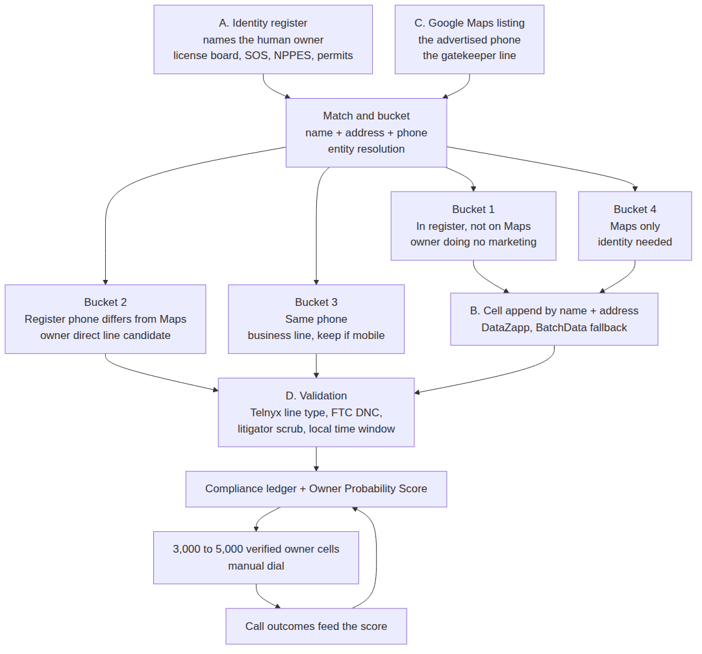
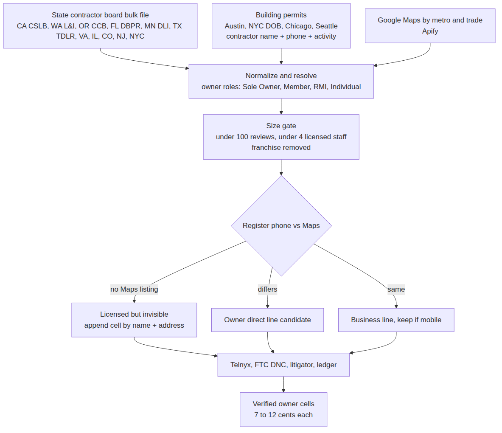
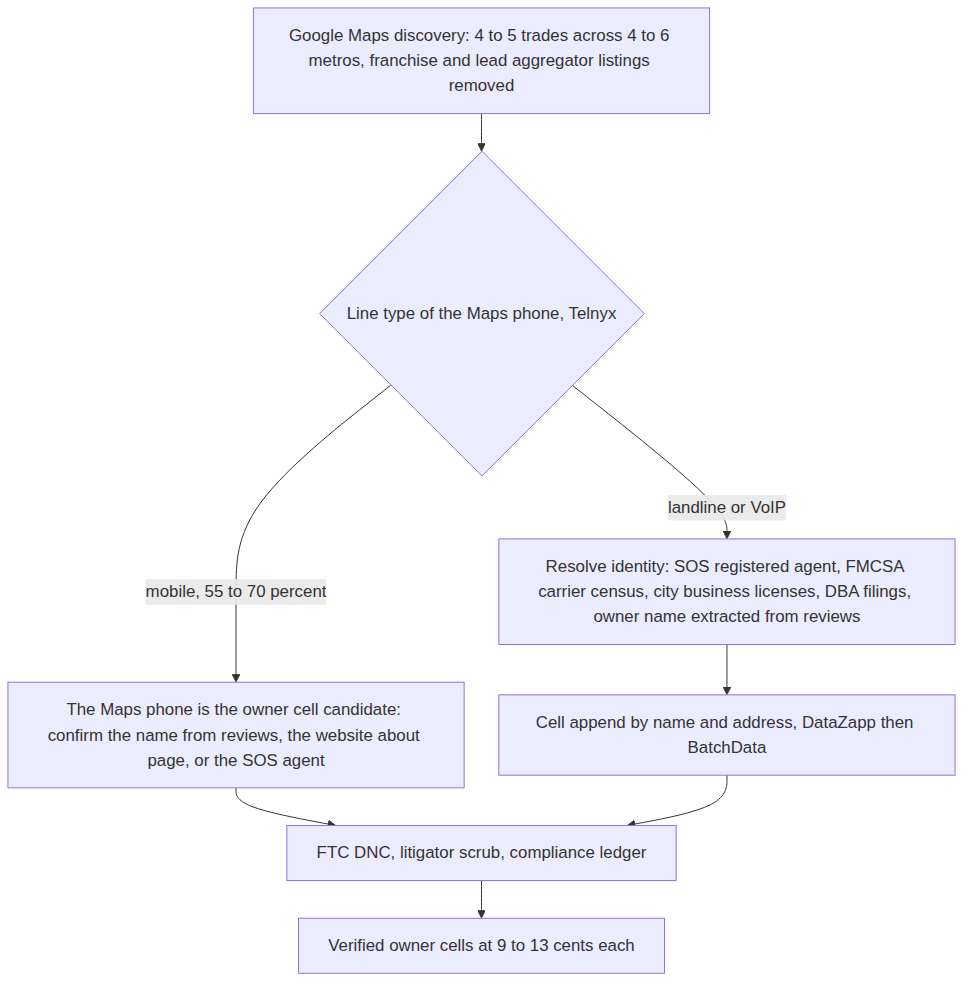
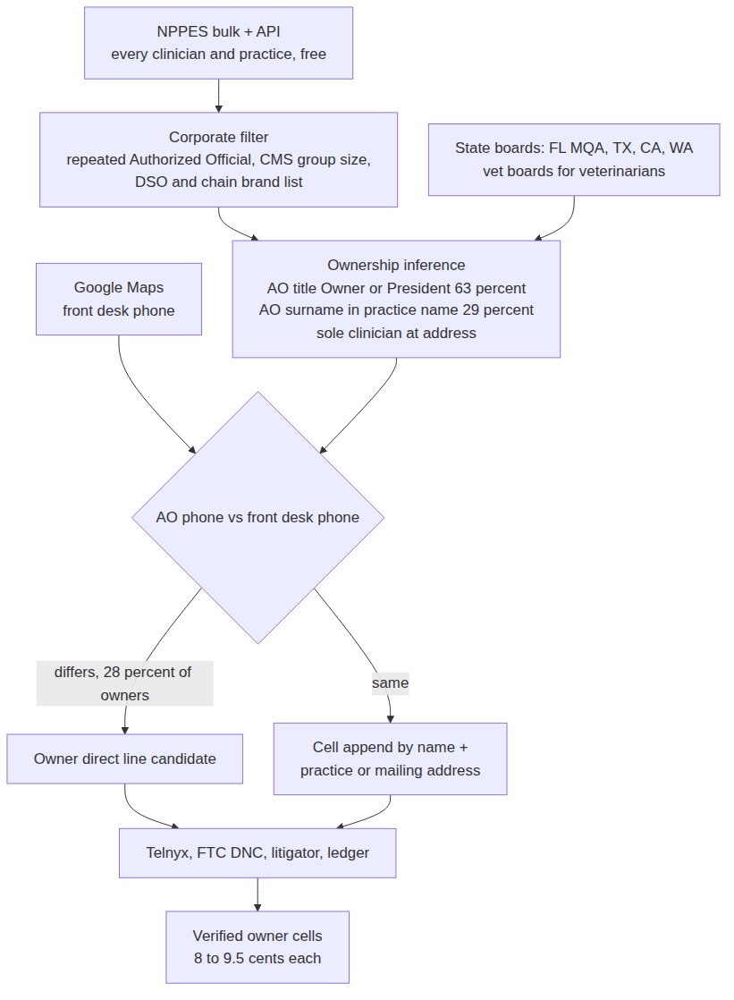
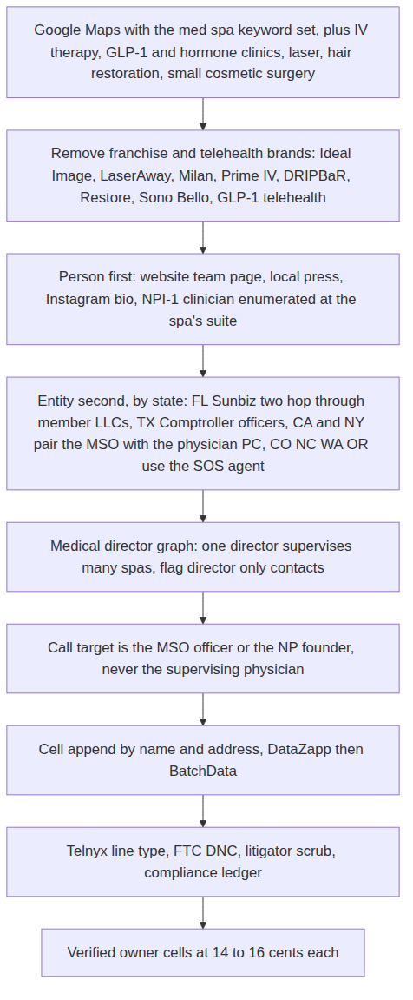
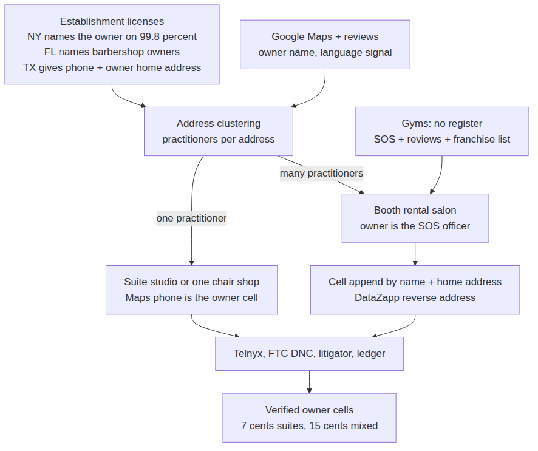
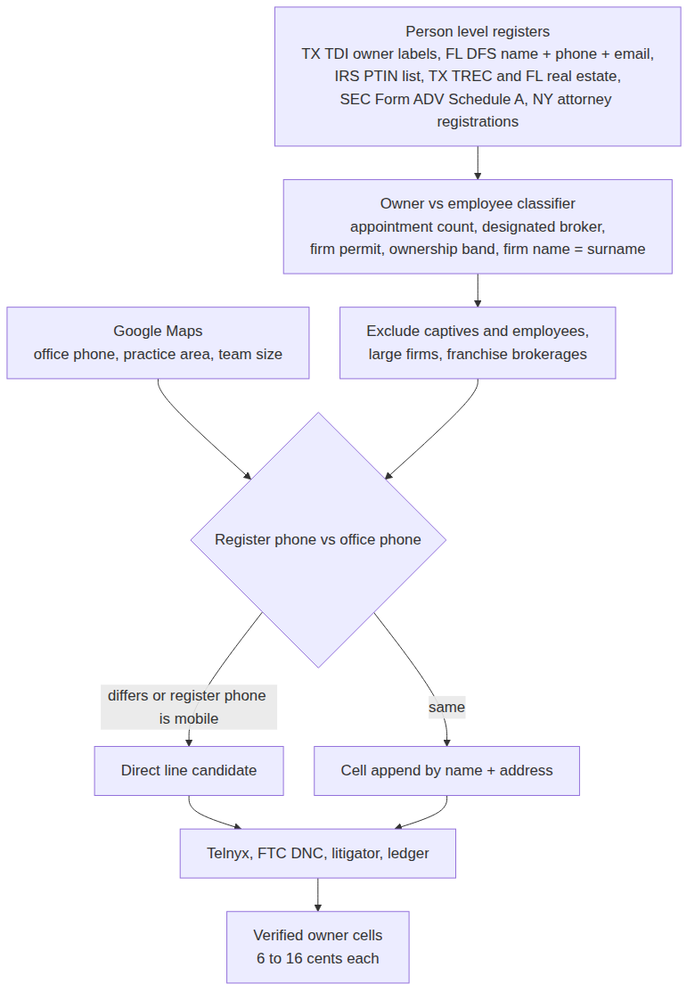
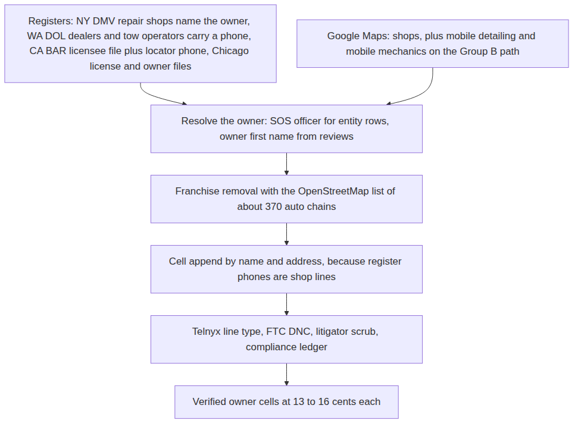
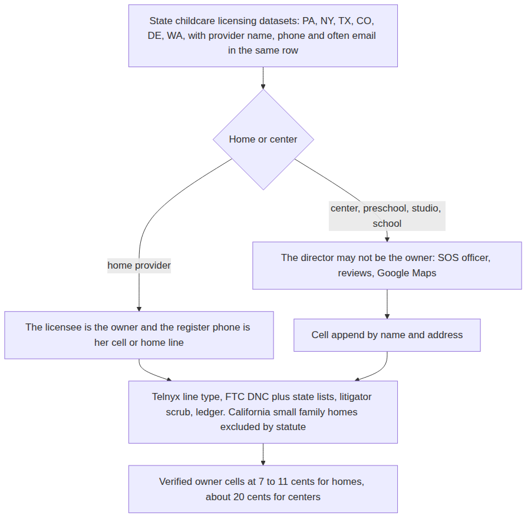
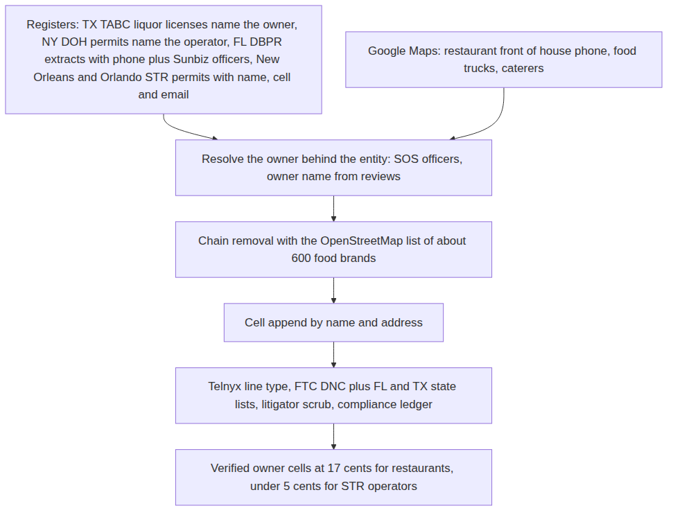

# Lead Engine Brief

## How we will source verified owner cell phones, industry by industry

Prepared by Franco Cappanera, Head of AI, NBC Sales. September 19, 2026.

This brief is the readable version of a much longer technical specification (about 115,000 words, seven research modules, one per industry group) that the engineering agent will build from. Here the goal is different: explain the logic, show how each industry's workflow works in one diagram, name the data sources and the apps we will use with their cost, and make the case for what will make this engine impossible to copy. Everything stated as a fact below was verified during the research by fetching the actual endpoint or file and reading it; where something is an estimate or a secondary report, it says so.

## 1. The logic

### 1.1 What we are building

Every lead scraper on the market runs a Google Maps scraper, takes the phone on the listing, and sells the list. That phone is, by definition, the number the business wants strangers to call: the front desk, the office line, the call tracking number, the receptionist. It is the gatekeeper line. A salesperson dialing it does the same thing everybody else does and hits the same wall.

The Lead Engine produces something else: **a verified owner cell phone number**. Mobile, live, belonging to the person who owns the business, not on the Do Not Call registry, not a known TCPA litigator, with a documented chain of evidence explaining why we believe it is the owner and why we are allowed to dial it. A human dials it manually, one call at a time, during the recipient's local business hours.

### 1.2 Why it is hard, and how we solve it

**No single data source both names the owner and proves that a phone belongs to that person.** Public registers name owners but publish office phones. Phone vendors attach phones to names but do not know who owns what. Google Maps knows what the business does and what number it advertises, but not who is behind it. So the engine is not a scraper. It is a matching system with four roles:

| Role | What it supplies | Why it fails alone |
|---|---|---|
| A. Identity | A public register that names the human owner: a license board, a corporate filing, a permit, a federal registry | Its phone is usually the office line, or there is no phone at all |
| B. Contact | A phone attached to that specific person, from the register itself or from a paid append on name plus address | A name next to a number proves nothing about ownership |
| C. Contrast | The number the business advertises on Google Maps | It is the gatekeeper line by definition |
| D. Validation | Line type (mobile, landline, VoIP), connected status, DNC status, litigator status | Says nothing about who owns the number |

The rule that ties them together is simple and measurable. **If the register phone differs from the advertised Maps phone, the register phone is a strong candidate for the owner's direct line.** If they are equal, it is the main line and the owner cell must come from an append. We first measured this on the federal healthcare registry: across 682 live practice records in Florida, Texas and North Carolina, the named Authorized Official's phone differs from the front desk in 36.7 percent of records, and when that official's title says Owner, President or Member, the different phone is a direct line to the owner about one time in four.

{height=6.2in}

### 1.3 The four buckets, and the one nobody else can see

The matching stage does not produce one list. It produces four buckets, worth very different amounts to a marketing agency.

- **Bucket 1, in the register but absent from Google Maps.** A licensed, registered owner who does no marketing at all: no listing, no reviews, often no website. For an agency that sells marketing this is the ideal customer, and a Maps first competitor structurally cannot find them because they start from Maps.
- **Bucket 2, in both, phones differ.** The register phone is the owner direct line candidate. The best bucket for immediate dialing.
- **Bucket 3, in both, phones equal.** The register phone is the business line. Keep only if the line type test says it is a mobile, which in one to three person shops it often is.
- **Bucket 4, in Maps only.** No identity from a register. Needs identity resolution from other sources and a paid append.

### 1.4 Why every industry needs its own workflow

The research confirmed the thesis that started this project: **the register knows who owns the business, and Google Maps knows what the business does.** Washington State's contractor register lists 50,628 "general" contractors and only 516 "roofing" contractors, because the state classifies the permission, not the trade. Ask the register for roofers and you get 516; ask Google Maps and you get thousands, with no owner names. Both stages are required, and the way they combine changes from one industry to the next. Where is the owner named, where is the owner's phone, and does the owner answer the advertised line: the answers are different for a roofer, a dentist, a med spa, a barber and a restaurant. The engine is therefore a router. It classifies the target industry into a group, and each group has its own identity source, its own contact logic, its own contrast rule and its own legal gate. Validation is shared.

## 2. How the industries were grouped

The grouping is not by commercial category and not by who buys the most marketing. It is by **sourcing mechanism**, decided by three questions: does a public register name the human owner; is the owner's phone attached to that register or does it have to be appended; and does the owner answer the advertised phone (one to five person shops) or sit behind a front desk (healthcare, personal care, restaurants).

| Group | Industries | Sourcing mechanism | Who answers the Maps phone |
|---|---|---|---|
| A. Licensed home services | HVAC, roofing, plumbing, electrical, garage doors, general contractors, solar, pool, fencing, concrete, windows | State contractor board names the owner or qualifier; in seven states it also carries a phone | Owner in small shops, office in larger ones |
| B. Unlicensed home services | Landscaping, tree service, cleaning, junk removal, pressure washing, handyman, painting, movers, pest control | No board; identity from Secretary of State, FMCSA, city licenses, DBA filings, reviews; the pipeline is inverted, Maps first | The owner, on a personal cell, most of the time |
| C. Healthcare with NPI | Dentists, chiropractors, physical therapy, optometry, audiology, mental health, dermatology, small physician practices, podiatry; veterinarians as a sub case | Federal NPPES registry names the Authorized Official and every clinician; ownership inferred from name, address and title patterns | Front desk |
| D. Aesthetic and cash pay healthcare | Med spas, injector practices, IV therapy, GLP-1 and hormone clinics, laser, hair restoration, small cosmetic surgery | No taxonomy and no owner register; person first, entity second; the legal structure varies by state | Front desk |
| E. Personal care and fitness | Salons, barbershops, nails, massage, lash and brow, tattoo, gyms and studios | Establishment license names the owner in NY and FL; practitioner license plus home address in TX; suite studios are one person businesses | Owner in suites and one chair shops, front desk in multi chair salons |
| F. Regulated professional services and legal | Insurance agents, CPAs and tax preparers, real estate brokers, RIAs, attorneys | Person level license registers with contact data; the problem is owner versus employee | The professional, or the office |
| G. Automotive | Independent repair, body, tire, towing, detailing, small dealers, car washes | NY names the owner on repair shops, WA gives phones, CA gives both through two files; elsewhere SOS plus Maps | Shop line |
| H. Childcare and education | Daycares, family child care homes, preschools, tutoring, dance and music studios | State childcare licensing datasets name the provider and carry her phone and often email | The provider herself, at home |
| I. Food and hospitality | Independent restaurants, bars, food trucks, caterers, short term rental operators | Liquor license files name principals; health permits name operators in NY; STR permits carry name, cell and email | Front of house |

A grouping by marketing spend would put dentists next to roofers, and they need completely different pipelines. A grouping by mechanism means one implementation per group serves every industry in it, and adding an industry later is a configuration change, not a new module.

## 3. How the research was done

Each group was researched as its own module, one at a time, with the same discipline, because a finding from one industry does not transfer to another. For each module: the most obvious path from "list of businesses" to "verified owner cell" was written down as hypothesis one; every way it breaks was listed (the phone is an office line, the named person is an employee, the register is stale, phones are reused, the state has no bulk data, the list is legally restricted, the mobile rate is low, franchises pollute the list); a specific alternative source, filter or matching technique was found for each; and the loop repeated until the workflow stopped changing.

Wherever possible the researcher hit the real endpoint and counted rather than assumed. A few examples of what was measured live: 682 NPPES practice records in three states for the Authorized Official effect; 41 med spa storefronts in Tampa and Austin looked up against NPPES (only 17 percent have a practice NPI); 15,554 of 15,799 electrical permits in Austin in the last twelve months carrying a contractor phone; 71,435 Texas salon establishment rows checked for the owner name trap; New York's 32,384 salon and barber licenses checked for a human owner name (99.8 percent have one); Texas TDLR's owner_telephone field compared to business_telephone (identical on 100 percent of rows, so it is a mirror, not a second phone).

The consequence for the reader: **the per industry findings below are not opinions.** Where the brief says Florida names the barbershop owner in the address block of the license file, that is a raw line from the file. Where something is unknown, the technical specification gives the exact request the engineering agent should run to settle it.

## 4. The recommended stack

The stack has three layers: free public registers (the identity layer, which is where the value is), a Google Maps scraper (the contrast layer), and a validation layer (line type, DNC, litigator). Paid appends sit between them and are used only on the rows that need them.

| Component | Role | Priority | Cost | Why |
|---|---|---|---|---|
| State and city open data endpoints (Socrata) and agency bulk files: CSLB, FL DBPR, FL MQA, FL DFS, FL Sunbiz, VA DPOR, MN DLI, NJ DCA, NPPES, CMS, IRS PTIN, SEC, FMCSA and others | A and often B | MUST | $0 | The identity layer; competitors are absent here |
| Apify Google Maps scraper (compass/crawler-google-places) | C | MUST | $0.004 per place, $0.50 minimum run | Already in stack; cheaper than Outscraper above the free tier |
| Apify Google Maps reviews scraper plus a small language model for extraction | A for unregistered sole proprietors | MUST in Groups B, E, G, I | $0.30 per 1,000 reviews plus about $0.002 per listing | Owner first names from reviews ("the owner, Mike, came out himself"); the cheapest identity source where no register exists |
| Postgres entity resolution: libpostal, rapidfuzz, phonenumbers, pg_trgm | Matching | MUST | $0 | The whole method is the join; no vendor does cross register resolution |
| Telnyx Number Lookup | D, line type and carrier | MUST | $0.0015 to $0.0025 per number | Cheapest accurate line type; the branch decision in every pipeline |
| FTC National Do Not Call Registry, direct subscription | D | MUST | $82 per area code per year (FY2026), $85 from October 2026; first five area codes free | Legal requirement; rescrub every 31 days; never depend on a vendor for this |
| TCPA Litigator List (or the Trestle litigator add on) | D | MUST | $0.001 to $0.005 per query | Asymmetric risk: a serial plaintiff's number passes every technical test |
| DataZapp Phone Append API, cell only mode | B, paid append | SHOULD | $0.02 to $0.03 per match, charged on matches only; $125 minimum, $1,000 prepay for API access | Cheapest name plus address to cell append found; returns phone type and cell DNC flag; its reverse phone product returns a company name, which tests whether a Maps phone belongs to a person |
| RealPhoneValidation Turbo V3 or DNC Plus | D, connected status and business versus consumer flag | SHOULD | $0.008 to $0.015 per number, $19 per month minimum | One call gives connected, line type, DNC and litigator; the "business" caller type is the evidence that defends a B2B call under the DNC rules |
| BatchData skip trace | B, second pass | SHOULD (reserve) | $0.03 to $0.07 per match, $99 minimum | Stronger on property linked owners; use on DataZapp misses, not as the default verifier |
| Secretary of State bulk files: CO and NY open data, FL Sunbiz SFTP, WA extract, TX Comptroller per record | A for entities | SHOULD, MUST in Groups B, D, E, I | $0 to $20 per month | The registered agent or officer is the owner for micro LLCs (5 of 5 in a Colorado lawn care sample) |
| Shovels.ai (building permits with contractor phone and activity) | Intent signal | NICE | $599 per month for 25,000 credits | Permit velocity as ability to pay; only on top candidates |
| Outscraper | C backup | NICE | $3 per 1,000 records | No advantage over Apify at our volumes |
| Fresha, Booksy, Instagram profile scrapers (Apify actors) | A residual | NICE | $1.60 to $4 per 1,000 | Staff role "Owner" and bio role words; terms risk, low volume only |
| Data Axle | B | AVOID | Contact sales | Compiled business file with business phones, no owner cell for one location shops |
| Clay, Apollo, ZoomInfo, Cognism, Lusha | B | AVOID | $149 to $15,000 plus per year, 10 to 40 cents per mobile credit | LinkedIn derived; about 20 percent owner coverage on local businesses; not built for one person trades |
| OpenCorporates | A | AVOID | £2,250 per year minimum | State SOS bulk is free where needed |
| NIPR, NMLS bulk, FINRA BrokerCheck, voter files, DMV data, Washington liquor lists, South Carolina and Utah licensee lists | A | AVOID | Various | Legally restricted for marketing, or $85,000 per year with no phone (NMLS) |

**Two decisions to make now.** First, the verifier is not one vendor: Telnyx or RealPhoneValidation for line type, the FTC subscription for DNC, a dedicated litigator scrub, and BatchData only for skip tracing. Separating the functions lowers cost and raises precision compared with using BatchData for everything. Second, DataZapp becomes the primary cell append because it charges on matches only and its cell only mode returns exactly the field we need; BatchData stays as the second pass.

## 5. Industry by industry

Each section gives what makes the group different, the findings that change the build, the workflow in one diagram, the sources and apps for that industry with priority and cost, the cost per 5,000 verified owner cells, and what to build first.

### 5.1 Group A: Licensed home services

**What makes it different.** The state register is not an optional enrichment; it is the legal precondition to operate. Identity is free in at least eleven jurisdictions and the register phone comes with it in seven. This is the cheapest and cleanest group and should be built first.

**Findings that change the build.**

- **California CSLB** is the largest and cleanest source: 212,896 licenses, 311,059 personnel rows with real human names, and the "Sole Owner" title isolates 93,755 people whose phone is used by nobody else (89.8 percent yield). Washington, Oregon, Minnesota and Florida also deliver name plus phone for free.
- **Texas has an owner phone field that is a mirror** of the business phone on 100 percent of electrical contractor rows, and the owner name is the business name. The human comes from the Master Electrician link or the Comptroller officer data. The Texas air conditioning contractor file has zero phones.
- **Building permits are a second identity plus contact source.** Austin's permit dataset carries the contractor's full name, phone and trade; 98 percent of electrical, plumbing and general contractor permits in the last twelve months have a phone. Permit velocity is the strongest intent and ability to pay signal available.
- **Legal posture must gate the state list.** South Carolina requires a certification that the licensee list will not be used for commercial solicitation, with criminal penalties. Utah restricts licensee lists to approved purposes. Arizona requires a commercial purpose public records statement. Oregon, Colorado and Illinois publish under open licenses. Washington publishes the full dataset under an open license even though its public records statute restricts commercial lists of individuals (defensible, not clean).
- New York has no statewide contractor license; NYC's consumer affairs dataset gives 13,385 home improvement contractors with a contact phone. North Carolina sells its list of general contractor qualifiers for $25, the best value in the country for GC owners.

{height=5.8in}

**Sources and apps for Group A.**

| Component | Priority | Cost | Reason |
|---|---|---|---|
| CSLB data portal, FL DBPR extracts, WA and OR open data, MN DLI CSVs, VA DPOR regulant lists, NJ DCA bulk, CO and IL open data, NYC DCWP | MUST | $0 | Free identity, and phone in CA, WA, OR, MN, FL |
| Austin, NYC DOB, Chicago, Seattle permit datasets | MUST where in scope | $0 | Person name plus phone plus activity |
| Apify Google Maps scraper | MUST | $40 to $80 per list | Contrast phone and trade classification |
| libpostal, rapidfuzz, phonenumbers | MUST | $0 | Entity resolution |
| Telnyx, FTC DNC, TCPA Litigator List | MUST | $0.0025 per number; $82 per area code; $0.005 per query | Legal floor |
| DataZapp cell append | SHOULD | $0.02 to $0.03 per match | Buckets 1 and 4 |
| RealPhoneValidation | SHOULD | $0.008 to $0.015 | Connected status and business flag |
| BatchData skip trace | SHOULD (reserve) | $0.03 to $0.07 | Second pass |
| Shovels.ai | NICE | $599 per month | Permit velocity where free permits do not exist |
| NC list ($25), NV list ($200), MI FOIA list ($0.005 per record) | NICE | Under $250 per state | Cheap paid identity for states without bulk |
| Data Axle, Clay, OpenCorporates, ConstructConnect, Dodge | AVOID | Four figures | No owner cells, or free equivalents exist |
| SC and UT board lists | AVOID | | Solicitation use prohibited |

**Cost per 5,000 verified owner cells: about $350 to $600, or 7 to 12 cents per cell.** The register is free; the dominant cost is the cell append for owners whose register phone is a landline.

**Build first:** California CSLB Sole Owner end to end (5,000 owners at near zero data cost), then Washington and Oregon, then Florida, then Austin permits as the intent feed.

### 5.2 Group B: Unlicensed home services

**What makes it different.** No board names the owner, so the pipeline is inverted: **start from Google Maps, test the line type of the advertised phone first, and only resolve identity and append a cell for listings whose phone is not already a mobile.** This works because one to five person shops advertise the owner's own handset. The best estimate of the mobile share of Maps phones in these trades is 55 to 70 percent (no vendor publishes this; it is the first thing to measure with Telnyx).

**Findings that change the build.**

- **The FMCSA Motor Carrier Census is a free national register with names, phones and emails** that covers not only movers (135,587 active household goods carriers, 82.5 percent with three or fewer trucks) but also 26,562 active carriers with "tree" in the name and 14,705 with "landscap" as a trade name. Anyone with a truck over 10,001 pounds registers with a USDOT number, and small operators register their cell.
- **The registered agent of a micro LLC is the owner.** In Colorado's corporate file, five of five lawn care entities in good standing had a registered agent whose surname matched the business name. The heuristic: agent is a person, agent address equals principal address, agent surname appears in the entity name.
- **City business license datasets name owners and carry phones** in Seattle (96 to 100 percent phone fill on these trades), San Francisco, Chicago and Los Angeles.
- **Owner names can be extracted from reviews.** "The owner, Mike, was great" appears constantly in reviews of micro businesses; at $0.30 per 1,000 reviews plus a small language model this is the cheapest identity source for sole proprietors who never filed anything, and no competitor was found doing it at scale.
- **Pest control is licensed everywhere** (agriculture department applicator and business lists), so it behaves like Group A.
- **Franchise contamination is heavy** (Molly Maid, The Grounds Guys, 1-800-GOT-JUNK, College Hunks, CertaPro, Two Men and a Truck, Lawn Doctor, Terminix) and must be removed by name pattern before any spend.

{height=5.5in}

**Sources and apps for Group B.**

| Component | Priority | Cost | Reason |
|---|---|---|---|
| Apify Google Maps scraper | MUST | $36 to $96 per 24,000 places | Discovery is the contact source here |
| Apify reviews scraper plus small language model | MUST | $120 plus $30 to $60 per list | Owner names for unregistered sole proprietors |
| Telnyx Number Lookup | MUST | $54 per list | The line type gate is the first paid step |
| FMCSA Company Census | MUST | $0 | Names, phones, emails for movers, tree, landscaping, haulers |
| Seattle, SF, Chicago, LA business license datasets | MUST where in scope | $0 | Owner names and phones |
| SOS bulk: CO, NY, FL Sunbiz, WA, OH and IN new filings | MUST | $0 | Registered agent or officer as owner |
| FL fictitious names, PA home improvement export, TX and CA pest CSVs | MUST per state | $0 | The human behind the trade name |
| FTC DNC plus FL, TX, PA, IN, MO state lists; TCPA Litigator List | MUST | $82 per area code; $0.005 per query | Higher DNC hit rate on personal cells |
| DataZapp cell append, RealPhoneValidation, BatchData reserve | SHOULD | $0.02 to $0.07 per match | Office branch and Bucket 1 |
| Website about page fetch | SHOULD | $0 plus model cost | 15 to 30 percent of listings gain a name |
| Harris County and LA County assumed names | SHOULD for Houston and LA | $0 to unknown | Sole proprietors in the two largest unlicensed markets |
| Facebook pages, Yelp, Thumbtack, Nextdoor scrapers | NICE | $1.20 to $5.40 per 1,000 | Cross platform discovery; terms risk |
| Historical WHOIS, Clay, Apollo, ZoomInfo, paid SOS bulk | AVOID | | Redacted, thin coverage, or free equivalents |

**Cost per 5,000 verified owner cells: about $600 to $650, or 12 to 13 cents per cell**; 9 cents if the connected second opinion is dropped in favor of Telnyx alone. A 5,000 list needs 18,000 to 22,000 raw Maps places after franchise removal: four to five trades across four to six metros.

**Build first:** the line type gate on Maps phones (measure the mobile share on day one), then the FMCSA join, then reviews extraction, then the Colorado and Florida agent heuristic.

### 5.3 Group C: Healthcare with NPI

**What makes it different.** The federal NPPES registry is free, has no key, has no opt out, names a human Authorized Official on every practice record and names every clinician with a license number and a mailing address that is frequently residential. The owner is identifiable from public data for roughly two thirds of independent practices without any vendor. The weak spot is the phone, not the identity.

**Findings that change the build (measured live on 682 practice records in FL, TX and NC).**

- The Authorized Official's phone differs from the practice phone in **36.7 percent** of records; the title indicates ownership (Owner, President, CEO, Member, Founder) in **62.8 percent**; among owner titled records the phone differs from the front desk in **28 percent**.
- The official's surname appears inside the practice's legal name ("Smith Family Dentistry", "John Doe DDS PA") in **29.2 percent** of single practice records: a free ownership rule.
- **Corporate contamination is detectable**: the same official's name and phone repeated across three or more records flags dental service organizations and chains (12 percent of the sample; 22 of 30 Florida audiology records belonged to one corporate official). CMS's provider catalog gives group size for free to exclude large groups.
- **Ranking by cleanliness:** podiatrists (82 percent owner titled) and chiropractors (74 percent) are the cleanest; family medicine (23 percent, hospital owned practices dominate) is the dirtiest. Mental health and acupuncture are mostly solo providers with no front desk, so the register phone is often a personal cell.
- About 5 percent of records list a credentialing or billing desk as the official; exclude by title.
- **Veterinarians are not in NPPES**; they route through state veterinary boards, SOS officers of the practice entity and Maps.

{height=5.8in}

**Sources and apps for Group C.**

| Component | Priority | Cost | Reason |
|---|---|---|---|
| NPPES monthly bulk plus weekly deltas | MUST | $0 | The register: official fields, license numbers, sole proprietor flag, enumeration date |
| NPPES API | MUST | $0 | Daily deltas and per record refresh |
| CMS Provider Data Catalog | MUST | $0 | Group size and group phone, 3.39 million rows |
| Apify Google Maps scraper | MUST | $70 to $100 per list | Contrast phone and brand detection |
| Postgres entity resolution | MUST | $0 | The join is the method |
| Telnyx, FTC DNC plus TX and FL lists, TCPA Litigator List | MUST | See section 4 | Legal floor |
| DataZapp cell append | SHOULD | $0.02 to $0.03 per match | 70 percent of owners have no register cell |
| Florida MQA data download | SHOULD | $0 | Daily statewide file with email and mailing address for every FL health profession |
| FL vet extract, TX dentist file, CA DCA files, WA DOH dataset | SHOULD | $0 | License confirmation; Texas "private practice" flag is a free owner style filter |
| SOS officer bulk (FL, NC, CO, WA, IN, OH) | SHOULD | $0 | PA and PLLC entities, the vet sub case |
| RealPhoneValidation, BatchData reserve | SHOULD | See section 4 | Connected status; second pass |
| PECOS files, Medicare utilization | NICE | $0 | Size and revenue proxies |
| DataZapp healthcare lists | NICE | $0.04 per record with phone | Breadth test before building |
| Definitive Healthcare, IQVIA, ZoomInfo, Ribbon, list brokers, Doximity | AVOID | $15,000 to $100,000 plus | No owner cells; the same NPPES rows we load free |

**Cost per 5,000 verified owner cells: about $410 to $470, or 8 to 9.5 cents per cell**, from roughly 30,000 input records (one large state across all sub verticals, or one sub vertical across four to six states).

**Build first:** the NPPES load with the official versus front desk contrast and the surname rule, then chiropractors and podiatrists in Florida and Texas, then the DSO exclusion model.

### 5.4 Group D: Med spas and aesthetic cash pay healthcare

**What makes it different.** No owner register and no NPPES taxonomy, and the legal structure varies by state. In strict corporate practice of medicine states (CA, TX, NY) the entity of record is a physician owned professional corporation with a management company behind it; in Florida the LLC owner can be anyone. The owner is resolved **person first** (the injector or founder on the website, on Instagram, in local press, or enumerated as a clinician at the spa's suite), then **entity second** (SOS officer or agent, two hops through member LLCs in Florida, Comptroller public information report in Texas, MSO plus PC pairing in CPOM states).

**Findings that change the build.**

- Of 41 med spa storefronts in Tampa and Austin looked up by name, only **17 percent had a practice NPI**. NPPES alone cannot enumerate the industry.
- **Address matching of individual clinicians works.** Querying NPPES for nurse practitioners, physician assistants and nurses by postal code and matching the practice location to the spa's suite found a clinician at 6 of 17 addresses (35 percent lower bound); two of those had a residential mailing address and a different mailing phone.
- **The Florida two hop pattern, on a live case:** a Tampa spa resolved to a nurse practitioner at the suite, then a Sunbiz officer search on her surname revealed the operating LLC, whose members are three holding entities, one at the NP's mailing address; local press confirmed the three co founders.
- **The Tennessee Medical Spa Registry** (399 facilities with the medical director named) shows the medical director is not the owner: 287 distinct directors, the top ones supervising three to seven spas each. A medical director graph is needed to avoid calling the supervising dermatologist as if he owned each spa.
- **Texas laser hair removal facility licenses** sit in a separate TDLR file with phone; Texas Comptroller public information reports expose officers per entity for free.
- **Franchise brands have no NPI records** (DRIPBaR, Restore, LaserAway returned zero); the exclusion list matters (Ideal Image, Milan Laser, SkinSpirit, Prime IV, Sono Bello, telehealth GLP-1 brands).
- Manufacturer provider locators (Allergan, Galderma, device makers) restrict use to non commercial personal purposes: manual qualification only, never bulk.

{height=5.8in}

**Sources and apps for Group D.**

| Component | Priority | Cost | Reason |
|---|---|---|---|
| Apify Google Maps scraper with the full keyword set | MUST | $120 to $180 per list | The only universal discovery source for a cash pay industry |
| FL Sunbiz SFTP bulk with two hop member resolution | MUST | $0 | The best free owner register in the group |
| CO, NC, WA, OR SOS files | MUST where in scope | $0 | Person agents on 85 percent of Colorado med spa rows |
| NPPES bulk, clinician address roster, mailing addresses | MUST | $0 | Injector identity, license number, residential mailing address |
| Website team page extraction with a small language model | MUST | $30 to $50 per list | Names the founder or lead injector on about half of sites |
| TX Comptroller public information reports | MUST for Texas | $1.50 per 1,000 | Only free officer source in a strict CPOM state |
| Chain, franchise and registered agent service blocklists | MUST | $0 | Otherwise the list contains regional managers and agent services |
| Medical director graph | MUST | $0 | Prevents calling the supervising physician as the owner |
| DataZapp, Telnyx, RealPhoneValidation, FTC DNC, litigator list | MUST | See section 4 | Validation |
| TN Medical Spa Registry plus TN licensure practice phones | SHOULD | $0 | Clean facility register in one state |
| TDLR laser facility file, FL office surgery and electrolysis files | SHOULD per state | $0 | Business phone and licensed address |
| Instagram profile scraper on handles found on websites | SHOULD | $1.60 per 1,000 | Bio role words; low volume |
| Local press "best injectors" extraction | SHOULD | $0 | Names owners with credential |
| CA SOS Statement of Information bulk order | SHOULD for California | About $100 | Per record lookups do not scale |
| Outscraper with social links, RealSelf actor, AHCA clinic export, RI lists | NICE | $3 to $5 per 1,000 | Backups and small states |
| Manufacturer locators, AmSpa reports, Yelp, Groupon, Booksy, Vagaro, Zocdoc bulk, "med spa" list vendors, Clay, ZoomInfo | AVOID | | Terms, or the same front desk phone we already have |

**Cost per 5,000 verified owner cells: about $690 to $810, or 14 to 16 cents per cell**, the most expensive group. Volume is the binding constraint: the national universe is roughly 11,000 to 12,000 med spas, so a 5,000 list must bundle med spas with IV, GLP-1, hormone, laser, hair restoration and small cosmetic surgery practices across three or four states.

**Build first:** Florida (Sunbiz two hop plus clinician address roster), then Texas with the Comptroller officer path, then the medical director graph using Tennessee as the template.

### 5.5 Group E: Personal care and fitness

**What makes it different.** In two large states **the establishment license itself names the human owner**: New York on 99.8 percent of shop licenses (32,384 rows) and Florida in the address block of barbershop rows. Texas never names a person on an establishment but gives **the owner's home mailing address on 96 percent of mini salons** (21,616 suite studio rows) and 80 percent of full service salons, which is a skip trace key. The suite studio segment (Sola, Phenix, Salon Lofts, about 3,300 buildings and 110,000 professionals) is a population of one person businesses whose advertised phone is the owner's cell, and Texas and New York license those people as their own establishments.

**Findings that change the build.**

- New York's dataset carries four license types (business, area renter, barbershop owner, barber renter), issue dates (2,205 new shops in 2026 to date) and coordinates, but no phone. Identity and freshness are free; the phone comes from Maps or an append.
- Texas has 71,435 establishments with phone on 99.9 percent; the mailing address on a residential street in another town is the append key.
- **Booth rental salons** are detected by counting licensed practitioners per address; the owner is the SOS officer, not the practitioners.
- Booking platforms (Fresha, Booksy) expose staff counts and an "Owner" job title through scrapers at $3.40 to $4 per 1,000 venues.
- **Gyms have no register**; they follow the Group B path with a franchise exclusion list (Anytime, Planet Fitness, Orangetheory, F45, Pure Barre, Club Pilates and about thirty more).
- Language matters for a bilingual sales team: Vietnamese American nail salons and Spanish speaking barbershops are large segments; route by language signal in reviews and names, never by anything beyond language preference.

{height=4.8in}

**Sources and apps for Group E.**

| Component | Priority | Cost | Reason |
|---|---|---|---|
| NY DOS appearance enhancement and barber datasets | MUST | $0 | Owner named on 99.8 percent of shops, renters flagged, daily |
| TX TDLR license dataset plus daily CSVs | MUST | $0 | 71,435 establishments with phone and home mailing address |
| FL DBPR barber and cosmetology extracts | MUST | $0 | Owner name on most barbershop rows, practitioner home addresses |
| CO, IL, DE license datasets | MUST | $0 | Practitioner and shop names; IL has a sole proprietor flag |
| SOS files (Sunbiz, CO, NY, WA, TX) | MUST | $0 to $200 | LLC and corporate shops, and all gyms |
| Apify Google Maps scraper | MUST | $0.004 per place | Contrast and phone |
| Address clustering (practitioners per address) | MUST | $0 | The segment logic is the product |
| Telnyx, FTC DNC, litigator list | MUST | See section 4 | Legal floor |
| DataZapp reverse address and cell append | SHOULD | $0.02 to $0.03 per match | Converts the TX home address and FL practitioner address to a cell |
| Reviews scraper plus language model | SHOULD | $0.30 per 1,000 reviews | Owner name and language signal for anonymous shops |
| Fresha and Booksy scrapers | SHOULD | $3.40 to $4 per 1,000 venues | Staff count as booth detector, "Owner" title |
| Instagram profile scraper, CA DCA files, VA, NJ, PA, OH lists, county body art files | NICE | $0 to $71 | Residual identity |
| BatchData skip trace | NICE (reserve) | $0.03 to $0.07 | Second pass |
| WA DOL professional lists, AZ, UT, SC board lists, suite operator directories, Clay, ZoomInfo, Apollo | AVOID | | Restricted, JavaScript only, or no coverage of one chair businesses |

**Cost per 5,000 verified owner cells: about $770, or 15 cents per cell** for a mixed list; **about $350, or 7 cents**, for a list built only from the suite and mini segment plus New York shops, because the register already carries the name (NY) or the cell (TX suites).

**Build first:** Texas mini establishments plus New York shops (the cheapest list in the whole program with the owner already identified), then Florida barbershops, then the booth rental detector.

### 5.6 Group F: Regulated professional services and legal

**What makes it different.** The person is the license and the registers are person level with contact data often included. The challenge is separating owners and principals (agency owner, firm partner, broker of record, RIA principal) from employees and captive producers, and reading the data use terms of each register.

**Findings that change the build.**

- **Texas TDI publishes an explicit owner register** (118,020 business relationship rows) with association types Owner (9,212), Designated Responsible Licensed Person (27,988), Employee (11,653), Officer, Member. It is both a list and the training set for an owner versus employee classifier. Florida publishes name plus phone plus email for every insurance licensee (daily). The NAIC report generator sells register rows with phone and email at $0.03 for 31 other states.
- **The IRS PTIN holder list is a free direct download by state** with business phone, business name, website and credential; the IRS states that the law allows vendors to obtain it and holders cannot opt out. Cleanest legal position in the group.
- **Real estate:** Texas TREC (324,647 rows) names the designated broker on every broker company and carries the original license date; Florida's files distinguish brokers from sales associates and identify independent brokers; California publishes a free daily list with the responsible broker link. New York's attorney registrations (433,726 rows) carry firm name and phone.
- **SEC Form ADV** monthly files include Schedule A direct owners with ownership bands, the compliance officer's name and phone, employee count and assets: a direct owner register for advisers, but a small universe (about 2,600 cells nationally per run).
- **Skip:** mortgage outside California (NMLS bulk is $85,000 with no phone), FINRA reps (terms prohibit compilation), NIPR (FCRA gate), captive employees.

{height=5.8in}

**Sources and apps for Group F.**

| Component | Priority | Cost | Reason |
|---|---|---|---|
| TX TDI open datasets (relationships, individuals, appointments, agencies) | MUST | $0 | The only public register anywhere with explicit Owner, DRLP and Employee rows |
| FL DFS bulk CSVs (individual, business, appointments) | MUST | $0 | Name plus phone plus email plus appointments |
| IRS PTIN state CSVs | MUST | $0 | Nationwide, business phone, released to vendors by law |
| TX TREC, FL real estate CSVs, CA DRE daily list, NY DOS brokers | MUST | $0 | Brokerage owner links and new firm dates |
| SEC monthly Form ADV files plus Schedule A archive | MUST | $0 | Owner register with ownership bands |
| NY attorney registrations | MUST | $0 | Only verified bulk attorney list with phone and firm |
| Apify Google Maps scraper | MUST | $0.004 per place | Contrast; the route to team leads and practice areas |
| DataZapp, Telnyx, FTC DNC, litigator list, reassigned check | MUST | See section 4 | Validation |
| NAIC SBS Report Generator | SHOULD | $0.03 per row, $30 minimum | Register rows with phone and email for 31 states; read checkout terms first |
| CA DRE mortgage and new licensee files, CA DCA licensee files, IAPD search API | SHOULD | $0 | Independent brokers, week one licensees, CRD resolution |
| FL CPA, WA CPA, CO, IL, NY tax preparer, CT datasets | NICE | $0 | Identity only, credential confirmation |
| Avvo, Justia, FindLaw, Martindale | NICE | $2 to $10 per 1,000 | Practice areas and founder bios; sparingly |
| State bar member data purchases (FL, TX, CA) | NICE, conditional | Unknown | Only after reading each bar's use terms |
| NIPR, NMLS bulk, FINRA BrokerCheck compilation, IRS EA list alone, Clay, ZoomInfo, Apollo | AVOID | | Restricted, $85,000 with no phone, or thin coverage |

**Cost per 5,000 verified owner cells by sub vertical:** insurance Florida about 6 cents, insurance Texas about 12 cents, tax preparers about 7 cents, real estate Florida about 9 cents, RIAs about 9 cents (small universe), New York attorneys about 9 cents (16 cents after a practice area filter).

**Build first:** Texas insurance and Texas real estate (they carry owner labels), the PTIN list nationwide, then Florida insurance and real estate, then RIAs and New York attorneys.

### 5.7 Group G: Automotive

**What makes it different.** Two excellent identity registers and many contrast only sources. New York DMV names the owner as a person on repair shop licenses (11,960 licenses expiring 2027 or 2028, a person in 11 of 12 sampled rows) but carries no phone. Washington gives dealers and tow operators with phone on 99 percent of rows but names only the entity. California gives the licensee name through the monthly DCA file and the shop phone through the Bureau of Automotive Repair locator API (no auth, public domain conditions of use). Florida's motor vehicle repair registry is per record only. Group G is append heavy because register phones are shop lines.

{height=4.2in}

**Sources and apps for Group G.**

| Component | Priority | Cost | Reason |
|---|---|---|---|
| NY DMV facilities, WA DOL transportation licenses, CT dealers and repairers, TX TDLR tow operators, Chicago license plus owner files | MUST | $0 | Free owner names (NY, Chicago), phones (WA), universes (CT, TX) |
| CA DCA monthly public information file | MUST for CA | $0 | Statewide licensee names |
| CA BAR locator API | SHOULD for CA | $0 | Shop phone per license; zip radius sweep |
| Apify Google Maps scraper | MUST | $0.004 per place | Contrast, and discovery for mobile detailing and mechanics |
| OpenStreetMap brand files (about 370 auto chains) | MUST | $0 | Franchise exclusion at zero cost |
| Reviews scraper plus language model, SOS bulk (NY, WA, CO, FL) | SHOULD | $0.30 per 1,000 reviews; $0 | Owner names for entity rows |
| Telnyx, DataZapp plus BatchData fallback, FTC DNC, litigator list | MUST | See section 4 | Append heavy group |
| MI FOIA list, FL HSMV data, TxDMV open records, CA DMV dealer lists | NICE | Unknown fees | States without open files |
| NAPA, Bosch, AAA, ASE locators | NICE | $0 | Network membership as a "spends on marketing" signal |
| Data Axle, ZoomInfo, Clay | AVOID | | No owner cells for one location shops |

**Cost per 5,000 verified owner cells: about $770 to $790, or 15 to 16 cents per cell** (13 cents if DataZapp hits 75 percent on full legal names).

**Build first:** New York repair shops (owner already named) plus mobile detailing and mobile mechanics on the Group B path.

### 5.8 Group H: Childcare and education

**What makes it different.** This is **the best identity plus contact register found anywhere in this research**. Home based providers are licensed under the woman who runs the home; the register carries her name, her home address in most states, her phone in most states and her email in several. Pennsylvania's dataset has the legal entity name equal to the person, the responsible person title "OWNER", phone on 100 percent and email on 99.8 percent of 958 family homes and 585 group homes. New York has 9,638 licensed group family day care homes with a person name on 100 percent and phone on 77 percent. Texas adds 4,704 home rows with phone on 99 percent. Centers name a director who may not be the owner; the owner comes from SOS.

The weakness is commercial, not technical: home providers spend little on marketing, and the DNC hit rate is the highest in the program (40 to 55 percent) because the register phone is her home or cell. Independent centers, preschools, dance and music studios and swim schools are the Meta ads buyers and follow the center path. One legal caution: California's Health and Safety Code limits distribution of identifying information of small family daycare homes to parents and consumer sites; the California phone must not be dialed for small family homes. Florida, Texas and New York impose no use restriction.

{height=5.2in}

**Sources and apps for Group H.**

| Component | Priority | Cost | Reason |
|---|---|---|---|
| NY, PA, TX, CO, DE, WA childcare datasets | MUST | $0 | Identity plus phone in one row for homes |
| IL Sunshine export, OH childcare search export | SHOULD | $0 | Two more large states; fields to confirm |
| Telnyx, FTC DNC plus TX, PA, FL state lists, litigator list | MUST | See section 4 | Highest DNC exposure in the program |
| DataZapp cell only, BatchData fallback | SHOULD | $0.02 to $0.07 per match | Only for no phone, landline and center owner rows |
| Apify Google Maps scraper, reviews scraper, SOS bulk | SHOULD | See section 4 | Contrast for homes; discovery and owners for studios and centers |
| GA and NC open records requests | NICE | $0.10 per page plus admin | Two big states with per record portals |
| Care.com, Wyzant, Winnie, Yelp scrapers | NICE | $1 to $6 per 1,000 | Independent tutors; terms risk |
| Child care resource and referral lists, CA small family home phones | AVOID | | Restricted to parents |

**Cost per 5,000 verified owner cells: about $530, or 7 to 11 cents per cell** for home providers from NY, PA and TX (the contact is free, the cost is validation); about 20 cents for a list of 2,500 to 3,000 independent centers and studios from five states.

**Build first:** the home provider list as the cheapest end to end proof of the whole engine (100 percent owner identification, phone in the register), then centers and studios as the commercial product.

### 5.9 Group I: Food and hospitality

**What makes it different.** Liquor license files are the best principal register in the group and health inspection files are the worst owner source. Texas TABC (daily, 47 fields) carries an owner field that is a person on roughly two thirds of beer and wine retailer rows, but the phone column is empty on all 75,000 active rows. New York State's health department names the permit operator as a person on 15,581 of 21,634 establishments outside NYC, with no phone. NYC has 31,319 active restaurants with 27,689 distinct phones but trade names only. Florida's hotels and restaurants extracts carry phone on 85 to 90 percent of rows with a person as licensee on only 8 to 12 percent, so the Sunbiz officer join closes the gap. Washington's liquor lists carry an explicit statement that records may not be used for commercial purposes: prohibited as a source.

The **short term rental operator product** is a surprise: New Orleans permits carry license holder name, contact name, contact phone and contact email at 99 percent fill, mostly personal addresses; Orlando has phone and email plus property owner names. Under 5 cents per cell. Restaurants are the most solicited owners in the program, with the highest DNC and Florida exposure, and the owner is behind an entity in most rows.

{height=4.2in}

**Sources and apps for Group I.**

| Component | Priority | Cost | Reason |
|---|---|---|---|
| TX TABC licenses | MUST | $0 | Only free statewide register with an owner person field at scale, daily |
| NY DOH food service establishments | MUST | $0 | Operator names on 15,581 establishments |
| FL DBPR hotels and restaurants extracts plus Sunbiz officers; the owner change feed | MUST for FL | $0 | Phone 85 to 90 percent; officers resolve the entity majority |
| New Orleans and Orlando STR permit datasets | MUST for the STR product | $0 | Name plus cell plus email in one row |
| OpenStreetMap brand files (about 600 food chains) | MUST | $0 | Chain exclusion |
| Apify Google Maps scraper, reviews scraper, language model | MUST | See section 4 | Contrast; discovery for mobile food; owner names for entities |
| Telnyx, DataZapp, BatchData, FTC DNC plus TX and FL lists, litigator list | MUST | See section 4 | Validation |
| CA ABC daily export, NYC and Chicago license files, CO liquor licenses | SHOULD | $0 | Names statewide (CA), phones (NYC), owners (Chicago) |
| TX SOS new filings feed | SHOULD | $20 per month | Catches new restaurants before the TABC permit issues |
| PA, NC, MI, OH, GA, AZ, NV liquor lists | NICE | Unknown | Per state check needed |
| WA LCB lists | AVOID | | Explicit no commercial use statement |
| Yelp, OpenTable, Toast, DoorDash directories | AVOID | | Terms risk, no owner data beyond Maps |

**Cost per 5,000 verified owner cells: about $1,300, or 17 cents per cell** for restaurants and bars from Texas; **under 5 cents** for the STR operator product; mobile food at Group B economics.

**Build first:** the STR operator product (cheapest, cleanest), then Texas TABC with the SOS officer join, then Florida.

### 5.10 Summary across groups

| Group | Owner identified from public data | Register carries a phone | Cost per verified owner cell | List size feasibility | Marketing spend of the owner | Build priority |
|---|---|---|---|---|---|---|
| A. Licensed home services | 80 to 90 percent in CA, WA, OR, FL | Yes in 7 states | 7 to 12 cents | Easy, statewide | High | 1 |
| E. Personal care (suites and NY) | 75 to 90 percent in NY and FL; TX via home address | Yes in TX (99.9 percent) | 7 cents suites, 15 cents mixed | Easy in TX, NY, FL | Medium | 2 |
| C. Healthcare with NPI | About two thirds | 28 percent of owner records have a direct line | 8 to 9.5 cents | Easy, national | High | 3 |
| H. Childcare | 90 to 100 percent on home rows | Yes (name, phone, email) | 7 to 11 cents homes; 20 cents centers | Easy in NY, PA, TX | Low for homes, medium for centers | 4 (as proof of engine) |
| B. Unlicensed home services | 55 to 70 percent with free sources | Maps phone is the cell in the majority | 9 to 13 cents | Needs 4 to 6 metros | Medium to high | 5 |
| F. Professional services | Very high (explicit owner labels in TX) | Yes in FL, PTIN, NY attorneys | 6 to 16 cents | Easy, large universes | High for real estate, attorneys, agents | 6 |
| G. Automotive | High in NY, CA | WA only | 13 to 16 cents | Medium | High | 7 |
| D. Med spas and aesthetic | 45 to 80 percent by state | Rarely | 14 to 16 cents | Hard, national universe about 12,000 | Very high | 8 (strategic, not first) |
| I. Food and hospitality | Two thirds in TX and NY (entities behind) | STR only | 17 cents restaurants, under 5 cents STR | Easy | Medium, heavily solicited | 9 |

Group D is last in build order but strategically the most valuable: nobody sells verified med spa owner cells, the owners spend the most on marketing, and the engine's identity resolution is the only way to produce the list. It should be built once the generic engine is proven on Groups A, E and C.

## 6. What a competitor cannot copy

Everything in section 5 uses public data and commodity vendors. A competent team with this brief could reproduce the pipelines in a quarter. So the honest question is what compounds and what is merely good practice. The research evaluated seven candidate moats per group; the verdict is consistent.

### 6.1 Real moats

**The Owner Probability Score trained on call outcomes.** Public data tells us who is licensed. Only dial outcomes tell us which register titles, phone patterns, address patterns and permit velocities actually produce "reached the owner". Every dial by an NBC Sales caller produces a label: reached owner, reached gatekeeper, wrong number, voicemail, disconnected. After 20,000 labeled dials the model knows, per state and per industry, that a Washington individual registrant with an exclusive mobile reaches the owner 61 percent of the time while a Florida qualifier on a company with 200 reviews reaches a gatekeeper 80 percent of the time. Those labels are generated inside NBC Sales and never leave. A competitor cannot buy them; they need their own dial volume, and by the time they have it, ours is bigger. **This is built first, in week one, as a schema:** an outcome enum and a snapshot of every feature at the moment of each dial. If the labels are not captured from the first list, they are lost.

**The cross register entity graph with history.** Nodes: person, business, license, phone, Maps place, permit, SOS entity, NPI. Edges carry provenance and timestamps. Anyone can build the graph from the same open data. What they cannot download is the accumulated history: who moved from employee qualifier to sole owner, which phone migrated from a company to a person, which license lapsed and was reissued under a new LLC, which med spa changed its medical director, which suite renter opened her own shop. Public registers overwrite in place; the history exists only for whoever was capturing it. A real moat after 12 to 18 months of daily diffs.

**The MSO plus PC pairing dataset in corporate practice of medicine states.** In California, Texas and New York, the med spa's legal owner is a physician owned professional corporation with a management company behind it, and the entrepreneur who runs the business is an officer of the management company, not of the PC. Pairing them by address, shared officers and filing date produces a proprietary ownership dataset no vendor sells. Combined with the medical director graph, it is the difference between calling the supervising dermatologist and calling the owner.

**The compliance ledger.** A row per number: source register and row id, fetch timestamp, title evidence, Maps place id and phone at time of fetch, the evidence that the line is a business line, line type vendor and timestamp, DNC file version and timestamp, litigator vendor and timestamp, reassigned number check, the state legal gate applied, and the local time dial window. This is what makes the list legally sellable when competitors' lists are not, what lets NBC Sales sell to larger clients, and what survives an audit or a TCPA demand letter. Cheap list sellers cannot produce it after the fact.

### 6.2 Good practice with a timing edge

- **The "licensed but invisible" pool** (Bucket 1). Anyone who joins a register to Maps can find the same people, but the pool is self depleting: once called, they are known. It is the primary segment for the first 90 days in each state and the sales narrative: we call owners nobody else has a list of.
- **New licensee daily diffs.** CSLB daily, Washington three times a day, Oregon, Colorado, New York salons, NPPES weekly, Texas real estate, TDLR, TABC: owners in their first 90 days have no marketing, no website and often no Maps listing yet. A job over the entity graph surfaces them the day they appear.
- **Owner name extraction from reviews and about pages.** No competitor was found doing this at scale; it costs under a cent per listing and is the only identity source for unregistered sole proprietors.
- **Permit velocity and license age as intent and ability to pay signals.** Free in Austin, NYC, Chicago and Seattle; paid elsewhere. A moat only once the score learns which velocity band converts.
- **The micro business classifier and the call tracking number detector**: cheap pre filters that keep spend off franchises, aggregators and VoIP tracking numbers.
- **Language routing for a bilingual team**: probable Spanish speaking owners detected from business names and review language, only as a language preference signal.

### 6.3 Table stakes

Exclusive phone and phone reuse filters (which remove the Minnesota style employer registering 189 workers on one phone), franchise exclusion lists, phone normalization, address standardization, deduplication. Without them the lists are bad; with them nothing is defensible.

### 6.4 The argument in one paragraph

The moat is not the scraper and not the registers. It is **the feedback loop between the engine and the sales floor**. Every competitor sells lists into the void and never learns which numbers reached an owner. NBC Sales controls both the engine and the dials, so every call improves the next list, and the ledger proves every number was produced legally. Labeled outcomes plus historical graph plus compliance evidence cannot be copied by buying the same tools, because the ingredient that matters is generated by our own callers, every day.

## 7. Build order and 90 day plan

**Module 0, week one, before any list is called:** the outcome schema and the compliance ledger (cheap, and the data is lost otherwise); phone and address normalization, name parsing with corporate suffix stripping, fuzzy matching with review thresholds, the four bucket logic, the exclusive phone filter, ZIP to time zone, the 31 day DNC rescrub scheduler, per run cost tracking with a hard spend cap.

**Module 1, weeks one to two:** California CSLB Sole Owner end to end. One state, one register, 5,000 owners, near zero cost. This is the demo.

**Module 2, week two:** Washington and Oregon, then the Telnyx line type measurement on every register phone. This produces the single missing number in the whole program: the mobile rate per source.

**Module 3, weeks three to four:** the NPPES load, the official versus front desk contrast, the surname rule, the DSO exclusion. First healthcare lists: chiropractors and podiatrists in Florida and Texas.

**Module 4, weeks four to six:** Texas mini establishments plus New York salon and barber owners, Florida DBPR, Florida Sunbiz ingestion (used by Groups B, D, E and I).

**Module 5, weeks six to eight:** the Group B inverted pipeline with reviews extraction and the FMCSA join; the Texas insurance owner register and the PTIN list; the childcare home provider list as the end to end proof.

**Module 6, weeks eight to twelve:** Group D (Florida two hop, Texas officers, medical director graph), then automotive and food.

**Throughout:** every list called feeds the Owner Probability Score, every register is diffed daily, every number carries a ledger row.

**Three things to show immediately:** 5,000 California contractors with verified owner cells, bucketed, at near zero data cost; the Authorized Official trick on chiropractors and dentists, showing owner direct lines that differ from the front desk, free and national; and the "licensed but invisible" bucket, a list of licensed owners with no Google presence, which is the literal ideal customer profile of a marketing agency.

## 8. Compliance floor

- **Manual dialing only.** No autodialer, no prerecorded voice, no ringless voicemail, no SMS. Enforced technically in the dialer.
- **The federal DNC applies to business owners' cell phones** even for B2B calls, because courts treat cells as residential lines and the caller carries the burden of proving the line is a business line. Every cell is scrubbed against the FTC registry, rescrubbed at least every 31 days, and the evidence that the line is a business line is recorded in the ledger.
- **Litigator scrub always.** Serial TCPA plaintiffs' numbers pass every technical test.
- **Dial window 8 am to 8 pm in the recipient's local time**, resolved per row from the address; rows with an unresolvable time zone are held back. Florida sets 8 am to 8 pm, a maximum of three calls per 24 hours on the same subject, and a private right of action at $500 to $1,500 per violation. Oklahoma, Washington, Maryland and Connecticut have similar laws.
- **Global permanent suppression** of opt outs and detected litigators across every client and industry.
- **Source legal gates:** never voter files, never DMV data, never South Carolina or Utah licensee lists, never Washington liquor lists, never NIPR, never manufacturer provider locators in bulk; Arizona only through the commercial public records process; California small family daycare phones never dialed.
- **CCPA:** holding names and cells of California residents makes NBC Sales a business under the statute; a privacy notice, an access and deletion mechanism, and provenance per record are required.

## 9. Open questions before the first campaign

- **The mobile rate per register.** The only datapoint is 20 percent mobile on ten Google Maps roofing numbers in Miami. The hypothesis that register phones perform far better (a sole proprietor registers her own number) is untested and is the first Telnyx batch to run.
- **The med spa workaround Anas found.** It should be compared with the Florida two hop and the clinician address roster before either is built.
- **DataZapp's real hit rate on full legal names plus register addresses**, which moves Group G and Group D cost by about three cents per cell.
- **A human legal review of licensee lists** in Washington, Arizona and Michigan.
- The full technical specification lists every remaining unknown with the exact request the engineering agent should run to settle it.
